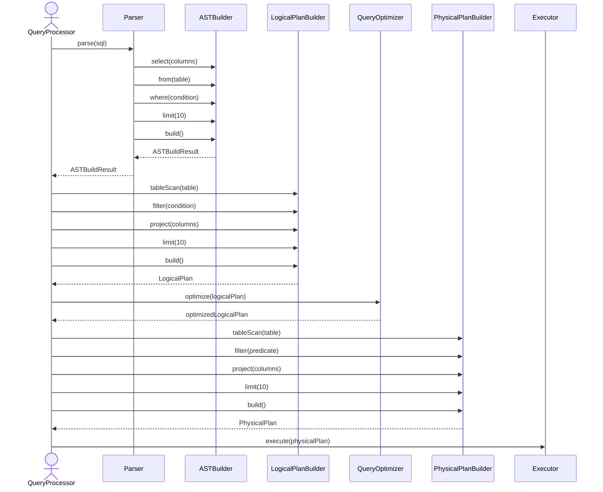

```mermaid
sequenceDiagram
    actor Processor as QueryProcessor
    participant Parser
    participant ASTBuilder
    participant LogicalBuilder as LogicalPlanBuilder
    participant Optimizer as QueryOptimizer
    participant PhysicalBuilder as PhysicalPlanBuilder
    participant Executor

    Processor->>Parser: parse(sql)

    Parser->>ASTBuilder: select(columns)
    Parser->>ASTBuilder: from(table)
    Parser->>ASTBuilder: where(condition)
    Parser->>ASTBuilder: limit(10)
    Parser->>ASTBuilder: build()
    ASTBuilder-->>Parser: ASTBuildResult

    Parser-->>Processor: ASTBuildResult

    Processor->>LogicalBuilder: tableScan(table)
    Processor->>LogicalBuilder: filter(condition)
    Processor->>LogicalBuilder: project(columns)
    Processor->>LogicalBuilder: limit(10)
    Processor->>LogicalBuilder: build()
    LogicalBuilder-->>Processor: LogicalPlan

    Processor->>Optimizer: optimize(logicalPlan)
    Optimizer-->>Processor: optimizedLogicalPlan

    Processor->>PhysicalBuilder: tableScan(table)
    Processor->>PhysicalBuilder: filter(predicate)
    Processor->>PhysicalBuilder: project(columns)
    Processor->>PhysicalBuilder: limit(10)
    Processor->>PhysicalBuilder: build()
    PhysicalBuilder-->>Processor: PhysicalPlan

    Processor->>Executor: execute(physicalPlan)
```