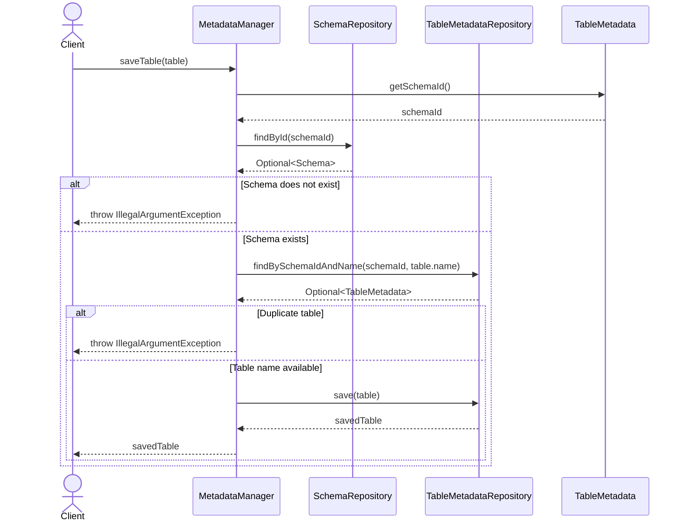
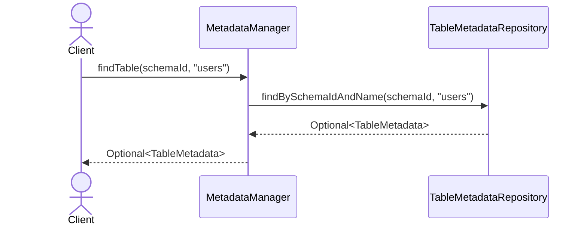
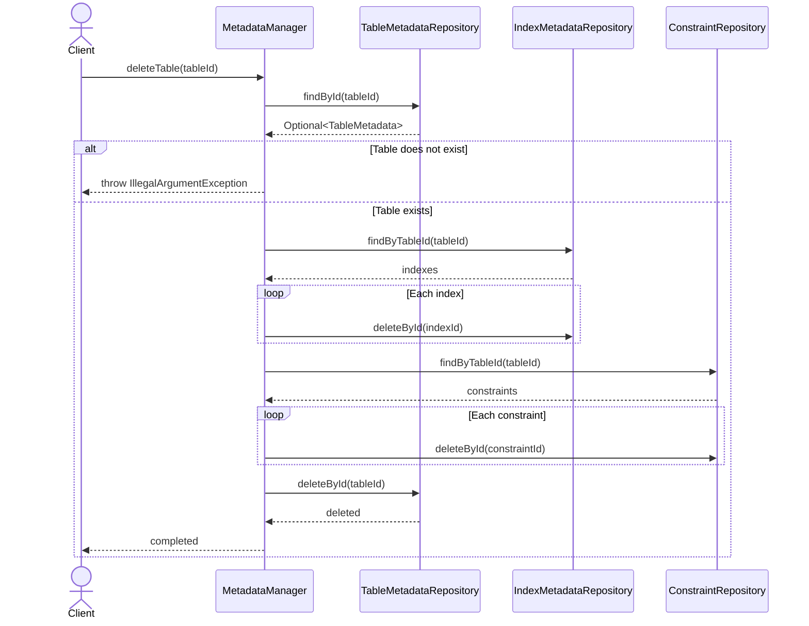

1. Sequence — Save Table Metadata

```mermaid
    sequenceDiagram
    actor Client
    participant Manager as MetadataManager
    participant SchemaRepo as SchemaRepository
    participant TableRepo as TableMetadataRepository
    participant Table as TableMetadata

    Client->>Manager: saveTable(table)

    Manager->>Table: getSchemaId()
    Table-->>Manager: schemaId

    Manager->>SchemaRepo: findById(schemaId)
    SchemaRepo-->>Manager: Optional<Schema>

    alt Schema does not exist
        Manager-->>Client: throw IllegalArgumentException
    else Schema exists
        Manager->>TableRepo: findBySchemaIdAndName(schemaId, table.name)
        TableRepo-->>Manager: Optional<TableMetadata>

        alt Duplicate table
            Manager-->>Client: throw IllegalArgumentException
        else Table name available
            Manager->>TableRepo: save(table)
            TableRepo-->>Manager: savedTable
            Manager-->>Client: savedTable
        end
    end
```

2. Sequence — Find Table Metadata 

```mermaid
sequenceDiagram
    actor Client
    participant Manager as MetadataManager
    participant Repository as TableMetadataRepository

    Client->>Manager: findTable(schemaId, "users")

    Manager->>Repository: findBySchemaIdAndName(schemaId, "users")
    Repository-->>Manager: Optional<TableMetadata>

    Manager-->>Client: Optional<TableMetadata>
```

3. Sequence - Delete Table Aggregate

```mermaid
    sequenceDiagram
    actor Client
    participant Manager as MetadataManager
    participant TableRepo as TableMetadataRepository
    participant IndexRepo as IndexMetadataRepository
    participant ConstraintRepo as ConstraintRepository

    Client->>Manager: deleteTable(tableId)

    Manager->>TableRepo: findById(tableId)
    TableRepo-->>Manager: Optional<TableMetadata>

    alt Table does not exist
        Manager-->>Client: throw IllegalArgumentException
    else Table exists
        Manager->>IndexRepo: findByTableId(tableId)
        IndexRepo-->>Manager: indexes

        loop Each index
            Manager->>IndexRepo: deleteById(indexId)
        end

        Manager->>ConstraintRepo: findByTableId(tableId)
        ConstraintRepo-->>Manager: constraints

        loop Each constraint
            Manager->>ConstraintRepo: deleteById(constraintId)
        end

        Manager->>TableRepo: deleteById(tableId)
        TableRepo-->>Manager: deleted

        Manager-->>Client: completed
    end
```
