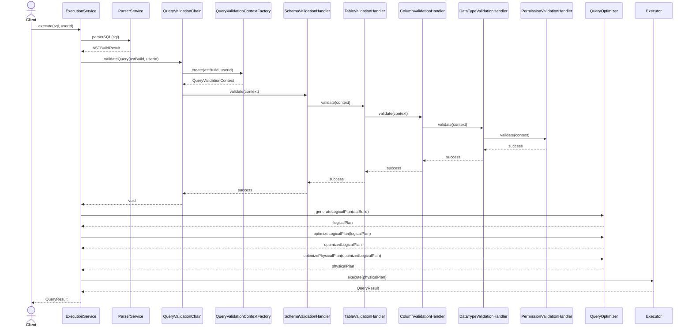
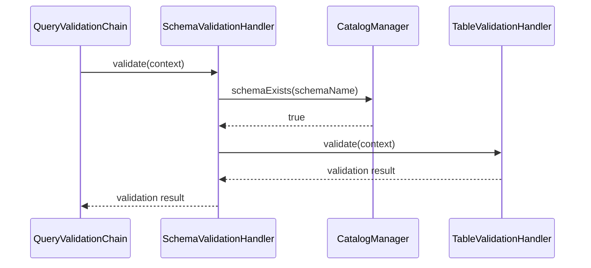
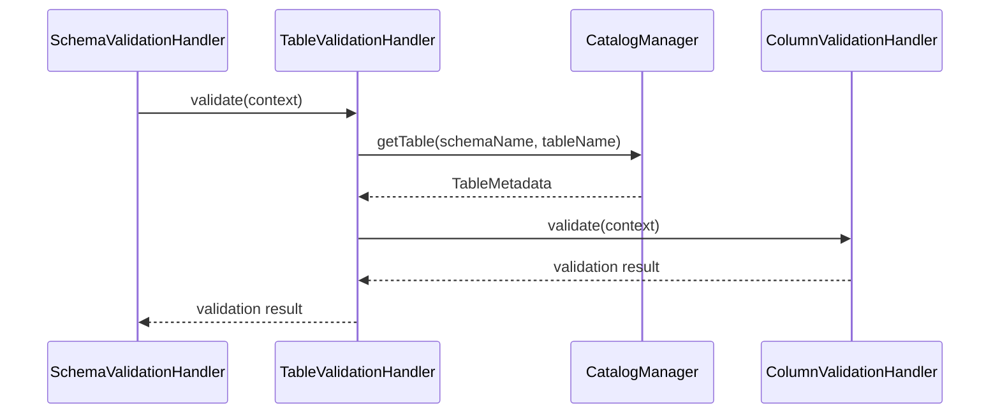
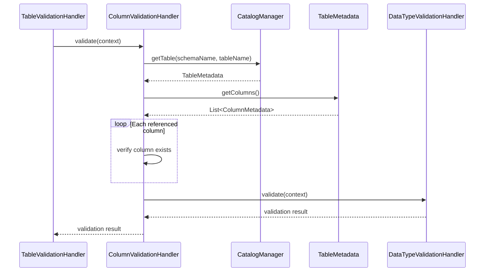
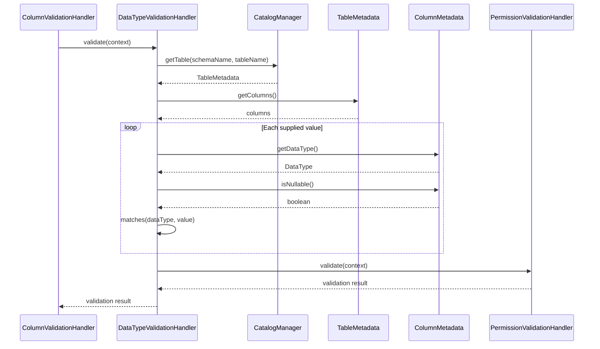
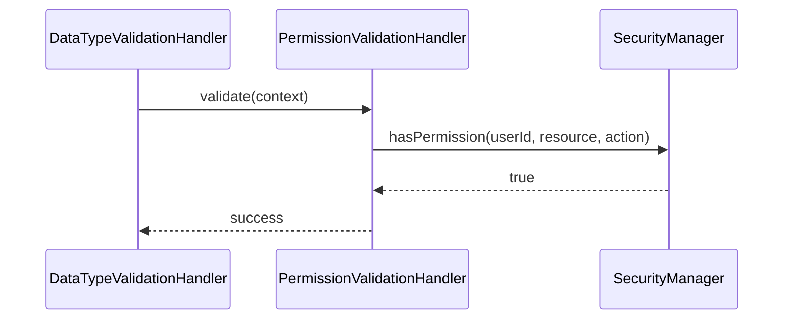

- Sequence diagram - Complete a query validation pipeline.

- Sequence diagram — Schema validation

- Sequence diagram — Table validation

- Sequence diagram - Column validation

- Sequence diagram — Data type validation

- Sequence diagram - Permission validation
