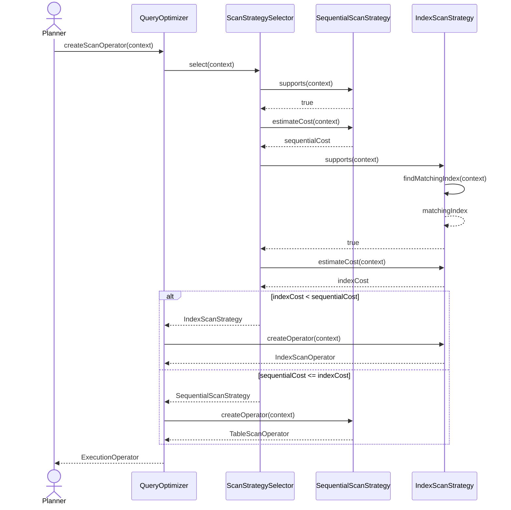

- Sequence: Choose index scan 

```mermaid
sequenceDiagram
    actor Planner
    participant Optimizer as QueryOptimizer
    participant Selector as ScanStrategySelector
    participant Sequential as SequentialScanStrategy
    participant Index as IndexScanStrategy

    Planner->>Optimizer: createScanOperator(context)

    Optimizer->>Selector: select(context)

    Selector->>Sequential: supports(context)
    Sequential-->>Selector: true

    Selector->>Sequential: estimateCost(context)
    Sequential-->>Selector: sequentialCost

    Selector->>Index: supports(context)
    Index->>Index: findMatchingIndex(context)
    Index-->>Index: matchingIndex
    Index-->>Selector: true

    Selector->>Index: estimateCost(context)
    Index-->>Selector: indexCost

    alt indexCost < sequentialCost
        Selector-->>Optimizer: IndexScanStrategy
        Optimizer->>Index: createOperator(context)
        Index-->>Optimizer: IndexScanOperator
    else sequentialCost <= indexCost
        Selector-->>Optimizer: SequentialScanStrategy
        Optimizer->>Sequential: createOperator(context)
        Sequential-->>Optimizer: TableScanOperator
    end

    Optimizer-->>Planner: ExecutionOperator
```