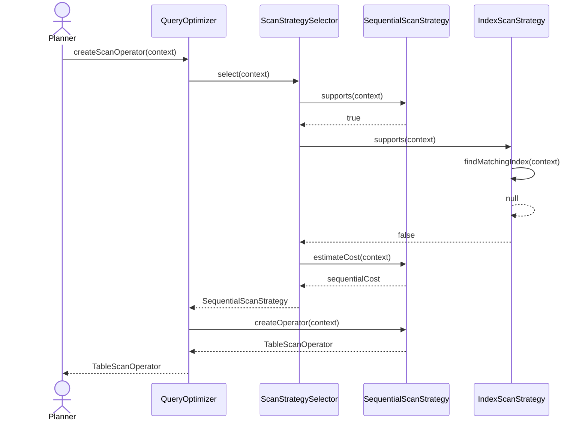

- Sequence - No proper indexing

```mermaid
sequenceDiagram
    actor Planner
    participant Optimizer as QueryOptimizer
    participant Selector as ScanStrategySelector
    participant Sequential as SequentialScanStrategy
    participant Index as IndexScanStrategy

    Planner->>Optimizer: createScanOperator(context)
    Optimizer->>Selector: select(context)

    Selector->>Sequential: supports(context)
    Sequential-->>Selector: true

    Selector->>Index: supports(context)
    Index->>Index: findMatchingIndex(context)
    Index-->>Index: null
    Index-->>Selector: false

    Selector->>Sequential: estimateCost(context)
    Sequential-->>Selector: sequentialCost

    Selector-->>Optimizer: SequentialScanStrategy

    Optimizer->>Sequential: createOperator(context)
    Sequential-->>Optimizer: TableScanOperator

    Optimizer-->>Planner: TableScanOperator
```