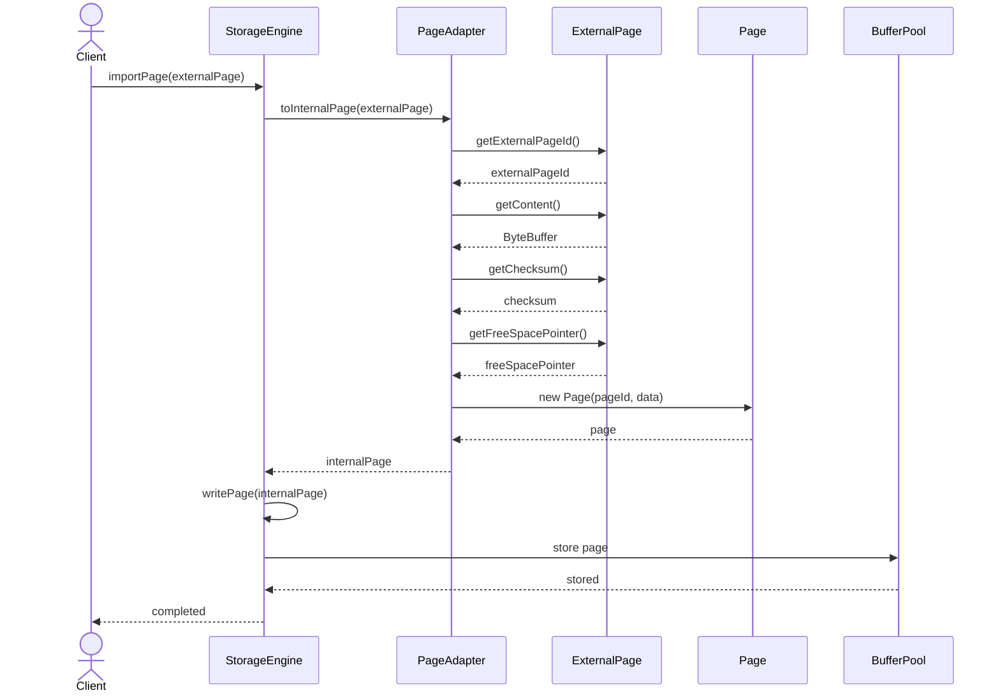
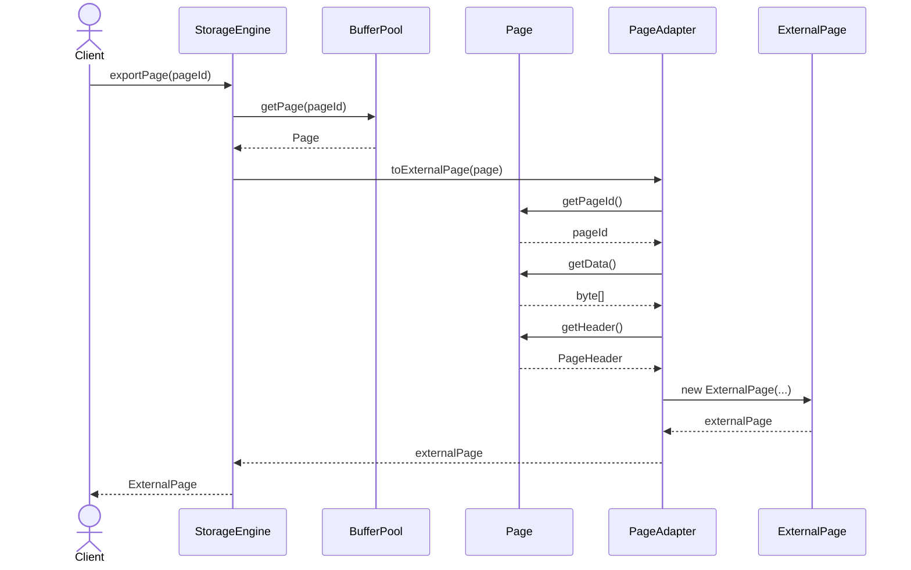

```mermaid
sequenceDiagram
    actor Client
    participant Engine as StorageEngine
    participant Adapter as PageAdapter
    participant External as ExternalPage
    participant Page
    participant BufferPool

    Client->>Engine: importPage(externalPage)

    Engine->>Adapter: toInternalPage(externalPage)

    Adapter->>External: getExternalPageId()
    External-->>Adapter: externalPageId

    Adapter->>External: getContent()
    External-->>Adapter: ByteBuffer

    Adapter->>External: getChecksum()
    External-->>Adapter: checksum

    Adapter->>External: getFreeSpacePointer()
    External-->>Adapter: freeSpacePointer

    Adapter->>Page: new Page(pageId, data)
    Page-->>Adapter: page

    Adapter-->>Engine: internalPage

    Engine->>Engine: writePage(internalPage)
    Engine->>BufferPool: store page
    BufferPool-->>Engine: stored

    Engine-->>Client: completed 
```

2. Sequence - Export Page

```mermaid
sequenceDiagram
    actor Client
    participant Engine as StorageEngine
    participant BufferPool
    participant Page
    participant Adapter as PageAdapter
    participant External as ExternalPage

    Client->>Engine: exportPage(pageId)

    Engine->>BufferPool: getPage(pageId)
    BufferPool-->>Engine: Page

    Engine->>Adapter: toExternalPage(page)

    Adapter->>Page: getPageId()
    Page-->>Adapter: pageId

    Adapter->>Page: getData()
    Page-->>Adapter: byte[]

    Adapter->>Page: getHeader()
    Page-->>Adapter: PageHeader

    Adapter->>External: new ExternalPage(...)
    External-->>Adapter: externalPage

    Adapter-->>Engine: externalPage
    Engine-->>Client: ExternalPage
```