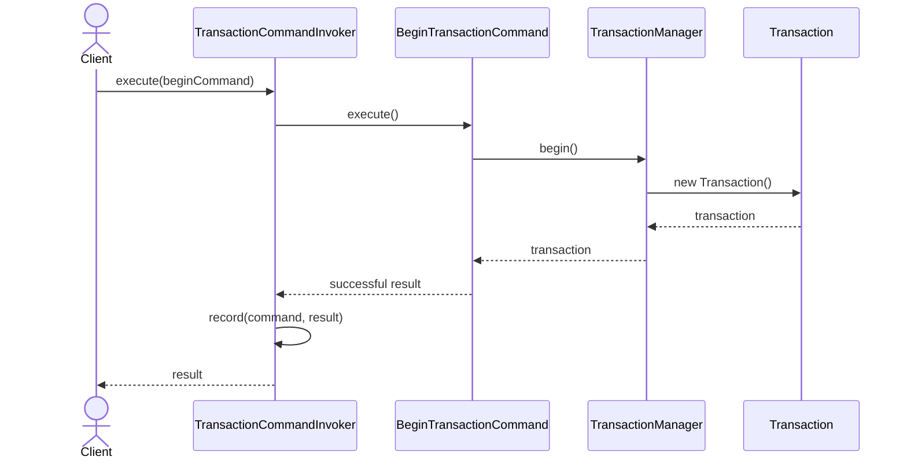
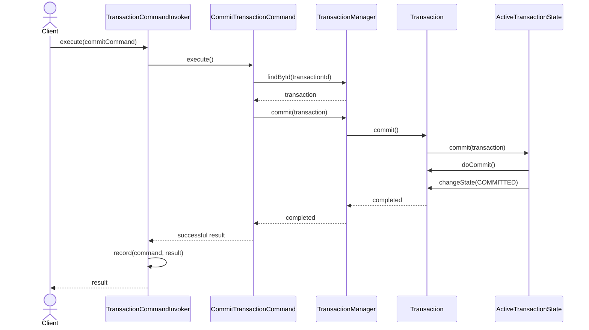
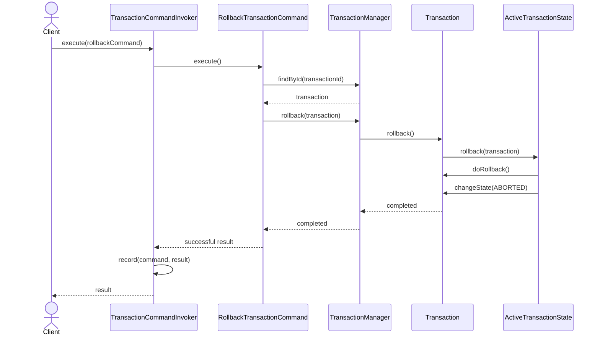
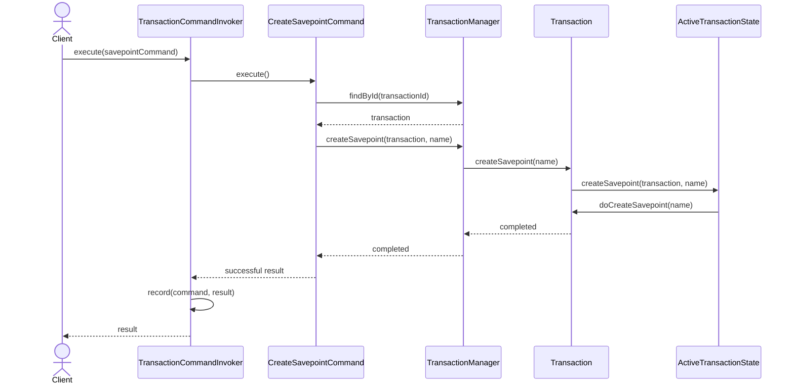

- Sequence — BEGIN Command


- Sequence - COMMIT Command

- Sequence - ROLLBACK Command

-  Sequence — SAVEPOINT Command


- How to use in system
```java
    TransactionCommandInvoker invoker =
            new TransactionCommandInvoker();

    TransactionCommand beginCommand =
            new BeginTransactionCommand(
                    transactionManager
            );
    TransactionCommandResult beginResult =
            invoker.execute(beginCommand);
```