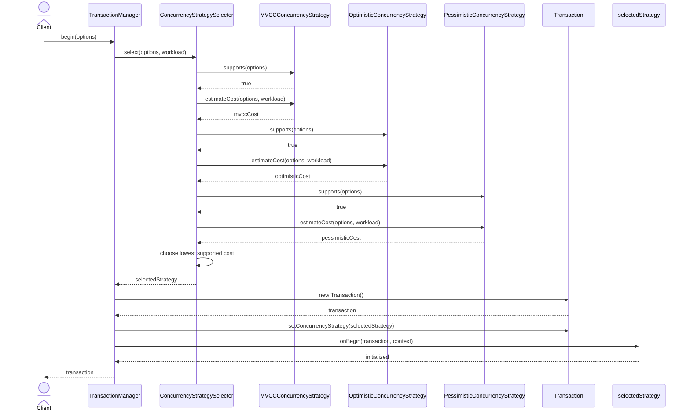
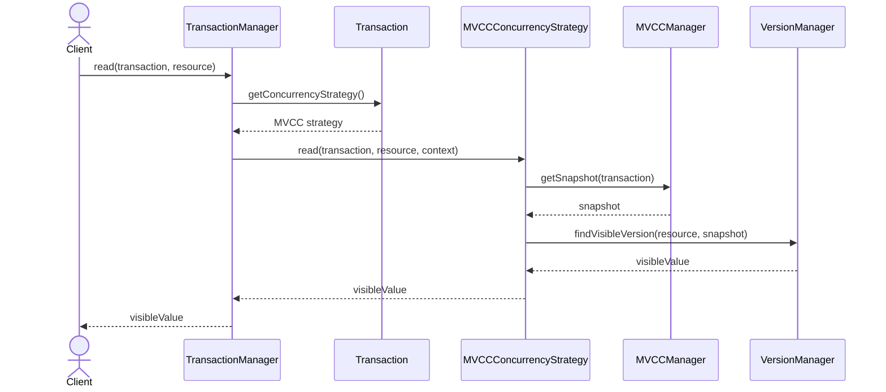
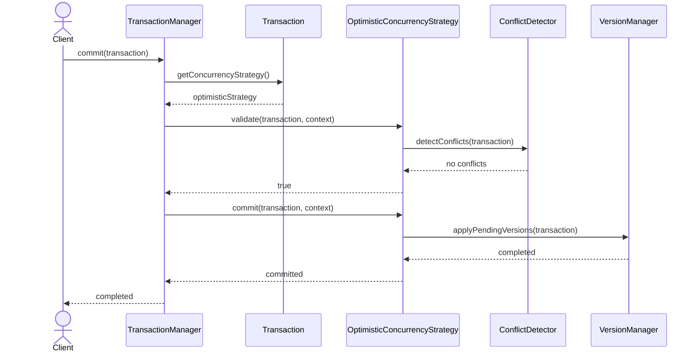
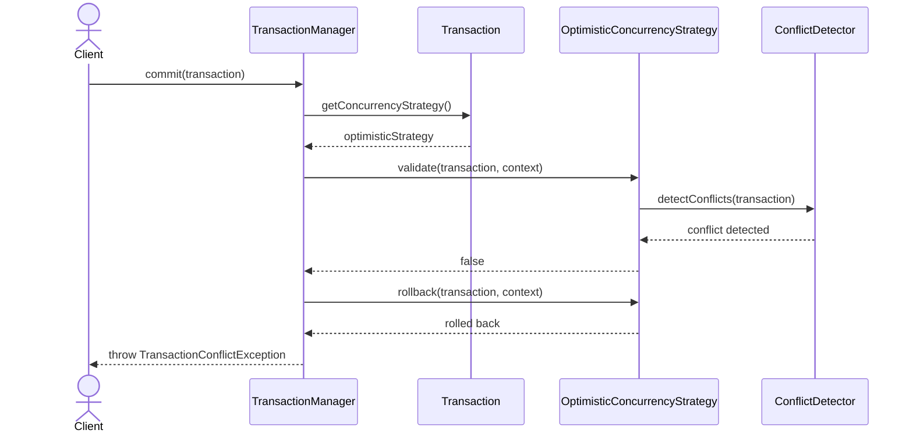
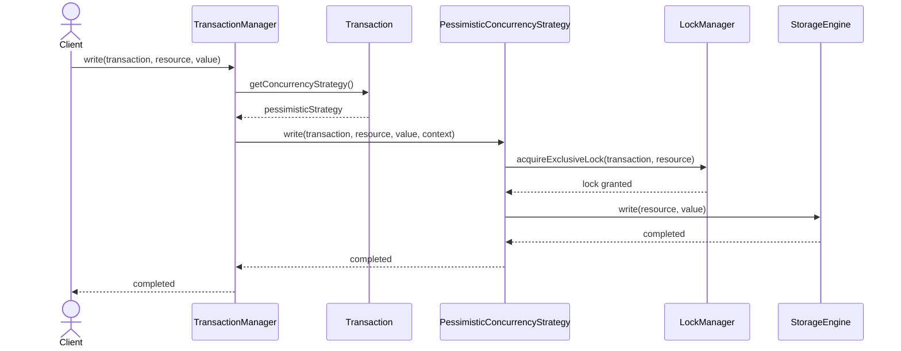

- Sequence — Select Strategy

```mermaid
sequenceDiagram
    actor Client
    participant Manager as TransactionManager
    participant Selector as ConcurrencyStrategySelector
    participant MVCC as MVCCConcurrencyStrategy
    participant Optimistic as OptimisticConcurrencyStrategy
    participant Pessimistic as PessimisticConcurrencyStrategy
    participant Tx as Transaction

    Client->>Manager: begin(options)

    Manager->>Selector: select(options, workload)

    Selector->>MVCC: supports(options)
    MVCC-->>Selector: true
    Selector->>MVCC: estimateCost(options, workload)
    MVCC-->>Selector: mvccCost

    Selector->>Optimistic: supports(options)
    Optimistic-->>Selector: true
    Selector->>Optimistic: estimateCost(options, workload)
    Optimistic-->>Selector: optimisticCost

    Selector->>Pessimistic: supports(options)
    Pessimistic-->>Selector: true
    Selector->>Pessimistic: estimateCost(options, workload)
    Pessimistic-->>Selector: pessimisticCost

    Selector->>Selector: choose lowest supported cost
    Selector-->>Manager: selectedStrategy

    Manager->>Tx: new Transaction()
    Tx-->>Manager: transaction

    Manager->>Tx: setConcurrencyStrategy(selectedStrategy)
    Manager->>selectedStrategy: onBegin(transaction, context)
    selectedStrategy-->>Manager: initialized

    Manager-->>Client: transaction
```
- Sequence — MVCC Read

```mermaid
sequenceDiagram
    actor Client
    participant Manager as TransactionManager
    participant Tx as Transaction
    participant Strategy as MVCCConcurrencyStrategy
    participant MVCC as MVCCManager
    participant Version as VersionManager

    Client->>Manager: read(transaction, resource)

    Manager->>Tx: getConcurrencyStrategy()
    Tx-->>Manager: MVCC strategy

    Manager->>Strategy: read(transaction, resource, context)

    Strategy->>MVCC: getSnapshot(transaction)
    MVCC-->>Strategy: snapshot

    Strategy->>Version: findVisibleVersion(resource, snapshot)
    Version-->>Strategy: visibleValue

    Strategy-->>Manager: visibleValue
    Manager-->>Client: visibleValue
```

- Sequence — Optimistic Commit

```mermaid
sequenceDiagram
    actor Client
    participant Manager as TransactionManager
    participant Tx as Transaction
    participant Strategy as OptimisticConcurrencyStrategy
    participant Detector as ConflictDetector
    participant Version as VersionManager

    Client->>Manager: commit(transaction)

    Manager->>Tx: getConcurrencyStrategy()
    Tx-->>Manager: optimisticStrategy

    Manager->>Strategy: validate(transaction, context)

    Strategy->>Detector: detectConflicts(transaction)
    Detector-->>Strategy: no conflicts

    Strategy-->>Manager: true
    Manager->>Strategy: commit(transaction, context)

    Strategy->>Version: applyPendingVersions(transaction)
    Version-->>Strategy: completed

    Strategy-->>Manager: committed
    Manager-->>Client: completed
```
- Sequence — Optimistic Conflict

```mermaid
sequenceDiagram
    actor Client
    participant Manager as TransactionManager
    participant Tx as Transaction
    participant Strategy as OptimisticConcurrencyStrategy
    participant Detector as ConflictDetector

    Client->>Manager: commit(transaction)

    Manager->>Tx: getConcurrencyStrategy()
    Tx-->>Manager: optimisticStrategy

    Manager->>Strategy: validate(transaction, context)
    Strategy->>Detector: detectConflicts(transaction)
    Detector-->>Strategy: conflict detected
    Strategy-->>Manager: false

    Manager->>Strategy: rollback(transaction, context)
    Strategy-->>Manager: rolled back

    Manager-->>Client: throw TransactionConflictException
```
- Sequence — Pessimistic Write

```mermaid
sequenceDiagram
    actor Client
    participant Manager as TransactionManager
    participant Tx as Transaction
    participant Strategy as PessimisticConcurrencyStrategy
    participant LockManager
    participant Storage as StorageEngine

    Client->>Manager: write(transaction, resource, value)

    Manager->>Tx: getConcurrencyStrategy()
    Tx-->>Manager: pessimisticStrategy

    Manager->>Strategy: write(transaction, resource, value, context)

    Strategy->>LockManager: acquireExclusiveLock(transaction, resource)
    LockManager-->>Strategy: lock granted

    Strategy->>Storage: write(resource, value)
    Storage-->>Strategy: completed

    Strategy-->>Manager: completed
    Manager-->>Client: completed
```