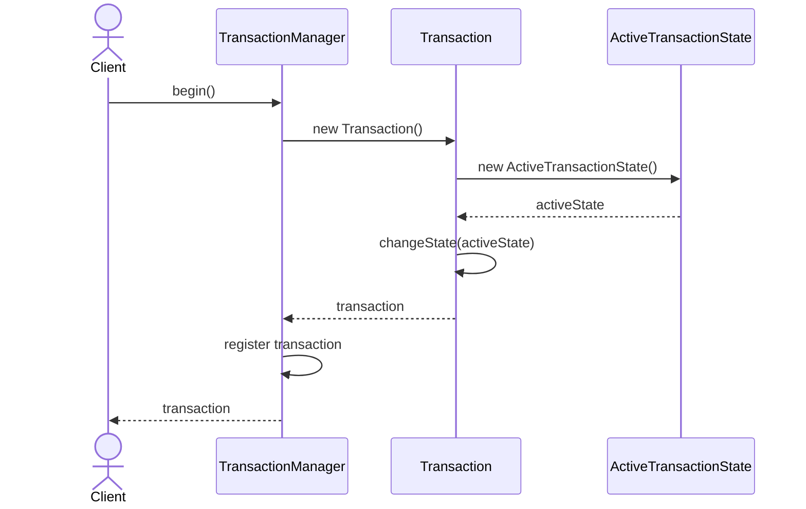
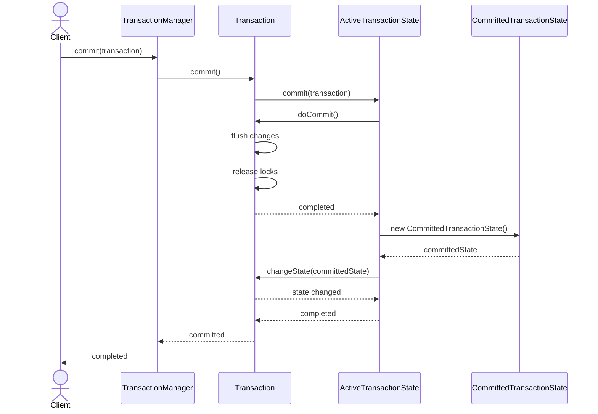
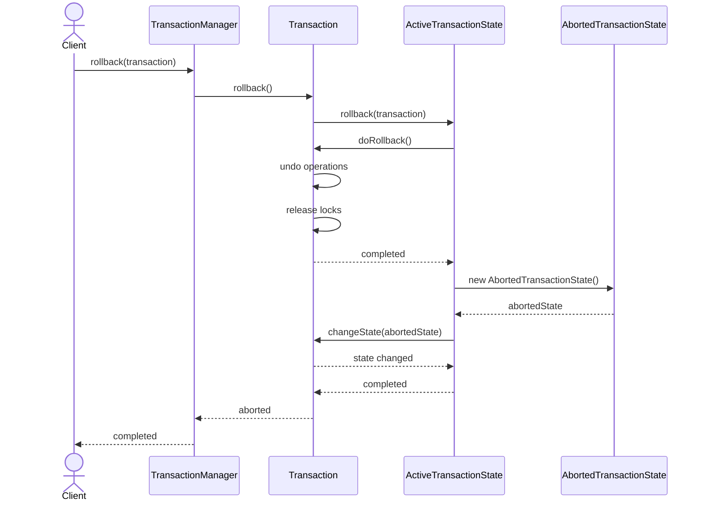
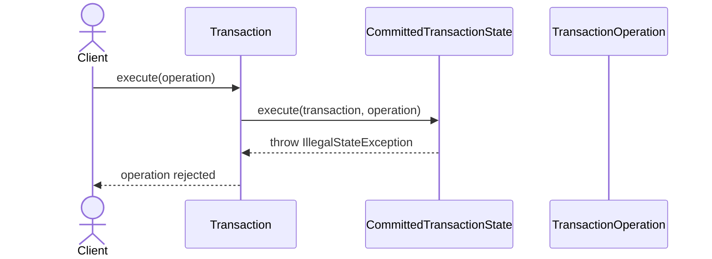

- Sequence — Begin Transaction

```mermaid
    sequenceDiagram
    actor Client
    participant Manager as TransactionManager
    participant Tx as Transaction
    participant State as ActiveTransactionState

    Client->>Manager: begin()

    Manager->>Tx: new Transaction()
    Tx->>State: new ActiveTransactionState()
    State-->>Tx: activeState

    Tx->>Tx: changeState(activeState)
    Tx-->>Manager: transaction

    Manager->>Manager: register transaction
    Manager-->>Client: transaction
```

- Sequence - Commit Active Transaction

```mermaid
sequenceDiagram
    actor Client
    participant Manager as TransactionManager
    participant Tx as Transaction
    participant Active as ActiveTransactionState
    participant Committed as CommittedTransactionState

    Client->>Manager: commit(transaction)
    Manager->>Tx: commit()

    Tx->>Active: commit(transaction)

    Active->>Tx: doCommit()
    Tx->>Tx: flush changes
    Tx->>Tx: release locks
    Tx-->>Active: completed

    Active->>Committed: new CommittedTransactionState()
    Committed-->>Active: committedState

    Active->>Tx: changeState(committedState)
    Tx-->>Active: state changed

    Active-->>Tx: completed
    Tx-->>Manager: committed
    Manager-->>Client: completed
```

- Sequence - Rollback Active Transaction

```mermaid
    sequenceDiagram
    actor Client
    participant Manager as TransactionManager
    participant Tx as Transaction
    participant Active as ActiveTransactionState
    participant Aborted as AbortedTransactionState

    Client->>Manager: rollback(transaction)
    Manager->>Tx: rollback()

    Tx->>Active: rollback(transaction)

    Active->>Tx: doRollback()
    Tx->>Tx: undo operations
    Tx->>Tx: release locks
    Tx-->>Active: completed

    Active->>Aborted: new AbortedTransactionState()
    Aborted-->>Active: abortedState

    Active->>Tx: changeState(abortedState)
    Tx-->>Active: state changed

    Active-->>Tx: completed
    Tx-->>Manager: aborted
    Manager-->>Client: completed
```
- Sequence — Reject Operation After Commit 

```mermaid
sequenceDiagram
    actor Client
    participant Tx as Transaction
    participant State as CommittedTransactionState
    participant Operation as TransactionOperation

    Client->>Tx: execute(operation)
    Tx->>State: execute(transaction, operation)

    State-->>Tx: throw IllegalStateException
    Tx-->>Client: operation rejected
```

