Query Validation Chain Test Sequence Diagrams

Each sequence diagram corresponds 1–1 with one method in QueryValidationChainTests.java.

1. Constructor_ShouldCreateValidationChain
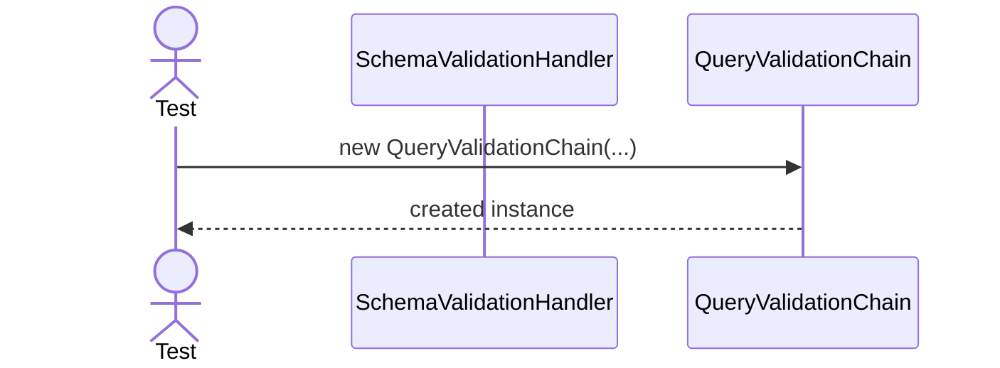
2. Constructor_ShouldRejectNullFirstHandler

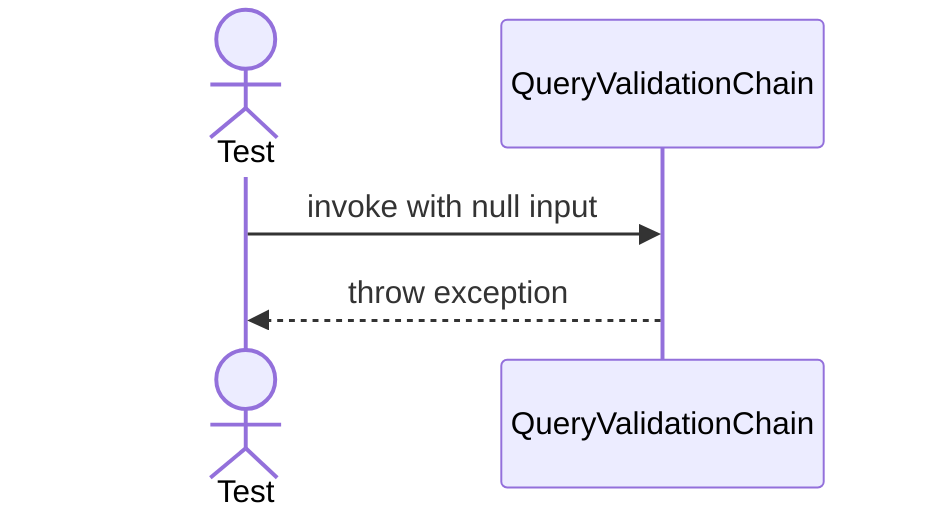
3. SetNext_ShouldConnectHandlersInExpectedOrder

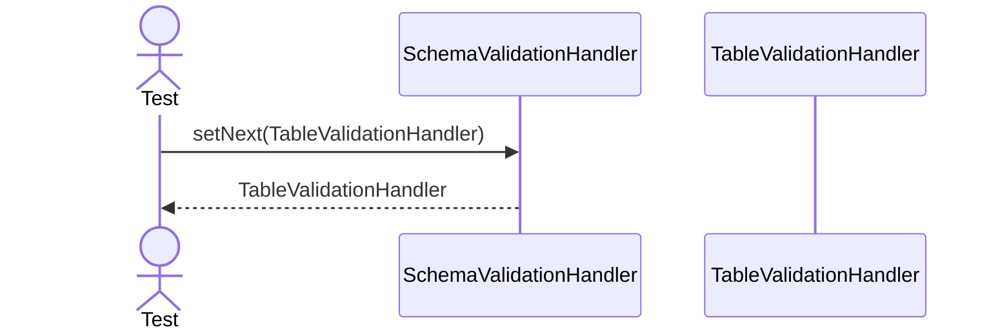
4. Validate_ValidQuery_ShouldPassAllHandlers

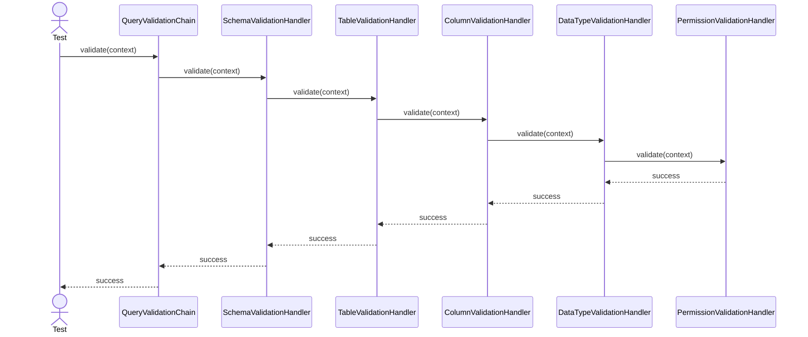
5. Validate_ValidQuery_ShouldExecuteHandlersInOrder

6. Validate_NullContext_ShouldThrowException


7. Validate_ExistingSchema_ShouldReturnSuccess

Return success when the schema exists.
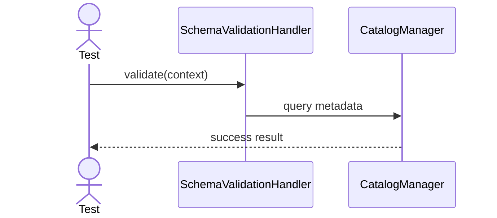
8. Validate_MissingSchema_ShouldReturnFailure

Return failure when the schema does not exist.
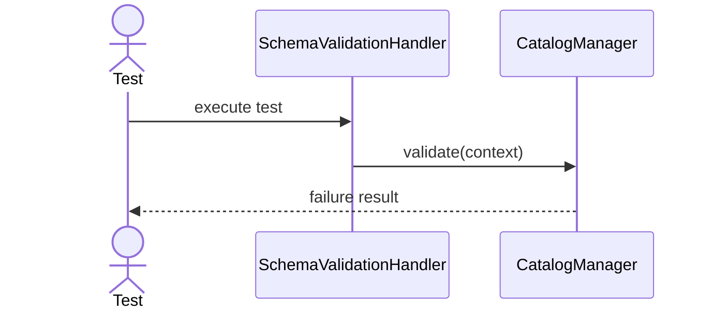
9. Validate_NullSchemaName_ShouldReturnFailure

Return failure when schema name is null.
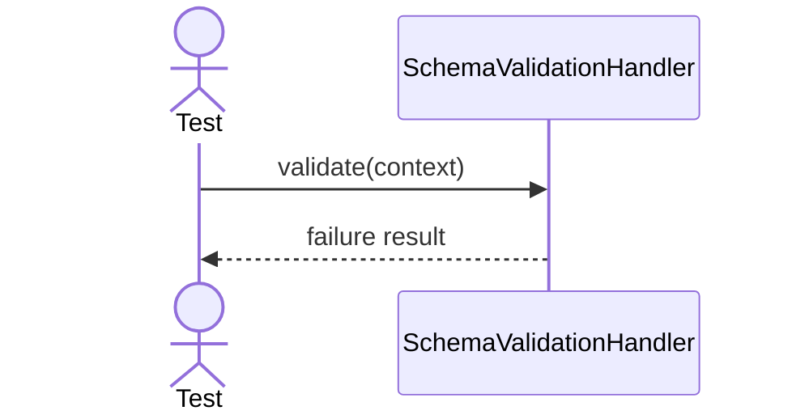
10. Validate_BlankSchemaName_ShouldReturnFailure

Return failure when schema name is blank.

11. Validate_ExistingTable_ShouldReturnSuccess

Return success when the table exists in the schema.
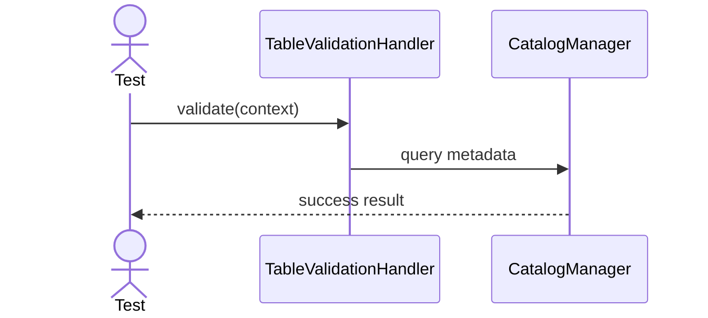
12. Validate_MissingTable_ShouldReturnFailure

Return failure when the table does not exist.
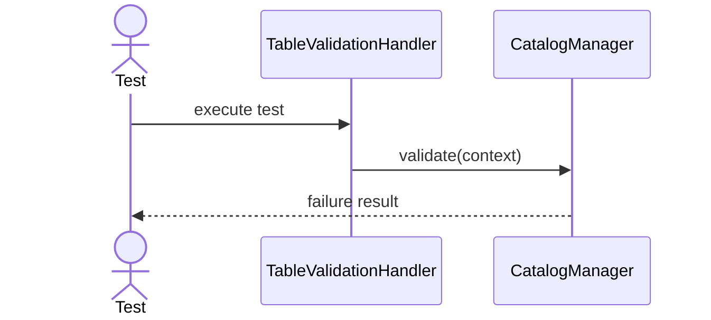
13. Validate_NullTableName_ShouldReturnFailure

Return failure when table name is null.

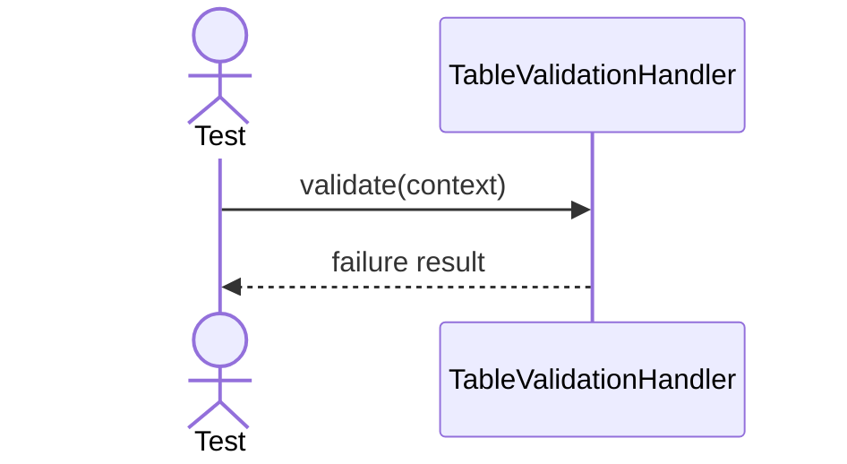
14. Validate_BlankTableName_ShouldReturnFailure

Return failure when table name is blank.

15. Validate_ExistingColumns_ShouldReturnSuccess

Return success when every referenced column exists.
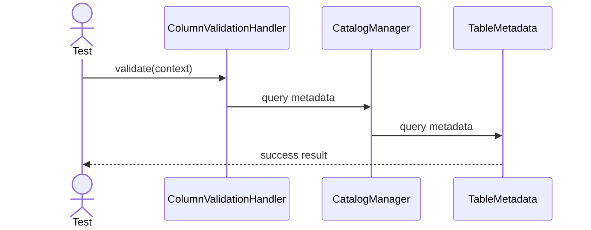
16. Validate_ColumnNameWithDifferentCase_ShouldReturnSuccess

Match referenced columns without case sensitivity.

17. Validate_MissingColumn_ShouldReturnFailure

Return failure for an unknown referenced column.
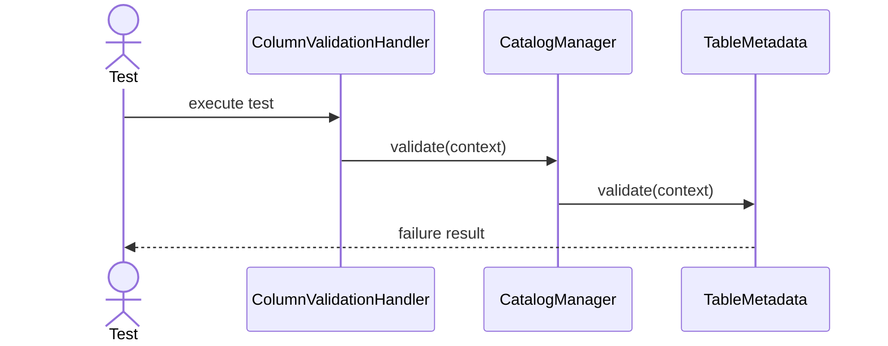
18. Validate_EmptyReferencedColumns_ShouldReturnSuccess

Return success when no columns are referenced.
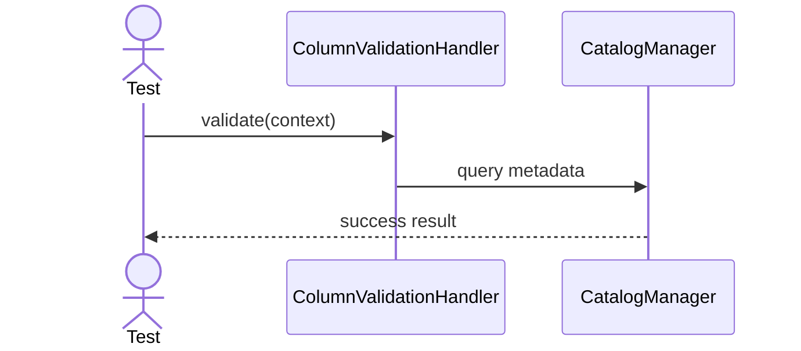
19. Validate_MissingTable_ShouldReturnFailure

Return failure when column validation cannot resolve the table.

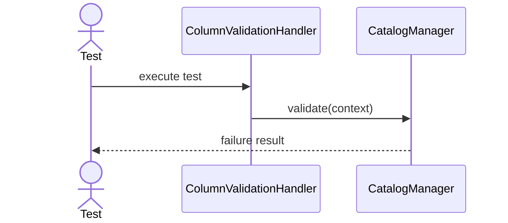
20. Validate_IntegerValue_ShouldReturnSuccess

Accept Integer for an INTEGER column.
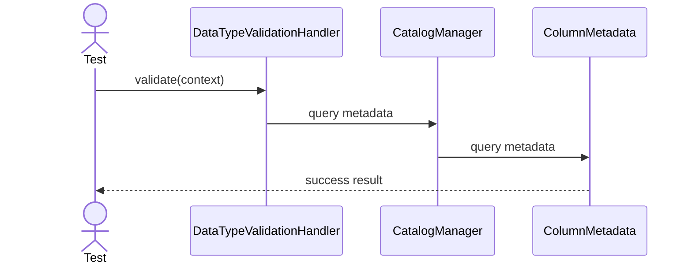
21. Validate_StringValue_ShouldReturnSuccess

Accept String for a VARCHAR column.
```mermaid

sequenceDiagram
    actor T0 as Test
    participant DTVH1 as DataTypeValidationHandler
    participant CM2 as CatalogManager
    participant CM3 as ColumnMetadata
    T0->>DTVH1: validate(context)
    DTVH1->>CM2: query metadata
    CM2->>CM3: query metadata
    CM3-->>T0: success result
```
22. Validate_BooleanValue_ShouldReturnSuccess

Accept Boolean for a BOOLEAN column.
```mermaid

sequenceDiagram
    actor T0 as Test
    participant DTVH1 as DataTypeValidationHandler
    participant CM2 as CatalogManager
    participant CM3 as ColumnMetadata
    T0->>DTVH1: validate(context)
    DTVH1->>CM2: query metadata
    CM2->>CM3: query metadata
    CM3-->>T0: success result
```
23. Validate_BigDecimalValue_ShouldReturnSuccess

Accept BigDecimal for a DECIMAL column.
```mermaid

sequenceDiagram
    actor T0 as Test
    participant DTVH1 as DataTypeValidationHandler
    participant CM2 as CatalogManager
    participant CM3 as ColumnMetadata
    T0->>DTVH1: validate(context)
    DTVH1->>CM2: query metadata
    CM2->>CM3: query metadata
    CM3-->>T0: success result
```
24. Validate_DoubleValue_ShouldReturnSuccess

Accept Double for a DECIMAL column.
```mermaid

sequenceDiagram
    actor T0 as Test
    participant DTVH1 as DataTypeValidationHandler
    participant CM2 as CatalogManager
    participant CM3 as ColumnMetadata
    T0->>DTVH1: validate(context)
    DTVH1->>CM2: query metadata
    CM2->>CM3: query metadata
    CM3-->>T0: success result
```
25. Validate_LocalDateValue_ShouldReturnSuccess

Accept LocalDate for a DATE column.
```mermaid

sequenceDiagram
    actor T0 as Test
    participant DTVH1 as DataTypeValidationHandler
    participant CM2 as CatalogManager
    participant CM3 as ColumnMetadata
    T0->>DTVH1: validate(context)
    DTVH1->>CM2: query metadata
    CM2->>CM3: query metadata
    CM3-->>T0: success result
```
26. Validate_LocalDateTimeValue_ShouldReturnSuccess

Accept LocalDateTime for a TIMESTAMP column.
```mermaid

sequenceDiagram
    actor T0 as Test
    participant DTVH1 as DataTypeValidationHandler
    participant CM2 as CatalogManager
    participant CM3 as ColumnMetadata
    T0->>DTVH1: validate(context)
    DTVH1->>CM2: query metadata
    CM2->>CM3: query metadata
    CM3-->>T0: success result
```
27. Validate_WrongValueType_ShouldReturnFailure

Reject a value whose Java type does not match the column type.
```mermaid

sequenceDiagram
    actor T0 as Test
    participant DTVH1 as DataTypeValidationHandler
    participant CM2 as CatalogManager
    participant CM3 as ColumnMetadata
    T0->>DTVH1: execute test
    DTVH1->>CM2: validate(context)
    CM2->>CM3: validate(context)
    CM3-->>T0: failure result
```
28. Validate_UnknownSuppliedColumn_ShouldReturnFailure

Reject a supplied value for an unknown column.
```mermaid

sequenceDiagram
    actor T0 as Test
    participant DTVH1 as DataTypeValidationHandler
    participant CM2 as CatalogManager
    participant TM3 as TableMetadata
    T0->>DTVH1: execute test
    DTVH1->>CM2: validate(context)
    CM2->>TM3: validate(context)
    TM3-->>T0: failure result
```
29. Validate_NullForNullableColumn_ShouldReturnSuccess

Accept null for a nullable column.
```mermaid

sequenceDiagram
    actor T0 as Test
    participant DTVH1 as DataTypeValidationHandler
    participant CM2 as CatalogManager
    participant CM3 as ColumnMetadata
    T0->>DTVH1: validate(context)
    DTVH1->>CM2: query metadata
    CM2->>CM3: query metadata
    CM3-->>T0: success result
```
30. Validate_NullForRequiredColumn_ShouldReturnFailure

Reject null for a non-nullable column.
```mermaid

sequenceDiagram
    actor T0 as Test
    participant DTVH1 as DataTypeValidationHandler
    participant CM2 as CatalogManager
    participant CM3 as ColumnMetadata
    T0->>DTVH1: execute test
    DTVH1->>CM2: validate(context)
    CM2->>CM3: validate(context)
    CM3-->>T0: failure result
```
31. Validate_EmptySuppliedValues_ShouldReturnSuccess

Return success when there are no supplied values.
```mermaid

sequenceDiagram
    actor T0 as Test
    participant DTVH1 as DataTypeValidationHandler
    participant CM2 as CatalogManager
    T0->>DTVH1: validate(context)
    DTVH1->>CM2: query metadata
    CM2-->>T0: success result
```
32. Validate_AllowedPermission_ShouldReturnSuccess

Return success when the user has the required permission.
```mermaid

sequenceDiagram
    actor T0 as Test
    participant PVH1 as PermissionValidationHandler
    participant SM2 as SecurityManager
    T0->>PVH1: validate(context)
    PVH1->>SM2: query metadata
    SM2-->>T0: success result
```
33. Validate_DeniedPermission_ShouldReturnFailure

Return failure when the user lacks the required permission.
```mermaid

sequenceDiagram
    actor T0 as Test
    participant PVH1 as PermissionValidationHandler
    participant SM2 as SecurityManager
    T0->>PVH1: execute test
    PVH1->>SM2: validate(context)
    SM2-->>T0: failure result
```
34. Validate_NullAction_ShouldReturnFailure

Return failure when the required action is null.

```mermaid
sequenceDiagram
    actor T0 as Test
    participant PVH1 as PermissionValidationHandler
    T0->>PVH1: validate(context)
    PVH1-->>T0: failure result
```
35. Validate_BlankAction_ShouldReturnFailure

Return failure when the required action is blank.
```mermaid

sequenceDiagram
    actor T0 as Test
    participant PVH1 as PermissionValidationHandler
    T0->>PVH1: validate(context)
    PVH1-->>T0: failure result
```
36. Validate_SchemaFailure_ShouldPreventRemainingHandlers

Stop the chain immediately after schema validation fails.
```mermaid

sequenceDiagram
    actor T0 as Test
    participant QVC1 as QueryValidationChain
    participant SVH2 as SchemaValidationHandler
    participant CM3 as CatalogManager
    T0->>QVC1: validate(context)
    QVC1->>SVH2: validate(context)
    SVH2->>CM3: validate(context)
    CM3-->>T0: failure
    Note over CM3: Remaining handlers are not invoked
```
37. Validate_TableFailure_ShouldPreventRemainingHandlers

Stop the chain immediately after table validation fails.
```mermaid

sequenceDiagram
    actor T0 as Test
    participant QVC1 as QueryValidationChain
    participant SVH2 as SchemaValidationHandler
    participant TVH3 as TableValidationHandler
    participant CM4 as CatalogManager
    T0->>QVC1: validate(context)
    QVC1->>SVH2: validate(context)
    SVH2->>TVH3: validate(context)
    TVH3->>CM4: validate(context)
    CM4-->>T0: failure
    Note over CM4: Remaining handlers are not invoked
```
38. Validate_ColumnFailure_ShouldPreventRemainingHandlers

Stop the chain immediately after column validation fails.
```mermaid

sequenceDiagram
    actor T0 as Test
    participant QVC1 as QueryValidationChain
    participant SVH2 as SchemaValidationHandler
    participant TVH3 as TableValidationHandler
    participant CVH4 as ColumnValidationHandler
    T0->>QVC1: validate(context)
    QVC1->>SVH2: validate(context)
    SVH2->>TVH3: validate(context)
    TVH3->>CVH4: validate(context)
    CVH4-->>T0: failure
    Note over CVH4: Remaining handlers are not invoked
```
39. Validate_TypeFailure_ShouldPreventPermissionValidation

Stop the chain before permission validation when type validation fails.
```mermaid

sequenceDiagram
    actor T0 as Test
    participant QVC1 as QueryValidationChain
    participant DTVH2 as DataTypeValidationHandler
    participant PVH3 as PermissionValidationHandler
    T0->>QVC1: validate(context)
    QVC1->>DTVH2: validate(context)
    DTVH2->>PVH3: validate(context)
    PVH3-->>T0: failure
    Note over PVH3: Remaining handlers are not invoked
```
40. Success_ShouldCreateValidResult

Create a valid result without failure details.
```mermaid

sequenceDiagram
    actor T0 as Test
    participant QVR1 as QueryValidationResult
    T0->>QVR1: success()
    QVR1-->>T0: valid result
```
41. Failure_ShouldCreateInvalidResult

Create an invalid result containing validator and message.
```mermaid

sequenceDiagram
    actor T0 as Test
    participant QVR1 as QueryValidationResult
    T0->>QVR1: validate(context)
    QVR1-->>T0: failure result
    ```