Scan Strategy Test Sequences

1. ScanContext_Constructor_ShouldCreateContext
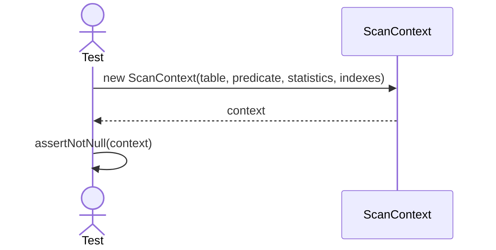
2. ScanContext_Constructor_ShouldStoreTable
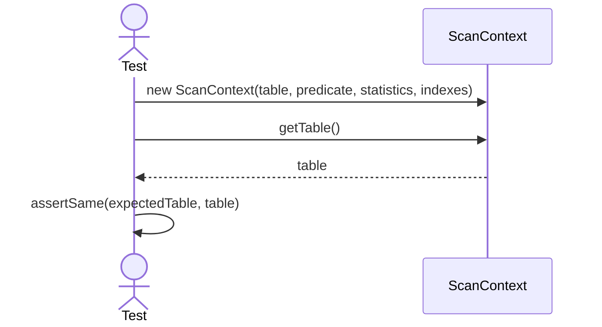
3. ScanContext_Constructor_ShouldStorePredicate
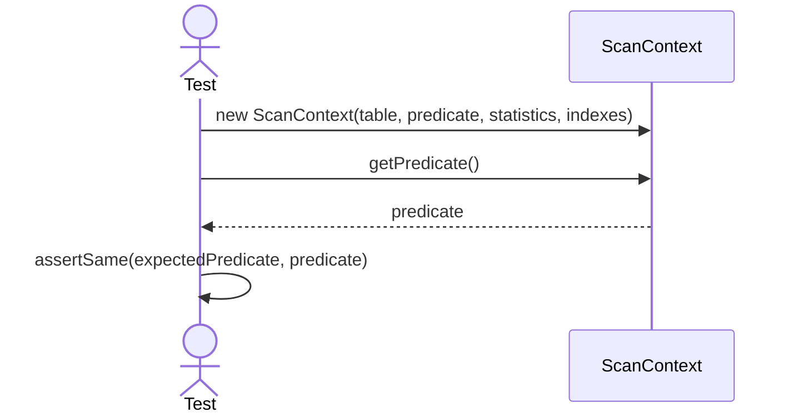
4. ScanContext_Constructor_ShouldStoreStatistics
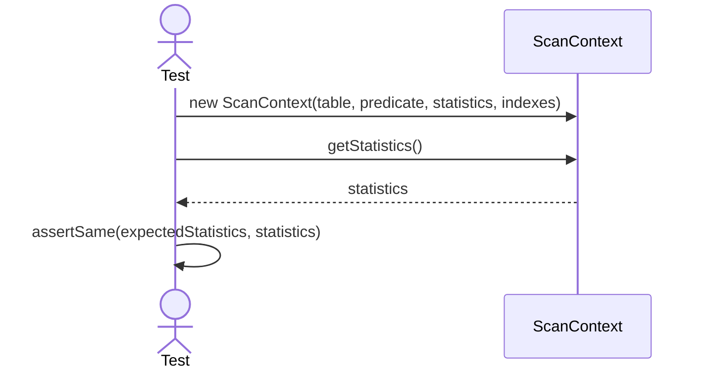
5. ScanContext_Constructor_ShouldStoreIndexes
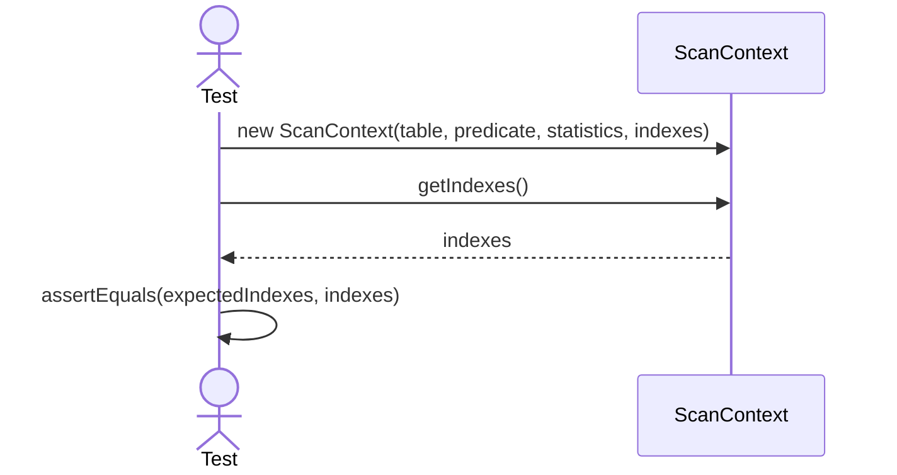
6. ScanContext_HasPredicate_ShouldReturnTrueWhenPredicateExists

7. ScanContext_HasPredicate_ShouldReturnFalseWhenPredicateMissing

8. ScanContext_HasIndexes_ShouldReturnTrueWhenIndexesExist

9. ScanContext_HasIndexes_ShouldReturnFalseWhenIndexesEmpty
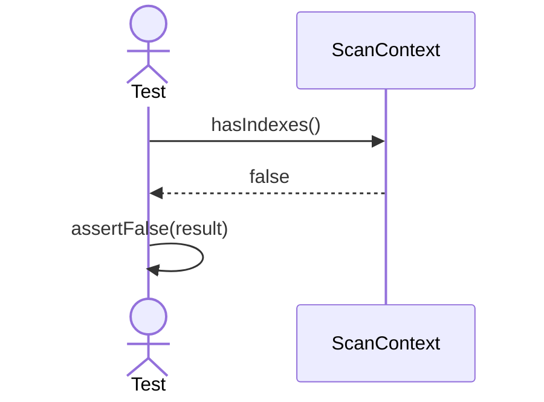
10. SequentialScan_Supports_ShouldReturnTrueForValidContext
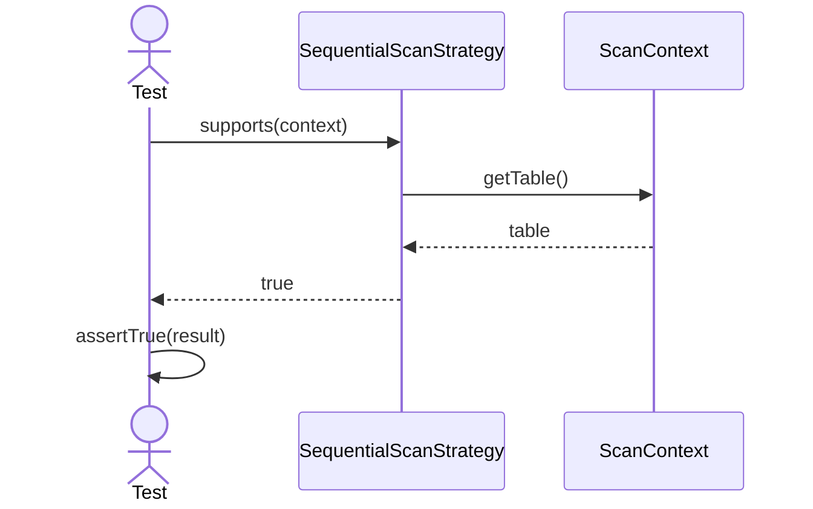
11. SequentialScan_EstimateCost_ShouldUseTablePageCount
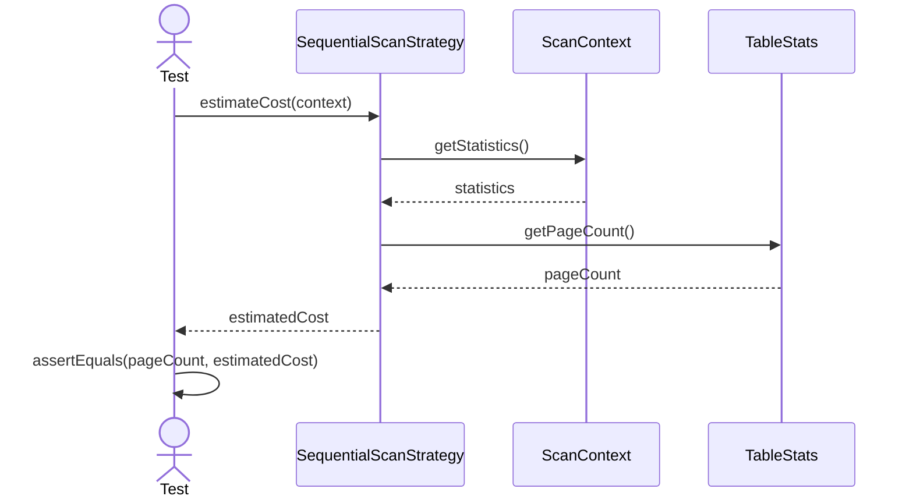
12. SequentialScan_CreateOperator_ShouldReturnTableScanOperator
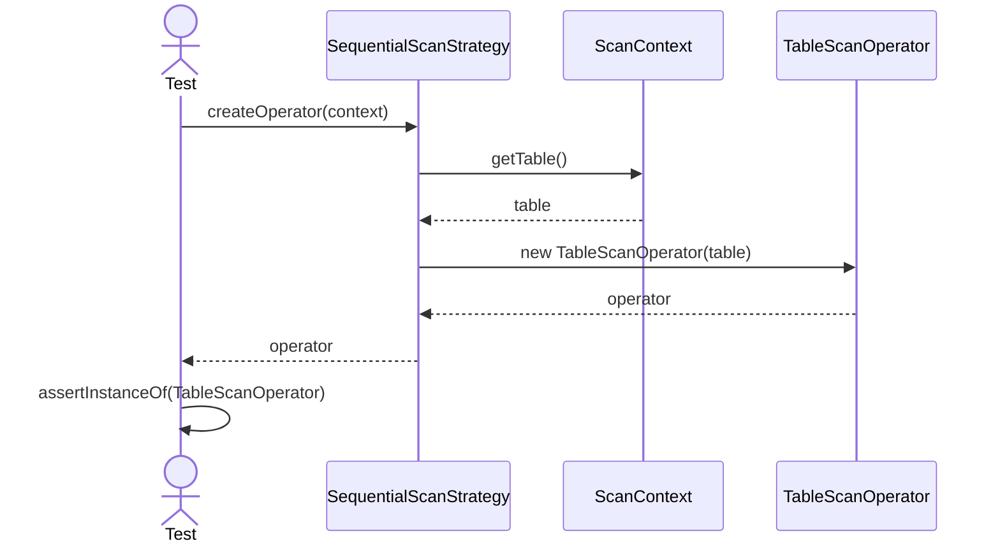
13. SequentialScan_GetType_ShouldReturnSequentialScan
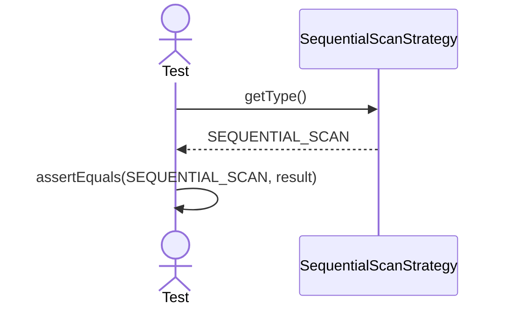
14. IndexScan_Supports_ShouldReturnTrueWhenMatchingIndexExists
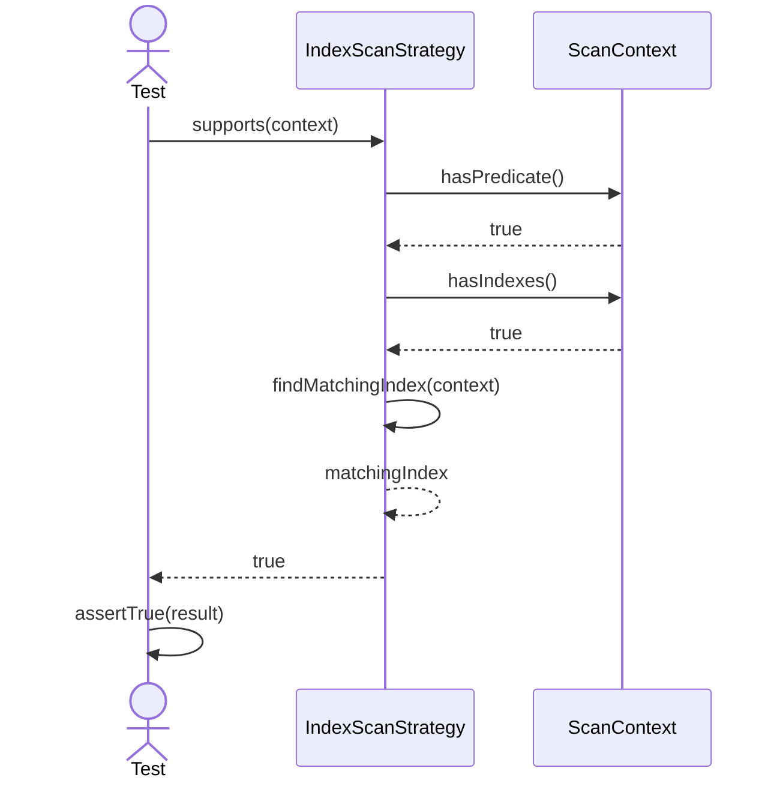
15. IndexScan_Supports_ShouldReturnFalseWhenNoIndexesExist
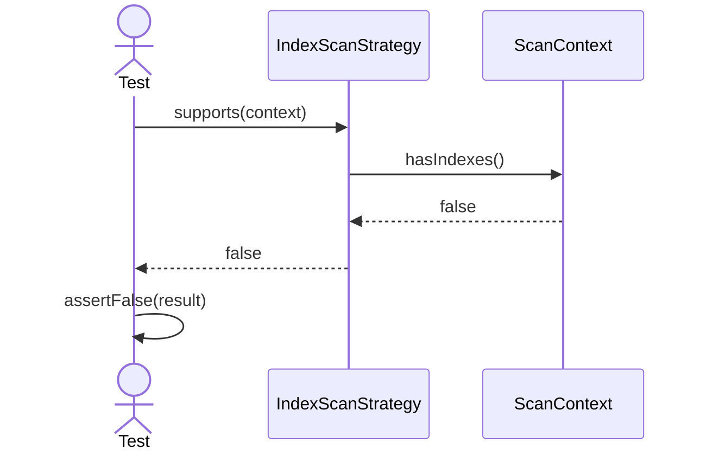
16. IndexScan_Supports_ShouldReturnFalseWhenPredicateMissing

17. IndexScan_Supports_ShouldReturnFalseWhenNoMatchingIndexExists
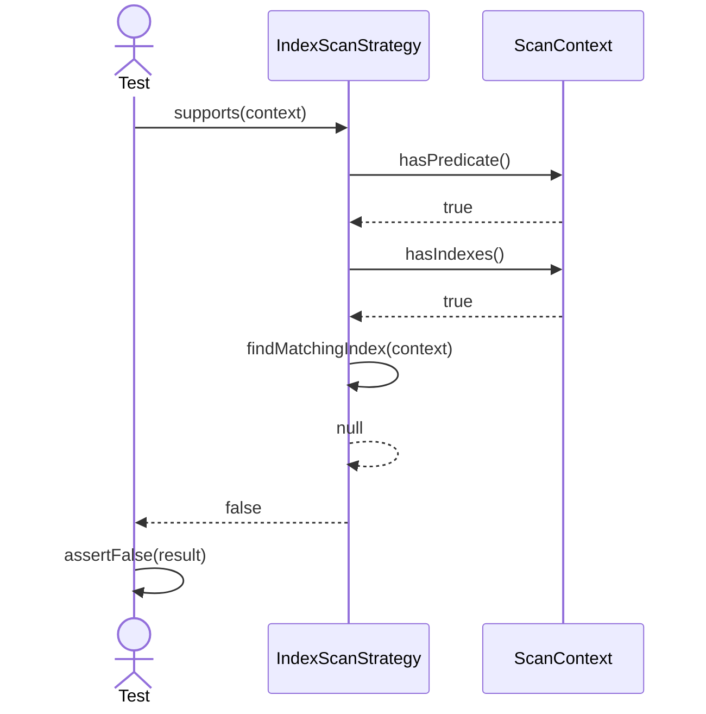
18. IndexScan_EstimateCost_ShouldReturnIndexScanCost
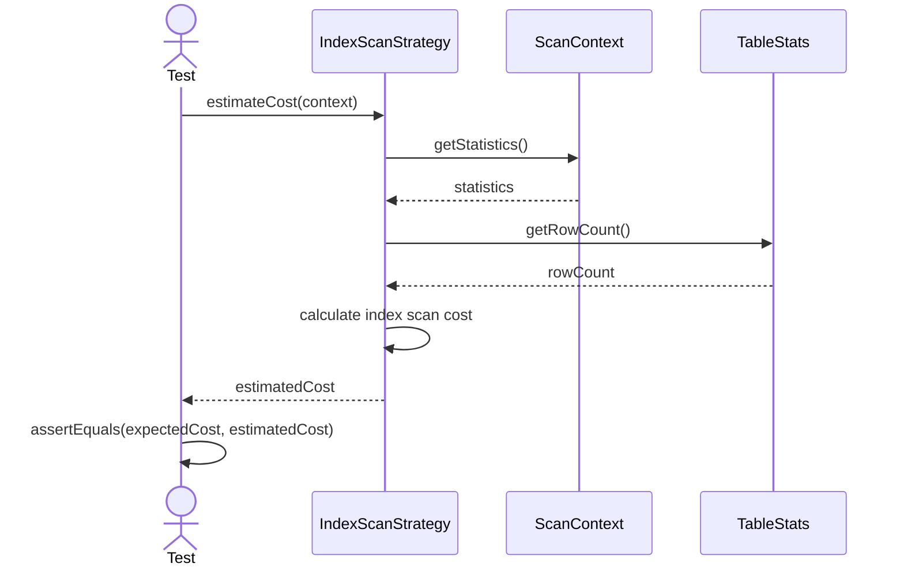
19. IndexScan_CreateOperator_ShouldReturnIndexScanOperator
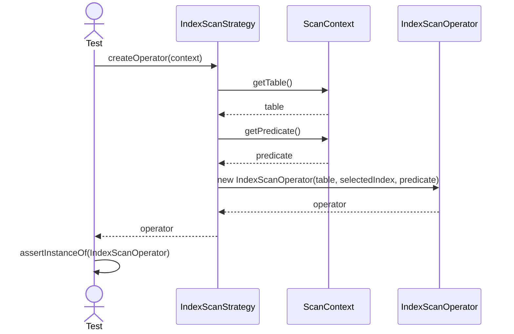
20. IndexScan_CreateOperator_ShouldUseSelectedIndex
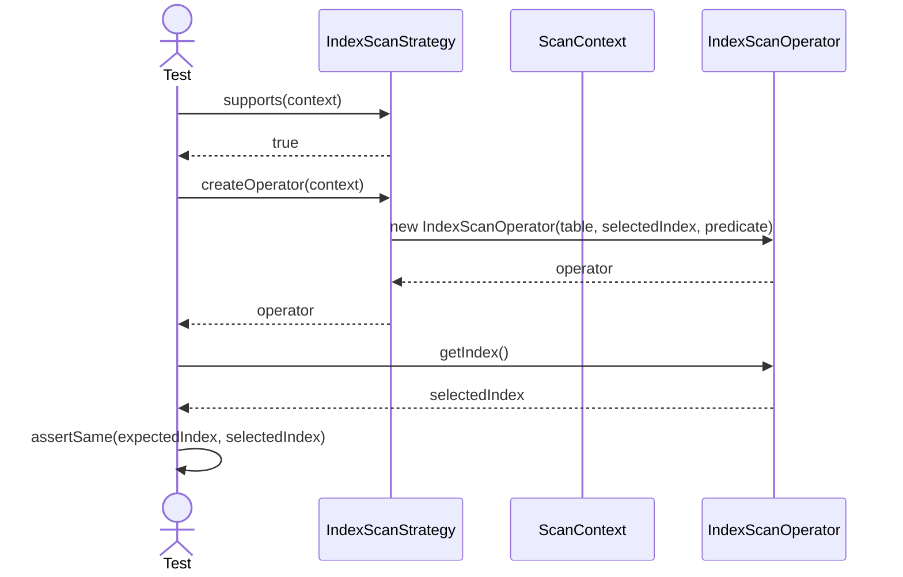
21. IndexScan_GetType_ShouldReturnIndexScan
```mermaid

sequenceDiagram
    actor Test
    participant Strategy as IndexScanStrategy

    Test->>Strategy: getType()
    Strategy-->>Test: INDEX_SCAN
    Test->>Test: assertEquals(INDEX_SCAN, result)
```
22. Selector_Constructor_ShouldStoreStrategies
```mermaid

sequenceDiagram
    actor Test
    participant Selector as ScanStrategySelector

    Test->>Selector: new ScanStrategySelector(strategies)
    Selector-->>Test: selector
    Test->>Selector: getStrategies()
    Selector-->>Test: strategies
    Test->>Test: assertEquals(expectedStrategies, strategies)
```
23. Selector_Select_ShouldChooseLowestCostStrategy
```mermaid

sequenceDiagram
    actor Test
    participant Selector as ScanStrategySelector
    participant First as ScanStrategy
    participant Second as ScanStrategy

    Test->>Selector: select(context)
    Selector->>First: supports(context)
    First-->>Selector: true
    Selector->>First: estimateCost(context)
    First-->>Selector: 100
    Selector->>Second: supports(context)
    Second-->>Selector: true
    Selector->>Second: estimateCost(context)
    Second-->>Selector: 20
    Selector-->>Test: secondStrategy
    Test->>Test: assertSame(secondStrategy, result)
```
24. Selector_Select_ShouldIgnoreUnsupportedStrategy
```mermaid

sequenceDiagram
    actor Test
    participant Selector as ScanStrategySelector
    participant Unsupported as ScanStrategy
    participant Supported as ScanStrategy

    Test->>Selector: select(context)
    Selector->>Unsupported: supports(context)
    Unsupported-->>Selector: false
    Note over Selector,Unsupported: estimateCost is not called
    Selector->>Supported: supports(context)
    Supported-->>Selector: true
    Selector->>Supported: estimateCost(context)
    Supported-->>Selector: cost
    Selector-->>Test: supportedStrategy
    Test->>Test: assertSame(supportedStrategy, result)
```
25. Selector_Select_ShouldReturnSequentialScanWhenIndexUnsupported
```mermaid

sequenceDiagram
    actor Test
    participant Selector as ScanStrategySelector
    participant Sequential as SequentialScanStrategy
    participant Index as IndexScanStrategy

    Test->>Selector: select(context)
    Selector->>Sequential: supports(context)
    Sequential-->>Selector: true
    Selector->>Sequential: estimateCost(context)
    Sequential-->>Selector: sequentialCost
    Selector->>Index: supports(context)
    Index-->>Selector: false
    Selector-->>Test: SequentialScanStrategy
    Test->>Test: assertSame(sequentialStrategy, result)
```
26. Selector_Select_ShouldReturnIndexScanWhenIndexCostIsLower
```mermaid

sequenceDiagram
    actor Test
    participant Selector as ScanStrategySelector
    participant Sequential as SequentialScanStrategy
    participant Index as IndexScanStrategy

    Test->>Selector: select(context)
    Selector->>Sequential: supports(context)
    Sequential-->>Selector: true
    Selector->>Sequential: estimateCost(context)
    Sequential-->>Selector: 100
    Selector->>Index: supports(context)
    Index-->>Selector: true
    Selector->>Index: estimateCost(context)
    Index-->>Selector: 10
    Selector-->>Test: IndexScanStrategy
    Test->>Test: assertSame(indexStrategy, result)
```
27. Selector_Select_ShouldRejectWhenNoStrategySupportsContext
```mermaid

sequenceDiagram
    actor Test
    participant Selector as ScanStrategySelector
    participant First as ScanStrategy
    participant Second as ScanStrategy

    Test->>Selector: select(context)
    Selector->>First: supports(context)
    First-->>Selector: false
    Selector->>Second: supports(context)
    Second-->>Selector: false
    Selector-->>Test: throw IllegalStateException
    Test->>Test: assertThrows(IllegalStateException)
```
28. QueryOptimizer_CreateScanOperator_ShouldDelegateToSelectedStrategy
```mermaid

sequenceDiagram
    actor Test
    participant Optimizer as QueryOptimizer
    participant Selector as ScanStrategySelector
    participant Strategy as ScanStrategy
    participant Operator as ExecutionOperator

    Test->>Optimizer: createScanOperator(context)
    Optimizer->>Selector: select(context)
    Selector-->>Optimizer: strategy
    Optimizer->>Strategy: createOperator(context)
    Strategy-->>Optimizer: operator
    Optimizer-->>Test: operator
    Test->>Test: assertSame(expectedOperator, operator)
```