Result Export Adapter Test Sequences

1. JsonAdapter_Constructor_ShouldStoreJsonWriter

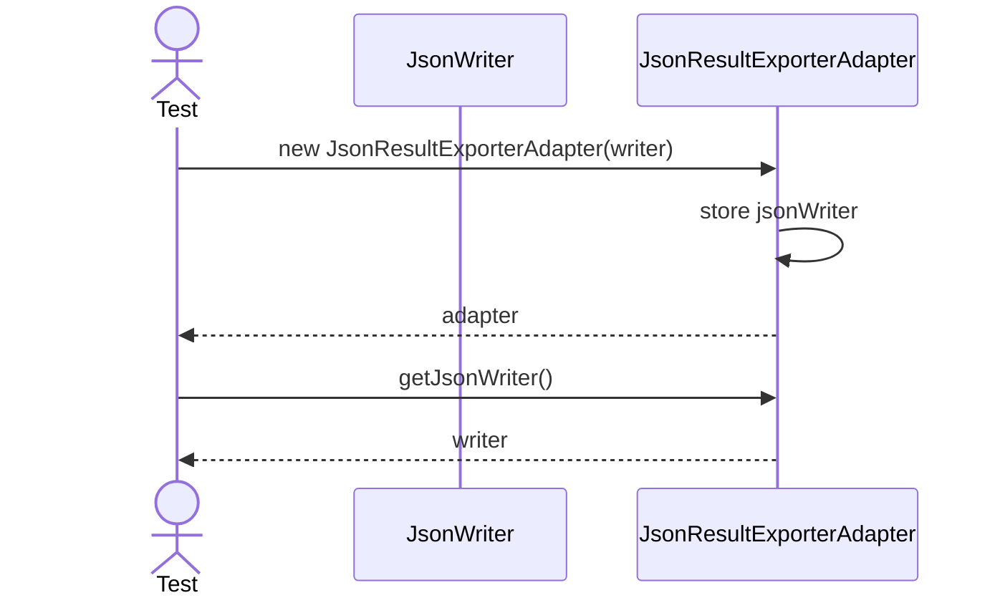
```mermaid
sequenceDiagram
    actor Test
    participant Writer as JsonWriter
    participant Adapter as JsonResultExporterAdapter

    Test->>Adapter: new JsonResultExporterAdapter(writer)
    Adapter->>Adapter: store jsonWriter
    Adapter-->>Test: adapter
    Test->>Adapter: getJsonWriter()
    Adapter-->>Test: writer
```
2. JsonAdapter_GetFormat_ShouldReturnJson

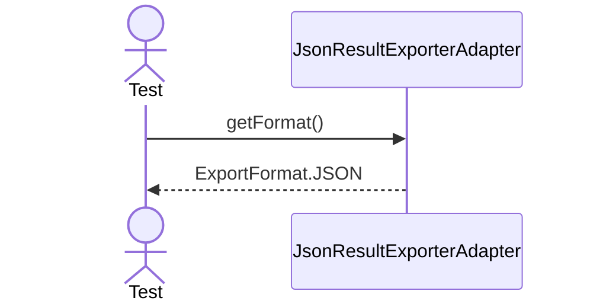
```mermaid
sequenceDiagram
    actor Test
    participant Adapter as JsonResultExporterAdapter

    Test->>Adapter: getFormat()
    Adapter-->>Test: ExportFormat.JSON
```
3. JsonAdapter_Export_ShouldConvertQueryResultToMaps

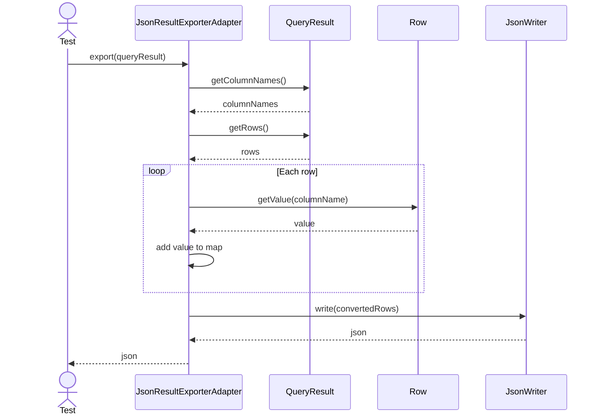
```mermaid
sequenceDiagram
    actor Test
    participant Adapter as JsonResultExporterAdapter
    participant Result as QueryResult
    participant Row
    participant Writer as JsonWriter

    Test->>Adapter: export(queryResult)
    Adapter->>Result: getColumnNames()
    Result-->>Adapter: columnNames
    Adapter->>Result: getRows()
    Result-->>Adapter: rows

    loop Each row
        Adapter->>Row: getValue(columnName)
        Row-->>Adapter: value
        Adapter->>Adapter: add value to map
    end

    Adapter->>Writer: write(convertedRows)
    Writer-->>Adapter: json
    Adapter-->>Test: json
```
4. JsonAdapter_Export_ShouldDelegateToJsonWriter

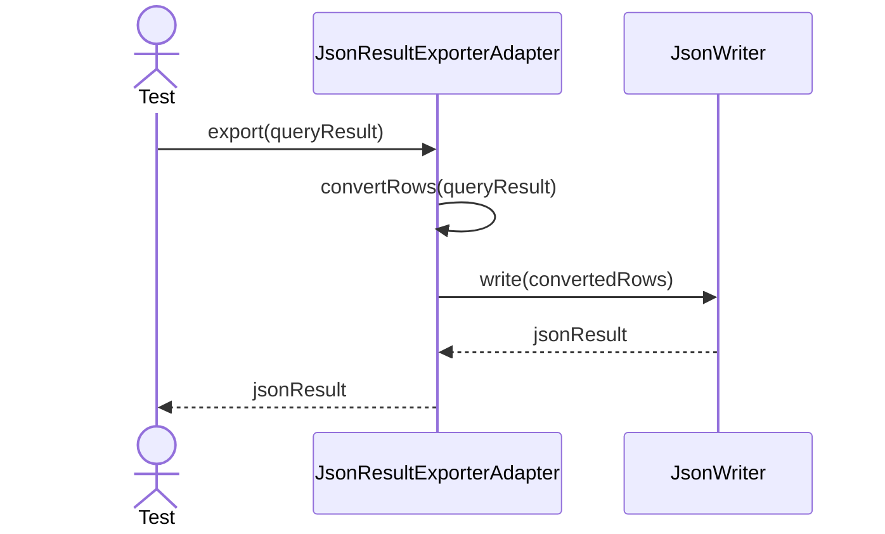
```mermaid
sequenceDiagram
    actor Test
    participant Adapter as JsonResultExporterAdapter
    participant Writer as JsonWriter

    Test->>Adapter: export(queryResult)
    Adapter->>Adapter: convertRows(queryResult)
    Adapter->>Writer: write(convertedRows)
    Writer-->>Adapter: jsonResult
    Adapter-->>Test: jsonResult
```
5. JsonAdapter_ExportToStream_ShouldDelegateToJsonWriter

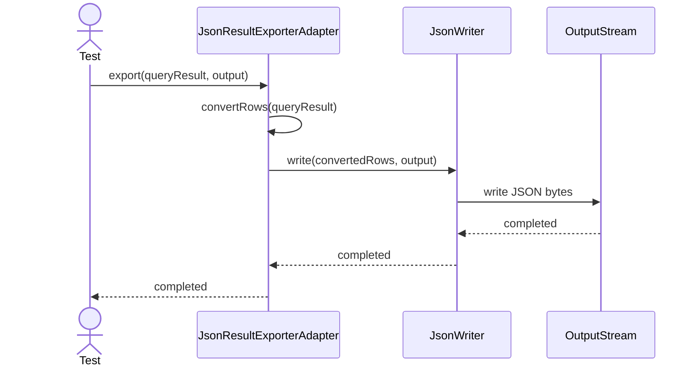
```mermaid
sequenceDiagram
    actor Test
    participant Adapter as JsonResultExporterAdapter
    participant Writer as JsonWriter
    participant Output as OutputStream

    Test->>Adapter: export(queryResult, output)
    Adapter->>Adapter: convertRows(queryResult)
    Adapter->>Writer: write(convertedRows, output)
    Writer->>Output: write JSON bytes
    Output-->>Writer: completed
    Writer-->>Adapter: completed
    Adapter-->>Test: completed
```
6. CsvAdapter_Constructor_ShouldStoreCsvWriter

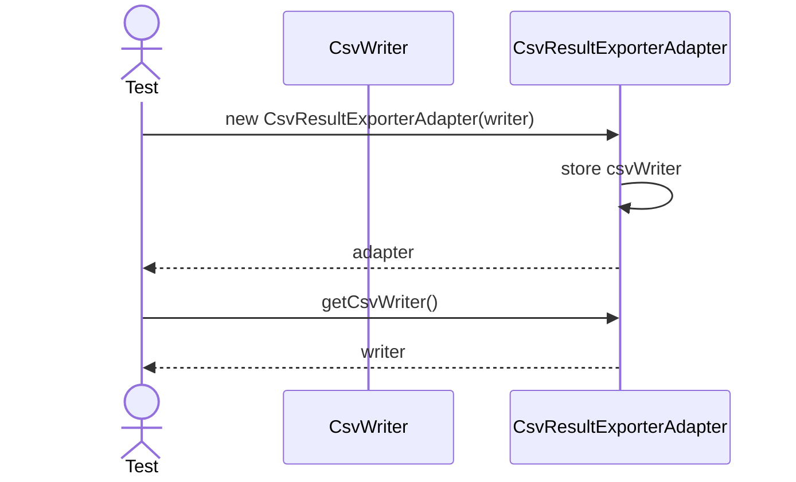
```mermaid
sequenceDiagram
    actor Test
    participant Writer as CsvWriter
    participant Adapter as CsvResultExporterAdapter

    Test->>Adapter: new CsvResultExporterAdapter(writer)
    Adapter->>Adapter: store csvWriter
    Adapter-->>Test: adapter
    Test->>Adapter: getCsvWriter()
    Adapter-->>Test: writer
```
7. CsvAdapter_GetFormat_ShouldReturnCsv

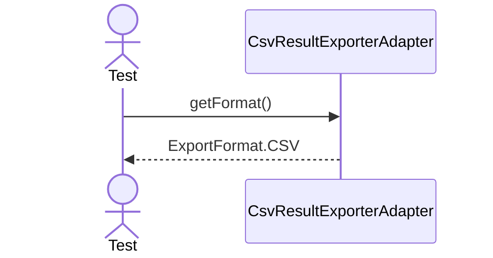
```mermaid
sequenceDiagram
    actor Test
    participant Adapter as CsvResultExporterAdapter

    Test->>Adapter: getFormat()
    Adapter-->>Test: ExportFormat.CSV
```
8. CsvAdapter_Export_ShouldUseColumnNamesAsHeaders

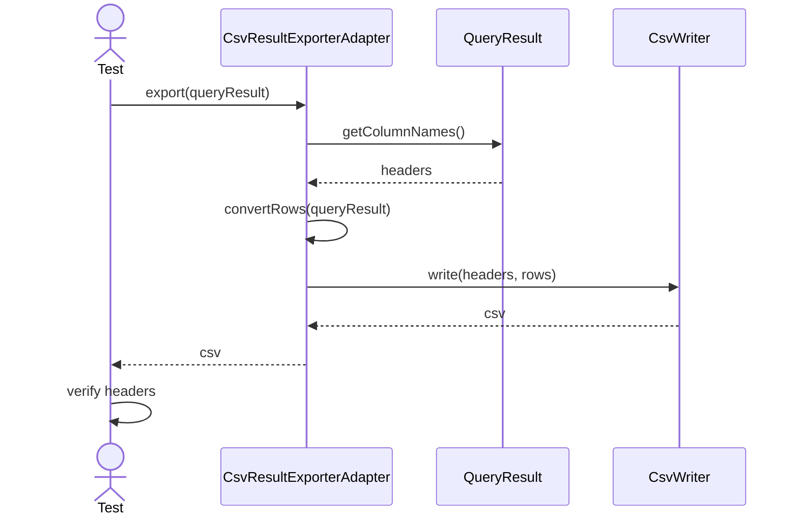
```mermaid
sequenceDiagram
    actor Test
    participant Adapter as CsvResultExporterAdapter
    participant Result as QueryResult
    participant Writer as CsvWriter

    Test->>Adapter: export(queryResult)
    Adapter->>Result: getColumnNames()
    Result-->>Adapter: headers
    Adapter->>Adapter: convertRows(queryResult)
    Adapter->>Writer: write(headers, rows)
    Writer-->>Adapter: csv
    Adapter-->>Test: csv
    Test->>Test: verify headers
```
9. CsvAdapter_Export_ShouldConvertRowsToOrderedValues

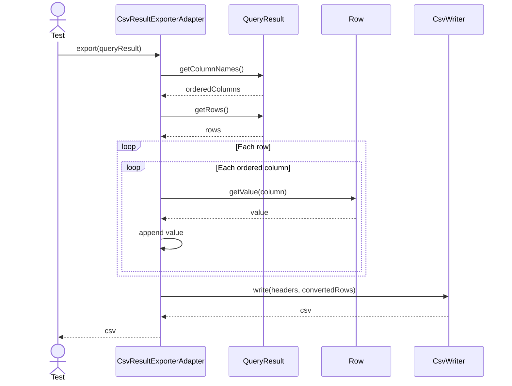
```mermaid
sequenceDiagram
    actor Test
    participant Adapter as CsvResultExporterAdapter
    participant Result as QueryResult
    participant Row
    participant Writer as CsvWriter

    Test->>Adapter: export(queryResult)
    Adapter->>Result: getColumnNames()
    Result-->>Adapter: orderedColumns
    Adapter->>Result: getRows()
    Result-->>Adapter: rows

    loop Each row
        loop Each ordered column
            Adapter->>Row: getValue(column)
            Row-->>Adapter: value
            Adapter->>Adapter: append value
        end
    end

    Adapter->>Writer: write(headers, convertedRows)
    Writer-->>Adapter: csv
    Adapter-->>Test: csv
```
10. CsvAdapter_Export_ShouldDelegateToCsvWriter

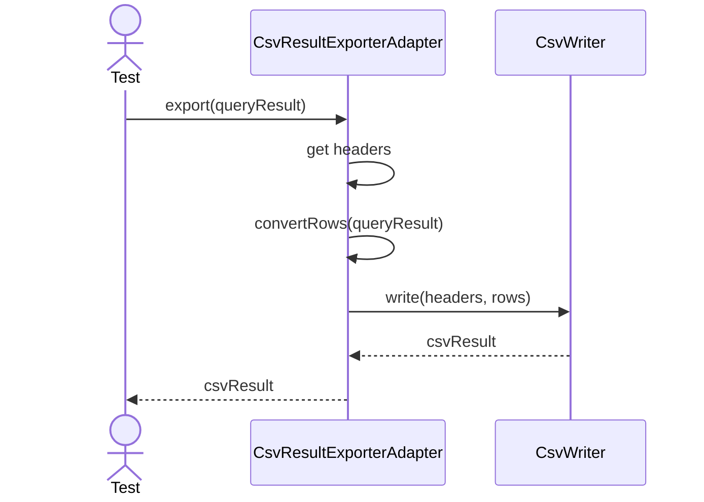
```mermaid
sequenceDiagram
    actor Test
    participant Adapter as CsvResultExporterAdapter
    participant Writer as CsvWriter

    Test->>Adapter: export(queryResult)
    Adapter->>Adapter: get headers
    Adapter->>Adapter: convertRows(queryResult)
    Adapter->>Writer: write(headers, rows)
    Writer-->>Adapter: csvResult
    Adapter-->>Test: csvResult
```
11. CsvAdapter_ExportToStream_ShouldDelegateToCsvWriter

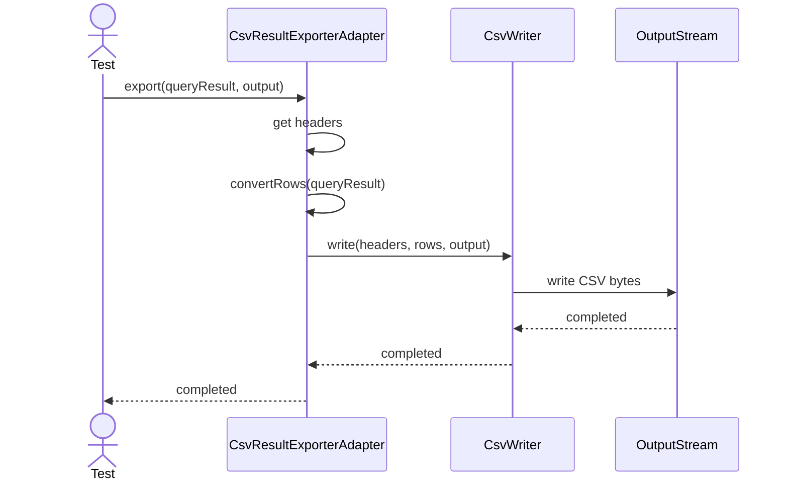
```mermaid
sequenceDiagram
    actor Test
    participant Adapter as CsvResultExporterAdapter
    participant Writer as CsvWriter
    participant Output as OutputStream

    Test->>Adapter: export(queryResult, output)
    Adapter->>Adapter: get headers
    Adapter->>Adapter: convertRows(queryResult)
    Adapter->>Writer: write(headers, rows, output)
    Writer->>Output: write CSV bytes
    Output-->>Writer: completed
    Writer-->>Adapter: completed
    Adapter-->>Test: completed
```
12. ExportService_Constructor_ShouldRegisterExporters

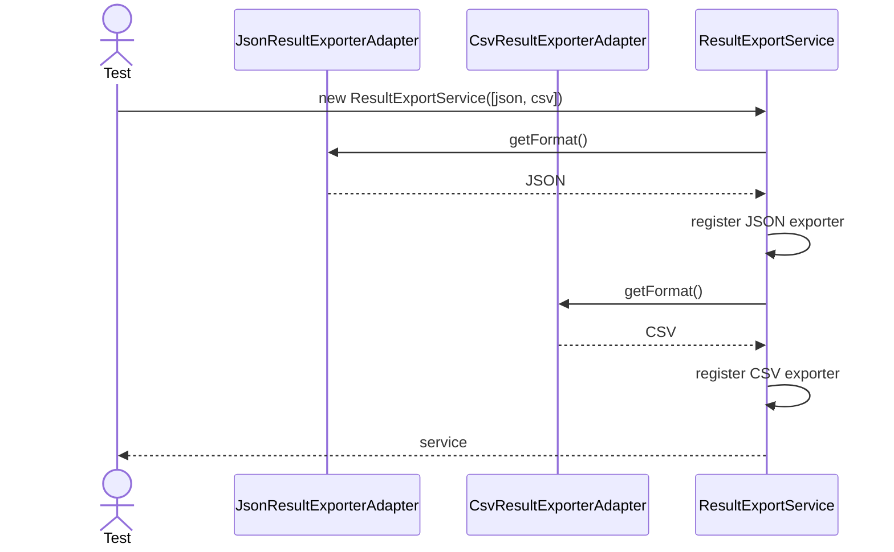
```mermaid
sequenceDiagram
    actor Test
    participant Json as JsonResultExporterAdapter
    participant Csv as CsvResultExporterAdapter
    participant Service as ResultExportService

    Test->>Service: new ResultExportService([json, csv])
    Service->>Json: getFormat()
    Json-->>Service: JSON
    Service->>Service: register JSON exporter
    Service->>Csv: getFormat()
    Csv-->>Service: CSV
    Service->>Service: register CSV exporter
    Service-->>Test: service
```
13. ExportService_Supports_ShouldReturnTrueForRegisteredFormat

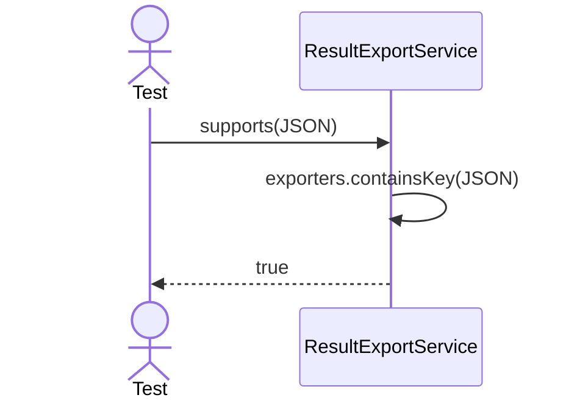
```mermaid
sequenceDiagram
    actor Test
    participant Service as ResultExportService

    Test->>Service: supports(JSON)
    Service->>Service: exporters.containsKey(JSON)
    Service-->>Test: true
```
14. ExportService_Supports_ShouldReturnFalseForMissingFormat

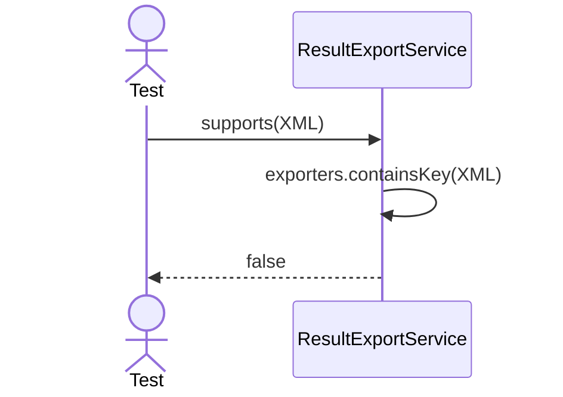
```mermaid
sequenceDiagram
    actor Test
    participant Service as ResultExportService

    Test->>Service: supports(XML)
    Service->>Service: exporters.containsKey(XML)
    Service-->>Test: false
```
15. ExportService_Export_ShouldSelectJsonAdapter

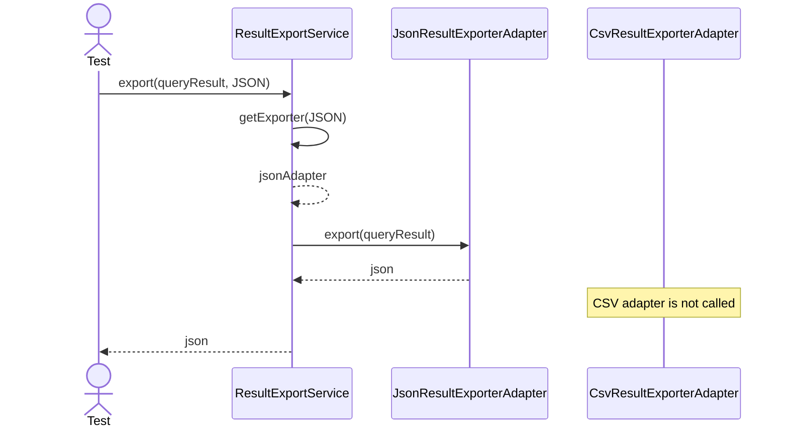
```mermaid
sequenceDiagram
    actor Test
    participant Service as ResultExportService
    participant Json as JsonResultExporterAdapter
    participant Csv as CsvResultExporterAdapter

    Test->>Service: export(queryResult, JSON)
    Service->>Service: getExporter(JSON)
    Service-->>Service: jsonAdapter
    Service->>Json: export(queryResult)
    Json-->>Service: json
    Note over Csv: CSV adapter is not called
    Service-->>Test: json
```
16. ExportService_Export_ShouldSelectCsvAdapter

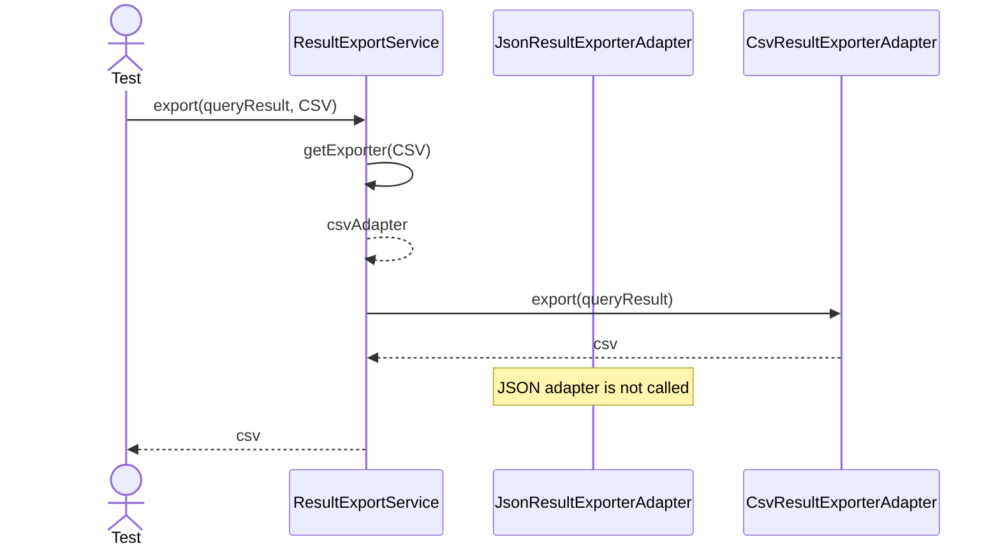
```mermaid
sequenceDiagram
    actor Test
    participant Service as ResultExportService
    participant Json as JsonResultExporterAdapter
    participant Csv as CsvResultExporterAdapter

    Test->>Service: export(queryResult, CSV)
    Service->>Service: getExporter(CSV)
    Service-->>Service: csvAdapter
    Service->>Csv: export(queryResult)
    Csv-->>Service: csv
    Note over Json: JSON adapter is not called
    Service-->>Test: csv
```
17. ExportService_ExportToStream_ShouldDelegateToSelectedAdapter
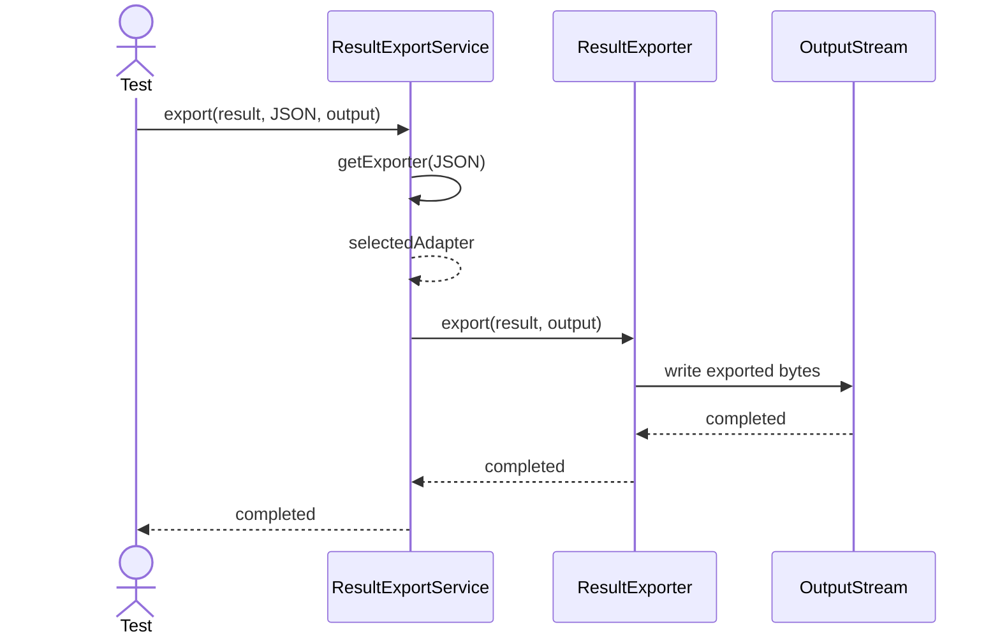
```mermaid

sequenceDiagram
    actor Test
    participant Service as ResultExportService
    participant Adapter as ResultExporter
    participant Output as OutputStream

    Test->>Service: export(result, JSON, output)
    Service->>Service: getExporter(JSON)
    Service-->>Service: selectedAdapter
    Service->>Adapter: export(result, output)
    Adapter->>Output: write exported bytes
    Output-->>Adapter: completed
    Adapter-->>Service: completed
    Service-->>Test: completed
```
18. ExportService_Export_ShouldRejectUnsupportedFormat
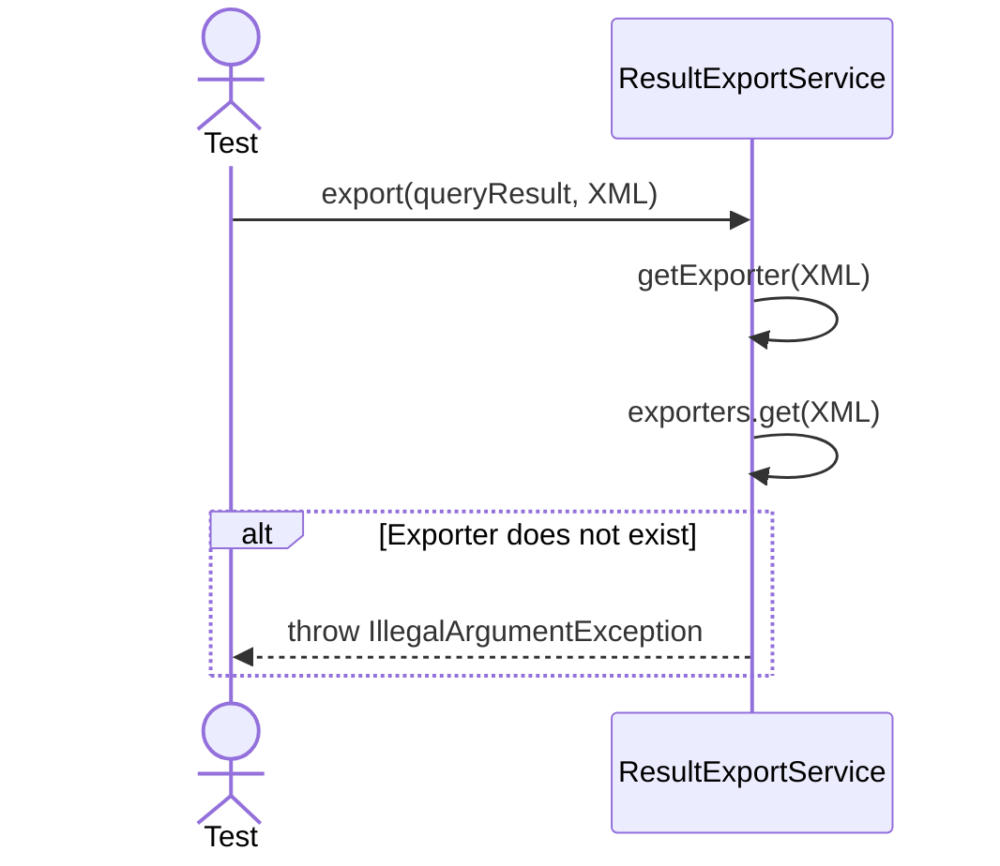
```mermaid
sequenceDiagram
    actor Test
    participant Service as ResultExportService

    Test->>Service: export(queryResult, XML)
    Service->>Service: getExporter(XML)
    Service->>Service: exporters.get(XML)

    alt Exporter does not exist
        Service-->>Test: throw IllegalArgumentException
    end
```
19. ExportService_RegisterExporter_ShouldAddNewExporter
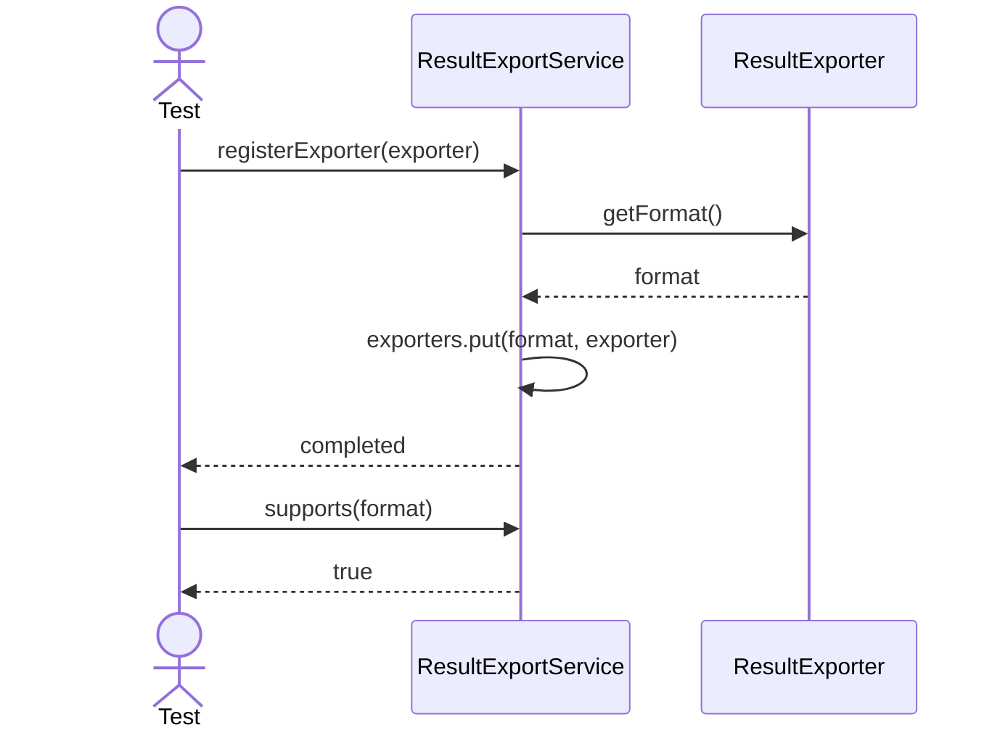
```mermaid
sequenceDiagram
    actor Test
    participant Service as ResultExportService
    participant Exporter as ResultExporter

    Test->>Service: registerExporter(exporter)
    Service->>Exporter: getFormat()
    Exporter-->>Service: format
    Service->>Service: exporters.put(format, exporter)
    Service-->>Test: completed
    Test->>Service: supports(format)
    Service-->>Test: true
```
20. ExportService_RegisterExporter_ShouldReplaceExistingFormat
```mermaid
sequenceDiagram
    actor Test
    participant Service as ResultExportService
    participant Old as OldJsonExporter
    participant New as NewJsonExporter

    Test->>Service: registerExporter(oldJsonExporter)
    Service->>Old: getFormat()
    Old-->>Service: JSON
    Service->>Service: exporters.put(JSON, old)

    Test->>Service: registerExporter(newJsonExporter)
    Service->>New: getFormat()
    New-->>Service: JSON
    Service->>Service: exporters.put(JSON, new)

    Test->>Service: export(result, JSON)
    Service->>New: export(result)
    New-->>Service: json
    Note over Old: Old exporter is not called
    Service-->>Test: json
    ```