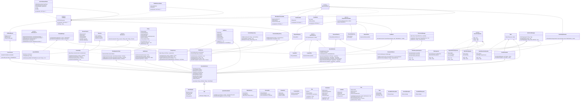

```mermaid
classDiagram
	direction BT

	%% =========================================================
	%% Application Orchestration
	%% =========================================================
	class ExecutionService {
		-ParserService parser
		-QueryValidation validator
		-IRoleService roleService
		-PolicyService policyService
		-QueryOptimizer optimizer
		-ExecutionPlanner planner
		-ResultFormatter formatter
		-SessionMgr sessionMgr
		-AuditLog auditLog
		+execute(sql: String, authToken: String) ResultOutput
	}

	class ResultOutput {
		+Boolean success
		+String message
		+int rowCount
		+String payload
	}

	class App {
		+main(args: String[]) Void
	}

	App --> ExecutionService : boots

	%% =========================================================
	%% Parsing and AST
	%% =========================================================
	class ParserService {
		-SyntaxErrorHandler errorHandler
		+parserSQL(sql: String) ASTBuildResult
	}

	class SyntaxErrorHandler {
		+handleError(errorTokens, rawSql) SyntaxErrorException
		+formatErrorMessage(line: int, col: int) String
	}

	class ASTBuildResult {
		+Boolean success
		+ASTNode root
		+String errorMessage
	}

	class ASTNode {
		<<interface>>
		+ASTNodeType type
		+accept(visitor: ASTVisitor) T
		+toString() String
	}

	class ExpressionNode {
		<<interface>>
	}
	ExpressionNode --|> ASTNode

	class SelectStatementNode {
		+TableReferenceNode fromClause
		+ExpressionNode whereClause
		+List~ASTNode~ projectionList
		+int limit
		+int offset
		+accept(visitor: ASTVisitor) T
	}
	SelectStatementNode --|> ASTNode

	class BinaryExpressionNode {
		+ExpressionNode left
		+String operator
		+ExpressionNode right
		+accept(visitor: ASTVisitor) T
	}
	BinaryExpressionNode --|> ExpressionNode

	class IdentifierNode {
		+String name
		+accept(visitor: ASTVisitor) T
	}
	IdentifierNode --|> ExpressionNode

	class LiteralNode {
		+any value
		+String rawType
		+accept(visitor: ASTVisitor) T
	}
	LiteralNode --|> ExpressionNode

	class TableReferenceNode {
		+String tableName
		+String alias
		+accept(visitor: ASTVisitor) T
	}
	TableReferenceNode --|> ASTNode

	class ASTVisitor~T~ {
		<<interface>>
		+visitSelectStatement(node: SelectStatementNode) T
		+visitBinaryExpression(node: BinaryExpressionNode) T
		+visitIdentifier(node: IdentifierNode) T
		+visitLiteral(node: LiteralNode) T
		+visitTableReference(node: TableReferenceNode) T
	}

	class PolicyRewriterVisitor {
		-ExpressionNode policyCondition
		+visitSelectStatement(node: SelectStatementNode) ASTNode
		+visitBinaryExpression(node: BinaryExpressionNode) ASTNode
		+visitTableReference(node: TableReferenceNode) ASTNode
	}
	PolicyRewriterVisitor ..|> ASTVisitor

	ParserService --> ASTBuildResult
	ASTBuildResult --> ASTNode
	ASTNode <|.. SelectStatementNode
	ASTNode <|.. TableReferenceNode
	ASTNode <|.. ExpressionNode

	%% =========================================================
	%% Validation, Security, and Policy
	%% =========================================================
	class QueryValidation {
		-IRoleService roleService
		-CatalogManager catalog
		+validateQuery(astBuild: ASTBuildResult, userID: String) Void
	}

	class CatalogManager {
		+getTableStatistics(tableName: String) TableStatistics
		+getTableSchema(tableName: String) SchemaInfo
	}

	class TableStatistics {
		+int rowCount
		+int pageCount
		+Map~String, String~ indexes
	}

	class SchemaInfo {
		+String tableName
		+List~ColumnInfo~ columns
		+List~ConstraintInfo~ constraints
	}

	class ColumnInfo {
		+String name
		+String dataType
		+Boolean nullable
	}

	class ConstraintInfo {
		+String constraintType
		+String expression
	}

	class SessionMgr {
		+Map~String, SessionContext~ activeSessions
		+createSession(userId, ip, device) TokenSet
		+validateSession(authToken) Boolean
		+refreshSession(refreshToken) TokenSet
		+revokeSession(authToken) Void
	}

	class SessionContext {
		+String sessionId
		+String userId
		+String authToken
		+String ipAddress
		+DateTime expiresAt
		+DateTime lastActiveAt
	}

	class TokenSet {
		+String authToken
		+String refreshToken
		+DateTime expiresAt
	}

	class AuthService {
		+hashPassword(rawPassword) String
		+verifyPassword(raw, hashed) Boolean
		+generateAuthAndRefreshToken(userId) Object
		+verifyToken(authToken) Boolean
	}

	class IRoleService {
		<<interface>>
		+checkAccess(userId: String, resource: String, action: String) Boolean
	}

	class RoleService {
		-UserRoleRepository userRoleRepo
		-PermissionRepository permRepo
		+createRole(name, permissions) Void
		+assignRole(userID, roleID) Void
		+unassignRole(userID, roleID) Void
		+checkAccess(userId, resource, action) Boolean
	}
	RoleService ..|> IRoleService

	class Role {
		+String id
		+String roleName
		+List~Permission~ permissions
		+createRole() String
		+deleteRole() Void
	}

	class Permission {
		+String permId
		+String permissionName
		+String resource
		+String action
		+String description
		+insertPerm() Void
		+editPerm() Void
	}

	class UserRole {
		+String userId
		+String roleId
		+DateTime createdAt
		+String ownerId
	}

	class Policy {
		+String policyId
		+String policyName
		+String targetTableId
		+String actionType
		+ExpressionNode conditionExpression
		+Boolean isEnabled
		+String assignmentType
		+insertNewPolicy() Void
		+updatePolicy(updates) Void
		+deletePolicy() Void
	}

	class PolicyService {
		-Map~String, List~Policy~~ policyCache
		+createPolicy(name, target, conditions) Policy
		+assignPolicy(policyId, targetId, type) Void
		+togglePolicyStatus(policyId, isEnabled) Void
		+getEnabledPoliciesForTable(tableName, actionType) List~Policy~
	}

	class AuditLog {
		+String logId
		+String actorID
		+String action
		+String targetId
		+String timestamp
		+String ipAddress
		+logging(info) Void
		+getLogging(options) List~AuditLog~
	}

	class User {
		+String userID
		+String username
		+String email
		+String hashedPassword
		+createNewUser(username, email, rawPassword) User
		+getUserData(username) User
		+checkUserExist(username) Boolean
		+updateUserInfo() Boolean
	}

	class UserRoleRepository {
		+findByUserId(userId: String) List~UserRole~
		+save(userRole: UserRole) Void
		+delete(userId: String, roleId: String) Void
	}

	class PermissionRepository {
		+findByRoleId(roleId: String) List~Permission~
		+save(permission: Permission) Void
	}

	QueryValidation --> CatalogManager
	QueryValidation --> IRoleService
	SessionMgr --> SessionContext
	SessionMgr --> TokenSet
	RoleService --> UserRoleRepository
	RoleService --> PermissionRepository
	PolicyService --> Policy
	PolicyService --> AuditLog

	%% =========================================================
	%% Optimization and Planning
	%% =========================================================
	class QueryOptimizer {
		-CatalogManager catalog
		-CostModel costModel
		-CardinalityEstimator cardinalityEstimator
		+generateLogicalPlan(ast: ASTNode) LogicalPlan
		+optimizeLogicalPlan(plan: LogicalPlan) LogicalPlan
		+optimizePhysicalPlan(plan: LogicalPlan) PhysicalPlanTree
		+applyPredicatePushdown(plan: LogicalPlan) LogicalPlan
		+applyProjectionPruning(plan: LogicalPlan) LogicalPlan
	}

	class CostModel {
		+calculateCost(node: PhysicalOperatorNode, stats: TableStatistics) Double
	}

	class CardinalityEstimator {
		+estimateSelectivity(predicate: ExpressionNode, stats: TableStatistics) double
	}

	class LogicalOperator {
		<<abstract>>
		+List~LogicalOperator~ children
	}

	class LogicalGet {
		+String tableName
	}
	LogicalGet --|> LogicalOperator

	class LogicalFilter {
		+ExpressionNode predicate
	}
	LogicalFilter --|> LogicalOperator

	class PhysicalPlanTree {
		+PhysicalOperatorNode root
	}

	class PhysicalOperatorNode {
		<<abstract>>
		+List~PhysicalOperatorNode~ children
		+double estimatedCost
	}

	class PhysicalSeqScan {
		+String tableId
	}
	PhysicalSeqScan --|> PhysicalOperatorNode

	class PhysicalIndexScan {
		+String indexId
		+any scanKey
	}
	PhysicalIndexScan --|> PhysicalOperatorNode

	class PhysicalFilter {
		+ExpressionNode predicate
	}
	PhysicalFilter --|> PhysicalOperatorNode

	QueryOptimizer --> CatalogManager
	QueryOptimizer --> CostModel
	QueryOptimizer --> CardinalityEstimator
	QueryOptimizer --> LogicalOperator
	QueryOptimizer --> PhysicalPlanTree
	CostModel --> PhysicalOperatorNode
	CardinalityEstimator --> ExpressionNode

	%% =========================================================
	%% Execution Planning and Operators
	%% =========================================================
	class ExecutionPlanner {
		-PlanCacheManager cacheManager
		+buildExecutionTree(plan: PhysicalPlanTree) ExecutionOperator
		+getPlanFromCache(sqlHash: String) PhysicalPlanTree
	}

	class PlanCacheManager {
		-Map~String, PhysicalPlanTree~ cacheMap
		+put(sqlHash: String, plan: PhysicalPlanTree) Void
		+get(sqlHash: String) PhysicalPlanTree
	}

	class ExecutionOperator {
		<<interface>>
		+init() Void
		+next() Tuple
		+close() Void
	}

	class Tuple {
		+Map~String, any~ values
	}

	class SequentialScanOperator {
		-String tableId
		-int currentPageId
		-int currentSlotId
		+init() Void
		+next() Tuple
	}
	SequentialScanOperator ..|> ExecutionOperator

	class IndexScanOperator {
		-String indexId
		-any searchKey
		+init() Void
		+next() Tuple
	}
	IndexScanOperator ..|> ExecutionOperator

	class FilterOperator {
		-ExecutionOperator childOperator
		-ExpressionNode predicate
		+init() Void
		+next() Tuple
	}
	FilterOperator ..|> ExecutionOperator

	class NestedLoopJoinOperator {
		-ExecutionOperator outerChild
		-ExecutionOperator innerChild
		-ExpressionNode joinPredicate
		+init() Void
		+next() Tuple
	}
	NestedLoopJoinOperator ..|> ExecutionOperator

	class InsertExecutionOperator {
		-String tableId
		-List~Tuple~ valuesToInsert
		+init() Void
		+next() Tuple
	}
	InsertExecutionOperator ..|> ExecutionOperator

	class BufferPoolManager {
		+fetchPage(pageId: String) Page
		+pinPage(pageId: String) Void
		+unpinPage(pageId: String, isDirty: Boolean) Void
	}

	class Page {
		+String pageId
		+Boolean isDirty
		+List~Tuple~ slots
	}

	class ResultFormatter {
		+formatAsJSON(tuples: List~Tuple~) String
		+formatAsCSV(tuples: List~Tuple~) String
	}

	class SyntaxErrorException {
		+String message
	}

	class SecurityException {
		+String message
	}

	class InvalidASTException {
		+String message
	}

	ExecutionPlanner --> PlanCacheManager
	ExecutionPlanner --> ExecutionOperator
	ExecutionPlanner --> PhysicalPlanTree
	FilterOperator --> ExecutionOperator
	SequentialScanOperator --> BufferPoolManager
	IndexScanOperator --> BufferPoolManager
	InsertExecutionOperator --> BufferPoolManager
	InsertExecutionOperator --> Tuple
	ResultFormatter --> Tuple

	%% =========================================================
	%% End-to-end dependencies
	%% =========================================================
	ExecutionService --> ParserService
	ExecutionService --> QueryValidation
	ExecutionService --> PolicyService
	ExecutionService --> QueryOptimizer
	ExecutionService --> ExecutionPlanner
	ExecutionService --> ResultFormatter
	ExecutionService --> SessionMgr
	ExecutionService --> AuditLog
	ExecutionService --> AuthService
	ExecutionService --> Tuple
	ExecutionService --> PolicyRewriterVisitor

	PolicyRewriterVisitor --> Policy
	PolicyRewriterVisitor --> ASTNode
```
