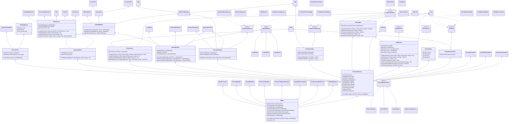

```mermaid

classDiagram
	direction BT

	class DBMS {
		-QueryProcessor queryProcessor
		-SecurityManager securityManager
		-StorageManager storageManager
		-TransactionManager transactionManager
		-ConnectionNetworkManager connectionNetworkManager
		-BackupRestoreLoging backupRestoreLoging
		-AdminstrationMonitoring adminstrationMonitoring
		-MedataManager medataManager
		+executeQuery(sql: String, authToken: String) ResultOutput
		+connect() Void
	}

	class QueryProcessor
	class SecurityManager
	class StorageManager
	class TransactionManager
	class ConnectionNetworkManager
	class BackupRestoreLoging
	class AdminstrationMonitoring
	class MedataManager

	DBMS o--> QueryProcessor
	DBMS o--> SecurityManager
	DBMS o--> StorageManager
	DBMS o--> TransactionManager
	DBMS o--> ConnectionNetworkManager
	DBMS o--> BackupRestoreLoging
	DBMS o--> AdminstrationMonitoring
	DBMS o--> MedataManager

	%% =========================================================
	%% Query processing pipeline
	%% =========================================================
	class ExecutionService {
		-ParserService parser
		-CatalogManager catalog
		-RoleService roleService
		-PolicyService policyService
		-QueryValidation validator
		-QueryOptimizer optimizer
		-ExecutionPlanner planner
		-ResultFormatter formatter
		-SessionMgr sessionMgr
		-AuditLog auditLog
		-AuthService authService
		+execute(sql: String, authToken: String) ResultOutput
	}

	class ResultOutput {
		+Boolean success
		+String message
		+int rowCount
		+String payload
	}

	class ParserService {
		-SyntaxErrorHandler errorHandler
		-Map~String, StatementParser~ parserMap
		+parserSQL(sql: String) ASTBuildResult
	}

	class SyntaxErrorHandler
	class ASTBuildResult {
		+Boolean success
		+ASTNode root
		+String errorMessage
	}

	class ASTNode {
		<<interface>>
	}
	class SelectStatementNode
	class InsertStatementNode
	class ExpressionNode {
		<<interface>>
	}
	class BinaryExpressionNode
	class IdentifierNode
	class LiteralNode
	class TableReferenceNode
	class ASTVisitor~T~ {
		<<interface>>
	}
	class PolicyRewriterVisitor {
		-ExpressionNode policyCondition
	}

	ASTNode <|.. SelectStatementNode
	ASTNode <|.. InsertStatementNode
	ASTNode <|.. TableReferenceNode
	ASTNode <|.. ExpressionNode
	ExpressionNode <|.. BinaryExpressionNode
	ExpressionNode <|.. IdentifierNode
	ExpressionNode <|.. LiteralNode
	PolicyRewriterVisitor ..|> ASTVisitor

	class QueryValidation {
		-CatalogManager catalog
		-RoleService roleService
		+validateQuery(astBuild: ASTBuildResult, userID: String) Void
	}

	class QueryOptimizer {
		-CatalogManager catalogManager
		-CostModel costModel
		-CardinalityEstimator cardinalityEstimator
		+generateLogicalPlan(ast: ASTNode) LogicalOperator
		+optimizeLogicalPlan(logicalPlan: LogicalOperator) LogicalOperator
		+optimizePhysicalPlan(logicalPlan: LogicalOperator) PhysicalPlanTree
	}

	class CostModel
	class CardinalityEstimator
	class LogicalOperator {
		<<abstract>>
	}
	class LogicalGet
	class LogicalFilter
	class LogicalInsert
	class PhysicalPlanTree
	class PhysicalOperatorNode {
		<<abstract>>
	}
	class PhysicalSeqScan
	class PhysicalFilter
	class PhysicalInsert

	LogicalGet --|> LogicalOperator
	LogicalFilter --|> LogicalOperator
	LogicalInsert --|> LogicalOperator
	PhysicalSeqScan --|> PhysicalOperatorNode
	PhysicalFilter --|> PhysicalOperatorNode
	PhysicalInsert --|> PhysicalOperatorNode

	class ExecutionPlanner {
		-PlanCacheManager cacheManager
		-BufferPoolManager bufferPoolManager
		+buildExecutionTree(plan: PhysicalPlanTree) ExecutionOperator
	}

	class PlanCacheManager
	class ExecutionOperator {
		<<interface>>
	}
	class SequentialScanOperator
	class IndexScanOperator
	class FilterOperator
	class InsertExecutionOperator
	class BufferPoolManager
	class Tuple
	class ResultFormatter {
		-TupleFormatStrategy jsonStrategy
		-TupleFormatStrategy csvStrategy
		+formatAsJSON(tuples: List~Tuple~) String
		+formatAsCSV(tuples: List~Tuple~) String
	}
	class TupleFormatStrategy {
		<<interface>>
	}
	class JsonTupleFormatStrategy
	class CsvTupleFormatStrategy

	ExecutionOperator <|.. SequentialScanOperator
	ExecutionOperator <|.. IndexScanOperator
	ExecutionOperator <|.. FilterOperator
	ExecutionOperator <|.. InsertExecutionOperator
	TupleFormatStrategy <|.. JsonTupleFormatStrategy
	TupleFormatStrategy <|.. CsvTupleFormatStrategy

	ExecutionService --> ParserService
	ExecutionService --> QueryValidation
	ExecutionService --> PolicyService
	ExecutionService --> QueryOptimizer
	ExecutionService --> ExecutionPlanner
	ExecutionService --> ResultFormatter
	ExecutionService --> SessionMgr
	ExecutionService --> AuditLog
	ExecutionService --> AuthService
	ExecutionService --> ResultOutput
	ExecutionService --> PolicyRewriterVisitor
	ParserService --> SyntaxErrorHandler
	ParserService --> ASTBuildResult
	QueryValidation --> CatalogManager
	QueryValidation --> RoleService
	QueryOptimizer --> CatalogManager
	QueryOptimizer --> CostModel
	QueryOptimizer --> CardinalityEstimator
	QueryOptimizer --> LogicalOperator
	QueryOptimizer --> PhysicalPlanTree
	ExecutionPlanner --> PlanCacheManager
	ExecutionPlanner --> BufferPoolManager
	ExecutionPlanner --> PhysicalPlanTree
	ExecutionPlanner --> ExecutionOperator
	ResultFormatter --> Tuple
	ResultFormatter --> TupleFormatStrategy
	PolicyRewriterVisitor --> Policy
	PolicyRewriterVisitor --> ASTNode

	%% =========================================================
	%% Security and access control
	%% =========================================================
	class AuthService {
		-SessionMgr sessionMgr
		-EmailService emailService
		-Map~String, User~ usersByUsername
		-Map~String, User~ usersByEmail
		-Map~String, String~ resetTokens
		+register(username: String, email: String, rawPassword: String) User
		+login(username: String, password: String) TokenSet
		+logout(authToken: String) Void
		+forgotPassword(email: String) String
		+resetPassword(resetToken: String, newPassword: String) Void
		+generateAuthAndRefreshToken(userId: String) TokenSet
		+verifyToken(authToken: TokenSet) Boolean
	}

	class SessionMgr {
		+Map~String, SessionContext~ activeSessions
		+createSession(userId: String, ip: String, device: String) TokenSet
		+validateSession(authToken: String) Boolean
		+refreshSession(refreshToken: String) TokenSet
		+revokeSession(authToken: String) Void
		+revokeSessionsByUserId(userId: String) Void
	}

	class SessionContext
	class TokenSet
	class EmailService {
		<<interface>>
	}
	class InMemoryEmailService
	class User
	class RoleService {
		-UserRoleRepository userRoleRepo
		-PermissionRepository permRepo
		-Map~String, Role~ roles
		+createRole(name: String, permissions: List~Permission~) Void
		+assignRole(userID: String, roleID: String) Void
		+unassignRole(userID: String, roleID: String) Void
		+checkAccess(userId: String, resource: String, action: String) Boolean
	}
	class Role
	class Permission
	class UserRole
	class UserRoleRepository
	class PermissionRepository
	class PolicyService {
		-Map~String, List~Policy~~ policyCache
		+createPolicy(name: String, target: String, conditions: ExpressionNode) Policy
		+assignPolicy(policyId: String, targetId: String, type: String) Void
		+togglePolicyStatus(policyId: String, isEnabled: Boolean) Void
		+getEnabledPoliciesForTable(tableName: String, actionType: String) List~Policy~
	}
	class Policy
	class AuditLog
	class SecurityException

	AuthService --> SessionMgr
	AuthService --> EmailService
	AuthService --> User
	SessionMgr --> SessionContext
	SessionMgr --> TokenSet
	SessionMgr --> User
	RoleService --> UserRoleRepository
	RoleService --> PermissionRepository
	RoleService --> Role
	RoleService --> UserRole
	RoleService --> Permission
	PolicyService --> Policy
	PolicyService --> ExpressionNode
	AuditLog --> User

	%% =========================================================
	%% Storage and catalog
	%% =========================================================
	class CatalogManager {
		+getTableStatistics(tableName: String) TableStatistics
		+getTableSchema(tableName: String) SchemaInfo
		+getBufferPoolManager() BufferPoolManager
	}
	class TableStatistics
	class SchemaInfo
	class ColumnInfo
	class ConstraintInfo
	class Page

	CatalogManager --> TableStatistics
	CatalogManager --> SchemaInfo
	CatalogManager --> BufferPoolManager
	SchemaInfo --> ColumnInfo
	SchemaInfo --> ConstraintInfo
	BufferPoolManager --> Page
	BufferPoolManager --> Tuple

	class SyntaxErrorException
	class InvalidASTException

	ExecutionService --> SecurityException
	ExecutionService --> InvalidASTException
	ExecutionService --> SyntaxErrorException
	DBMS --> ExecutionService
```
