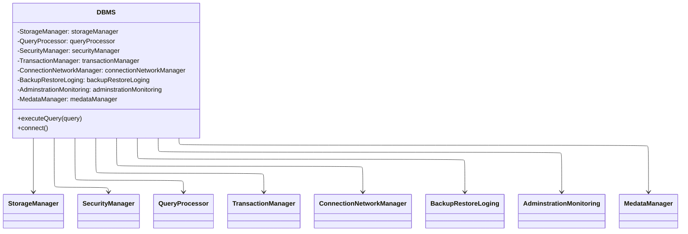

```mermaid
---
config:
  layout: elk
---
classDiagram
direction TB
    class DBMS {
	    -StorageManager: storageManager
	    -QueryProcessor: queryProcessor
	    -SecurityManager: securityManager
	    -TransactionManager: transactionManager
	    -ConnectionNetworkManager: connectionNetworkManager
	    -BackupRestoreLoging: backupRestoreLoging
	    -AdminstrationMonitoring: adminstrationMonitoring
	    -MedataManager: medataManager
	    +executeQuery(query)
	    +connect()
    }
    class StorageManager {
    }

    class SecurityManager {
    }

    class QueryProcessor {
    }

    class TransactionManager {
    }

    class ConnectionNetworkManager {
    }

    class BackupRestoreLoging {
    }

    class AdminstrationMonitoring {
    }

    class MedataManager {
    }

    direction TB

    DBMS --> StorageManager
    DBMS --> SecurityManager
    DBMS --> QueryProcessor
    DBMS --> TransactionManager
    DBMS --> ConnectionNetworkManager
    DBMS --> BackupRestoreLoging
    DBMS --> AdminstrationMonitoring
    DBMS --> MedataManager

```
