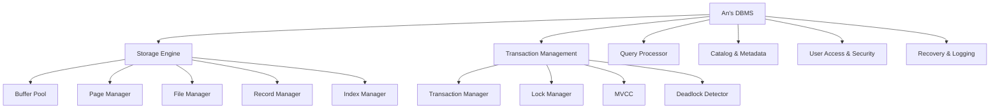

```mermaid
graph TD

    DBMS["An's DBMS"]

   

    Storage --> BufferPool["Buffer Pool"]
    Storage --> PageManager["Page Manager"]
    Storage --> FileManager["File Manager"]
    Storage --> RecordManager["Record Manager"]
    Storage --> IndexManager["Index Manager"]

  

    Transaction --> TxManager["Transaction Manager"]
    Transaction --> LockManager["Lock Manager"]
    Transaction --> MVCC["MVCC"]
    Transaction --> Deadlock["Deadlock Detector"]


     DBMS --> Storage["Storage Engine"]
    DBMS --> Query["Query Processor"]
    DBMS --> Transaction["Transaction Management"]
    DBMS --> Metadata["Catalog & Metadata"]
    DBMS --> Security["User Access & Security"]
    DBMS --> Recovery["Recovery & Logging"]
```