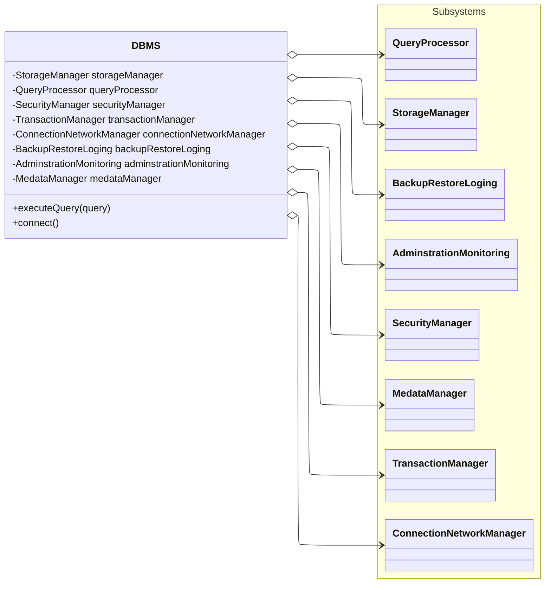

```mermaid
---
config:
  layout: elk
---
classDiagram
    direction LR

    class DBMS {
      -StorageManager storageManager
      -QueryProcessor queryProcessor
      -SecurityManager securityManager
      -TransactionManager transactionManager
      -ConnectionNetworkManager connectionNetworkManager
      -BackupRestoreLoging backupRestoreLoging
      -AdminstrationMonitoring adminstrationMonitoring
      -MedataManager medataManager
      +executeQuery(query)
      +connect()
    }

    namespace Subsystems {
        class StorageManager
        class SecurityManager
        class QueryProcessor
        class TransactionManager
        class ConnectionNetworkManager
        class BackupRestoreLoging
        class AdminstrationMonitoring
        class MedataManager
    }

    %% Các đường kết nối từ DBMS tới các Subsystems
    DBMS o--> StorageManager
    DBMS o--> SecurityManager
    DBMS o--> QueryProcessor
    DBMS o--> TransactionManager
    DBMS o--> ConnectionNetworkManager
    DBMS o--> BackupRestoreLoging
    DBMS o--> AdminstrationMonitoring
    DBMS o--> MedataManager
```
