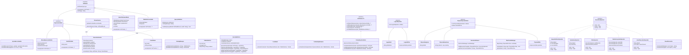

```mermaid
classDiagram
    direction BT

    %% --- SQL Parser & AST ---
    class ParserService {
        -SyntaxErrorHandler errorHandler
        +parserSQL(sql: String) ASTBuildResult
    }

    class SyntaxErrorHandler {
        +handleError(errorTokens, rawSql) SyntaxErrorException
        +formatErrorMessage(line: int, col: int) String
    }

    class ASTNode {
        <<interface>>
        +ASTNodeType type
        +accept(visitor: ASTVisitor) T
        +toString() String
    }

    class ExpressionNode {
        <<interface>>
    }
    ExpressionNode --|> ASTNode

    class SelectStatementNode {
        +TableReferenceNode fromClause
        +ExpressionNode whereClause
        +List~ASTNode~ projectionList
        +int limit
        +int offset
        +accept(visitor: ASTVisitor) T
    }
    SelectStatementNode --|> ASTNode

    class BinaryExpressionNode {
        +ExpressionNode left
        +String operator
        +ExpressionNode right
        +accept(visitor: ASTVisitor) T
    }
    BinaryExpressionNode --|> ExpressionNode

    class IdentifierNode {
        +String name
        +accept(visitor: ASTVisitor) T
    }
    IdentifierNode --|> ExpressionNode

    class LiteralNode {
        +any value
        +String rawType
        +accept(visitor: ASTVisitor) T
    }
    LiteralNode --|> ExpressionNode

    class TableReferenceNode {
        +String tableName
        +String alias
        +accept(visitor: ASTVisitor) T
    }
    TableReferenceNode --|> ASTNode

    %% --- AST Visitor & Policy Rewriter ---
    class ASTVisitor~T~ {
        <<interface>>
        +visitSelectStatement(node: SelectStatementNode) T
        +visitBinaryExpression(node: BinaryExpressionNode) T
        +visitIdentifier(node: IdentifierNode) T
        +visitLiteral(node: LiteralNode) T
        +visitTableReference(node: TableReferenceNode) T
    }

    class PolicyRewriterVisitor {
        -ExpressionNode policyCondition
        +visitSelectStatement(node: SelectStatementNode) ASTNode
        +visitBinaryExpression(node: BinaryExpressionNode) ASTNode
        +visitTableReference(node: TableReferenceNode) ASTNode
    }
    PolicyRewriterVisitor ..|> ASTVisitor

    %% --- Validation & Catalog ---
    class QueryValidation {
        -IRoleService roleService
        -CatalogManager catalog
        +validateQuery(astBuild: ASTBuildResult, userID: String) Void
    }

    class CatalogManager {
        +getTableStatistics(tableName: String) TableStatistics
        +getTableSchema(tableName: String) SchemaInfo
    }

    class TableStatistics {
        +int rowCount
        +int pageCount
        +Map~String, String~ indexes
    }

    %% --- Optimizer & Cost Model ---
    class QueryOptimizer {
        -CatalogManager catalog
        -CostModel costModel
        -CardinalityEstimator cardinalityEstimator
        +generateLogicalPlan(ast: ASTNode) LogicalPlan
        +optimizeLogicalPlan(plan: LogicalPlan) LogicalPlan
        +optimizePhysicalPlan(plan: LogicalPlan) PhysicalPlanTree
        +applyPredicatePushdown(plan: LogicalPlan) LogicalPlan
        +applyProjectionPruning(plan: LogicalPlan) LogicalPlan
    }

    class CostModel {
        +calculateCost(node: PhysicalOperatorNode, stats: TableStatistics) Double
    }

    class CardinalityEstimator {
        +estimateSelectivity(predicate: ExpressionNode, stats: TableStatistics) double
    }

    %% --- Plans ---
    class LogicalOperator {
        <<abstract>>
        +List~LogicalOperator~ children
    }
    class LogicalGet { +String tableName }
    class LogicalFilter { +ExpressionNode predicate }
    LogicalGet --|> LogicalOperator
    LogicalFilter --|> LogicalOperator

    class PhysicalOperatorNode {
        <<abstract>>
        +List~PhysicalOperatorNode~ children
        +double estimatedCost
    }
    class PhysicalSeqScan { +String tableId }
    class PhysicalIndexScan { +String indexId, +any scanKey }
    class PhysicalFilter { +ExpressionNode predicate }
    PhysicalSeqScan --|> PhysicalOperatorNode
    PhysicalIndexScan --|> PhysicalOperatorNode
    PhysicalFilter --|> PhysicalOperatorNode

    %% --- Execution Planning & Cache ---
    class ExecutionPlanner {
        -PlanCacheManager cacheManager
        +buildExecutionTree(plan: PhysicalPlanTree) ExecutionOperator
        +getPlanFromCache(sqlHash: String) PhysicalPlanTree
    }

    class PlanCacheManager {
        -Map~String, PhysicalPlanTree~ cacheMap
        +put(sqlHash: String, plan: PhysicalPlanTree) Void
        +get(sqlHash: String) PhysicalPlanTree
    }

    %% --- Query Executor Operators ---
    class ExecutionOperator {
        <<interface>>
        +init() Void
        +next() Tuple
        +close() Void
    }

    class SequentialScanOperator {
        -String tableId
        -int currentPageId
        -int currentSlotId
        +init() Void
        +next() Tuple
    }
    class IndexScanOperator {
        -String indexId
        -any searchKey
        +init() Void
        +next() Tuple
    }
    class FilterOperator {
        -ExecutionOperator childOperator
        -ExpressionNode predicate
        +init() Void
        +next() Tuple
    }
    class NestedLoopJoinOperator {
        -ExecutionOperator outerChild
        -ExecutionOperator innerChild
        -ExpressionNode joinPredicate
        +init() Void
        +next() Tuple
    }
    class InsertExecutionOperator {
        -String tableId
        -List~Tuple~ valuesToInsert
        +init() Void
        +next() Tuple
    }

    SequentialScanOperator ..|> ExecutionOperator
    IndexScanOperator ..|> ExecutionOperator
    FilterOperator ..|> ExecutionOperator
    NestedLoopJoinOperator ..|> ExecutionOperator
    InsertExecutionOperator ..|> ExecutionOperator

    %% --- Execution Control Service ---
    class ExecutionService {
        -ParserService parser
        -QueryValidation validator
        -PolicyService policyService
        -QueryOptimizer optimizer
        -ExecutionPlanner planner
        -ResultFormatter formatter
        +execute(sql: String, authToken: String) ResultOutput
    }

    class ResultFormatter {
        +formatAsJSON(tuples: List~Tuple~) String
        +formatAsCSV(tuples: List~Tuple~) String
    }

    ExecutionService ..> ParserService: uses
    ExecutionService ..> QueryValidation: uses
```