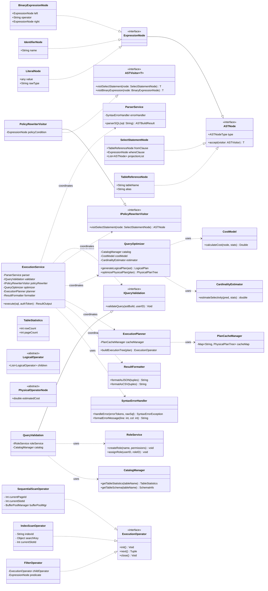

```mermaid

classDiagram
    direction LR

    %% ==========================================
    %% SUBGRAPH 1: SQL PARSER & AST
    %% ==========================================
    subgraph AST_and_Parser
        class ParserService {
            -SyntaxErrorHandler errorHandler
            +parserSQL(sql: String) ASTBuildResult
        }
        class SyntaxErrorHandler {
            +handleError(errorTokens, rawSql) SyntaxErrorException
            +formatErrorMessage(line: int, col: int) String
        }
        class ASTNode {
            <<interface>>
            +ASTNodeType type
            +accept(visitor: ASTVisitor) T
        }
        class ExpressionNode {
            <<interface>>
        }
        class SelectStatementNode {
            +TableReferenceNode fromClause
            +ExpressionNode whereClause
            +List~ASTNode~ projectionList
        }
        class BinaryExpressionNode {
            +ExpressionNode left
            +String operator
            +ExpressionNode right
        }
        class IdentifierNode {
            +String name
        }
        class LiteralNode {
            +any value
            +String rawType
        }
        class TableReferenceNode {
            +String tableName
            +String alias
        }

        ExpressionNode --|> ASTNode
        SelectStatementNode ..|> ASTNode
        TableReferenceNode ..|> ASTNode
        BinaryExpressionNode ..|> ExpressionNode
        IdentifierNode ..|> ExpressionNode
        LiteralNode ..|> ExpressionNode
    end

    %% ==========================================
    %% SUBGRAPH 2: VISITOR & REWRITER
    %% ==========================================
    subgraph AST_Visitors_Writers
        class ASTVisitor~T~ {
            <<interface>>
            +visitSelectStatement(node: SelectStatementNode) T
            +visitBinaryExpression(node: BinaryExpressionNode) T
        }
        class IPolicyRewriterVisitor {
            <<interface>>
            +visitSelectStatement(node: SelectStatementNode) ASTNode
        }
        class PolicyRewriterVisitor {
            -ExpressionNode policyCondition
        }
        PolicyRewriterVisitor --|> IPolicyRewriterVisitor
        PolicyRewriterVisitor ..|> ASTVisitor
    end

    %% ==========================================
    %% SUBGRAPH 3: VALIDATION & CATALOG
    %% ==========================================
    subgraph Catalog_and_Validation
        class IQueryValidation {
            <<interface>>
            +validateQuery(astBuild, userID) Void
        }
        class QueryValidation {
            -IRoleService roleService
            -CatalogManager catalog
        }
        class RoleService {
            +createRole(name, permissions) void
            +assignRole(userID, roleID) void
        }
        class CatalogManager {
            +getTableStatistics(tableName) TableStatistics
            +getTableSchema(tableName) SchemaInfo
        }
        class TableStatistics {
            +int rowCount
            +int pageCount
        }
        QueryValidation --|> IQueryValidation
        QueryValidation ..> RoleService : uses
        QueryValidation ..> CatalogManager : uses
    end

    %% ==========================================
    %% SUBGRAPH 4: OPTIMIZER & PLANS
    %% ==========================================
    subgraph Query Optimization
        class QueryOptimizer {
            -CatalogManager catalog
            -CostModel costModel
            -CardinalityEstimator estimator
            +generateLogicalPlan(ast) LogicalPlan
            +optimizePhysicalPlan(plan) PhysicalPlanTree
        }
        class CostModel {
            +calculateCost(node, stats) Double
        }
        class CardinalityEstimator {
            +estimateSelectivity(pred, stats) double
        }
        class LogicalOperator {
            <<abstract>>
            +List~LogicalOperator~ children
        }
        class PhysicalOperatorNode {
            <<abstract>>
            +double estimatedCost
        }
        QueryOptimizer ..> CostModel : uses
        QueryOptimizer ..> CardinalityEstimator : uses
    end

    %% ==========================================
    %% SUBGRAPH 5: EXECUTION ENGINE
    %% ==========================================
    subgraph Execution_Engine
        class ExecutionPlanner {
            -PlanCacheManager cacheManager
            +buildExecutionTree(plan) ExecutionOperator
        }
        class PlanCacheManager {
            -Map~String, PhysicalPlanTree~ cacheMap
        }
        class ExecutionOperator {
            <<interface>>
            +init() Void
            +next() Tuple
            +close() Void
        }
        class SequentialScanOperator {
            - Int currentPageId
            - Int currentSlotId
            - BufferPoolManager bufferPoolMgr

        }
        class IndexScanOperator {
            - String indexId
            - Object searchKey
            - Int currentSlotId
        }
        class FilterOperator {
            -ExecutionOperator childOperator
            -ExpressionNode predicate
        }

        SequentialScanOperator ..|> ExecutionOperator
        IndexScanOperator ..|> ExecutionOperator
        FilterOperator ..|> ExecutionOperator
        ExecutionPlanner ..> PlanCacheManager : uses
    end

    %% ==========================================
    %% SUBGRAPH 6: CONTROL SERVICE (Orchestrator)
    %% ==========================================
    subgraph Main_Service
        class ExecutionService {
            -ParserService parser
            -IQueryValidation validator
            -IPolicyRewriterVisitor policyRewriter
            -QueryOptimizer optimizer
            -ExecutionPlanner planner
            -ResultFormatter formatter
            +execute(sql, authToken) ResultOutput
        }
        class ResultFormatter {
            +formatAsJSON(tuples) String
            +formatAsCSV(tuples) String
        }
    end

    %% Core orchestration flow links
    ExecutionService ..> ParserService : coordinates
    ExecutionService ..> IQueryValidation : coordinates
    ExecutionService ..> IPolicyRewriterVisitor : coordinates
    ExecutionService ..> QueryOptimizer : coordinates
    ExecutionService ..> ExecutionPlanner : coordinates
    ExecutionService ..> ResultFormatter : coordinates
    ExecutionService ..> SyntaxErrorHandler: uses

```
