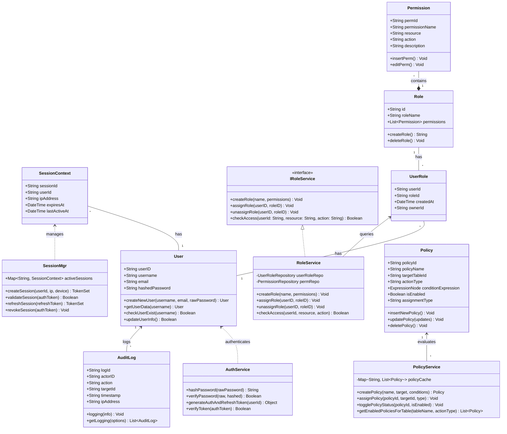

```mermaid
classDiagram
    direction BT

    %% --- Authentication & Session ---
    class User {
        +String userID
        +String username
        +String email
        +String hashedPassword
        +createNewUser(username, email, rawPassword) User
        +getUserData(username) User
        +checkUserExist(username) Boolean
        +updateUserInfo() Boolean
    }

    class SessionMgr {
        +Map~String, SessionContext~ activeSessions
        +createSession(userId, ip, device) TokenSet
        +validateSession(authToken) Boolean
        +refreshSession(refreshToken) TokenSet
        +revokeSession(authToken) Void
    }

    class SessionContext {
        +String sessionId
        +String userId
        +String ipAddress
        +DateTime expiresAt
        +DateTime lastActiveAt
    }

    class AuthService {
        +hashPassword(rawPassword) String
        +verifyPassword(raw, hashed) Boolean
        +generateAuthAndRefreshToken(userId) Object
        +verifyToken(authToken) Boolean
    }

    %% --- Authorization (RBAC) ---
    class IRoleService {
        <<interface>>
        +createRole(name, permissions) Void
        +assignRole(userID, roleID) Void
        +unassignRole(userID, roleID) Void
        +checkAccess(userId: String, resource: String, action: String) Boolean
    }

    class RoleService {
        -UserRoleRepository userRoleRepo
        -PermissionRepository permRepo
        +createRole(name, permissions) Void
        +assignRole(userID, roleID) Void
        +unassignRole(userID, roleID) Void
        +checkAccess(userId, resource, action) Boolean
    }

    class Role {
        +String id
        +String roleName
        +List~Permission~ permissions
        +createRole() String
        +deleteRole() Void
    }

    class Permission {
        +String permId
        +String permissionName
        +String resource
        +String action
        +String description
        +insertPerm() Void
        +editPerm() Void
    }

    class UserRole {
        +String userId
        +String roleId
        +DateTime createdAt
        +String ownerId
    }

    %% --- Policy Management (ABAC/Row-Level) ---
    class Policy {
        +String policyId
        +String policyName
        +String targetTableId
        +String actionType
        +ExpressionNode conditionExpression
        +Boolean isEnabled
        +String assignmentType
        +insertNewPolicy() Void
        +updatePolicy(updates) Void
        +deletePolicy() Void
    }

    class PolicyService {
        -Map~String, List~Policy~~ policyCache
        +createPolicy(name, target, conditions) Policy
        +assignPolicy(policyId, targetId, type) Void
        +togglePolicyStatus(policyId, isEnabled) Void
        +getEnabledPoliciesForTable(tableName, actionType) List~Policy~
    }

    class AuditLog {
        +String logId
        +String actorID
        +String action
        +String targetId
        +String timestamp
        +String ipAddress
        +logging(info) Void
        +getLogging(options) List~AuditLog~
    }

    %% --- Relationships ---
    SessionMgr ..> SessionContext : manages
    RoleService ..|> IRoleService
    RoleService --> UserRole : queries
    Role "1" *-- "*" Permission : contains
    PolicyService "*" --> "1" Policy : evaluates
    User "1" -- "*" SessionContext : has
    User "1" -- "*" UserRole : has
    UserRole "*" -- "1" Role : has
    AuditLog "*" --> "1" User : logs
    AuthService ..> User : authenticates
```