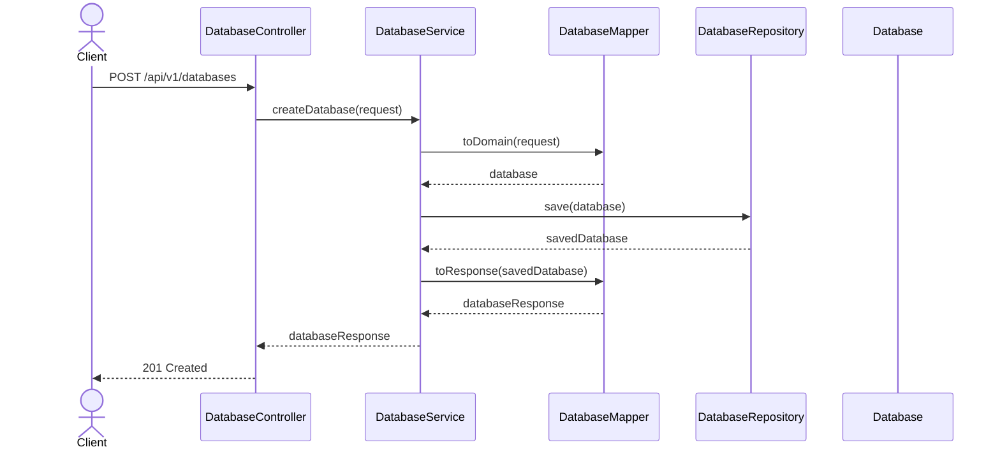
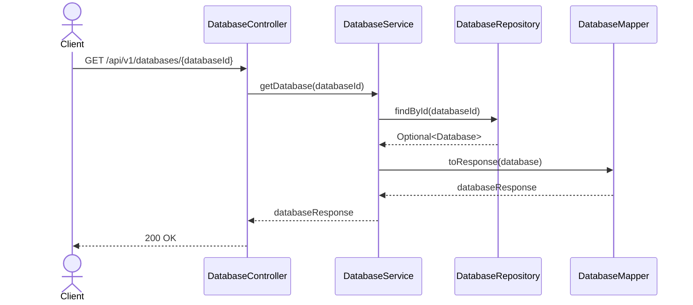
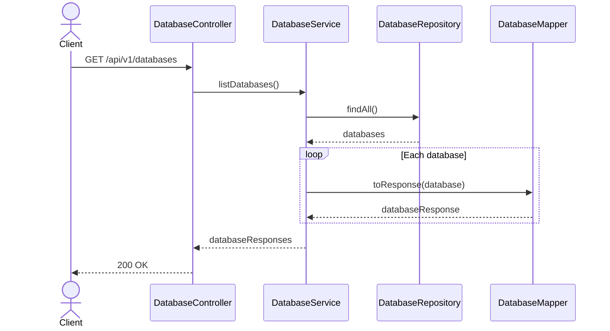
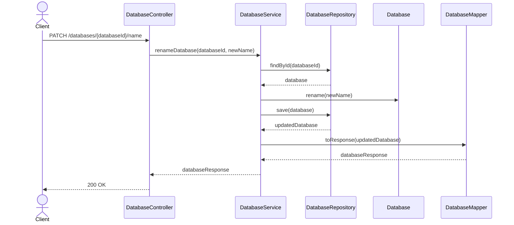
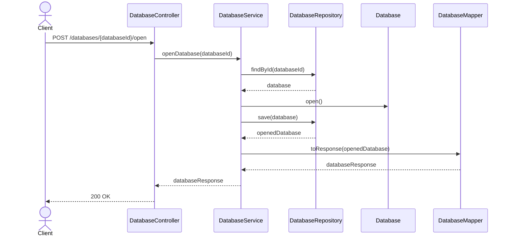
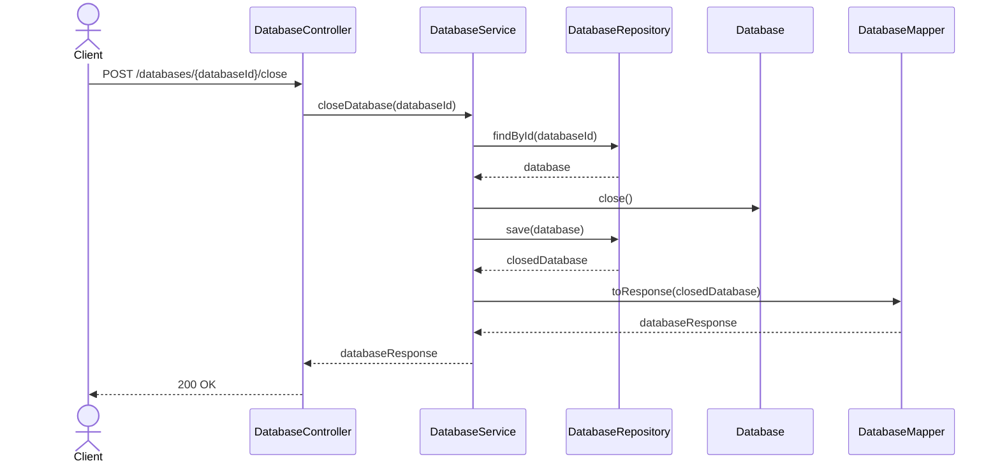
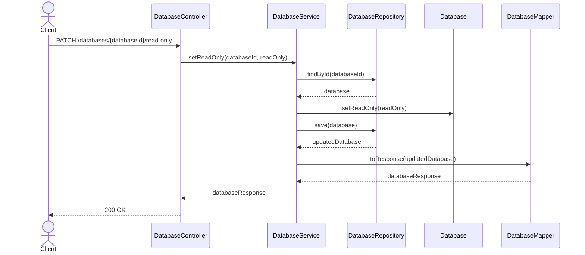
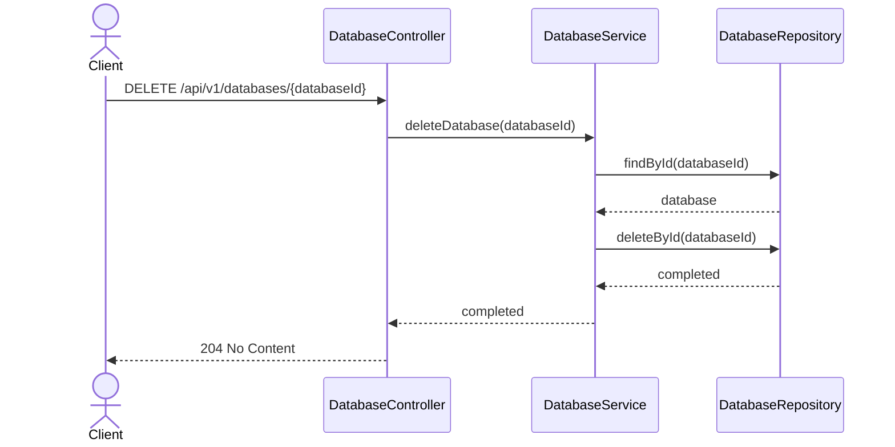

# 1. Create database

```mermaid
sequenceDiagram
    actor Client
    participant Controller as DatabaseController
    participant Service as DatabaseService
    participant Mapper as DatabaseMapper
    participant Repository as DatabaseRepository
    participant Database as Database

    Client->>Controller: POST /api/v1/databases
    Controller->>Service: createDatabase(request)
    Service->>Mapper: toDomain(request)
    Mapper-->>Service: database
    Service->>Repository: save(database)
    Repository-->>Service: savedDatabase
    Service->>Mapper: toResponse(savedDatabase)
    Mapper-->>Service: databaseResponse
    Service-->>Controller: databaseResponse
    Controller-->>Client: 201 Created
```

# 2. Get database

```mermaid
sequenceDiagram
    actor Client
    participant Controller as DatabaseController
    participant Service as DatabaseService
    participant Repository as DatabaseRepository
    participant Mapper as DatabaseMapper

    Client->>Controller: GET /api/v1/databases/{databaseId}
    Controller->>Service: getDatabase(databaseId)
    Service->>Repository: findById(databaseId)
    Repository-->>Service: Optional<Database>
    Service->>Mapper: toResponse(database)
    Mapper-->>Service: databaseResponse
    Service-->>Controller: databaseResponse
    Controller-->>Client: 200 OK
```

### 3. List databases

```mermaid
sequenceDiagram
    actor Client
    participant Controller as DatabaseController
    participant Service as DatabaseService
    participant Repository as DatabaseRepository
    participant Mapper as DatabaseMapper

    Client->>Controller: GET /api/v1/databases
    Controller->>Service: listDatabases()
    Service->>Repository: findAll()
    Repository-->>Service: databases

    loop Each database
        Service->>Mapper: toResponse(database)
        Mapper-->>Service: databaseResponse
    end

    Service-->>Controller: databaseResponses
    Controller-->>Client: 200 OK
```

### 4. Rename database

```mermaid
sequenceDiagram
    actor Client
    participant Controller as DatabaseController
    participant Service as DatabaseService
    participant Repository as DatabaseRepository
    participant Database as Database
    participant Mapper as DatabaseMapper

    Client->>Controller: PATCH /databases/{databaseId}/name
    Controller->>Service: renameDatabase(databaseId, newName)
    Service->>Repository: findById(databaseId)
    Repository-->>Service: database
    Service->>Database: rename(newName)
    Service->>Repository: save(database)
    Repository-->>Service: updatedDatabase
    Service->>Mapper: toResponse(updatedDatabase)
    Mapper-->>Service: databaseResponse
    Service-->>Controller: databaseResponse
    Controller-->>Client: 200 OK
```

### 5. Open database

```mermaid
sequenceDiagram
    actor Client
    participant Controller as DatabaseController
    participant Service as DatabaseService
    participant Repository as DatabaseRepository
    participant Database as Database
    participant Mapper as DatabaseMapper

    Client->>Controller: POST /databases/{databaseId}/open
    Controller->>Service: openDatabase(databaseId)
    Service->>Repository: findById(databaseId)
    Repository-->>Service: database
    Service->>Database: open()
    Service->>Repository: save(database)
    Repository-->>Service: openedDatabase
    Service->>Mapper: toResponse(openedDatabase)
    Mapper-->>Service: databaseResponse
    Service-->>Controller: databaseResponse
    Controller-->>Client: 200 OK
```

### 6. Close database

```mermaid
sequenceDiagram
    actor Client
    participant Controller as DatabaseController
    participant Service as DatabaseService
    participant Repository as DatabaseRepository
    participant Database as Database
    participant Mapper as DatabaseMapper

    Client->>Controller: POST /databases/{databaseId}/close
    Controller->>Service: closeDatabase(databaseId)
    Service->>Repository: findById(databaseId)
    Repository-->>Service: database
    Service->>Database: close()
    Service->>Repository: save(database)
    Repository-->>Service: closedDatabase
    Service->>Mapper: toResponse(closedDatabase)
    Mapper-->>Service: databaseResponse
    Service-->>Controller: databaseResponse
    Controller-->>Client: 200 OK
```

### 7. Set read-only mode

```mermaid
sequenceDiagram
    actor Client
    participant Controller as DatabaseController
    participant Service as DatabaseService
    participant Repository as DatabaseRepository
    participant Database as Database
    participant Mapper as DatabaseMapper

    Client->>Controller: PATCH /databases/{databaseId}/read-only
    Controller->>Service: setReadOnly(databaseId, readOnly)
    Service->>Repository: findById(databaseId)
    Repository-->>Service: database
    Service->>Database: setReadOnly(readOnly)
    Service->>Repository: save(database)
    Repository-->>Service: updatedDatabase
    Service->>Mapper: toResponse(updatedDatabase)
    Mapper-->>Service: databaseResponse
    Service-->>Controller: databaseResponse
    Controller-->>Client: 200 OK
```

### 8. Delete database

```mermaid
sequenceDiagram
    actor Client
    participant Controller as DatabaseController
    participant Service as DatabaseService
    participant Repository as DatabaseRepository

    Client->>Controller: DELETE /api/v1/databases/{databaseId}
    Controller->>Service: deleteDatabase(databaseId)
    Service->>Repository: findById(databaseId)
    Repository-->>Service: database
    Service->>Repository: deleteById(databaseId)
    Repository-->>Service: completed
    Service-->>Controller: completed
    Controller-->>Client: 204 No Content
```