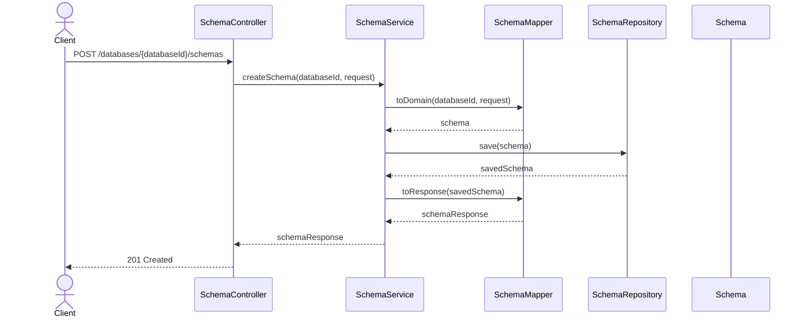
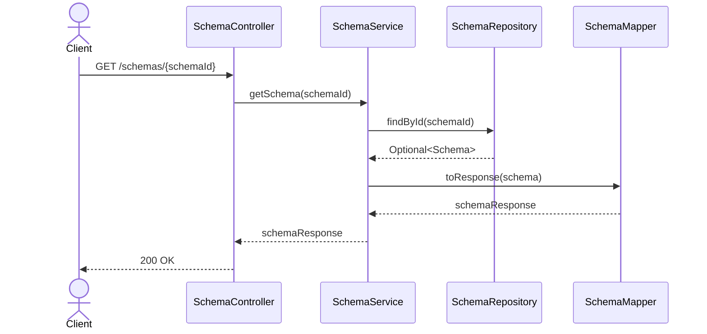
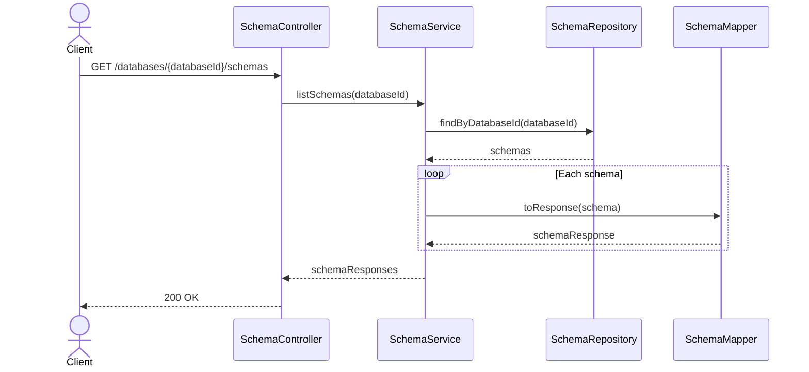
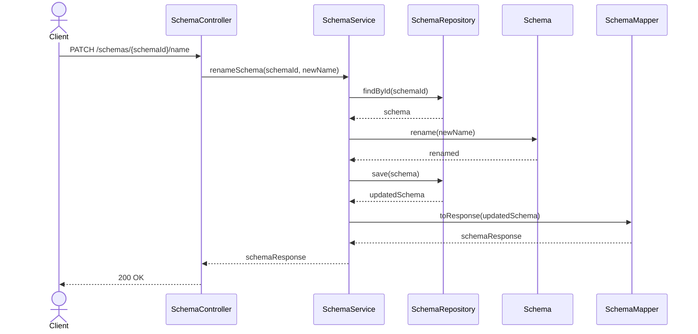
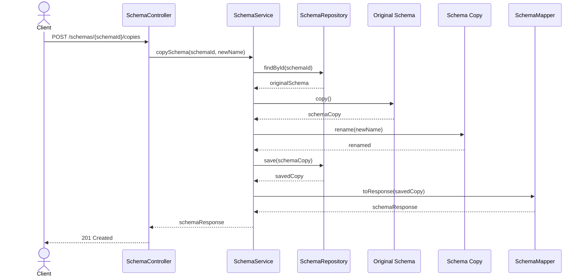
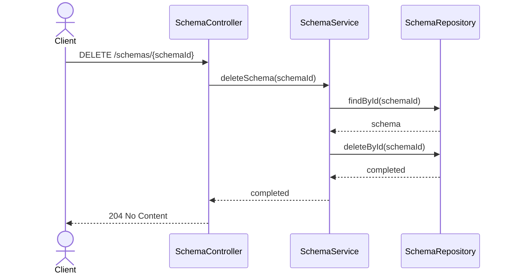

### 1. Create schema

```mermaid
sequenceDiagram
    actor Client

    participant Controller as SchemaController
    participant Service as SchemaService
    participant Mapper as SchemaMapper
    participant Repository as SchemaRepository
    participant Schema as Schema

    Client->>Controller: POST /databases/{databaseId}/schemas
    Controller->>Service: createSchema(databaseId, request)

    Service->>Mapper: toDomain(databaseId, request)
    Mapper-->>Service: schema

    Service->>Repository: save(schema)
    Repository-->>Service: savedSchema

    Service->>Mapper: toResponse(savedSchema)
    Mapper-->>Service: schemaResponse

    Service-->>Controller: schemaResponse
    Controller-->>Client: 201 Created
```

### 2. Get schema

```mermaid
sequenceDiagram
    actor Client

    participant Controller as SchemaController
    participant Service as SchemaService
    participant Repository as SchemaRepository
    participant Mapper as SchemaMapper

    Client->>Controller: GET /schemas/{schemaId}
    Controller->>Service: getSchema(schemaId)

    Service->>Repository: findById(schemaId)
    Repository-->>Service: Optional<Schema>

    Service->>Mapper: toResponse(schema)
    Mapper-->>Service: schemaResponse

    Service-->>Controller: schemaResponse
    Controller-->>Client: 200 OK
```

### 3. List schemas

```mermaid
sequenceDiagram
    actor Client

    participant Controller as SchemaController
    participant Service as SchemaService
    participant Repository as SchemaRepository
    participant Mapper as SchemaMapper

    Client->>Controller: GET /databases/{databaseId}/schemas
    Controller->>Service: listSchemas(databaseId)

    Service->>Repository: findByDatabaseId(databaseId)
    Repository-->>Service: schemas

    loop Each schema
        Service->>Mapper: toResponse(schema)
        Mapper-->>Service: schemaResponse
    end

    Service-->>Controller: schemaResponses
    Controller-->>Client: 200 OK
```
### 4. Rename schema

```mermaid
sequenceDiagram
    actor Client

    participant Controller as SchemaController
    participant Service as SchemaService
    participant Repository as SchemaRepository
    participant Schema as Schema
    participant Mapper as SchemaMapper

    Client->>Controller: PATCH /schemas/{schemaId}/name
    Controller->>Service: renameSchema(schemaId, newName)

    Service->>Repository: findById(schemaId)
    Repository-->>Service: schema

    Service->>Schema: rename(newName)
    Schema-->>Service: renamed

    Service->>Repository: save(schema)
    Repository-->>Service: updatedSchema

    Service->>Mapper: toResponse(updatedSchema)
    Mapper-->>Service: schemaResponse

    Service-->>Controller: schemaResponse
    Controller-->>Client: 200 OK
```

### 5. Copy schema

```mermaid
sequenceDiagram
    actor Client

    participant Controller as SchemaController
    participant Service as SchemaService
    participant Repository as SchemaRepository
    participant Original as Original Schema
    participant Copy as Schema Copy
    participant Mapper as SchemaMapper

    Client->>Controller: POST /schemas/{schemaId}/copies
    Controller->>Service: copySchema(schemaId, newName)

    Service->>Repository: findById(schemaId)
    Repository-->>Service: originalSchema

    Service->>Original: copy()
    Original-->>Service: schemaCopy

    Service->>Copy: rename(newName)
    Copy-->>Service: renamed

    Service->>Repository: save(schemaCopy)
    Repository-->>Service: savedCopy

    Service->>Mapper: toResponse(savedCopy)
    Mapper-->>Service: schemaResponse

    Service-->>Controller: schemaResponse
    Controller-->>Client: 201 Created
```
### 6. Delete schema

```mermaid
sequenceDiagram
    actor Client

    participant Controller as SchemaController
    participant Service as SchemaService
    participant Repository as SchemaRepository

    Client->>Controller: DELETE /schemas/{schemaId}
    Controller->>Service: deleteSchema(schemaId)

    Service->>Repository: findById(schemaId)
    Repository-->>Service: schema

    Service->>Repository: deleteById(schemaId)
    Repository-->>Service: completed

    Service-->>Controller: completed
    Controller-->>Client: 204 No Content
```
