# API Project - DBMS

# I. Database Object Management API Design

## 1. Overview

This API provides management operations for the main database objects in An's DBMS.

### Supported objects

```text
Database
└── Schema
    ├── Table
    │   ├── Column
    │   ├── Constraint
    │   └── Index
    └── View
```

### Base URL

```text
/api/v1
```

### API package structure

```text
com.an.dbms.api
├── database
│   ├── DatabaseController.java
│   ├── DatabaseService.java
│   ├── DatabaseMapper.java
│   └── dto
├── schema
│   ├── SchemaController.java
│   ├── SchemaService.java
│   ├── SchemaMapper.java
│   └── dto
├── table
│   ├── TableController.java
│   ├── TableService.java
│   ├── TableMapper.java
│   └── dto
├── column
│   ├── ColumnController.java
│   ├── ColumnService.java
│   ├── ColumnMapper.java
│   └── dto
├── view
│   ├── ViewController.java
│   ├── ViewService.java
│   ├── ViewMapper.java
│   └── dto
├── index
│   ├── IndexController.java
│   ├── IndexService.java
│   ├── IndexMapper.java
│   └── dto
├── constraint
│   ├── ConstraintController.java
│   ├── ConstraintService.java
│   ├── ConstraintMapper.java
│   └── dto
└── common
    ├── ApiError.java
    ├── ApiResponse.java
    └── GlobalExceptionHandler.java
```

---

## 2. General Conventions

| Operation | HTTP method |
| --- | --- |
| Create a resource | `POST` |
| Retrieve a resource | `GET` |
| Partially update a resource | `PATCH` |
| Delete a resource | `DELETE` |
| Execute a resource action | `POST` |

### Common response status codes

| Status | Meaning |
| --- | --- |
| `200 OK` | Resource retrieved or updated successfully |
| `201 Created` | Resource created successfully |
| `204 No Content` | Resource deleted successfully |
| `400 Bad Request` | Invalid request |
| `404 Not Found` | Resource does not exist |
| `409 Conflict` | Duplicate name or resource conflict |
| `500 Internal Server Error` | Unexpected server error |

---

# 3. Database API

Base resource:

```text
/api/v1/databases
```

| Method | Endpoint | Controller method | Request | Response | Status | Description |
| --- | --- | --- | --- | --- | --- | --- |
| `POST` | `/api/v1/databases` | `createDatabase(request)` | `CreateDatabaseRequest` | `DatabaseResponse` | `201` | Create a database |
| `GET` | `/api/v1/databases/{databaseId}` | `getDatabase(databaseId)` | None | `DatabaseResponse` | `200` | Get a database by ID |
| `GET` | `/api/v1/databases` | `listDatabases()` | None | `List<DatabaseResponse>` | `200` | List all databases |
| `PATCH` | `/api/v1/databases/{databaseId}/name` | `renameDatabase(databaseId, request)` | `RenameDatabaseRequest` | `DatabaseResponse` | `200` | Rename a database |
| `POST` | `/api/v1/databases/{databaseId}/open` | `openDatabase(databaseId)` | None | `DatabaseResponse` | `200` | Open a database |
| `POST` | `/api/v1/databases/{databaseId}/close` | `closeDatabase(databaseId)` | None | `DatabaseResponse` | `200` | Close a database |
| `PATCH` | `/api/v1/databases/{databaseId}/read-only` | `setReadOnly(databaseId, request)` | `SetReadOnlyRequest` | `DatabaseResponse` | `200` | Change read-only mode |
| `DELETE` | `/api/v1/databases/{databaseId}` | `deleteDatabase(databaseId)` | None | None | `204` | Delete a database |

### Main DTOs

```text
CreateDatabaseRequest
└── String name

RenameDatabaseRequest
└── String newName

SetReadOnlyRequest
└── boolean readOnly

DatabaseResponse
├── UUID id
├── String name
├── DatabaseStateType state
├── boolean readOnly
└── int schemaCount
```

### Java Core mapping

```text
DatabaseController
→ DatabaseService
→ DatabaseMapper
→ DatabaseManager
→ Database
```

---

# 4. Schema API

Collection resource:

```text
/api/v1/databases/{databaseId}/schemas
```

Individual resource:

```text
/api/v1/schemas/{schemaId}
```

| Method | Endpoint | Controller method | Request | Response | Status | Description |
| --- | --- | --- | --- | --- | --- | --- |
| `POST` | `/api/v1/databases/{databaseId}/schemas` | `createSchema(databaseId, request)` | `CreateSchemaRequest` | `SchemaResponse` | `201` | Create a schema |
| `GET` | `/api/v1/schemas/{schemaId}` | `getSchema(schemaId)` | None | `SchemaResponse` | `200` | Get a schema by ID |
| `GET` | `/api/v1/databases/{databaseId}/schemas` | `listSchemas(databaseId)` | None | `List<SchemaResponse>` | `200` | List schemas in a database |
| `PATCH` | `/api/v1/schemas/{schemaId}/name` | `renameSchema(schemaId, request)` | `RenameSchemaRequest` | `SchemaResponse` | `200` | Rename a schema |
| `POST` | `/api/v1/schemas/{schemaId}/copies` | `copySchema(schemaId, request)` | `CopySchemaRequest` | `SchemaResponse` | `201` | Copy a schema |
| `DELETE` | `/api/v1/schemas/{schemaId}` | `deleteSchema(schemaId)` | None | None | `204` | Delete a schema |

### Main DTOs

```text
CreateSchemaRequest
├── String name
└── UUID ownerId

RenameSchemaRequest
└── String newName

CopySchemaRequest
└── String newName

SchemaResponse
├── UUID id
├── UUID databaseId
├── UUID ownerId
├── String name
├── int tableCount
└── int viewCount
```

### Java Core mapping

```text
SchemaController
→ SchemaService
→ SchemaMapper
→ MetadataManager
→ SchemaRepository
→ Schema
```

---

# 5. Table API

Collection resource:

```text
/api/v1/schemas/{schemaId}/tables
```

Individual resource:

```text
/api/v1/tables/{tableId}
```

| Method | Endpoint | Controller method | Request | Response | Status | Description |
| --- | --- | --- | --- | --- | --- | --- |
| `POST` | `/api/v1/schemas/{schemaId}/tables` | `createTable(schemaId, request)` | `CreateTableRequest` | `TableResponse` | `201` | Create a table |
| `GET` | `/api/v1/tables/{tableId}` | `getTable(tableId)` | None | `TableResponse` | `200` | Get a table by ID |
| `GET` | `/api/v1/schemas/{schemaId}/tables` | `listTables(schemaId)` | None | `List<TableResponse>` | `200` | List tables in a schema |
| `PATCH` | `/api/v1/tables/{tableId}/name` | `renameTable(tableId, request)` | `RenameTableRequest` | `TableResponse` | `200` | Rename a table |
| `POST` | `/api/v1/tables/{tableId}/copies` | `copyTable(tableId, request)` | `CopyTableRequest` | `TableResponse` | `201` | Copy table metadata |
| `DELETE` | `/api/v1/tables/{tableId}` | `deleteTable(tableId)` | None | None | `204` | Delete a table |

### Main DTOs

```text
CreateTableRequest
└── String name

RenameTableRequest
└── String newName

CopyTableRequest
├── String newName
└── UUID targetSchemaId

TableResponse
├── UUID id
├── UUID schemaId
├── String name
├── List<ColumnResponse> columns
├── List<ConstraintResponse> constraints
└── List<IndexResponse> indexes
```

### Java Core mapping

```text
TableController
→ TableService
→ TableMapper
→ MetadataManager
→ TableMetadataRepository
→ TableMetadata
```

---

# 6. Column API

Column is a child resource of a table. Therefore, `tableId` is included in every column endpoint.

Collection resource:

```text
/api/v1/tables/{tableId}/columns
```

Individual resource:

```text
/api/v1/tables/{tableId}/columns/{columnId}
```

| Method | Endpoint | Controller method | Request | Response | Status | Description |
| --- | --- | --- | --- | --- | --- | --- |
| `POST` | `/api/v1/tables/{tableId}/columns` | `createColumn(tableId, request)` | `CreateColumnRequest` | `ColumnResponse` | `201` | Add a column to a table |
| `GET` | `/api/v1/tables/{tableId}/columns/{columnId}` | `getColumn(tableId, columnId)` | None | `ColumnResponse` | `200` | Get a column by ID |
| `GET` | `/api/v1/tables/{tableId}/columns` | `listColumns(tableId)` | None | `List<ColumnResponse>` | `200` | List columns in a table |
| `PATCH` | `/api/v1/tables/{tableId}/columns/{columnId}/name` | `renameColumn(tableId, columnId, request)` | `RenameColumnRequest` | `ColumnResponse` | `200` | Rename a column |
| `PATCH` | `/api/v1/tables/{tableId}/columns/{columnId}` | `updateColumn(tableId, columnId, request)` | `UpdateColumnRequest` | `ColumnResponse` | `200` | Update column metadata |
| `DELETE` | `/api/v1/tables/{tableId}/columns/{columnId}` | `deleteColumn(tableId, columnId)` | None | None | `204` | Remove a column |

### Main DTOs

```text
CreateColumnRequest
├── String name
├── DataType dataType
├── boolean nullable
├── Object defaultValue
├── int position
├── Integer length
├── Integer precision
├── Integer scale
└── boolean identity

RenameColumnRequest
└── String newName

UpdateColumnRequest
├── DataType dataType
├── Boolean nullable
├── Object defaultValue
├── Integer length
├── Integer precision
└── Integer scale

ColumnResponse
├── UUID id
├── UUID tableId
├── String name
├── DataType dataType
├── boolean nullable
├── Object defaultValue
├── int position
├── Integer length
├── Integer precision
├── Integer scale
└── boolean identity
```

### Java Core mapping

```text
ColumnController
→ ColumnService
→ ColumnMapper
→ ColumnMetadataBuilder
→ TableMetadataRepository
→ TableMetadata
→ ColumnMetadata
```

---

# 7. View API

View is a child resource of a schema.

Collection resource:

```text
/api/v1/schemas/{schemaId}/views
```

Individual resource:

```text
/api/v1/schemas/{schemaId}/views/{viewId}
```

| Method | Endpoint | Controller method | Request | Response | Status | Description |
| --- | --- | --- | --- | --- | --- | --- |
| `POST` | `/api/v1/schemas/{schemaId}/views` | `createView(schemaId, request)` | `CreateViewRequest` | `ViewResponse` | `201` | Create a view |
| `GET` | `/api/v1/schemas/{schemaId}/views/{viewId}` | `getView(schemaId, viewId)` | None | `ViewResponse` | `200` | Get a view by ID |
| `GET` | `/api/v1/schemas/{schemaId}/views` | `listViews(schemaId)` | None | `List<ViewResponse>` | `200` | List views in a schema |
| `PATCH` | `/api/v1/schemas/{schemaId}/views/{viewId}/name` | `renameView(schemaId, viewId, request)` | `RenameViewRequest` | `ViewResponse` | `200` | Rename a view |
| `PATCH` | `/api/v1/schemas/{schemaId}/views/{viewId}/definition` | `updateDefinition(schemaId, viewId, request)` | `UpdateViewDefinitionRequest` | `ViewResponse` | `200` | Update the view definition |
| `POST` | `/api/v1/schemas/{schemaId}/views/{viewId}/refresh` | `refreshView(schemaId, viewId)` | None | `ViewResponse` | `200` | Refresh a materialized view |
| `DELETE` | `/api/v1/schemas/{schemaId}/views/{viewId}` | `deleteView(schemaId, viewId)` | None | None | `204` | Delete a view |

### Main DTOs

```text
CreateViewRequest
├── String name
├── String definition
└── boolean materialized

RenameViewRequest
└── String newName

UpdateViewDefinitionRequest
└── String definition

ViewResponse
├── UUID id
├── UUID schemaId
├── String name
├── String definition
├── Set<UUID> dependencyIds
├── boolean materialized
└── boolean valid
```

### Java Core mapping

```text
ViewController
→ ViewService
→ ViewMapper
→ MetadataManager
→ SchemaRepository
→ Schema
→ View
```

---

# 8. Index API

Collection resource:

```text
/api/v1/tables/{tableId}/indexes
```

Individual resource:

```text
/api/v1/indexes/{indexId}
```

| Method | Endpoint | Controller method | Request | Response | Status | Description |
| --- | --- | --- | --- | --- | --- | --- |
| `POST` | `/api/v1/tables/{tableId}/indexes` | `createIndex(tableId, request)` | `CreateIndexRequest` | `IndexResponse` | `201` | Create an index |
| `GET` | `/api/v1/indexes/{indexId}` | `getIndex(indexId)` | None | `IndexResponse` | `200` | Get an index by ID |
| `GET` | `/api/v1/tables/{tableId}/indexes` | `listIndexes(tableId)` | None | `List<IndexResponse>` | `200` | List indexes on a table |
| `PATCH` | `/api/v1/indexes/{indexId}/name` | `renameIndex(indexId, request)` | `RenameIndexRequest` | `IndexResponse` | `200` | Rename an index |
| `POST` | `/api/v1/indexes/{indexId}/rebuild` | `rebuildIndex(indexId)` | None | `IndexResponse` | `200` | Rebuild an index |
| `DELETE` | `/api/v1/indexes/{indexId}` | `deleteIndex(indexId)` | None | None | `204` | Delete an index |

### Main DTOs

```text
CreateIndexRequest
├── String name
├── IndexType type
├── List<UUID> columnIds
└── boolean unique

RenameIndexRequest
└── String newName

IndexResponse
├── UUID id
├── UUID tableId
├── String name
├── IndexType type
├── List<UUID> columnIds
└── boolean unique
```

### Java Core mapping

```text
IndexController
→ IndexService
→ IndexMapper
→ IndexFactory
→ MetadataManager
→ IndexMetadataRepository
→ IndexMetadata
```

---

# 9. Constraint API

Foreign key relationships are managed as constraints. A separate relationship API is not required.

Collection resource:

```text
/api/v1/tables/{tableId}/constraints
```

Individual resource:

```text
/api/v1/constraints/{constraintId}
```

| Method | Endpoint | Controller method | Request | Response | Status | Description |
| --- | --- | --- | --- | --- | --- | --- |
| `POST` | `/api/v1/tables/{tableId}/constraints` | `createConstraint(tableId, request)` | `CreateConstraintRequest` | `ConstraintResponse` | `201` | Create a constraint |
| `GET` | `/api/v1/constraints/{constraintId}` | `getConstraint(constraintId)` | None | `ConstraintResponse` | `200` | Get a constraint by ID |
| `GET` | `/api/v1/tables/{tableId}/constraints` | `listConstraints(tableId)` | None | `List<ConstraintResponse>` | `200` | List constraints on a table |
| `PATCH` | `/api/v1/constraints/{constraintId}/name` | `renameConstraint(constraintId, request)` | `RenameConstraintRequest` | `ConstraintResponse` | `200` | Rename a constraint |
| `POST` | `/api/v1/constraints/{constraintId}/validate` | `validateConstraint(constraintId)` | None | `ConstraintValidationResponse` | `200` | Validate a constraint |
| `DELETE` | `/api/v1/constraints/{constraintId}` | `deleteConstraint(constraintId)` | None | None | `204` | Delete a constraint |

### Supported constraint types

```text
PRIMARY_KEY
FOREIGN_KEY
UNIQUE
NOT_NULL
CHECK
```

### Main DTOs

```text
CreateConstraintRequest
├── String name
├── ConstraintType type
├── List<UUID> columnIds
├── UUID referencedTableId
├── List<UUID> referencedColumnIds
└── String expression

RenameConstraintRequest
└── String newName

ConstraintResponse
├── UUID id
├── UUID tableId
├── String name
├── ConstraintType type
├── List<UUID> columnIds
├── UUID referencedTableId
├── List<UUID> referencedColumnIds
└── String expression

ConstraintValidationResponse
├── UUID constraintId
├── boolean valid
├── long violationCount
└── List<String> violations
```

### Java Core mapping

```text
ConstraintController
→ ConstraintService
→ ConstraintMapper
→ ConstraintDefinitionBuilder
→ ConstraintFactory
→ MetadataManager
→ ConstraintRepository
→ Constraint
```

---

# 10. Endpoint Summary

| Module | Endpoints |
| --- | ---: |
| Database | 8 |
| Schema | 6 |
| Table | 6 |
| Column | 6 |
| View | 7 |
| Index | 6 |
| Constraint | 6 |
| **Total** | **45** |

---
# II. Mindmap
### 1. API mindmap
```mermaid
flowchart LR
    %% =====================================================
    %% ROOT
    %% =====================================================

    DatabaseMetadataAPI["**Database & Metadata API**"]:::rootStyle

    %% =====================================================
    %% LEFT-SIDE MANAGEMENT BRANCHES
    %% =====================================================

    DatabaseManagement["**Database Management**"]:::highlightDatabase
    SchemaManagement["**Schema Management**"]:::highlightDatabase
    TableMetadataManagement["**Table Metadata Management**"]:::highlightDatabase
    ColumnMetadataManagement["**Column Metadata Management**"]:::highlightDatabase

    %% =====================================================
    %% RIGHT-SIDE MANAGEMENT BRANCHES
    %% =====================================================

    DataTypeManagement["**Data Type Management**"]:::highlightDatabase
    IndexManagement["**Index Management**"]:::highlightDatabase
    RelationshipManagement["**Relationship Management**"]:::highlightDatabase
    ConstraintManagement["**Constraint Management**"]:::highlightDatabase
    ProgrammableObjects["**Programmable Objects**"]:::highlightDatabase

    %% =====================================================
    %% DATABASE MANAGEMENT - HTTP METHOD GROUPS
    %% =====================================================

    DatabasePostAPI["POST APIs"]:::postGroup
    DatabaseGetAPI["GET APIs"]:::getGroup
    DatabaseUpdateAPI["PUT / PATCH APIs"]:::updateGroup
    DatabaseDeleteAPI["DELETE APIs"]:::deleteGroup

    %% Database POST endpoints

    CreateDatabase["POST /api/v1/databases<br/><b>Create Database</b>"]:::leafCreate
    OpenDatabase["POST /api/v1/databases/{databaseId}/open<br/><b>Open Database</b>"]:::leafAction
    CloseDatabase["POST /api/v1/databases/{databaseId}/close<br/><b>Close Database</b>"]:::leafAction

    %% Database GET endpoints

    ListDatabases["GET /api/v1/databases<br/><b>List Databases</b>"]:::leafRead
    GetDatabase["GET /api/v1/databases/{databaseId}<br/><b>Get Database</b>"]:::leafRead
    GetDatabaseConfiguration["GET /api/v1/databases/{databaseId}/configuration<br/><b>Get Configuration</b>"]:::leafRead
    GetDatabaseStatistics["GET /api/v1/databases/{databaseId}/statistics<br/><b>Get Statistics</b>"]:::leafRead

    %% Database update endpoints

    UpdateDatabase["PATCH /api/v1/databases/{databaseId}<br/><b>Update Database</b>"]:::leafUpdate
    RenameDatabase["PATCH /api/v1/databases/{databaseId}/name<br/><b>Rename Database</b>"]:::leafUpdate
    SetDatabaseReadOnly["PUT /api/v1/databases/{databaseId}/read-only<br/><b>Set Read-Only Mode</b>"]:::leafUpdate
    UpdateDatabaseConfiguration["PATCH /api/v1/databases/{databaseId}/configuration<br/><b>Update Configuration</b>"]:::leafUpdate

    %% Database DELETE endpoints

    DeleteDatabase["DELETE /api/v1/databases/{databaseId}<br/><b>Delete Database</b>"]:::leafDelete

    %% =====================================================
    %% SCHEMA MANAGEMENT - HTTP METHOD GROUPS
    %% =====================================================

    SchemaPostAPI["POST APIs"]:::postGroup
    SchemaGetAPI["GET APIs"]:::getGroup
    SchemaUpdateAPI["PUT / PATCH APIs"]:::updateGroup
    SchemaDeleteAPI["DELETE APIs"]:::deleteGroup

    %% Schema POST endpoints

    CreateSchema["POST /api/v1/databases/{databaseId}/schemas<br/><b>Create Schema</b>"]:::leafCreate

    %% Schema GET endpoints

    ListSchemas["GET /api/v1/databases/{databaseId}/schemas<br/><b>List Schemas</b>"]:::leafRead
    GetSchema["GET /api/v1/schemas/{schemaId}<br/><b>Get Schema</b>"]:::leafRead
    GetSchemaObjects["GET /api/v1/schemas/{schemaId}/objects<br/><b>List Schema Objects</b>"]:::leafRead
    GetSchemaDependencies["GET /api/v1/schemas/{schemaId}/dependencies<br/><b>Get Dependencies</b>"]:::leafRead

    %% Schema update endpoints

    UpdateSchema["PATCH /api/v1/schemas/{schemaId}<br/><b>Update Schema</b>"]:::leafUpdate
    RenameSchema["PATCH /api/v1/schemas/{schemaId}/name<br/><b>Rename Schema</b>"]:::leafUpdate

    %% Schema DELETE endpoints

    DeleteSchema["DELETE /api/v1/schemas/{schemaId}<br/><b>Delete Schema</b>"]:::leafDelete

    %% =====================================================
    %% TABLE MANAGEMENT - HTTP METHOD GROUPS
    %% =====================================================

    TablePostAPI["POST APIs"]:::postGroup
    TableGetAPI["GET APIs"]:::getGroup
    TableUpdateAPI["PUT / PATCH APIs"]:::updateGroup
    TableDeleteAPI["DELETE APIs"]:::deleteGroup

    %% Table POST endpoints

    CreateTable["POST /api/v1/schemas/{schemaId}/tables<br/><b>Create Table</b>"]:::leafCreate
    TruncateTable["POST /api/v1/tables/{tableId}/truncate<br/><b>Truncate Table</b>"]:::leafAction

    %% Table GET endpoints

    ListTables["GET /api/v1/schemas/{schemaId}/tables<br/><b>List Tables</b>"]:::leafRead
    GetTable["GET /api/v1/tables/{tableId}<br/><b>Get Table</b>"]:::leafRead
    GetTableDefinition["GET /api/v1/tables/{tableId}/definition<br/><b>Get Definition</b>"]:::leafRead
    GetTableStatistics["GET /api/v1/tables/{tableId}/statistics<br/><b>Get Statistics</b>"]:::leafRead
    GetTableStorage["GET /api/v1/tables/{tableId}/storage<br/><b>Get Storage Information</b>"]:::leafRead
    GetTableDependencies["GET /api/v1/tables/{tableId}/dependencies<br/><b>Get Dependencies</b>"]:::leafRead

    %% Table update endpoints

    UpdateTable["PATCH /api/v1/tables/{tableId}<br/><b>Update Table</b>"]:::leafUpdate
    RenameTable["PATCH /api/v1/tables/{tableId}/name<br/><b>Rename Table</b>"]:::leafUpdate

    %% Table DELETE endpoints

    DropTable["DELETE /api/v1/tables/{tableId}<br/><b>Drop Table</b>"]:::leafDelete

    %% =====================================================
    %% COLUMN MANAGEMENT - HTTP METHOD GROUPS
    %% =====================================================

    ColumnPostAPI["POST APIs"]:::postGroup
    ColumnGetAPI["GET APIs"]:::getGroup
    ColumnUpdateAPI["PUT / PATCH APIs"]:::updateGroup
    ColumnDeleteAPI["DELETE APIs"]:::deleteGroup

    %% Column POST endpoints

    AddColumn["POST /api/v1/tables/{tableId}/columns<br/><b>Add Column</b>"]:::leafCreate

    %% Column GET endpoints

    ListColumns["GET /api/v1/tables/{tableId}/columns<br/><b>List Columns</b>"]:::leafRead
    GetColumn["GET /api/v1/tables/{tableId}/columns/{columnId}<br/><b>Get Column</b>"]:::leafRead
    GetColumnStatistics["GET /api/v1/tables/{tableId}/columns/{columnId}/statistics<br/><b>Get Statistics</b>"]:::leafRead

    %% Column update endpoints

    UpdateColumn["PATCH /api/v1/tables/{tableId}/columns/{columnId}<br/><b>Alter Column</b>"]:::leafUpdate
    RenameColumn["PATCH /api/v1/tables/{tableId}/columns/{columnId}/name<br/><b>Rename Column</b>"]:::leafUpdate
    ChangeColumnType["PUT /api/v1/tables/{tableId}/columns/{columnId}/data-type<br/><b>Change Data Type</b>"]:::leafUpdate
    ChangeColumnPosition["PUT /api/v1/tables/{tableId}/columns/{columnId}/position<br/><b>Change Position</b>"]:::leafUpdate
    SetColumnDefault["PUT /api/v1/tables/{tableId}/columns/{columnId}/default<br/><b>Set Default Value</b>"]:::leafUpdate

    %% Column DELETE endpoints

    DropColumn["DELETE /api/v1/tables/{tableId}/columns/{columnId}<br/><b>Drop Column</b>"]:::leafDelete
    RemoveColumnDefault["DELETE /api/v1/tables/{tableId}/columns/{columnId}/default<br/><b>Remove Default</b>"]:::leafDelete

    %% =====================================================
    %% DATA TYPE MANAGEMENT - METHOD GROUPS
    %% =====================================================

    DataTypeGetAPI["GET APIs"]:::getGroup
    DataTypePostAPI["POST APIs"]:::postGroup

    ListDataTypes["GET /api/v1/data-types<br/><b>List Data Types</b>"]:::leafRead
    GetDataType["GET /api/v1/data-types/{typeName}<br/><b>Get Data Type</b>"]:::leafRead
    ListTypeConversions["GET /api/v1/data-types/{typeName}/conversions<br/><b>List Conversions</b>"]:::leafRead

    ValidateDataType["POST /api/v1/data-types/validate<br/><b>Validate Definition</b>"]:::leafAction
    ValidateTypeConversion["POST /api/v1/data-types/validate-conversion<br/><b>Validate Conversion</b>"]:::leafAction

    %% =====================================================
    %% INDEX MANAGEMENT - METHOD GROUPS
    %% =====================================================

    IndexPostAPI["POST APIs"]:::postGroup
    IndexGetAPI["GET APIs"]:::getGroup
    IndexUpdateAPI["PUT / PATCH APIs"]:::updateGroup
    IndexDeleteAPI["DELETE APIs"]:::deleteGroup

    CreateIndex["POST /api/v1/tables/{tableId}/indexes<br/><b>Create Index</b>"]:::leafCreate
    RebuildIndex["POST /api/v1/indexes/{indexId}/rebuild<br/><b>Rebuild Index</b>"]:::leafAction
    EnableIndex["POST /api/v1/indexes/{indexId}/enable<br/><b>Enable Index</b>"]:::leafAction
    DisableIndex["POST /api/v1/indexes/{indexId}/disable<br/><b>Disable Index</b>"]:::leafAction

    ListIndexes["GET /api/v1/tables/{tableId}/indexes<br/><b>List Indexes</b>"]:::leafRead
    GetIndex["GET /api/v1/indexes/{indexId}<br/><b>Get Index</b>"]:::leafRead
    GetIndexStatistics["GET /api/v1/indexes/{indexId}/statistics<br/><b>Get Statistics</b>"]:::leafRead

    UpdateIndex["PATCH /api/v1/indexes/{indexId}<br/><b>Update Index</b>"]:::leafUpdate
    RenameIndex["PATCH /api/v1/indexes/{indexId}/name<br/><b>Rename Index</b>"]:::leafUpdate

    DropIndex["DELETE /api/v1/indexes/{indexId}<br/><b>Drop Index</b>"]:::leafDelete

    %% =====================================================
    %% RELATIONSHIP MANAGEMENT - METHOD GROUPS
    %% =====================================================

    RelationshipPostAPI["POST APIs"]:::postGroup
    RelationshipGetAPI["GET APIs"]:::getGroup
    RelationshipUpdateAPI["PUT / PATCH APIs"]:::updateGroup
    RelationshipDeleteAPI["DELETE APIs"]:::deleteGroup

    CreateRelationship["POST /api/v1/tables/{tableId}/relationships<br/><b>Create Relationship</b>"]:::leafCreate
    ValidateRelationship["POST /api/v1/relationships/validate<br/><b>Validate Relationship</b>"]:::leafAction

    ListRelationships["GET /api/v1/tables/{tableId}/relationships<br/><b>List Relationships</b>"]:::leafRead
    GetRelationship["GET /api/v1/relationships/{relationshipId}<br/><b>Get Relationship</b>"]:::leafRead
    GetParentRelationships["GET /api/v1/tables/{tableId}/relationships/parents<br/><b>Get Parents</b>"]:::leafRead
    GetChildRelationships["GET /api/v1/tables/{tableId}/relationships/children<br/><b>Get Children</b>"]:::leafRead

    UpdateRelationship["PATCH /api/v1/relationships/{relationshipId}<br/><b>Update Relationship</b>"]:::leafUpdate

    DeleteRelationship["DELETE /api/v1/relationships/{relationshipId}<br/><b>Delete Relationship</b>"]:::leafDelete

    %% =====================================================
    %% CONSTRAINT MANAGEMENT - METHOD GROUPS
    %% =====================================================

    ConstraintPostAPI["POST APIs"]:::postGroup
    ConstraintGetAPI["GET APIs"]:::getGroup
    ConstraintUpdateAPI["PUT / PATCH APIs"]:::updateGroup
    ConstraintDeleteAPI["DELETE APIs"]:::deleteGroup

    CreateConstraint["POST /api/v1/tables/{tableId}/constraints<br/><b>Create Constraint</b>"]:::leafCreate
    EnableConstraint["POST /api/v1/constraints/{constraintId}/enable<br/><b>Enable Constraint</b>"]:::leafAction
    DisableConstraint["POST /api/v1/constraints/{constraintId}/disable<br/><b>Disable Constraint</b>"]:::leafAction
    ValidateConstraint["POST /api/v1/constraints/{constraintId}/validate<br/><b>Validate Existing Data</b>"]:::leafAction

    ListConstraints["GET /api/v1/tables/{tableId}/constraints<br/><b>List Constraints</b>"]:::leafRead
    GetConstraint["GET /api/v1/constraints/{constraintId}<br/><b>Get Constraint</b>"]:::leafRead

    UpdateConstraint["PATCH /api/v1/constraints/{constraintId}<br/><b>Update Constraint</b>"]:::leafUpdate
    RenameConstraint["PATCH /api/v1/constraints/{constraintId}/name<br/><b>Rename Constraint</b>"]:::leafUpdate

    DropConstraint["DELETE /api/v1/constraints/{constraintId}<br/><b>Drop Constraint</b>"]:::leafDelete

    %% =====================================================
    %% PROGRAMMABLE OBJECT GROUPS
    %% =====================================================

    ViewManagement["View Management"]:::databaseSubBranch
    SequenceManagement["Sequence Management"]:::databaseSubBranch
    ProcedureManagement["Stored Procedure Management"]:::databaseSubBranch
    FunctionManagement["Function Management"]:::databaseSubBranch
    TriggerManagement["Trigger Management"]:::databaseSubBranch

    %% =====================================================
    %% ROOT CONNECTIONS
    %% =====================================================

    DatabaseManagement --> DatabaseMetadataAPI
    SchemaManagement --> DatabaseMetadataAPI
    TableMetadataManagement --> DatabaseMetadataAPI
    ColumnMetadataManagement --> DatabaseMetadataAPI

    DatabaseMetadataAPI --> DataTypeManagement
    DatabaseMetadataAPI --> IndexManagement
    DatabaseMetadataAPI --> RelationshipManagement
    DatabaseMetadataAPI --> ConstraintManagement
    DatabaseMetadataAPI --> ProgrammableObjects

    %% =====================================================
    %% LEFT MANAGEMENT -> METHOD GROUPS
    %% Method groups point toward management nodes
    %% =====================================================

    DatabasePostAPI --> DatabaseManagement
    DatabaseGetAPI --> DatabaseManagement
    DatabaseUpdateAPI --> DatabaseManagement
    DatabaseDeleteAPI --> DatabaseManagement

    SchemaPostAPI --> SchemaManagement
    SchemaGetAPI --> SchemaManagement
    SchemaUpdateAPI --> SchemaManagement
    SchemaDeleteAPI --> SchemaManagement

    TablePostAPI --> TableMetadataManagement
    TableGetAPI --> TableMetadataManagement
    TableUpdateAPI --> TableMetadataManagement
    TableDeleteAPI --> TableMetadataManagement

    ColumnPostAPI --> ColumnMetadataManagement
    ColumnGetAPI --> ColumnMetadataManagement
    ColumnUpdateAPI --> ColumnMetadataManagement
    ColumnDeleteAPI --> ColumnMetadataManagement

    %% =====================================================
    %% LEFT ENDPOINTS -> METHOD GROUPS
    %% =====================================================

    CreateDatabase --> DatabasePostAPI
    OpenDatabase --> DatabasePostAPI
    CloseDatabase --> DatabasePostAPI

    ListDatabases --> DatabaseGetAPI
    GetDatabase --> DatabaseGetAPI
    GetDatabaseConfiguration --> DatabaseGetAPI
    GetDatabaseStatistics --> DatabaseGetAPI

    UpdateDatabase --> DatabaseUpdateAPI
    RenameDatabase --> DatabaseUpdateAPI
    SetDatabaseReadOnly --> DatabaseUpdateAPI
    UpdateDatabaseConfiguration --> DatabaseUpdateAPI

    DeleteDatabase --> DatabaseDeleteAPI

    CreateSchema --> SchemaPostAPI

    ListSchemas --> SchemaGetAPI
    GetSchema --> SchemaGetAPI
    GetSchemaObjects --> SchemaGetAPI
    GetSchemaDependencies --> SchemaGetAPI

    UpdateSchema --> SchemaUpdateAPI
    RenameSchema --> SchemaUpdateAPI

    DeleteSchema --> SchemaDeleteAPI

    CreateTable --> TablePostAPI
    TruncateTable --> TablePostAPI

    ListTables --> TableGetAPI
    GetTable --> TableGetAPI
    GetTableDefinition --> TableGetAPI
    GetTableStatistics --> TableGetAPI
    GetTableStorage --> TableGetAPI
    GetTableDependencies --> TableGetAPI

    UpdateTable --> TableUpdateAPI
    RenameTable --> TableUpdateAPI

    DropTable --> TableDeleteAPI

    AddColumn --> ColumnPostAPI

    ListColumns --> ColumnGetAPI
    GetColumn --> ColumnGetAPI
    GetColumnStatistics --> ColumnGetAPI

    UpdateColumn --> ColumnUpdateAPI
    RenameColumn --> ColumnUpdateAPI
    ChangeColumnType --> ColumnUpdateAPI
    ChangeColumnPosition --> ColumnUpdateAPI
    SetColumnDefault --> ColumnUpdateAPI

    DropColumn --> ColumnDeleteAPI
    RemoveColumnDefault --> ColumnDeleteAPI

    %% =====================================================
    %% RIGHT MANAGEMENT -> METHOD GROUPS
    %% =====================================================

    DataTypeManagement --> DataTypeGetAPI
    DataTypeManagement --> DataTypePostAPI

    IndexManagement --> IndexPostAPI
    IndexManagement --> IndexGetAPI
    IndexManagement --> IndexUpdateAPI
    IndexManagement --> IndexDeleteAPI

    RelationshipManagement --> RelationshipPostAPI
    RelationshipManagement --> RelationshipGetAPI
    RelationshipManagement --> RelationshipUpdateAPI
    RelationshipManagement --> RelationshipDeleteAPI

    ConstraintManagement --> ConstraintPostAPI
    ConstraintManagement --> ConstraintGetAPI
    ConstraintManagement --> ConstraintUpdateAPI
    ConstraintManagement --> ConstraintDeleteAPI

    ProgrammableObjects --> ViewManagement
    ProgrammableObjects --> SequenceManagement
    ProgrammableObjects --> ProcedureManagement
    ProgrammableObjects --> FunctionManagement
    ProgrammableObjects --> TriggerManagement

    %% =====================================================
    %% RIGHT METHOD GROUPS -> ENDPOINTS
    %% =====================================================

    DataTypeGetAPI --> ListDataTypes
    DataTypeGetAPI --> GetDataType
    DataTypeGetAPI --> ListTypeConversions

    DataTypePostAPI --> ValidateDataType
    DataTypePostAPI --> ValidateTypeConversion

    IndexPostAPI --> CreateIndex
    IndexPostAPI --> RebuildIndex
    IndexPostAPI --> EnableIndex
    IndexPostAPI --> DisableIndex

    IndexGetAPI --> ListIndexes
    IndexGetAPI --> GetIndex
    IndexGetAPI --> GetIndexStatistics

    IndexUpdateAPI --> UpdateIndex
    IndexUpdateAPI --> RenameIndex

    IndexDeleteAPI --> DropIndex

    RelationshipPostAPI --> CreateRelationship
    RelationshipPostAPI --> ValidateRelationship

    RelationshipGetAPI --> ListRelationships
    RelationshipGetAPI --> GetRelationship
    RelationshipGetAPI --> GetParentRelationships
    RelationshipGetAPI --> GetChildRelationships

    RelationshipUpdateAPI --> UpdateRelationship

    RelationshipDeleteAPI --> DeleteRelationship

    ConstraintPostAPI --> CreateConstraint
    ConstraintPostAPI --> EnableConstraint
    ConstraintPostAPI --> DisableConstraint
    ConstraintPostAPI --> ValidateConstraint

    ConstraintGetAPI --> ListConstraints
    ConstraintGetAPI --> GetConstraint

    ConstraintUpdateAPI --> UpdateConstraint
    ConstraintUpdateAPI --> RenameConstraint

    ConstraintDeleteAPI --> DropConstraint

    %% =====================================================
    %% STYLE DEFINITIONS
    %% =====================================================

    classDef rootStyle fill:#1d3557,stroke:#457b9d,stroke-width:4px,color:#ffffff,font-weight:bold,font-size:17px;

    classDef highlightDatabase fill:#4169e1,stroke:#234fcb,stroke-width:4px,color:#ffffff,font-weight:bold,font-size:14px;

    classDef databaseSubBranch fill:#e8eeff,stroke:#4169e1,stroke-width:3px,color:#1d3557,font-weight:bold;

    %% HTTP method group styles

    classDef postGroup fill:#dff5e1,stroke:#2e7d32,stroke-width:3px,color:#1b5e20,font-weight:bold;
    classDef getGroup fill:#dceeff,stroke:#1976d2,stroke-width:3px,color:#0d47a1,font-weight:bold;
    classDef updateGroup fill:#fff1c7,stroke:#f9a825,stroke-width:3px,color:#8d6e00,font-weight:bold;
    classDef deleteGroup fill:#ffdfe3,stroke:#d32f2f,stroke-width:3px,color:#b71c1c,font-weight:bold;

    %% Endpoint styles

    classDef leafCreate fill:#e8f5e9,stroke:#2e7d32,stroke-width:2px,color:#1b5e20;
    classDef leafRead fill:#e3f2fd,stroke:#1976d2,stroke-width:2px,color:#0d47a1;
    classDef leafUpdate fill:#fff8e1,stroke:#f9a825,stroke-width:2px,color:#8d6e00;
    classDef leafDelete fill:#ffebee,stroke:#d32f2f,stroke-width:2px,color:#b71c1c;
    classDef leafAction fill:#f3e5f5,stroke:#8e24aa,stroke-width:2px,color:#4a148c;
```


# 2. Design class mindmap:

## Database Management

```mermaid
flowchart LR
    DatabaseManagement["Database Management"]:::rootStyle

    Controller["Controller"]:::controllerGroup
    DTO["DTO"]:::dtoGroup
    Mapper["Mapper"]:::mapperGroup

    Service["Service"]:::serviceGroup
    Core["Java Core"]:::coreGroup

    DatabaseController["DatabaseController"]:::classLeaf
    DCService["Attribute: DatabaseService databaseService"]:::attributeLeaf
    DCMapper["Attribute: DatabaseMapper databaseMapper"]:::attributeLeaf
    DCCreate["Method: createDatabase(CreateDatabaseRequest request)"]:::methodLeaf
    DCGet["Method: getDatabase(UUID databaseId)"]:::methodLeaf
    DCList["Method: listDatabases()"]:::methodLeaf
    DCRename["Method: renameDatabase(UUID databaseId, RenameDatabaseRequest request)"]:::methodLeaf
    DCOpen["Method: openDatabase(UUID databaseId)"]:::methodLeaf
    DCClose["Method: closeDatabase(UUID databaseId)"]:::methodLeaf
    DCReadOnly["Method: setReadOnly(UUID databaseId, SetReadOnlyRequest request)"]:::methodLeaf
    DCDelete["Method: deleteDatabase(UUID databaseId)"]:::methodLeaf

    CreateDatabaseRequest["CreateDatabaseRequest"]:::classLeaf
    CDRName["Attribute: String name"]:::attributeLeaf

    RenameDatabaseRequest["RenameDatabaseRequest"]:::classLeaf
    RDRName["Attribute: String newName"]:::attributeLeaf

    SetReadOnlyRequest["SetReadOnlyRequest"]:::classLeaf
    SRRReadOnly["Attribute: boolean readOnly"]:::attributeLeaf

    DatabaseResponse["DatabaseResponse"]:::classLeaf
    DBRID["Attribute: UUID id"]:::attributeLeaf
    DBRName["Attribute: String name"]:::attributeLeaf
    DBRState["Attribute: DatabaseStateType state"]:::attributeLeaf
    DBRSchemaCount["Attribute: int schemaCount"]:::attributeLeaf

    DatabaseMapper["DatabaseMapper"]:::classLeaf
    DMToDomain["Method: toDomain(CreateDatabaseRequest request)"]:::methodLeaf
    DMToResponse["Method: toResponse(Database database)"]:::methodLeaf

    DatabaseService["DatabaseService"]:::classLeaf
    DSManager["Attribute: DatabaseManager databaseManager"]:::attributeLeaf
    DSCreate["Method: createDatabase(CreateDatabaseRequest request)"]:::methodLeaf
    DSFind["Method: findDatabase(UUID databaseId)"]:::methodLeaf
    DSFindAll["Method: findAllDatabases()"]:::methodLeaf
    DSRename["Method: renameDatabase(UUID databaseId, String newName)"]:::methodLeaf
    DSOpen["Method: openDatabase(UUID databaseId)"]:::methodLeaf
    DSClose["Method: closeDatabase(UUID databaseId)"]:::methodLeaf
    DSReadOnly["Method: setReadOnly(UUID databaseId, boolean readOnly)"]:::methodLeaf
    DSDelete["Method: deleteDatabase(UUID databaseId)"]:::methodLeaf

    DatabaseManager["DatabaseManager"]:::classLeaf
    DMDatabaseMap["Attribute: Map<UUID, Database> databases"]:::attributeLeaf
    DMCreate["Method: createDatabase(String name)"]:::methodLeaf
    DMFind["Method: findDatabase(UUID databaseId)"]:::methodLeaf
    DMFindAll["Method: listDatabases()"]:::methodLeaf
    DMDrop["Method: dropDatabase(UUID databaseId)"]:::methodLeaf

    Database["Database"]:::classLeaf
    DBId["Attribute: UUID id"]:::attributeLeaf
    DBName["Attribute: String name"]:::attributeLeaf
    DBCatalog["Attribute: Catalog catalog"]:::attributeLeaf
    DBState["Attribute: DatabaseState state"]:::attributeLeaf
    DBOpen["Method: open()"]:::methodLeaf
    DBClose["Method: close()"]:::methodLeaf
    DBSetReadOnly["Method: setReadOnly(boolean readOnly)"]:::methodLeaf
    DBRename["Method: rename(String newName)"]:::methodLeaf
    DBAddSchema["Method: addSchema(Schema schema)"]:::methodLeaf
    DBRemoveSchema["Method: removeSchema(String name)"]:::methodLeaf

    Controller --> DatabaseManagement
    DTO --> DatabaseManagement
    Mapper --> DatabaseManagement

    DatabaseManagement --> Service
    DatabaseManagement --> Core

    DatabaseController --> Controller
    CreateDatabaseRequest --> DTO
    RenameDatabaseRequest --> DTO
    SetReadOnlyRequest --> DTO
    DatabaseResponse --> DTO
    DatabaseMapper --> Mapper

    Service --> DatabaseService
    Core --> DatabaseManager
    Core --> Database

    DCService --> DatabaseController
    DCMapper --> DatabaseController
    DCCreate --> DatabaseController
    DCGet --> DatabaseController
    DCList --> DatabaseController
    DCRename --> DatabaseController
    DCOpen --> DatabaseController
    DCClose --> DatabaseController
    DCReadOnly --> DatabaseController
    DCDelete --> DatabaseController

    CDRName --> CreateDatabaseRequest
    RDRName --> RenameDatabaseRequest
    SRRReadOnly --> SetReadOnlyRequest

    DBRID --> DatabaseResponse
    DBRName --> DatabaseResponse
    DBRState --> DatabaseResponse
    DBRSchemaCount --> DatabaseResponse

    DMToDomain --> DatabaseMapper
    DMToResponse --> DatabaseMapper

    DatabaseService --> DSManager
    DatabaseService --> DSCreate
    DatabaseService --> DSFind
    DatabaseService --> DSFindAll
    DatabaseService --> DSRename
    DatabaseService --> DSOpen
    DatabaseService --> DSClose
    DatabaseService --> DSReadOnly
    DatabaseService --> DSDelete

    DatabaseManager --> DMDatabaseMap
    DatabaseManager --> DMCreate
    DatabaseManager --> DMFind
    DatabaseManager --> DMFindAll
    DatabaseManager --> DMDrop

    Database --> DBId
    Database --> DBName
    Database --> DBCatalog
    Database --> DBState
    Database --> DBOpen
    Database --> DBClose
    Database --> DBSetReadOnly
    Database --> DBRename
    Database --> DBAddSchema
    Database --> DBRemoveSchema

    classDef rootStyle fill:#1d3557,stroke:#457b9d,stroke-width:4px,color:#ffffff,font-weight:bold;
    classDef controllerGroup fill:#00a6a6,stroke:#007f7f,stroke-width:3px,color:#ffffff,font-weight:bold;
    classDef dtoGroup fill:#1976d2,stroke:#0d47a1,stroke-width:3px,color:#ffffff,font-weight:bold;
    classDef mapperGroup fill:#7b61c9,stroke:#5e43ad,stroke-width:3px,color:#ffffff,font-weight:bold;
    classDef serviceGroup fill:#f9a825,stroke:#d88c00,stroke-width:3px,color:#ffffff,font-weight:bold;
    classDef coreGroup fill:#d84315,stroke:#bf360c,stroke-width:3px,color:#ffffff,font-weight:bold;
    classDef classLeaf fill:#ffffff,stroke:#607d8b,stroke-width:2px,color:#263238,font-weight:bold;
    classDef attributeLeaf fill:#eef7ff,stroke:#64b5f6,stroke-width:1px,color:#0d47a1;
    classDef methodLeaf fill:#f3f8e9,stroke:#8bc34a,stroke-width:1px,color:#33691e;
```



---

## Schema Management

```mermaid
flowchart LR
    SchemaManagement["Schema Management"]:::rootStyle

    Controller["Controller"]:::controllerGroup
    DTO["DTO"]:::dtoGroup
    Mapper["Mapper"]:::mapperGroup

    Service["Service"]:::serviceGroup
    Repository["Repository"]:::repositoryGroup
    Core["Java Core"]:::coreGroup

    SchemaController["SchemaController"]:::classLeaf
    SCService["Attribute: SchemaService schemaService"]:::attributeLeaf
    SCMapper["Attribute: SchemaMapper schemaMapper"]:::attributeLeaf
    SCCreate["Method: createSchema(UUID databaseId, CreateSchemaRequest request)"]:::methodLeaf
    SCGet["Method: getSchema(UUID schemaId)"]:::methodLeaf
    SCList["Method: listSchemas(UUID databaseId)"]:::methodLeaf
    SCRename["Method: renameSchema(UUID schemaId, RenameSchemaRequest request)"]:::methodLeaf
    SCCopy["Method: copySchema(UUID schemaId, CopySchemaRequest request)"]:::methodLeaf
    SCDelete["Method: deleteSchema(UUID schemaId)"]:::methodLeaf

    CreateSchemaRequest["CreateSchemaRequest"]:::classLeaf
    CSRName["Attribute: String name"]:::attributeLeaf
    CSROwner["Attribute: UUID ownerId"]:::attributeLeaf

    RenameSchemaRequest["RenameSchemaRequest"]:::classLeaf
    RSRName["Attribute: String newName"]:::attributeLeaf

    CopySchemaRequest["CopySchemaRequest"]:::classLeaf
    CPSName["Attribute: String newName"]:::attributeLeaf

    SchemaResponse["SchemaResponse"]:::classLeaf
    SRId["Attribute: UUID id"]:::attributeLeaf
    SRDatabaseId["Attribute: UUID databaseId"]:::attributeLeaf
    SROwnerId["Attribute: UUID ownerId"]:::attributeLeaf
    SRName["Attribute: String name"]:::attributeLeaf
    SRTableCount["Attribute: int tableCount"]:::attributeLeaf
    SRViewCount["Attribute: int viewCount"]:::attributeLeaf

    SchemaMapper["SchemaMapper"]:::classLeaf
    SMToDomain["Method: toDomain(UUID databaseId, CreateSchemaRequest request)"]:::methodLeaf
    SMToResponse["Method: toResponse(Schema schema)"]:::methodLeaf

    SchemaService["SchemaService"]:::classLeaf
    SSManager["Attribute: MetadataManager metadataManager"]:::attributeLeaf
    SSRepository["Attribute: SchemaRepository schemaRepository"]:::attributeLeaf
    SSCreate["Method: createSchema(UUID databaseId, CreateSchemaRequest request)"]:::methodLeaf
    SSFind["Method: findSchema(UUID schemaId)"]:::methodLeaf
    SSFindAll["Method: findSchemas(UUID databaseId)"]:::methodLeaf
    SSRename["Method: renameSchema(UUID schemaId, String newName)"]:::methodLeaf
    SSCopy["Method: copySchema(UUID schemaId, String newName)"]:::methodLeaf
    SSDelete["Method: deleteSchema(UUID schemaId)"]:::methodLeaf

    SchemaRepository["SchemaRepository"]:::classLeaf
    SRepoSave["Method: save(Schema schema)"]:::methodLeaf
    SRepoFindId["Method: findById(UUID schemaId)"]:::methodLeaf
    SRepoFindDatabase["Method: findByDatabaseId(UUID databaseId)"]:::methodLeaf
    SRepoFindName["Method: findByDatabaseIdAndName(UUID databaseId, String name)"]:::methodLeaf
    SRepoDelete["Method: deleteById(UUID schemaId)"]:::methodLeaf

    MetadataManager["MetadataManager"]:::classLeaf
    MMCreate["Method: createSchema(String name, UUID ownerId)"]:::methodLeaf
    MMFind["Method: findSchema(UUID schemaId)"]:::methodLeaf

    Schema["Schema"]:::classLeaf
    SchemaId["Attribute: UUID id"]:::attributeLeaf
    SchemaName["Attribute: String name"]:::attributeLeaf
    SchemaDatabase["Attribute: UUID databaseId"]:::attributeLeaf
    SchemaOwner["Attribute: UUID ownerId"]:::attributeLeaf
    SchemaTables["Attribute: List<TableMetadata> tables"]:::attributeLeaf
    SchemaViews["Attribute: List<View> views"]:::attributeLeaf
    SchemaRename["Method: rename(String newName)"]:::methodLeaf
    SchemaAddTable["Method: addTable(TableMetadata table)"]:::methodLeaf
    SchemaRemoveTable["Method: removeTable(String name)"]:::methodLeaf
    SchemaCopy["Method: copy()"]:::methodLeaf

    Controller --> SchemaManagement
    DTO --> SchemaManagement
    Mapper --> SchemaManagement

    SchemaManagement --> Service
    SchemaManagement --> Repository
    SchemaManagement --> Core

    SchemaController --> Controller
    CreateSchemaRequest --> DTO
    RenameSchemaRequest --> DTO
    CopySchemaRequest --> DTO
    SchemaResponse --> DTO
    SchemaMapper --> Mapper

    Service --> SchemaService
    Repository --> SchemaRepository
    Core --> MetadataManager
    Core --> Schema

    SCService --> SchemaController
    SCMapper --> SchemaController
    SCCreate --> SchemaController
    SCGet --> SchemaController
    SCList --> SchemaController
    SCRename --> SchemaController
    SCCopy --> SchemaController
    SCDelete --> SchemaController

    CSRName --> CreateSchemaRequest
    CSROwner --> CreateSchemaRequest
    RSRName --> RenameSchemaRequest
    CPSName --> CopySchemaRequest

    SRId --> SchemaResponse
    SRDatabaseId --> SchemaResponse
    SROwnerId --> SchemaResponse
    SRName --> SchemaResponse
    SRTableCount --> SchemaResponse
    SRViewCount --> SchemaResponse

    SMToDomain --> SchemaMapper
    SMToResponse --> SchemaMapper

    SchemaService --> SSManager
    SchemaService --> SSRepository
    SchemaService --> SSCreate
    SchemaService --> SSFind
    SchemaService --> SSFindAll
    SchemaService --> SSRename
    SchemaService --> SSCopy
    SchemaService --> SSDelete

    SchemaRepository --> SRepoSave
    SchemaRepository --> SRepoFindId
    SchemaRepository --> SRepoFindDatabase
    SchemaRepository --> SRepoFindName
    SchemaRepository --> SRepoDelete

    MetadataManager --> MMCreate
    MetadataManager --> MMFind

    Schema --> SchemaId
    Schema --> SchemaName
    Schema --> SchemaDatabase
    Schema --> SchemaOwner
    Schema --> SchemaTables
    Schema --> SchemaViews
    Schema --> SchemaRename
    Schema --> SchemaAddTable
    Schema --> SchemaRemoveTable
    Schema --> SchemaCopy

    classDef rootStyle fill:#1d3557,stroke:#457b9d,stroke-width:4px,color:#ffffff,font-weight:bold;
    classDef controllerGroup fill:#00a6a6,stroke:#007f7f,stroke-width:3px,color:#ffffff,font-weight:bold;
    classDef dtoGroup fill:#1976d2,stroke:#0d47a1,stroke-width:3px,color:#ffffff,font-weight:bold;
    classDef mapperGroup fill:#7b61c9,stroke:#5e43ad,stroke-width:3px,color:#ffffff,font-weight:bold;
    classDef serviceGroup fill:#f9a825,stroke:#d88c00,stroke-width:3px,color:#ffffff,font-weight:bold;
    classDef repositoryGroup fill:#e65100,stroke:#bf360c,stroke-width:3px,color:#ffffff,font-weight:bold;
    classDef coreGroup fill:#d84315,stroke:#bf360c,stroke-width:3px,color:#ffffff,font-weight:bold;
    classDef classLeaf fill:#ffffff,stroke:#607d8b,stroke-width:2px,color:#263238,font-weight:bold;
    classDef attributeLeaf fill:#eef7ff,stroke:#64b5f6,stroke-width:1px,color:#0d47a1;
    classDef methodLeaf fill:#f3f8e9,stroke:#8bc34a,stroke-width:1px,color:#33691e;
```



---

## Table Metadata Management

```mermaid
flowchart LR
    TableManagement["Table Metadata Management"]:::rootStyle

    Controller["Controller"]:::controllerGroup
    DTO["DTO"]:::dtoGroup
    Mapper["Mapper"]:::mapperGroup

    Service["Service"]:::serviceGroup
    Repository["Repository"]:::repositoryGroup
    Core["Java Core"]:::coreGroup

    TableController["TableController"]:::classLeaf
    TCService["Attribute: TableService tableService"]:::attributeLeaf
    TCMapper["Attribute: TableMapper tableMapper"]:::attributeLeaf
    TCCreate["Method: createTable(UUID schemaId, CreateTableRequest request)"]:::methodLeaf
    TCGet["Method: getTable(UUID tableId)"]:::methodLeaf
    TCList["Method: listTables(UUID schemaId)"]:::methodLeaf
    TCRename["Method: renameTable(UUID tableId, RenameTableRequest request)"]:::methodLeaf
    TCCopy["Method: copyTable(UUID tableId, CopyTableRequest request)"]:::methodLeaf
    TCDrop["Method: deleteTable(UUID tableId)"]:::methodLeaf

    CreateTableRequest["CreateTableRequest"]:::classLeaf
    CTRName["Attribute: String name"]:::attributeLeaf

    RenameTableRequest["RenameTableRequest"]:::classLeaf
    RTRName["Attribute: String newName"]:::attributeLeaf

    CopyTableRequest["CopyTableRequest"]:::classLeaf
    CPTRName["Attribute: String newName"]:::attributeLeaf

    TableResponse["TableResponse"]:::classLeaf
    TRId["Attribute: UUID id"]:::attributeLeaf
    TRSchemaId["Attribute: UUID schemaId"]:::attributeLeaf
    TRName["Attribute: String name"]:::attributeLeaf
    TRColumns["Attribute: List<ColumnResponse> columns"]:::attributeLeaf
    TRConstraints["Attribute: List<ConstraintResponse> constraints"]:::attributeLeaf
    TRIndexes["Attribute: List<IndexResponse> indexes"]:::attributeLeaf
    TRStats["Attribute: TableStats stats"]:::attributeLeaf

    TableMapper["TableMapper"]:::classLeaf
    TMToDomain["Method: toDomain(UUID schemaId, CreateTableRequest request)"]:::methodLeaf
    TMToResponse["Method: toResponse(TableMetadata table)"]:::methodLeaf

    TableService["TableService"]:::classLeaf
    TSManager["Attribute: MetadataManager metadataManager"]:::attributeLeaf
    TSRepository["Attribute: TableMetadataRepository tableRepository"]:::attributeLeaf
    TSCreate["Method: createTable(UUID schemaId, String name)"]:::methodLeaf
    TSFind["Method: findTable(UUID tableId)"]:::methodLeaf
    TSFindAll["Method: findTables(UUID schemaId)"]:::methodLeaf
    TSRename["Method: renameTable(UUID tableId, String newName)"]:::methodLeaf
    TSCopy["Method: copyTable(UUID tableId, String newName)"]:::methodLeaf
    TSDelete["Method: deleteTable(UUID tableId)"]:::methodLeaf

    TableRepository["TableMetadataRepository"]:::classLeaf
    TRepoSave["Method: save(TableMetadata table)"]:::methodLeaf
    TRepoFindId["Method: findById(UUID tableId)"]:::methodLeaf
    TRepoFindSchema["Method: findBySchemaId(UUID schemaId)"]:::methodLeaf
    TRepoFindName["Method: findBySchemaIdAndName(UUID schemaId, String name)"]:::methodLeaf
    TRepoDelete["Method: deleteById(UUID tableId)"]:::methodLeaf

    MetadataManager["MetadataManager"]:::classLeaf
    MMCreate["Method: createTable(UUID schemaId, String name)"]:::methodLeaf
    MMFind["Method: findTable(UUID tableId)"]:::methodLeaf
    MMRemove["Method: removeTable(UUID schemaId, String tableName)"]:::methodLeaf

    TableMetadata["TableMetadata"]:::classLeaf
    TableId["Attribute: UUID id"]:::attributeLeaf
    TableName["Attribute: String name"]:::attributeLeaf
    TableSchema["Attribute: UUID schemaId"]:::attributeLeaf
    TableColumns["Attribute: List<ColumnMetadata> columns"]:::attributeLeaf
    TableConstraints["Attribute: List<Constraint> constraints"]:::attributeLeaf
    TableIndexes["Attribute: List<IndexMetadata> indexes"]:::attributeLeaf
    TableStorage["Attribute: StorageInfo storageInfo"]:::attributeLeaf
    TableStats["Attribute: TableStats stats"]:::attributeLeaf
    TableRename["Method: rename(String newName)"]:::methodLeaf
    TableAddColumn["Method: addColumn(ColumnMetadata column)"]:::methodLeaf
    TableRemoveColumn["Method: removeColumn(String name)"]:::methodLeaf
    TableAddConstraint["Method: addConstraint(Constraint constraint)"]:::methodLeaf
    TableAddIndex["Method: addIndex(IndexMetadata index)"]:::methodLeaf
    TableCopy["Method: copy()"]:::methodLeaf

    Controller --> TableManagement
    DTO --> TableManagement
    Mapper --> TableManagement

    TableManagement --> Service
    TableManagement --> Repository
    TableManagement --> Core

    TableController --> Controller
    CreateTableRequest --> DTO
    RenameTableRequest --> DTO
    CopyTableRequest --> DTO
    TableResponse --> DTO
    TableMapper --> Mapper

    Service --> TableService
    Repository --> TableRepository
    Core --> MetadataManager
    Core --> TableMetadata

    TCService --> TableController
    TCMapper --> TableController
    TCCreate --> TableController
    TCGet --> TableController
    TCList --> TableController
    TCRename --> TableController
    TCCopy --> TableController
    TCDrop --> TableController

    CTRName --> CreateTableRequest
    RTRName --> RenameTableRequest
    CPTRName --> CopyTableRequest

    TRId --> TableResponse
    TRSchemaId --> TableResponse
    TRName --> TableResponse
    TRColumns --> TableResponse
    TRConstraints --> TableResponse
    TRIndexes --> TableResponse
    TRStats --> TableResponse

    TMToDomain --> TableMapper
    TMToResponse --> TableMapper

    TableService --> TSManager
    TableService --> TSRepository
    TableService --> TSCreate
    TableService --> TSFind
    TableService --> TSFindAll
    TableService --> TSRename
    TableService --> TSCopy
    TableService --> TSDelete

    TableRepository --> TRepoSave
    TableRepository --> TRepoFindId
    TableRepository --> TRepoFindSchema
    TableRepository --> TRepoFindName
    TableRepository --> TRepoDelete

    MetadataManager --> MMCreate
    MetadataManager --> MMFind
    MetadataManager --> MMRemove

    TableMetadata --> TableId
    TableMetadata --> TableName
    TableMetadata --> TableSchema
    TableMetadata --> TableColumns
    TableMetadata --> TableConstraints
    TableMetadata --> TableIndexes
    TableMetadata --> TableStorage
    TableMetadata --> TableStats
    TableMetadata --> TableRename
    TableMetadata --> TableAddColumn
    TableMetadata --> TableRemoveColumn
    TableMetadata --> TableAddConstraint
    TableMetadata --> TableAddIndex
    TableMetadata --> TableCopy

    classDef rootStyle fill:#1d3557,stroke:#457b9d,stroke-width:4px,color:#ffffff,font-weight:bold;
    classDef controllerGroup fill:#00a6a6,stroke:#007f7f,stroke-width:3px,color:#ffffff,font-weight:bold;
    classDef dtoGroup fill:#1976d2,stroke:#0d47a1,stroke-width:3px,color:#ffffff,font-weight:bold;
    classDef mapperGroup fill:#7b61c9,stroke:#5e43ad,stroke-width:3px,color:#ffffff,font-weight:bold;
    classDef serviceGroup fill:#f9a825,stroke:#d88c00,stroke-width:3px,color:#ffffff,font-weight:bold;
    classDef repositoryGroup fill:#e65100,stroke:#bf360c,stroke-width:3px,color:#ffffff,font-weight:bold;
    classDef coreGroup fill:#d84315,stroke:#bf360c,stroke-width:3px,color:#ffffff,font-weight:bold;
    classDef classLeaf fill:#ffffff,stroke:#607d8b,stroke-width:2px,color:#263238,font-weight:bold;
    classDef attributeLeaf fill:#eef7ff,stroke:#64b5f6,stroke-width:1px,color:#0d47a1;
    classDef methodLeaf fill:#f3f8e9,stroke:#8bc34a,stroke-width:1px,color:#33691e;
```



---

## Column Metadata Management

```mermaid
flowchart LR
    ColumnManagement["Column Metadata Management"]:::rootStyle

    Controller["Controller"]:::controllerGroup
    DTO["DTO"]:::dtoGroup
    Mapper["Mapper"]:::mapperGroup

    Service["Service"]:::serviceGroup
    Builder["Builder"]:::builderGroup
    Core["Java Core"]:::coreGroup

    ColumnController["ColumnController"]:::classLeaf
    CCService["Attribute: ColumnService columnService"]:::attributeLeaf
    CCMapper["Attribute: ColumnMapper columnMapper"]:::attributeLeaf
    CCCreate["Method: createColumn(UUID tableId, CreateColumnRequest request)"]:::methodLeaf
    CCGet["Method: getColumn(UUID tableId, UUID columnId)"]:::methodLeaf
    CCList["Method: listColumns(UUID tableId)"]:::methodLeaf
    CCRename["Method: renameColumn(UUID tableId, UUID columnId, RenameColumnRequest request)"]:::methodLeaf
    CCUpdate["Method: updateColumn(UUID tableId, UUID columnId, UpdateColumnRequest request)"]:::methodLeaf
    CCDelete["Method: deleteColumn(UUID tableId, UUID columnId)"]:::methodLeaf

    CreateColumnRequest["CreateColumnRequest"]:::classLeaf
    CCRName["Attribute: String name"]:::attributeLeaf
    CCRType["Attribute: DataType dataType"]:::attributeLeaf
    CCRNullable["Attribute: boolean nullable"]:::attributeLeaf
    CCRDefault["Attribute: Object defaultValue"]:::attributeLeaf
    CCRPosition["Attribute: int position"]:::attributeLeaf
    CCRLength["Attribute: Integer length"]:::attributeLeaf
    CCRPrecision["Attribute: Integer precision"]:::attributeLeaf
    CCRScale["Attribute: Integer scale"]:::attributeLeaf
    CCRIdentity["Attribute: boolean identity"]:::attributeLeaf

    RenameColumnRequest["RenameColumnRequest"]:::classLeaf
    RCRName["Attribute: String newName"]:::attributeLeaf

    UpdateColumnRequest["UpdateColumnRequest"]:::classLeaf
    UCRType["Attribute: DataType dataType"]:::attributeLeaf
    UCRNullable["Attribute: Boolean nullable"]:::attributeLeaf
    UCRDefault["Attribute: Object defaultValue"]:::attributeLeaf
    UCRLength["Attribute: Integer length"]:::attributeLeaf
    UCRPrecision["Attribute: Integer precision"]:::attributeLeaf
    UCRScale["Attribute: Integer scale"]:::attributeLeaf

    ColumnResponse["ColumnResponse"]:::classLeaf
    CRId["Attribute: UUID id"]:::attributeLeaf
    CRName["Attribute: String name"]:::attributeLeaf
    CRType["Attribute: DataType dataType"]:::attributeLeaf
    CRNullable["Attribute: boolean nullable"]:::attributeLeaf
    CRDefault["Attribute: Object defaultValue"]:::attributeLeaf
    CRPosition["Attribute: int position"]:::attributeLeaf
    CRLength["Attribute: Integer length"]:::attributeLeaf
    CRPrecision["Attribute: Integer precision"]:::attributeLeaf
    CRScale["Attribute: Integer scale"]:::attributeLeaf
    CRIdentity["Attribute: boolean identity"]:::attributeLeaf

    ColumnMapper["ColumnMapper"]:::classLeaf
    CMToBuilder["Method: toBuilder(CreateColumnRequest request)"]:::methodLeaf
    CMToResponse["Method: toResponse(ColumnMetadata column)"]:::methodLeaf

    ColumnService["ColumnService"]:::classLeaf
    CSManager["Attribute: MetadataManager metadataManager"]:::attributeLeaf
    CSTableRepo["Attribute: TableMetadataRepository tableRepository"]:::attributeLeaf
    CSCreate["Method: createColumn(UUID tableId, CreateColumnRequest request)"]:::methodLeaf
    CSFind["Method: findColumn(UUID tableId, UUID columnId)"]:::methodLeaf
    CSFindAll["Method: findColumns(UUID tableId)"]:::methodLeaf
    CSRename["Method: renameColumn(UUID tableId, UUID columnId, String newName)"]:::methodLeaf
    CSUpdate["Method: updateColumn(UUID tableId, UUID columnId, UpdateColumnRequest request)"]:::methodLeaf
    CSDelete["Method: deleteColumn(UUID tableId, UUID columnId)"]:::methodLeaf

    ColumnBuilder["ColumnMetadataBuilder"]:::classLeaf
    CBBuilder["Method: builder()"]:::methodLeaf
    CBName["Method: name(String name)"]:::methodLeaf
    CBType["Method: dataType(DataType dataType)"]:::methodLeaf
    CBNullable["Method: nullable(boolean nullable)"]:::methodLeaf
    CBDefault["Method: defaultValue(Object value)"]:::methodLeaf
    CBPosition["Method: position(int position)"]:::methodLeaf
    CBLength["Method: length(Integer length)"]:::methodLeaf
    CBPrecision["Method: precision(Integer precision)"]:::methodLeaf
    CBScale["Method: scale(Integer scale)"]:::methodLeaf
    CBIdentity["Method: identity(boolean identity)"]:::methodLeaf
    CBBuild["Method: build()"]:::methodLeaf

    TableMetadata["TableMetadata"]:::classLeaf
    TMColumns["Attribute: List<ColumnMetadata> columns"]:::attributeLeaf
    TMAdd["Method: addColumn(ColumnMetadata column)"]:::methodLeaf
    TMRemove["Method: removeColumn(String name)"]:::methodLeaf
    TMGet["Method: getColumn(String name)"]:::methodLeaf

    ColumnMetadata["ColumnMetadata"]:::classLeaf
    ColumnId["Attribute: UUID id"]:::attributeLeaf
    ColumnName["Attribute: String name"]:::attributeLeaf
    ColumnType["Attribute: DataType dataType"]:::attributeLeaf
    ColumnNullable["Attribute: boolean nullable"]:::attributeLeaf
    ColumnDefault["Attribute: Object defaultValue"]:::attributeLeaf
    ColumnPosition["Attribute: int position"]:::attributeLeaf
    ColumnRename["Method: rename(String newName)"]:::methodLeaf
    ColumnSetNullable["Method: setNullable(boolean nullable)"]:::methodLeaf
    ColumnSetDefault["Method: setDefaultValue(Object value)"]:::methodLeaf
    ColumnValidate["Method: isValidDefinition()"]:::methodLeaf
    ColumnCopy["Method: copy()"]:::methodLeaf

    Controller --> ColumnManagement
    DTO --> ColumnManagement
    Mapper --> ColumnManagement

    ColumnManagement --> Service
    ColumnManagement --> Builder
    ColumnManagement --> Core

    ColumnController --> Controller
    CreateColumnRequest --> DTO
    RenameColumnRequest --> DTO
    UpdateColumnRequest --> DTO
    ColumnResponse --> DTO
    ColumnMapper --> Mapper

    Service --> ColumnService
    Builder --> ColumnBuilder
    Core --> TableMetadata
    Core --> ColumnMetadata

    CCService --> ColumnController
    CCMapper --> ColumnController
    CCCreate --> ColumnController
    CCGet --> ColumnController
    CCList --> ColumnController
    CCRename --> ColumnController
    CCUpdate --> ColumnController
    CCDelete --> ColumnController

    CCRName --> CreateColumnRequest
    CCRType --> CreateColumnRequest
    CCRNullable --> CreateColumnRequest
    CCRDefault --> CreateColumnRequest
    CCRPosition --> CreateColumnRequest
    CCRLength --> CreateColumnRequest
    CCRPrecision --> CreateColumnRequest
    CCRScale --> CreateColumnRequest
    CCRIdentity --> CreateColumnRequest

    RCRName --> RenameColumnRequest

    UCRType --> UpdateColumnRequest
    UCRNullable --> UpdateColumnRequest
    UCRDefault --> UpdateColumnRequest
    UCRLength --> UpdateColumnRequest
    UCRPrecision --> UpdateColumnRequest
    UCRScale --> UpdateColumnRequest

    CRId --> ColumnResponse
    CRName --> ColumnResponse
    CRType --> ColumnResponse
    CRNullable --> ColumnResponse
    CRDefault --> ColumnResponse
    CRPosition --> ColumnResponse
    CRLength --> ColumnResponse
    CRPrecision --> ColumnResponse
    CRScale --> ColumnResponse
    CRIdentity --> ColumnResponse

    CMToBuilder --> ColumnMapper
    CMToResponse --> ColumnMapper

    ColumnService --> CSManager
    ColumnService --> CSTableRepo
    ColumnService --> CSCreate
    ColumnService --> CSFind
    ColumnService --> CSFindAll
    ColumnService --> CSRename
    ColumnService --> CSUpdate
    ColumnService --> CSDelete

    ColumnBuilder --> CBBuilder
    ColumnBuilder --> CBName
    ColumnBuilder --> CBType
    ColumnBuilder --> CBNullable
    ColumnBuilder --> CBDefault
    ColumnBuilder --> CBPosition
    ColumnBuilder --> CBLength
    ColumnBuilder --> CBPrecision
    ColumnBuilder --> CBScale
    ColumnBuilder --> CBIdentity
    ColumnBuilder --> CBBuild

    TableMetadata --> TMColumns
    TableMetadata --> TMAdd
    TableMetadata --> TMRemove
    TableMetadata --> TMGet

    ColumnMetadata --> ColumnId
    ColumnMetadata --> ColumnName
    ColumnMetadata --> ColumnType
    ColumnMetadata --> ColumnNullable
    ColumnMetadata --> ColumnDefault
    ColumnMetadata --> ColumnPosition
    ColumnMetadata --> ColumnRename
    ColumnMetadata --> ColumnSetNullable
    ColumnMetadata --> ColumnSetDefault
    ColumnMetadata --> ColumnValidate
    ColumnMetadata --> ColumnCopy

    classDef rootStyle fill:#1d3557,stroke:#457b9d,stroke-width:4px,color:#ffffff,font-weight:bold;
    classDef controllerGroup fill:#00a6a6,stroke:#007f7f,stroke-width:3px,color:#ffffff,font-weight:bold;
    classDef dtoGroup fill:#1976d2,stroke:#0d47a1,stroke-width:3px,color:#ffffff,font-weight:bold;
    classDef mapperGroup fill:#7b61c9,stroke:#5e43ad,stroke-width:3px,color:#ffffff,font-weight:bold;
    classDef serviceGroup fill:#f9a825,stroke:#d88c00,stroke-width:3px,color:#ffffff,font-weight:bold;
    classDef builderGroup fill:#8e24aa,stroke:#6a1b9a,stroke-width:3px,color:#ffffff,font-weight:bold;
    classDef coreGroup fill:#d84315,stroke:#bf360c,stroke-width:3px,color:#ffffff,font-weight:bold;
    classDef classLeaf fill:#ffffff,stroke:#607d8b,stroke-width:2px,color:#263238,font-weight:bold;
    classDef attributeLeaf fill:#eef7ff,stroke:#64b5f6,stroke-width:1px,color:#0d47a1;
    classDef methodLeaf fill:#f3f8e9,stroke:#8bc34a,stroke-width:1px,color:#33691e;
```



---

## Constraint Management

```mermaid
flowchart LR
    ConstraintManagement["Constraint Management"]:::rootStyle

    Controller["Controller"]:::controllerGroup
    DTO["DTO"]:::dtoGroup
    Mapper["Mapper"]:::mapperGroup

    Service["Service"]:::serviceGroup
    Repository["Repository"]:::repositoryGroup
    BuilderFactory["Builder + Factory"]:::builderGroup
    Core["Java Core"]:::coreGroup

    ConstraintController["ConstraintController"]:::classLeaf
    CCService["Attribute: ConstraintService constraintService"]:::attributeLeaf
    CCMapper["Attribute: ConstraintMapper constraintMapper"]:::attributeLeaf
    CCCreate["Method: createConstraint(UUID tableId, CreateConstraintRequest request)"]:::methodLeaf
    CCGet["Method: getConstraint(UUID constraintId)"]:::methodLeaf
    CCList["Method: listConstraints(UUID tableId)"]:::methodLeaf
    CCRename["Method: renameConstraint(UUID constraintId, RenameConstraintRequest request)"]:::methodLeaf
    CCDelete["Method: deleteConstraint(UUID constraintId)"]:::methodLeaf

    CreateConstraintRequest["CreateConstraintRequest"]:::classLeaf
    CCRName["Attribute: String name"]:::attributeLeaf
    CCRType["Attribute: ConstraintType type"]:::attributeLeaf
    CCRColumns["Attribute: List<UUID> columnIds"]:::attributeLeaf
    CCRRefTable["Attribute: UUID referencedTableId"]:::attributeLeaf
    CCRRefColumns["Attribute: List<UUID> referencedColumnIds"]:::attributeLeaf
    CCRExpression["Attribute: String expression"]:::attributeLeaf

    RenameConstraintRequest["RenameConstraintRequest"]:::classLeaf
    RCRName["Attribute: String newName"]:::attributeLeaf

    ConstraintResponse["ConstraintResponse"]:::classLeaf
    CRId["Attribute: UUID id"]:::attributeLeaf
    CRTableId["Attribute: UUID tableId"]:::attributeLeaf
    CRName["Attribute: String name"]:::attributeLeaf
    CRType["Attribute: ConstraintType type"]:::attributeLeaf
    CRColumns["Attribute: List<UUID> columnIds"]:::attributeLeaf

    ConstraintMapper["ConstraintMapper"]:::classLeaf
    CMToDefinition["Method: toDefinition(UUID tableId, CreateConstraintRequest request)"]:::methodLeaf
    CMToResponse["Method: toResponse(Constraint constraint)"]:::methodLeaf

    ConstraintService["ConstraintService"]:::classLeaf
    CSManager["Attribute: MetadataManager metadataManager"]:::attributeLeaf
    CSRepository["Attribute: ConstraintRepository constraintRepository"]:::attributeLeaf
    CSFactory["Attribute: ConstraintFactory constraintFactory"]:::attributeLeaf
    CSCreate["Method: createConstraint(UUID tableId, ConstraintDefinition definition)"]:::methodLeaf
    CSFind["Method: findConstraint(UUID constraintId)"]:::methodLeaf
    CSFindAll["Method: findConstraints(UUID tableId)"]:::methodLeaf
    CSRename["Method: renameConstraint(UUID constraintId, String newName)"]:::methodLeaf
    CSDelete["Method: deleteConstraint(UUID constraintId)"]:::methodLeaf

    ConstraintRepository["ConstraintRepository"]:::classLeaf
    CRepoSave["Method: save(Constraint constraint)"]:::methodLeaf
    CRepoFindId["Method: findById(UUID constraintId)"]:::methodLeaf
    CRepoFindTable["Method: findByTableId(UUID tableId)"]:::methodLeaf
    CRepoFindName["Method: findByTableIdAndName(UUID tableId, String name)"]:::methodLeaf
    CRepoFindType["Method: findByType(ConstraintType type)"]:::methodLeaf
    CRepoDelete["Method: deleteById(UUID constraintId)"]:::methodLeaf

    DefinitionBuilder["ConstraintDefinitionBuilder"]:::classLeaf
    CDBBuilder["Method: builder()"]:::methodLeaf
    CDBName["Method: name(String name)"]:::methodLeaf
    CDBType["Method: type(ConstraintType type)"]:::methodLeaf
    CDBTable["Method: tableId(UUID tableId)"]:::methodLeaf
    CDBColumns["Method: columnIds(List<UUID> columnIds)"]:::methodLeaf
    CDBRefTable["Method: referencedTableId(UUID tableId)"]:::methodLeaf
    CDBRefColumns["Method: referencedColumnIds(List<UUID> columnIds)"]:::methodLeaf
    CDBExpression["Method: expression(String expression)"]:::methodLeaf
    CDBBuild["Method: build()"]:::methodLeaf

    ConstraintFactory["ConstraintFactory"]:::classLeaf
    CFCreate["Method: create(ConstraintDefinition definition)"]:::methodLeaf

    Constraint["Constraint"]:::classLeaf
    ConstraintId["Attribute: UUID id"]:::attributeLeaf
    ConstraintName["Attribute: String name"]:::attributeLeaf
    ConstraintTable["Attribute: UUID tableId"]:::attributeLeaf
    ConstraintColumns["Attribute: List<UUID> columnIds"]:::attributeLeaf
    ConstraintTypeField["Attribute: ConstraintType type"]:::attributeLeaf
    ConstraintValidate["Method: validateDefinition()"]:::methodLeaf
    ConstraintCopy["Method: copyAs()"]:::methodLeaf

    PrimaryKey["PrimaryKeyConstraint"]:::classLeaf
    ForeignKey["ForeignKeyConstraint"]:::classLeaf
    Unique["UniqueConstraint"]:::classLeaf
    NotNull["NotNullConstraint"]:::classLeaf
    Check["CheckConstraint"]:::classLeaf

    Controller --> ConstraintManagement
    DTO --> ConstraintManagement
    Mapper --> ConstraintManagement

    ConstraintManagement --> Service
    ConstraintManagement --> Repository
    ConstraintManagement --> BuilderFactory
    ConstraintManagement --> Core

    ConstraintController --> Controller
    CreateConstraintRequest --> DTO
    RenameConstraintRequest --> DTO
    ConstraintResponse --> DTO
    ConstraintMapper --> Mapper

    Service --> ConstraintService
    Repository --> ConstraintRepository
    BuilderFactory --> DefinitionBuilder
    BuilderFactory --> ConstraintFactory

    Core --> Constraint
    Core --> PrimaryKey
    Core --> ForeignKey
    Core --> Unique
    Core --> NotNull
    Core --> Check

    CCService --> ConstraintController
    CCMapper --> ConstraintController
    CCCreate --> ConstraintController
    CCGet --> ConstraintController
    CCList --> ConstraintController
    CCRename --> ConstraintController
    CCDelete --> ConstraintController

    CCRName --> CreateConstraintRequest
    CCRType --> CreateConstraintRequest
    CCRColumns --> CreateConstraintRequest
    CCRRefTable --> CreateConstraintRequest
    CCRRefColumns --> CreateConstraintRequest
    CCRExpression --> CreateConstraintRequest

    RCRName --> RenameConstraintRequest

    CRId --> ConstraintResponse
    CRTableId --> ConstraintResponse
    CRName --> ConstraintResponse
    CRType --> ConstraintResponse
    CRColumns --> ConstraintResponse

    CMToDefinition --> ConstraintMapper
    CMToResponse --> ConstraintMapper

    ConstraintService --> CSManager
    ConstraintService --> CSRepository
    ConstraintService --> CSFactory
    ConstraintService --> CSCreate
    ConstraintService --> CSFind
    ConstraintService --> CSFindAll
    ConstraintService --> CSRename
    ConstraintService --> CSDelete

    ConstraintRepository --> CRepoSave
    ConstraintRepository --> CRepoFindId
    ConstraintRepository --> CRepoFindTable
    ConstraintRepository --> CRepoFindName
    ConstraintRepository --> CRepoFindType
    ConstraintRepository --> CRepoDelete

    DefinitionBuilder --> CDBBuilder
    DefinitionBuilder --> CDBName
    DefinitionBuilder --> CDBType
    DefinitionBuilder --> CDBTable
    DefinitionBuilder --> CDBColumns
    DefinitionBuilder --> CDBRefTable
    DefinitionBuilder --> CDBRefColumns
    DefinitionBuilder --> CDBExpression
    DefinitionBuilder --> CDBBuild

    ConstraintFactory --> CFCreate

    Constraint --> ConstraintId
    Constraint --> ConstraintName
    Constraint --> ConstraintTable
    Constraint --> ConstraintColumns
    Constraint --> ConstraintTypeField
    Constraint --> ConstraintValidate
    Constraint --> ConstraintCopy

    Constraint --> PrimaryKey
    Constraint --> ForeignKey
    Constraint --> Unique
    Constraint --> NotNull
    Constraint --> Check

    classDef rootStyle fill:#1d3557,stroke:#457b9d,stroke-width:4px,color:#ffffff,font-weight:bold;
    classDef controllerGroup fill:#00a6a6,stroke:#007f7f,stroke-width:3px,color:#ffffff,font-weight:bold;
    classDef dtoGroup fill:#1976d2,stroke:#0d47a1,stroke-width:3px,color:#ffffff,font-weight:bold;
    classDef mapperGroup fill:#7b61c9,stroke:#5e43ad,stroke-width:3px,color:#ffffff,font-weight:bold;
    classDef serviceGroup fill:#f9a825,stroke:#d88c00,stroke-width:3px,color:#ffffff,font-weight:bold;
    classDef repositoryGroup fill:#e65100,stroke:#bf360c,stroke-width:3px,color:#ffffff,font-weight:bold;
    classDef builderGroup fill:#8e24aa,stroke:#6a1b9a,stroke-width:3px,color:#ffffff,font-weight:bold;
    classDef coreGroup fill:#d84315,stroke:#bf360c,stroke-width:3px,color:#ffffff,font-weight:bold;
    classDef classLeaf fill:#ffffff,stroke:#607d8b,stroke-width:2px,color:#263238,font-weight:bold;
    classDef attributeLeaf fill:#eef7ff,stroke:#64b5f6,stroke-width:1px,color:#0d47a1;
    classDef methodLeaf fill:#f3f8e9,stroke:#8bc34a,stroke-width:1px,color:#33691e;
```



---

## Index Management

```mermaid
flowchart LR
    IndexManagement["Index Management"]:::rootStyle

    Controller["Controller"]:::controllerGroup
    DTO["DTO"]:::dtoGroup
    Mapper["Mapper"]:::mapperGroup

    Service["Service"]:::serviceGroup
    Repository["Repository"]:::repositoryGroup
    Factory["Factory"]:::builderGroup
    Core["Java Core"]:::coreGroup

    IndexController["IndexController"]:::classLeaf
    ICService["Attribute: IndexService indexService"]:::attributeLeaf
    ICMapper["Attribute: IndexMapper indexMapper"]:::attributeLeaf
    ICCreate["Method: createIndex(UUID tableId, CreateIndexRequest request)"]:::methodLeaf
    ICGet["Method: getIndex(UUID indexId)"]:::methodLeaf
    ICList["Method: listIndexes(UUID tableId)"]:::methodLeaf
    ICRename["Method: renameIndex(UUID indexId, RenameIndexRequest request)"]:::methodLeaf
    ICDelete["Method: deleteIndex(UUID indexId)"]:::methodLeaf

    CreateIndexRequest["CreateIndexRequest"]:::classLeaf
    CIRName["Attribute: String name"]:::attributeLeaf
    CIRType["Attribute: IndexType type"]:::attributeLeaf
    CIRColumns["Attribute: List<UUID> columnIds"]:::attributeLeaf
    CIRUnique["Attribute: boolean unique"]:::attributeLeaf

    RenameIndexRequest["RenameIndexRequest"]:::classLeaf
    RIRName["Attribute: String newName"]:::attributeLeaf

    IndexResponse["IndexResponse"]:::classLeaf
    IRId["Attribute: UUID id"]:::attributeLeaf
    IRTableId["Attribute: UUID tableId"]:::attributeLeaf
    IRName["Attribute: String name"]:::attributeLeaf
    IRType["Attribute: IndexType type"]:::attributeLeaf
    IRColumns["Attribute: List<UUID> columnIds"]:::attributeLeaf
    IRUnique["Attribute: boolean unique"]:::attributeLeaf

    IndexMapper["IndexMapper"]:::classLeaf
    IMToDefinition["Method: toDefinition(UUID tableId, CreateIndexRequest request)"]:::methodLeaf
    IMToResponse["Method: toResponse(IndexMetadata index)"]:::methodLeaf

    IndexService["IndexService"]:::classLeaf
    ISManager["Attribute: MetadataManager metadataManager"]:::attributeLeaf
    ISRepository["Attribute: IndexMetadataRepository indexRepository"]:::attributeLeaf
    ISFactory["Attribute: IndexFactory indexFactory"]:::attributeLeaf
    ISCreate["Method: createIndex(UUID tableId, IndexDefinition definition)"]:::methodLeaf
    ISFind["Method: findIndex(UUID indexId)"]:::methodLeaf
    ISFindAll["Method: findIndexes(UUID tableId)"]:::methodLeaf
    ISRename["Method: renameIndex(UUID indexId, String newName)"]:::methodLeaf
    ISDelete["Method: deleteIndex(UUID indexId)"]:::methodLeaf

    IndexRepository["IndexMetadataRepository"]:::classLeaf
    IRepoSave["Method: save(IndexMetadata index)"]:::methodLeaf
    IRepoFindId["Method: findById(UUID indexId)"]:::methodLeaf
    IRepoFindTable["Method: findByTableId(UUID tableId)"]:::methodLeaf
    IRepoFindName["Method: findByTableIdAndName(UUID tableId, String name)"]:::methodLeaf
    IRepoDelete["Method: deleteById(UUID indexId)"]:::methodLeaf

    IndexFactory["IndexFactory"]:::classLeaf
    IFCreate["Method: createIndex(IndexDefinition definition)"]:::methodLeaf

    IndexDefinition["IndexDefinition"]:::classLeaf
    IDName["Attribute: String name"]:::attributeLeaf
    IDTable["Attribute: UUID tableId"]:::attributeLeaf
    IDColumns["Attribute: List<UUID> columnIds"]:::attributeLeaf
    IDUnique["Attribute: boolean unique"]:::attributeLeaf
    IDType["Attribute: IndexType type"]:::attributeLeaf

    IndexMetadata["IndexMetadata"]:::classLeaf
    IndexId["Attribute: UUID id"]:::attributeLeaf
    IndexName["Attribute: String name"]:::attributeLeaf
    IndexTable["Attribute: UUID tableId"]:::attributeLeaf
    IndexColumns["Attribute: List<UUID> columnIds"]:::attributeLeaf
    IndexTypeField["Attribute: IndexType type"]:::attributeLeaf
    IndexInsert["Method: insert(Object key, RecordId recordId)"]:::methodLeaf
    IndexSearch["Method: search(Object key)"]:::methodLeaf
    IndexDelete["Method: delete(Object key, RecordId recordId)"]:::methodLeaf
    IndexCopy["Method: copy()"]:::methodLeaf

    BTreeIndex["BTreeIndex"]:::classLeaf
    HashIndex["HashIndex"]:::classLeaf
    BitmapIndex["BitmapIndex"]:::classLeaf

    Controller --> IndexManagement
    DTO --> IndexManagement
    Mapper --> IndexManagement

    IndexManagement --> Service
    IndexManagement --> Repository
    IndexManagement --> Factory
    IndexManagement --> Core

    IndexController --> Controller
    CreateIndexRequest --> DTO
    RenameIndexRequest --> DTO
    IndexResponse --> DTO
    IndexMapper --> Mapper

    Service --> IndexService
    Repository --> IndexRepository
    Factory --> IndexFactory
    Factory --> IndexDefinition

    Core --> IndexMetadata
    Core --> BTreeIndex
    Core --> HashIndex
    Core --> BitmapIndex

    ICService --> IndexController
    ICMapper --> IndexController
    ICCreate --> IndexController
    ICGet --> IndexController
    ICList --> IndexController
    ICRename --> IndexController
    ICDelete --> IndexController

    CIRName --> CreateIndexRequest
    CIRType --> CreateIndexRequest
    CIRColumns --> CreateIndexRequest
    CIRUnique --> CreateIndexRequest
    RIRName --> RenameIndexRequest

    IRId --> IndexResponse
    IRTableId --> IndexResponse
    IRName --> IndexResponse
    IRType --> IndexResponse
    IRColumns --> IndexResponse
    IRUnique --> IndexResponse

    IMToDefinition --> IndexMapper
    IMToResponse --> IndexMapper

    IndexService --> ISManager
    IndexService --> ISRepository
    IndexService --> ISFactory
    IndexService --> ISCreate
    IndexService --> ISFind
    IndexService --> ISFindAll
    IndexService --> ISRename
    IndexService --> ISDelete

    IndexRepository --> IRepoSave
    IndexRepository --> IRepoFindId
    IndexRepository --> IRepoFindTable
    IndexRepository --> IRepoFindName
    IndexRepository --> IRepoDelete

    IndexFactory --> IFCreate

    IndexDefinition --> IDName
    IndexDefinition --> IDTable
    IndexDefinition --> IDColumns
    IndexDefinition --> IDUnique
    IndexDefinition --> IDType

    IndexMetadata --> IndexId
    IndexMetadata --> IndexName
    IndexMetadata --> IndexTable
    IndexMetadata --> IndexColumns
    IndexMetadata --> IndexTypeField
    IndexMetadata --> IndexInsert
    IndexMetadata --> IndexSearch
    IndexMetadata --> IndexDelete
    IndexMetadata --> IndexCopy

    IndexMetadata --> BTreeIndex
    IndexMetadata --> HashIndex
    IndexMetadata --> BitmapIndex

    classDef rootStyle fill:#1d3557,stroke:#457b9d,stroke-width:4px,color:#ffffff,font-weight:bold;
    classDef controllerGroup fill:#00a6a6,stroke:#007f7f,stroke-width:3px,color:#ffffff,font-weight:bold;
    classDef dtoGroup fill:#1976d2,stroke:#0d47a1,stroke-width:3px,color:#ffffff,font-weight:bold;
    classDef mapperGroup fill:#7b61c9,stroke:#5e43ad,stroke-width:3px,color:#ffffff,font-weight:bold;
    classDef serviceGroup fill:#f9a825,stroke:#d88c00,stroke-width:3px,color:#ffffff,font-weight:bold;
    classDef repositoryGroup fill:#e65100,stroke:#bf360c,stroke-width:3px,color:#ffffff,font-weight:bold;
    classDef builderGroup fill:#8e24aa,stroke:#6a1b9a,stroke-width:3px,color:#ffffff,font-weight:bold;
    classDef coreGroup fill:#d84315,stroke:#bf360c,stroke-width:3px,color:#ffffff,font-weight:bold;
    classDef classLeaf fill:#ffffff,stroke:#607d8b,stroke-width:2px,color:#263238,font-weight:bold;
    classDef attributeLeaf fill:#eef7ff,stroke:#64b5f6,stroke-width:1px,color:#0d47a1;
    classDef methodLeaf fill:#f3f8e9,stroke:#8bc34a,stroke-width:1px,color:#33691e;
```



---

## View Management

```mermaid
flowchart LR
    ViewManagement["View Management"]:::rootStyle

    Controller["Controller"]:::controllerGroup
    DTO["DTO"]:::dtoGroup
    Mapper["Mapper"]:::mapperGroup

    Service["Service"]:::serviceGroup
    Core["Java Core"]:::coreGroup

    ViewController["ViewController"]:::classLeaf
    VCService["Attribute: ViewService viewService"]:::attributeLeaf
    VCMapper["Attribute: ViewMapper viewMapper"]:::attributeLeaf
    VCCreate["Method: createView(UUID schemaId, CreateViewRequest request)"]:::methodLeaf
    VCGet["Method: getView(UUID schemaId, UUID viewId)"]:::methodLeaf
    VCList["Method: listViews(UUID schemaId)"]:::methodLeaf
    VCRename["Method: renameView(UUID schemaId, UUID viewId, RenameViewRequest request)"]:::methodLeaf
    VCUpdate["Method: updateDefinition(UUID schemaId, UUID viewId, UpdateViewDefinitionRequest request)"]:::methodLeaf
    VCDelete["Method: deleteView(UUID schemaId, UUID viewId)"]:::methodLeaf

    CreateViewRequest["CreateViewRequest"]:::classLeaf
    CVRName["Attribute: String name"]:::attributeLeaf
    CVRDefinition["Attribute: String definition"]:::attributeLeaf
    CVRMaterialized["Attribute: boolean materialized"]:::attributeLeaf

    RenameViewRequest["RenameViewRequest"]:::classLeaf
    RVRName["Attribute: String newName"]:::attributeLeaf

    UpdateViewRequest["UpdateViewDefinitionRequest"]:::classLeaf
    UVRDefinition["Attribute: String definition"]:::attributeLeaf

    ViewResponse["ViewResponse"]:::classLeaf
    VRId["Attribute: UUID id"]:::attributeLeaf
    VRSchemaId["Attribute: UUID schemaId"]:::attributeLeaf
    VRName["Attribute: String name"]:::attributeLeaf
    VRDefinition["Attribute: String definition"]:::attributeLeaf
    VRDependencies["Attribute: Set<UUID> dependencyIds"]:::attributeLeaf
    VRMaterialized["Attribute: boolean materialized"]:::attributeLeaf
    VRValid["Attribute: boolean valid"]:::attributeLeaf

    ViewMapper["ViewMapper"]:::classLeaf
    VMToDomain["Method: toDomain(UUID schemaId, CreateViewRequest request)"]:::methodLeaf
    VMToResponse["Method: toResponse(View view)"]:::methodLeaf

    ViewService["ViewService"]:::classLeaf
    VSManager["Attribute: MetadataManager metadataManager"]:::attributeLeaf
    VSSchemaRepo["Attribute: SchemaRepository schemaRepository"]:::attributeLeaf
    VSCreate["Method: createView(UUID schemaId, CreateViewRequest request)"]:::methodLeaf
    VSFind["Method: findView(UUID schemaId, UUID viewId)"]:::methodLeaf
    VSFindAll["Method: findViews(UUID schemaId)"]:::methodLeaf
    VSRename["Method: renameView(UUID schemaId, UUID viewId, String newName)"]:::methodLeaf
    VSUpdate["Method: updateDefinition(UUID schemaId, UUID viewId, String definition)"]:::methodLeaf
    VSDelete["Method: deleteView(UUID schemaId, UUID viewId)"]:::methodLeaf

    Schema["Schema"]:::classLeaf
    SchemaViews["Attribute: List<View> views"]:::attributeLeaf
    SchemaAddView["Method: addView(View view)"]:::methodLeaf
    SchemaGetView["Method: getView(String name)"]:::methodLeaf
    SchemaRemoveView["Method: removeView(String name)"]:::methodLeaf

    View["View"]:::classLeaf
    ViewId["Attribute: UUID id"]:::attributeLeaf
    ViewName["Attribute: String name"]:::attributeLeaf
    ViewSchema["Attribute: UUID schemaId"]:::attributeLeaf
    ViewDefinition["Attribute: String definition"]:::attributeLeaf
    ViewDependencies["Attribute: Set<UUID> dependencyIds"]:::attributeLeaf
    ViewMaterialized["Attribute: boolean materialized"]:::attributeLeaf
    ViewValid["Attribute: boolean valid"]:::attributeLeaf
    ViewRename["Method: rename(String newName)"]:::methodLeaf
    ViewUpdate["Method: updateDefinition(String definition)"]:::methodLeaf
    ViewAddDependency["Method: addDependency(UUID objectId)"]:::methodLeaf
    ViewRemoveDependency["Method: removeDependency(UUID objectId)"]:::methodLeaf
    ViewValidate["Method: validateDefinition()"]:::methodLeaf
    ViewRefresh["Method: refresh()"]:::methodLeaf

    Controller --> ViewManagement
    DTO --> ViewManagement
    Mapper --> ViewManagement

    ViewManagement --> Service
    ViewManagement --> Core

    ViewController --> Controller
    CreateViewRequest --> DTO
    RenameViewRequest --> DTO
    UpdateViewRequest --> DTO
    ViewResponse --> DTO
    ViewMapper --> Mapper

    Service --> ViewService
    Core --> Schema
    Core --> View

    VCService --> ViewController
    VCMapper --> ViewController
    VCCreate --> ViewController
    VCGet --> ViewController
    VCList --> ViewController
    VCRename --> ViewController
    VCUpdate --> ViewController
    VCDelete --> ViewController

    CVRName --> CreateViewRequest
    CVRDefinition --> CreateViewRequest
    CVRMaterialized --> CreateViewRequest
    RVRName --> RenameViewRequest
    UVRDefinition --> UpdateViewRequest

    VRId --> ViewResponse
    VRSchemaId --> ViewResponse
    VRName --> ViewResponse
    VRDefinition --> ViewResponse
    VRDependencies --> ViewResponse
    VRMaterialized --> ViewResponse
    VRValid --> ViewResponse

    VMToDomain --> ViewMapper
    VMToResponse --> ViewMapper

    ViewService --> VSManager
    ViewService --> VSSchemaRepo
    ViewService --> VSCreate
    ViewService --> VSFind
    ViewService --> VSFindAll
    ViewService --> VSRename
    ViewService --> VSUpdate
    ViewService --> VSDelete

    Schema --> SchemaViews
    Schema --> SchemaAddView
    Schema --> SchemaGetView
    Schema --> SchemaRemoveView

    View --> ViewId
    View --> ViewName
    View --> ViewSchema
    View --> ViewDefinition
    View --> ViewDependencies
    View --> ViewMaterialized
    View --> ViewValid
    View --> ViewRename
    View --> ViewUpdate
    View --> ViewAddDependency
    View --> ViewRemoveDependency
    View --> ViewValidate
    View --> ViewRefresh

    classDef rootStyle fill:#1d3557,stroke:#457b9d,stroke-width:4px,color:#ffffff,font-weight:bold;
    classDef controllerGroup fill:#00a6a6,stroke:#007f7f,stroke-width:3px,color:#ffffff,font-weight:bold;
    classDef dtoGroup fill:#1976d2,stroke:#0d47a1,stroke-width:3px,color:#ffffff,font-weight:bold;
    classDef mapperGroup fill:#7b61c9,stroke:#5e43ad,stroke-width:3px,color:#ffffff,font-weight:bold;
    classDef serviceGroup fill:#f9a825,stroke:#d88c00,stroke-width:3px,color:#ffffff,font-weight:bold;
    classDef coreGroup fill:#d84315,stroke:#bf360c,stroke-width:3px,color:#ffffff,font-weight:bold;
    classDef classLeaf fill:#ffffff,stroke:#607d8b,stroke-width:2px,color:#263238,font-weight:bold;
    classDef attributeLeaf fill:#eef7ff,stroke:#64b5f6,stroke-width:1px,color:#0d47a1;
    classDef methodLeaf fill:#f3f8e9,stroke:#8bc34a,stroke-width:1px,color:#33691e;
```



---

