### 1. API mindmap
```mermaid
flowchart LR
    %% =====================================================
    %% ROOT
    %% =====================================================

    DatabaseMetadataAPI["**Database & Metadata API**"]:::rootStyle

    %% =====================================================
    %% LEFT-SIDE MANAGEMENT BRANCHES
    %% =====================================================

    DatabaseManagement["**Database Management**"]:::highlightDatabase
    SchemaManagement["**Schema Management**"]:::highlightDatabase
    TableMetadataManagement["**Table Metadata Management**"]:::highlightDatabase
    ColumnMetadataManagement["**Column Metadata Management**"]:::highlightDatabase

    %% =====================================================
    %% RIGHT-SIDE MANAGEMENT BRANCHES
    %% =====================================================

    DataTypeManagement["**Data Type Management**"]:::highlightDatabase
    IndexManagement["**Index Management**"]:::highlightDatabase
    RelationshipManagement["**Relationship Management**"]:::highlightDatabase
    ConstraintManagement["**Constraint Management**"]:::highlightDatabase
    ProgrammableObjects["**Programmable Objects**"]:::highlightDatabase

    %% =====================================================
    %% DATABASE MANAGEMENT - HTTP METHOD GROUPS
    %% =====================================================

    DatabasePostAPI["POST APIs"]:::postGroup
    DatabaseGetAPI["GET APIs"]:::getGroup
    DatabaseUpdateAPI["PUT / PATCH APIs"]:::updateGroup
    DatabaseDeleteAPI["DELETE APIs"]:::deleteGroup

    %% Database POST endpoints

    CreateDatabase["POST /api/v1/databases<br/><b>Create Database</b>"]:::leafCreate
    OpenDatabase["POST /api/v1/databases/{databaseId}/open<br/><b>Open Database</b>"]:::leafAction
    CloseDatabase["POST /api/v1/databases/{databaseId}/close<br/><b>Close Database</b>"]:::leafAction

    %% Database GET endpoints

    ListDatabases["GET /api/v1/databases<br/><b>List Databases</b>"]:::leafRead
    GetDatabase["GET /api/v1/databases/{databaseId}<br/><b>Get Database</b>"]:::leafRead
    GetDatabaseConfiguration["GET /api/v1/databases/{databaseId}/configuration<br/><b>Get Configuration</b>"]:::leafRead
    GetDatabaseStatistics["GET /api/v1/databases/{databaseId}/statistics<br/><b>Get Statistics</b>"]:::leafRead

    %% Database update endpoints

    UpdateDatabase["PATCH /api/v1/databases/{databaseId}<br/><b>Update Database</b>"]:::leafUpdate
    RenameDatabase["PATCH /api/v1/databases/{databaseId}/name<br/><b>Rename Database</b>"]:::leafUpdate
    SetDatabaseReadOnly["PUT /api/v1/databases/{databaseId}/read-only<br/><b>Set Read-Only Mode</b>"]:::leafUpdate
    UpdateDatabaseConfiguration["PATCH /api/v1/databases/{databaseId}/configuration<br/><b>Update Configuration</b>"]:::leafUpdate

    %% Database DELETE endpoints

    DeleteDatabase["DELETE /api/v1/databases/{databaseId}<br/><b>Delete Database</b>"]:::leafDelete

    %% =====================================================
    %% SCHEMA MANAGEMENT - HTTP METHOD GROUPS
    %% =====================================================

    SchemaPostAPI["POST APIs"]:::postGroup
    SchemaGetAPI["GET APIs"]:::getGroup
    SchemaUpdateAPI["PUT / PATCH APIs"]:::updateGroup
    SchemaDeleteAPI["DELETE APIs"]:::deleteGroup

    %% Schema POST endpoints

    CreateSchema["POST /api/v1/databases/{databaseId}/schemas<br/><b>Create Schema</b>"]:::leafCreate

    %% Schema GET endpoints

    ListSchemas["GET /api/v1/databases/{databaseId}/schemas<br/><b>List Schemas</b>"]:::leafRead
    GetSchema["GET /api/v1/schemas/{schemaId}<br/><b>Get Schema</b>"]:::leafRead
    GetSchemaObjects["GET /api/v1/schemas/{schemaId}/objects<br/><b>List Schema Objects</b>"]:::leafRead
    GetSchemaDependencies["GET /api/v1/schemas/{schemaId}/dependencies<br/><b>Get Dependencies</b>"]:::leafRead

    %% Schema update endpoints

    UpdateSchema["PATCH /api/v1/schemas/{schemaId}<br/><b>Update Schema</b>"]:::leafUpdate
    RenameSchema["PATCH /api/v1/schemas/{schemaId}/name<br/><b>Rename Schema</b>"]:::leafUpdate

    %% Schema DELETE endpoints

    DeleteSchema["DELETE /api/v1/schemas/{schemaId}<br/><b>Delete Schema</b>"]:::leafDelete

    %% =====================================================
    %% TABLE MANAGEMENT - HTTP METHOD GROUPS
    %% =====================================================

    TablePostAPI["POST APIs"]:::postGroup
    TableGetAPI["GET APIs"]:::getGroup
    TableUpdateAPI["PUT / PATCH APIs"]:::updateGroup
    TableDeleteAPI["DELETE APIs"]:::deleteGroup

    %% Table POST endpoints

    CreateTable["POST /api/v1/schemas/{schemaId}/tables<br/><b>Create Table</b>"]:::leafCreate
    TruncateTable["POST /api/v1/tables/{tableId}/truncate<br/><b>Truncate Table</b>"]:::leafAction

    %% Table GET endpoints

    ListTables["GET /api/v1/schemas/{schemaId}/tables<br/><b>List Tables</b>"]:::leafRead
    GetTable["GET /api/v1/tables/{tableId}<br/><b>Get Table</b>"]:::leafRead
    GetTableDefinition["GET /api/v1/tables/{tableId}/definition<br/><b>Get Definition</b>"]:::leafRead
    GetTableStatistics["GET /api/v1/tables/{tableId}/statistics<br/><b>Get Statistics</b>"]:::leafRead
    GetTableStorage["GET /api/v1/tables/{tableId}/storage<br/><b>Get Storage Information</b>"]:::leafRead
    GetTableDependencies["GET /api/v1/tables/{tableId}/dependencies<br/><b>Get Dependencies</b>"]:::leafRead

    %% Table update endpoints

    UpdateTable["PATCH /api/v1/tables/{tableId}<br/><b>Update Table</b>"]:::leafUpdate
    RenameTable["PATCH /api/v1/tables/{tableId}/name<br/><b>Rename Table</b>"]:::leafUpdate

    %% Table DELETE endpoints

    DropTable["DELETE /api/v1/tables/{tableId}<br/><b>Drop Table</b>"]:::leafDelete

    %% =====================================================
    %% COLUMN MANAGEMENT - HTTP METHOD GROUPS
    %% =====================================================

    ColumnPostAPI["POST APIs"]:::postGroup
    ColumnGetAPI["GET APIs"]:::getGroup
    ColumnUpdateAPI["PUT / PATCH APIs"]:::updateGroup
    ColumnDeleteAPI["DELETE APIs"]:::deleteGroup

    %% Column POST endpoints

    AddColumn["POST /api/v1/tables/{tableId}/columns<br/><b>Add Column</b>"]:::leafCreate

    %% Column GET endpoints

    ListColumns["GET /api/v1/tables/{tableId}/columns<br/><b>List Columns</b>"]:::leafRead
    GetColumn["GET /api/v1/tables/{tableId}/columns/{columnId}<br/><b>Get Column</b>"]:::leafRead
    GetColumnStatistics["GET /api/v1/tables/{tableId}/columns/{columnId}/statistics<br/><b>Get Statistics</b>"]:::leafRead

    %% Column update endpoints

    UpdateColumn["PATCH /api/v1/tables/{tableId}/columns/{columnId}<br/><b>Alter Column</b>"]:::leafUpdate
    RenameColumn["PATCH /api/v1/tables/{tableId}/columns/{columnId}/name<br/><b>Rename Column</b>"]:::leafUpdate
    ChangeColumnType["PUT /api/v1/tables/{tableId}/columns/{columnId}/data-type<br/><b>Change Data Type</b>"]:::leafUpdate
    ChangeColumnPosition["PUT /api/v1/tables/{tableId}/columns/{columnId}/position<br/><b>Change Position</b>"]:::leafUpdate
    SetColumnDefault["PUT /api/v1/tables/{tableId}/columns/{columnId}/default<br/><b>Set Default Value</b>"]:::leafUpdate

    %% Column DELETE endpoints

    DropColumn["DELETE /api/v1/tables/{tableId}/columns/{columnId}<br/><b>Drop Column</b>"]:::leafDelete
    RemoveColumnDefault["DELETE /api/v1/tables/{tableId}/columns/{columnId}/default<br/><b>Remove Default</b>"]:::leafDelete

    %% =====================================================
    %% DATA TYPE MANAGEMENT - METHOD GROUPS
    %% =====================================================

    DataTypeGetAPI["GET APIs"]:::getGroup
    DataTypePostAPI["POST APIs"]:::postGroup

    ListDataTypes["GET /api/v1/data-types<br/><b>List Data Types</b>"]:::leafRead
    GetDataType["GET /api/v1/data-types/{typeName}<br/><b>Get Data Type</b>"]:::leafRead
    ListTypeConversions["GET /api/v1/data-types/{typeName}/conversions<br/><b>List Conversions</b>"]:::leafRead

    ValidateDataType["POST /api/v1/data-types/validate<br/><b>Validate Definition</b>"]:::leafAction
    ValidateTypeConversion["POST /api/v1/data-types/validate-conversion<br/><b>Validate Conversion</b>"]:::leafAction

    %% =====================================================
    %% INDEX MANAGEMENT - METHOD GROUPS
    %% =====================================================

    IndexPostAPI["POST APIs"]:::postGroup
    IndexGetAPI["GET APIs"]:::getGroup
    IndexUpdateAPI["PUT / PATCH APIs"]:::updateGroup
    IndexDeleteAPI["DELETE APIs"]:::deleteGroup

    CreateIndex["POST /api/v1/tables/{tableId}/indexes<br/><b>Create Index</b>"]:::leafCreate
    RebuildIndex["POST /api/v1/indexes/{indexId}/rebuild<br/><b>Rebuild Index</b>"]:::leafAction
    EnableIndex["POST /api/v1/indexes/{indexId}/enable<br/><b>Enable Index</b>"]:::leafAction
    DisableIndex["POST /api/v1/indexes/{indexId}/disable<br/><b>Disable Index</b>"]:::leafAction

    ListIndexes["GET /api/v1/tables/{tableId}/indexes<br/><b>List Indexes</b>"]:::leafRead
    GetIndex["GET /api/v1/indexes/{indexId}<br/><b>Get Index</b>"]:::leafRead
    GetIndexStatistics["GET /api/v1/indexes/{indexId}/statistics<br/><b>Get Statistics</b>"]:::leafRead

    UpdateIndex["PATCH /api/v1/indexes/{indexId}<br/><b>Update Index</b>"]:::leafUpdate
    RenameIndex["PATCH /api/v1/indexes/{indexId}/name<br/><b>Rename Index</b>"]:::leafUpdate

    DropIndex["DELETE /api/v1/indexes/{indexId}<br/><b>Drop Index</b>"]:::leafDelete

    %% =====================================================
    %% RELATIONSHIP MANAGEMENT - METHOD GROUPS
    %% =====================================================

    RelationshipPostAPI["POST APIs"]:::postGroup
    RelationshipGetAPI["GET APIs"]:::getGroup
    RelationshipUpdateAPI["PUT / PATCH APIs"]:::updateGroup
    RelationshipDeleteAPI["DELETE APIs"]:::deleteGroup

    CreateRelationship["POST /api/v1/tables/{tableId}/relationships<br/><b>Create Relationship</b>"]:::leafCreate
    ValidateRelationship["POST /api/v1/relationships/validate<br/><b>Validate Relationship</b>"]:::leafAction

    ListRelationships["GET /api/v1/tables/{tableId}/relationships<br/><b>List Relationships</b>"]:::leafRead
    GetRelationship["GET /api/v1/relationships/{relationshipId}<br/><b>Get Relationship</b>"]:::leafRead
    GetParentRelationships["GET /api/v1/tables/{tableId}/relationships/parents<br/><b>Get Parents</b>"]:::leafRead
    GetChildRelationships["GET /api/v1/tables/{tableId}/relationships/children<br/><b>Get Children</b>"]:::leafRead

    UpdateRelationship["PATCH /api/v1/relationships/{relationshipId}<br/><b>Update Relationship</b>"]:::leafUpdate

    DeleteRelationship["DELETE /api/v1/relationships/{relationshipId}<br/><b>Delete Relationship</b>"]:::leafDelete

    %% =====================================================
    %% CONSTRAINT MANAGEMENT - METHOD GROUPS
    %% =====================================================

    ConstraintPostAPI["POST APIs"]:::postGroup
    ConstraintGetAPI["GET APIs"]:::getGroup
    ConstraintUpdateAPI["PUT / PATCH APIs"]:::updateGroup
    ConstraintDeleteAPI["DELETE APIs"]:::deleteGroup

    CreateConstraint["POST /api/v1/tables/{tableId}/constraints<br/><b>Create Constraint</b>"]:::leafCreate
    EnableConstraint["POST /api/v1/constraints/{constraintId}/enable<br/><b>Enable Constraint</b>"]:::leafAction
    DisableConstraint["POST /api/v1/constraints/{constraintId}/disable<br/><b>Disable Constraint</b>"]:::leafAction
    ValidateConstraint["POST /api/v1/constraints/{constraintId}/validate<br/><b>Validate Existing Data</b>"]:::leafAction

    ListConstraints["GET /api/v1/tables/{tableId}/constraints<br/><b>List Constraints</b>"]:::leafRead
    GetConstraint["GET /api/v1/constraints/{constraintId}<br/><b>Get Constraint</b>"]:::leafRead

    UpdateConstraint["PATCH /api/v1/constraints/{constraintId}<br/><b>Update Constraint</b>"]:::leafUpdate
    RenameConstraint["PATCH /api/v1/constraints/{constraintId}/name<br/><b>Rename Constraint</b>"]:::leafUpdate

    DropConstraint["DELETE /api/v1/constraints/{constraintId}<br/><b>Drop Constraint</b>"]:::leafDelete

    %% =====================================================
    %% PROGRAMMABLE OBJECT GROUPS
    %% =====================================================

    ViewManagement["View Management"]:::databaseSubBranch
    SequenceManagement["Sequence Management"]:::databaseSubBranch
    ProcedureManagement["Stored Procedure Management"]:::databaseSubBranch
    FunctionManagement["Function Management"]:::databaseSubBranch
    TriggerManagement["Trigger Management"]:::databaseSubBranch

    %% =====================================================
    %% ROOT CONNECTIONS
    %% =====================================================

    DatabaseManagement --> DatabaseMetadataAPI
    SchemaManagement --> DatabaseMetadataAPI
    TableMetadataManagement --> DatabaseMetadataAPI
    ColumnMetadataManagement --> DatabaseMetadataAPI

    DatabaseMetadataAPI --> DataTypeManagement
    DatabaseMetadataAPI --> IndexManagement
    DatabaseMetadataAPI --> RelationshipManagement
    DatabaseMetadataAPI --> ConstraintManagement
    DatabaseMetadataAPI --> ProgrammableObjects

    %% =====================================================
    %% LEFT MANAGEMENT -> METHOD GROUPS
    %% Method groups point toward management nodes
    %% =====================================================

    DatabasePostAPI --> DatabaseManagement
    DatabaseGetAPI --> DatabaseManagement
    DatabaseUpdateAPI --> DatabaseManagement
    DatabaseDeleteAPI --> DatabaseManagement

    SchemaPostAPI --> SchemaManagement
    SchemaGetAPI --> SchemaManagement
    SchemaUpdateAPI --> SchemaManagement
    SchemaDeleteAPI --> SchemaManagement

    TablePostAPI --> TableMetadataManagement
    TableGetAPI --> TableMetadataManagement
    TableUpdateAPI --> TableMetadataManagement
    TableDeleteAPI --> TableMetadataManagement

    ColumnPostAPI --> ColumnMetadataManagement
    ColumnGetAPI --> ColumnMetadataManagement
    ColumnUpdateAPI --> ColumnMetadataManagement
    ColumnDeleteAPI --> ColumnMetadataManagement

    %% =====================================================
    %% LEFT ENDPOINTS -> METHOD GROUPS
    %% =====================================================

    CreateDatabase --> DatabasePostAPI
    OpenDatabase --> DatabasePostAPI
    CloseDatabase --> DatabasePostAPI

    ListDatabases --> DatabaseGetAPI
    GetDatabase --> DatabaseGetAPI
    GetDatabaseConfiguration --> DatabaseGetAPI
    GetDatabaseStatistics --> DatabaseGetAPI

    UpdateDatabase --> DatabaseUpdateAPI
    RenameDatabase --> DatabaseUpdateAPI
    SetDatabaseReadOnly --> DatabaseUpdateAPI
    UpdateDatabaseConfiguration --> DatabaseUpdateAPI

    DeleteDatabase --> DatabaseDeleteAPI

    CreateSchema --> SchemaPostAPI

    ListSchemas --> SchemaGetAPI
    GetSchema --> SchemaGetAPI
    GetSchemaObjects --> SchemaGetAPI
    GetSchemaDependencies --> SchemaGetAPI

    UpdateSchema --> SchemaUpdateAPI
    RenameSchema --> SchemaUpdateAPI

    DeleteSchema --> SchemaDeleteAPI

    CreateTable --> TablePostAPI
    TruncateTable --> TablePostAPI

    ListTables --> TableGetAPI
    GetTable --> TableGetAPI
    GetTableDefinition --> TableGetAPI
    GetTableStatistics --> TableGetAPI
    GetTableStorage --> TableGetAPI
    GetTableDependencies --> TableGetAPI

    UpdateTable --> TableUpdateAPI
    RenameTable --> TableUpdateAPI

    DropTable --> TableDeleteAPI

    AddColumn --> ColumnPostAPI

    ListColumns --> ColumnGetAPI
    GetColumn --> ColumnGetAPI
    GetColumnStatistics --> ColumnGetAPI

    UpdateColumn --> ColumnUpdateAPI
    RenameColumn --> ColumnUpdateAPI
    ChangeColumnType --> ColumnUpdateAPI
    ChangeColumnPosition --> ColumnUpdateAPI
    SetColumnDefault --> ColumnUpdateAPI

    DropColumn --> ColumnDeleteAPI
    RemoveColumnDefault --> ColumnDeleteAPI

    %% =====================================================
    %% RIGHT MANAGEMENT -> METHOD GROUPS
    %% =====================================================

    DataTypeManagement --> DataTypeGetAPI
    DataTypeManagement --> DataTypePostAPI

    IndexManagement --> IndexPostAPI
    IndexManagement --> IndexGetAPI
    IndexManagement --> IndexUpdateAPI
    IndexManagement --> IndexDeleteAPI

    RelationshipManagement --> RelationshipPostAPI
    RelationshipManagement --> RelationshipGetAPI
    RelationshipManagement --> RelationshipUpdateAPI
    RelationshipManagement --> RelationshipDeleteAPI

    ConstraintManagement --> ConstraintPostAPI
    ConstraintManagement --> ConstraintGetAPI
    ConstraintManagement --> ConstraintUpdateAPI
    ConstraintManagement --> ConstraintDeleteAPI

    ProgrammableObjects --> ViewManagement
    ProgrammableObjects --> SequenceManagement
    ProgrammableObjects --> ProcedureManagement
    ProgrammableObjects --> FunctionManagement
    ProgrammableObjects --> TriggerManagement

    %% =====================================================
    %% RIGHT METHOD GROUPS -> ENDPOINTS
    %% =====================================================

    DataTypeGetAPI --> ListDataTypes
    DataTypeGetAPI --> GetDataType
    DataTypeGetAPI --> ListTypeConversions

    DataTypePostAPI --> ValidateDataType
    DataTypePostAPI --> ValidateTypeConversion

    IndexPostAPI --> CreateIndex
    IndexPostAPI --> RebuildIndex
    IndexPostAPI --> EnableIndex
    IndexPostAPI --> DisableIndex

    IndexGetAPI --> ListIndexes
    IndexGetAPI --> GetIndex
    IndexGetAPI --> GetIndexStatistics

    IndexUpdateAPI --> UpdateIndex
    IndexUpdateAPI --> RenameIndex

    IndexDeleteAPI --> DropIndex

    RelationshipPostAPI --> CreateRelationship
    RelationshipPostAPI --> ValidateRelationship

    RelationshipGetAPI --> ListRelationships
    RelationshipGetAPI --> GetRelationship
    RelationshipGetAPI --> GetParentRelationships
    RelationshipGetAPI --> GetChildRelationships

    RelationshipUpdateAPI --> UpdateRelationship

    RelationshipDeleteAPI --> DeleteRelationship

    ConstraintPostAPI --> CreateConstraint
    ConstraintPostAPI --> EnableConstraint
    ConstraintPostAPI --> DisableConstraint
    ConstraintPostAPI --> ValidateConstraint

    ConstraintGetAPI --> ListConstraints
    ConstraintGetAPI --> GetConstraint

    ConstraintUpdateAPI --> UpdateConstraint
    ConstraintUpdateAPI --> RenameConstraint

    ConstraintDeleteAPI --> DropConstraint

    %% =====================================================
    %% STYLE DEFINITIONS
    %% =====================================================

    classDef rootStyle fill:#1d3557,stroke:#457b9d,stroke-width:4px,color:#ffffff,font-weight:bold,font-size:17px;

    classDef highlightDatabase fill:#4169e1,stroke:#234fcb,stroke-width:4px,color:#ffffff,font-weight:bold,font-size:14px;

    classDef databaseSubBranch fill:#e8eeff,stroke:#4169e1,stroke-width:3px,color:#1d3557,font-weight:bold;

    %% HTTP method group styles

    classDef postGroup fill:#dff5e1,stroke:#2e7d32,stroke-width:3px,color:#1b5e20,font-weight:bold;
    classDef getGroup fill:#dceeff,stroke:#1976d2,stroke-width:3px,color:#0d47a1,font-weight:bold;
    classDef updateGroup fill:#fff1c7,stroke:#f9a825,stroke-width:3px,color:#8d6e00,font-weight:bold;
    classDef deleteGroup fill:#ffdfe3,stroke:#d32f2f,stroke-width:3px,color:#b71c1c,font-weight:bold;

    %% Endpoint styles

    classDef leafCreate fill:#e8f5e9,stroke:#2e7d32,stroke-width:2px,color:#1b5e20;
    classDef leafRead fill:#e3f2fd,stroke:#1976d2,stroke-width:2px,color:#0d47a1;
    classDef leafUpdate fill:#fff8e1,stroke:#f9a825,stroke-width:2px,color:#8d6e00;
    classDef leafDelete fill:#ffebee,stroke:#d32f2f,stroke-width:2px,color:#b71c1c;
    classDef leafAction fill:#f3e5f5,stroke:#8e24aa,stroke-width:2px,color:#4a148c;
```


# 2. Design class mindmap:
```mermaid
flowchart LR
    DatabaseManagement["Database Management"]:::rootStyle

    DatabaseManagementController["Controller"]:::controllerGroup
    DatabaseManagementControllerDatabaseController["DatabaseController"]:::classLeaf
    DatabaseManagementControllerDatabaseControllerAttributeDatabaseServicedatabaseService["Attribute: DatabaseService databaseService"]:::attributeLeaf
    DatabaseManagementControllerDatabaseControllerAttributeDatabaseMapperdatabaseMapper["Attribute: DatabaseMapper databaseMapper"]:::attributeLeaf
    DatabaseManagementControllerDatabaseControllerMethodcreateDatabaseCreateDatabaseRequestrequest["Method: createDatabase(CreateDatabaseRequest request)"]:::methodLeaf
    DatabaseManagementControllerDatabaseControllerMethodgetDatabaseUUIDdatabaseId["Method: getDatabase(UUID databaseId)"]:::methodLeaf
    DatabaseManagementControllerDatabaseControllerMethodlistDatabases["Method: listDatabases()"]:::methodLeaf
    DatabaseManagementControllerDatabaseControllerMethodrenameDatabaseUUIDdatabaseIdRenameDatabaseRequestrequest["Method: renameDatabase(UUID databaseId, RenameDatabaseRequest request)"]:::methodLeaf
    DatabaseManagementControllerDatabaseControllerMethodupdateConfigurationUUIDdatabaseIdUpdateDatabaseConfigurationRequestrequest["Method: updateConfiguration(UUID databaseId, UpdateDatabaseConfigurationRequest request)"]:::methodLeaf
    DatabaseManagementControllerDatabaseControllerMethodopenDatabaseUUIDdatabaseId["Method: openDatabase(UUID databaseId)"]:::methodLeaf
    DatabaseManagementControllerDatabaseControllerMethodcloseDatabaseUUIDdatabaseId["Method: closeDatabase(UUID databaseId)"]:::methodLeaf
    DatabaseManagementControllerDatabaseControllerMethoddeleteDatabaseUUIDdatabaseId["Method: deleteDatabase(UUID databaseId)"]:::methodLeaf
    DatabaseManagementControllerDatabaseControllerMethodgetStatisticsUUIDdatabaseId["Method: getStatistics(UUID databaseId)"]:::methodLeaf

    DatabaseManagementDTO["DTO"]:::dtoGroup
    DatabaseManagementDTOCreateDatabaseRequest["CreateDatabaseRequest"]:::classLeaf
    DatabaseManagementDTOCreateDatabaseRequestAttributeStringname["Attribute: String name"]:::attributeLeaf
    DatabaseManagementDTOCreateDatabaseRequestAttributeStringdescription["Attribute: String description"]:::attributeLeaf
    DatabaseManagementDTOCreateDatabaseRequestAttributeDatabaseConfigurationRequestconfiguration["Attribute: DatabaseConfigurationRequest configuration"]:::attributeLeaf
    DatabaseManagementDTORenameDatabaseRequest["RenameDatabaseRequest"]:::classLeaf
    DatabaseManagementDTORenameDatabaseRequestAttributeStringnewName["Attribute: String newName"]:::attributeLeaf
    DatabaseManagementDTOUpdateDatabaseConfigurationRequest["UpdateDatabaseConfigurationRequest"]:::classLeaf
    DatabaseManagementDTOUpdateDatabaseConfigurationRequestAttributeBooleanreadOnly["Attribute: Boolean readOnly"]:::attributeLeaf
    DatabaseManagementDTOUpdateDatabaseConfigurationRequestAttributeIntegerconnectionLimit["Attribute: Integer connectionLimit"]:::attributeLeaf
    DatabaseManagementDTOUpdateDatabaseConfigurationRequestAttributeStringdefaultSchema["Attribute: String defaultSchema"]:::attributeLeaf
    DatabaseManagementDTODatabaseResponse["DatabaseResponse"]:::classLeaf
    DatabaseManagementDTODatabaseResponseAttributeUUIDid["Attribute: UUID id"]:::attributeLeaf
    DatabaseManagementDTODatabaseResponseAttributeStringname["Attribute: String name"]:::attributeLeaf
    DatabaseManagementDTODatabaseResponseAttributeStringdescription["Attribute: String description"]:::attributeLeaf
    DatabaseManagementDTODatabaseResponseAttributeDatabaseStatestate["Attribute: DatabaseState state"]:::attributeLeaf
    DatabaseManagementDTODatabaseResponseAttributebooleanreadOnly["Attribute: boolean readOnly"]:::attributeLeaf
    DatabaseManagementDTODatabaseStatisticsResponse["DatabaseStatisticsResponse"]:::classLeaf
    DatabaseManagementDTODatabaseStatisticsResponseAttributelongschemaCount["Attribute: long schemaCount"]:::attributeLeaf
    DatabaseManagementDTODatabaseStatisticsResponseAttributelongtableCount["Attribute: long tableCount"]:::attributeLeaf
    DatabaseManagementDTODatabaseStatisticsResponseAttributelongtotalSize["Attribute: long totalSize"]:::attributeLeaf
    DatabaseManagementDTODatabaseStatisticsResponseAttributelongactiveConnections["Attribute: long activeConnections"]:::attributeLeaf

    DatabaseManagementMapper["Mapper"]:::mapperGroup
    DatabaseManagementMapperDatabaseMapper["DatabaseMapper"]:::classLeaf
    DatabaseManagementMapperDatabaseMapperMethodtoCreateCommandCreateDatabaseRequestrequest["Method: toCreateCommand(CreateDatabaseRequest request)"]:::methodLeaf
    DatabaseManagementMapperDatabaseMapperMethodtoResponseDatabasedatabase["Method: toResponse(Database database)"]:::methodLeaf
    DatabaseManagementMapperDatabaseMapperMethodtoStatisticsResponseDatabaseStatisticsstatistics["Method: toStatisticsResponse(DatabaseStatistics statistics)"]:::methodLeaf

    DatabaseManagementService["Service"]:::serviceGroup
    DatabaseManagementServiceDatabaseService["DatabaseService"]:::classLeaf
    DatabaseManagementServiceDatabaseServiceAttributeDatabaseCatalogdatabaseCatalog["Attribute: DatabaseCatalog databaseCatalog"]:::attributeLeaf
    DatabaseManagementServiceDatabaseServiceAttributeDatabaseManagerdatabaseManager["Attribute: DatabaseManager databaseManager"]:::attributeLeaf
    DatabaseManagementServiceDatabaseServiceMethodcreateDatabaseCreateDatabaseCommandcommand["Method: createDatabase(CreateDatabaseCommand command)"]:::methodLeaf
    DatabaseManagementServiceDatabaseServiceMethodfindDatabaseUUIDdatabaseId["Method: findDatabase(UUID databaseId)"]:::methodLeaf
    DatabaseManagementServiceDatabaseServiceMethodfindAllDatabases["Method: findAllDatabases()"]:::methodLeaf
    DatabaseManagementServiceDatabaseServiceMethodrenameDatabaseUUIDdatabaseIdStringnewName["Method: renameDatabase(UUID databaseId, String newName)"]:::methodLeaf
    DatabaseManagementServiceDatabaseServiceMethoddeleteDatabaseUUIDdatabaseId["Method: deleteDatabase(UUID databaseId)"]:::methodLeaf
    DatabaseManagementServiceDatabaseLifecycleService["DatabaseLifecycleService"]:::classLeaf
    DatabaseManagementServiceDatabaseLifecycleServiceAttributeDatabaseCatalogdatabaseCatalog["Attribute: DatabaseCatalog databaseCatalog"]:::attributeLeaf
    DatabaseManagementServiceDatabaseLifecycleServiceAttributeDatabaseManagerdatabaseManager["Attribute: DatabaseManager databaseManager"]:::attributeLeaf
    DatabaseManagementServiceDatabaseLifecycleServiceMethodopenDatabaseUUIDdatabaseId["Method: openDatabase(UUID databaseId)"]:::methodLeaf
    DatabaseManagementServiceDatabaseLifecycleServiceMethodcloseDatabaseUUIDdatabaseId["Method: closeDatabase(UUID databaseId)"]:::methodLeaf
    DatabaseManagementServiceDatabaseLifecycleServiceMethodsetReadOnlyUUIDdatabaseIdbooleanreadOnly["Method: setReadOnly(UUID databaseId, boolean readOnly)"]:::methodLeaf
    DatabaseManagementServiceDatabaseConfigurationService["DatabaseConfigurationService"]:::classLeaf
    DatabaseManagementServiceDatabaseConfigurationServiceAttributeDatabaseCatalogdatabaseCatalog["Attribute: DatabaseCatalog databaseCatalog"]:::attributeLeaf
    DatabaseManagementServiceDatabaseConfigurationServiceMethodgetConfigurationUUIDdatabaseId["Method: getConfiguration(UUID databaseId)"]:::methodLeaf
    DatabaseManagementServiceDatabaseConfigurationServiceMethodupdateConfigurationUUIDdatabaseIdDatabaseConfigurationconfiguration["Method: updateConfiguration(UUID databaseId, DatabaseConfiguration configuration)"]:::methodLeaf
    DatabaseManagementServiceDatabaseStatisticsService["DatabaseStatisticsService"]:::classLeaf
    DatabaseManagementServiceDatabaseStatisticsServiceAttributeDatabaseCatalogdatabaseCatalog["Attribute: DatabaseCatalog databaseCatalog"]:::attributeLeaf
    DatabaseManagementServiceDatabaseStatisticsServiceAttributeStorageEnginestorageEngine["Attribute: StorageEngine storageEngine"]:::attributeLeaf
    DatabaseManagementServiceDatabaseStatisticsServiceMethodgetStatisticsUUIDdatabaseId["Method: getStatistics(UUID databaseId)"]:::methodLeaf
    DatabaseManagementServiceDatabaseStatisticsServiceMethodrefreshStatisticsUUIDdatabaseId["Method: refreshStatistics(UUID databaseId)"]:::methodLeaf

    DatabaseManagementCatalog["Catalog"]:::catalogGroup
    DatabaseManagementCatalogDatabaseCatalog["DatabaseCatalog"]:::classLeaf
    DatabaseManagementCatalogDatabaseCatalogAttributeMapUUIDDatabasedatabases["Attribute: Map<UUID, Database> databases"]:::attributeLeaf
    DatabaseManagementCatalogDatabaseCatalogMethodsaveDatabasedatabase["Method: save(Database database)"]:::methodLeaf
    DatabaseManagementCatalogDatabaseCatalogMethodfindByIdUUIDdatabaseId["Method: findById(UUID databaseId)"]:::methodLeaf
    DatabaseManagementCatalogDatabaseCatalogMethodfindByNameStringname["Method: findByName(String name)"]:::methodLeaf
    DatabaseManagementCatalogDatabaseCatalogMethodfindAll["Method: findAll()"]:::methodLeaf
    DatabaseManagementCatalogDatabaseCatalogMethodexistsByNameStringname["Method: existsByName(String name)"]:::methodLeaf
    DatabaseManagementCatalogDatabaseCatalogMethoddeleteUUIDdatabaseId["Method: delete(UUID databaseId)"]:::methodLeaf
    DatabaseManagementCatalogCatalogManager["CatalogManager"]:::classLeaf
    DatabaseManagementCatalogCatalogManagerAttributeDatabaseCatalogdatabaseCatalog["Attribute: DatabaseCatalog databaseCatalog"]:::attributeLeaf
    DatabaseManagementCatalogCatalogManagerAttributeSchemaCatalogschemaCatalog["Attribute: SchemaCatalog schemaCatalog"]:::attributeLeaf
    DatabaseManagementCatalogCatalogManagerMethodregisterDatabaseDatabasedatabase["Method: registerDatabase(Database database)"]:::methodLeaf
    DatabaseManagementCatalogCatalogManagerMethodremoveDatabaseUUIDdatabaseId["Method: removeDatabase(UUID databaseId)"]:::methodLeaf
    DatabaseManagementCatalogCatalogManagerMethodloadDatabaseMetadataUUIDdatabaseId["Method: loadDatabaseMetadata(UUID databaseId)"]:::methodLeaf

    DatabaseManagementDBMSCore["DBMS Core"]:::coreGroup
    DatabaseManagementDBMSCoreDatabaseManager["DatabaseManager"]:::classLeaf
    DatabaseManagementDBMSCoreDatabaseManagerAttributeCatalogManagercatalogManager["Attribute: CatalogManager catalogManager"]:::attributeLeaf
    DatabaseManagementDBMSCoreDatabaseManagerAttributeStorageEnginestorageEngine["Attribute: StorageEngine storageEngine"]:::attributeLeaf
    DatabaseManagementDBMSCoreDatabaseManagerMethodcreateDatabaseDefinitiondefinition["Method: create(DatabaseDefinition definition)"]:::methodLeaf
    DatabaseManagementDBMSCoreDatabaseManagerMethodopenUUIDdatabaseId["Method: open(UUID databaseId)"]:::methodLeaf
    DatabaseManagementDBMSCoreDatabaseManagerMethodcloseUUIDdatabaseId["Method: close(UUID databaseId)"]:::methodLeaf
    DatabaseManagementDBMSCoreDatabaseManagerMethoddropUUIDdatabaseId["Method: drop(UUID databaseId)"]:::methodLeaf
    DatabaseManagementDBMSCoreStorageEngine["StorageEngine"]:::classLeaf
    DatabaseManagementDBMSCoreStorageEngineAttributeFileManagerfileManager["Attribute: FileManager fileManager"]:::attributeLeaf
    DatabaseManagementDBMSCoreStorageEngineAttributeBufferPoolbufferPool["Attribute: BufferPool bufferPool"]:::attributeLeaf
    DatabaseManagementDBMSCoreStorageEngineAttributeLogManagerlogManager["Attribute: LogManager logManager"]:::attributeLeaf
    DatabaseManagementDBMSCoreStorageEngineMethodallocateDatabaseStorageUUIDdatabaseId["Method: allocateDatabaseStorage(UUID databaseId)"]:::methodLeaf
    DatabaseManagementDBMSCoreStorageEngineMethodreleaseDatabaseStorageUUIDdatabaseId["Method: releaseDatabaseStorage(UUID databaseId)"]:::methodLeaf
    DatabaseManagementDBMSCoreStorageEngineMethodflushDatabaseUUIDdatabaseId["Method: flushDatabase(UUID databaseId)"]:::methodLeaf

    DatabaseManagementController --> DatabaseManagement
    DatabaseManagementDTO --> DatabaseManagement
    DatabaseManagementMapper --> DatabaseManagement
    DatabaseManagement --> DatabaseManagementService
    DatabaseManagement --> DatabaseManagementCatalog
    DatabaseManagement --> DatabaseManagementDBMSCore

    DatabaseManagementControllerDatabaseController --> DatabaseManagementController
    DatabaseManagementDTOCreateDatabaseRequest --> DatabaseManagementDTO
    DatabaseManagementDTORenameDatabaseRequest --> DatabaseManagementDTO
    DatabaseManagementDTOUpdateDatabaseConfigurationRequest --> DatabaseManagementDTO
    DatabaseManagementDTODatabaseResponse --> DatabaseManagementDTO
    DatabaseManagementDTODatabaseStatisticsResponse --> DatabaseManagementDTO
    DatabaseManagementMapperDatabaseMapper --> DatabaseManagementMapper
    DatabaseManagementService --> DatabaseManagementServiceDatabaseService
    DatabaseManagementService --> DatabaseManagementServiceDatabaseLifecycleService
    DatabaseManagementService --> DatabaseManagementServiceDatabaseConfigurationService
    DatabaseManagementService --> DatabaseManagementServiceDatabaseStatisticsService
    DatabaseManagementCatalog --> DatabaseManagementCatalogDatabaseCatalog
    DatabaseManagementCatalog --> DatabaseManagementCatalogCatalogManager
    DatabaseManagementDBMSCore --> DatabaseManagementDBMSCoreDatabaseManager
    DatabaseManagementDBMSCore --> DatabaseManagementDBMSCoreStorageEngine

    DatabaseManagementControllerDatabaseControllerAttributeDatabaseServicedatabaseService --> DatabaseManagementControllerDatabaseController
    DatabaseManagementControllerDatabaseControllerAttributeDatabaseMapperdatabaseMapper --> DatabaseManagementControllerDatabaseController
    DatabaseManagementControllerDatabaseControllerMethodcreateDatabaseCreateDatabaseRequestrequest --> DatabaseManagementControllerDatabaseController
    DatabaseManagementControllerDatabaseControllerMethodgetDatabaseUUIDdatabaseId --> DatabaseManagementControllerDatabaseController
    DatabaseManagementControllerDatabaseControllerMethodlistDatabases --> DatabaseManagementControllerDatabaseController
    DatabaseManagementControllerDatabaseControllerMethodrenameDatabaseUUIDdatabaseIdRenameDatabaseRequestrequest --> DatabaseManagementControllerDatabaseController
    DatabaseManagementControllerDatabaseControllerMethodupdateConfigurationUUIDdatabaseIdUpdateDatabaseConfigurationRequestrequest --> DatabaseManagementControllerDatabaseController
    DatabaseManagementControllerDatabaseControllerMethodopenDatabaseUUIDdatabaseId --> DatabaseManagementControllerDatabaseController
    DatabaseManagementControllerDatabaseControllerMethodcloseDatabaseUUIDdatabaseId --> DatabaseManagementControllerDatabaseController
    DatabaseManagementControllerDatabaseControllerMethoddeleteDatabaseUUIDdatabaseId --> DatabaseManagementControllerDatabaseController
    DatabaseManagementControllerDatabaseControllerMethodgetStatisticsUUIDdatabaseId --> DatabaseManagementControllerDatabaseController
    DatabaseManagementDTOCreateDatabaseRequestAttributeStringname --> DatabaseManagementDTOCreateDatabaseRequest
    DatabaseManagementDTOCreateDatabaseRequestAttributeStringdescription --> DatabaseManagementDTOCreateDatabaseRequest
    DatabaseManagementDTOCreateDatabaseRequestAttributeDatabaseConfigurationRequestconfiguration --> DatabaseManagementDTOCreateDatabaseRequest
    DatabaseManagementDTORenameDatabaseRequestAttributeStringnewName --> DatabaseManagementDTORenameDatabaseRequest
    DatabaseManagementDTOUpdateDatabaseConfigurationRequestAttributeBooleanreadOnly --> DatabaseManagementDTOUpdateDatabaseConfigurationRequest
    DatabaseManagementDTOUpdateDatabaseConfigurationRequestAttributeIntegerconnectionLimit --> DatabaseManagementDTOUpdateDatabaseConfigurationRequest
    DatabaseManagementDTOUpdateDatabaseConfigurationRequestAttributeStringdefaultSchema --> DatabaseManagementDTOUpdateDatabaseConfigurationRequest
    DatabaseManagementDTODatabaseResponseAttributeUUIDid --> DatabaseManagementDTODatabaseResponse
    DatabaseManagementDTODatabaseResponseAttributeStringname --> DatabaseManagementDTODatabaseResponse
    DatabaseManagementDTODatabaseResponseAttributeStringdescription --> DatabaseManagementDTODatabaseResponse
    DatabaseManagementDTODatabaseResponseAttributeDatabaseStatestate --> DatabaseManagementDTODatabaseResponse
    DatabaseManagementDTODatabaseResponseAttributebooleanreadOnly --> DatabaseManagementDTODatabaseResponse
    DatabaseManagementDTODatabaseStatisticsResponseAttributelongschemaCount --> DatabaseManagementDTODatabaseStatisticsResponse
    DatabaseManagementDTODatabaseStatisticsResponseAttributelongtableCount --> DatabaseManagementDTODatabaseStatisticsResponse
    DatabaseManagementDTODatabaseStatisticsResponseAttributelongtotalSize --> DatabaseManagementDTODatabaseStatisticsResponse
    DatabaseManagementDTODatabaseStatisticsResponseAttributelongactiveConnections --> DatabaseManagementDTODatabaseStatisticsResponse
    DatabaseManagementMapperDatabaseMapperMethodtoCreateCommandCreateDatabaseRequestrequest --> DatabaseManagementMapperDatabaseMapper
    DatabaseManagementMapperDatabaseMapperMethodtoResponseDatabasedatabase --> DatabaseManagementMapperDatabaseMapper
    DatabaseManagementMapperDatabaseMapperMethodtoStatisticsResponseDatabaseStatisticsstatistics --> DatabaseManagementMapperDatabaseMapper
    DatabaseManagementServiceDatabaseService --> DatabaseManagementServiceDatabaseServiceAttributeDatabaseCatalogdatabaseCatalog
    DatabaseManagementServiceDatabaseService --> DatabaseManagementServiceDatabaseServiceAttributeDatabaseManagerdatabaseManager
    DatabaseManagementServiceDatabaseService --> DatabaseManagementServiceDatabaseServiceMethodcreateDatabaseCreateDatabaseCommandcommand
    DatabaseManagementServiceDatabaseService --> DatabaseManagementServiceDatabaseServiceMethodfindDatabaseUUIDdatabaseId
    DatabaseManagementServiceDatabaseService --> DatabaseManagementServiceDatabaseServiceMethodfindAllDatabases
    DatabaseManagementServiceDatabaseService --> DatabaseManagementServiceDatabaseServiceMethodrenameDatabaseUUIDdatabaseIdStringnewName
    DatabaseManagementServiceDatabaseService --> DatabaseManagementServiceDatabaseServiceMethoddeleteDatabaseUUIDdatabaseId
    DatabaseManagementServiceDatabaseLifecycleService --> DatabaseManagementServiceDatabaseLifecycleServiceAttributeDatabaseCatalogdatabaseCatalog
    DatabaseManagementServiceDatabaseLifecycleService --> DatabaseManagementServiceDatabaseLifecycleServiceAttributeDatabaseManagerdatabaseManager
    DatabaseManagementServiceDatabaseLifecycleService --> DatabaseManagementServiceDatabaseLifecycleServiceMethodopenDatabaseUUIDdatabaseId
    DatabaseManagementServiceDatabaseLifecycleService --> DatabaseManagementServiceDatabaseLifecycleServiceMethodcloseDatabaseUUIDdatabaseId
    DatabaseManagementServiceDatabaseLifecycleService --> DatabaseManagementServiceDatabaseLifecycleServiceMethodsetReadOnlyUUIDdatabaseIdbooleanreadOnly
    DatabaseManagementServiceDatabaseConfigurationService --> DatabaseManagementServiceDatabaseConfigurationServiceAttributeDatabaseCatalogdatabaseCatalog
    DatabaseManagementServiceDatabaseConfigurationService --> DatabaseManagementServiceDatabaseConfigurationServiceMethodgetConfigurationUUIDdatabaseId
    DatabaseManagementServiceDatabaseConfigurationService --> DatabaseManagementServiceDatabaseConfigurationServiceMethodupdateConfigurationUUIDdatabaseIdDatabaseConfigurationconfiguration
    DatabaseManagementServiceDatabaseStatisticsService --> DatabaseManagementServiceDatabaseStatisticsServiceAttributeDatabaseCatalogdatabaseCatalog
    DatabaseManagementServiceDatabaseStatisticsService --> DatabaseManagementServiceDatabaseStatisticsServiceAttributeStorageEnginestorageEngine
    DatabaseManagementServiceDatabaseStatisticsService --> DatabaseManagementServiceDatabaseStatisticsServiceMethodgetStatisticsUUIDdatabaseId
    DatabaseManagementServiceDatabaseStatisticsService --> DatabaseManagementServiceDatabaseStatisticsServiceMethodrefreshStatisticsUUIDdatabaseId
    DatabaseManagementCatalogDatabaseCatalog --> DatabaseManagementCatalogDatabaseCatalogAttributeMapUUIDDatabasedatabases
    DatabaseManagementCatalogDatabaseCatalog --> DatabaseManagementCatalogDatabaseCatalogMethodsaveDatabasedatabase
    DatabaseManagementCatalogDatabaseCatalog --> DatabaseManagementCatalogDatabaseCatalogMethodfindByIdUUIDdatabaseId
    DatabaseManagementCatalogDatabaseCatalog --> DatabaseManagementCatalogDatabaseCatalogMethodfindByNameStringname
    DatabaseManagementCatalogDatabaseCatalog --> DatabaseManagementCatalogDatabaseCatalogMethodfindAll
    DatabaseManagementCatalogDatabaseCatalog --> DatabaseManagementCatalogDatabaseCatalogMethodexistsByNameStringname
    DatabaseManagementCatalogDatabaseCatalog --> DatabaseManagementCatalogDatabaseCatalogMethoddeleteUUIDdatabaseId
    DatabaseManagementCatalogCatalogManager --> DatabaseManagementCatalogCatalogManagerAttributeDatabaseCatalogdatabaseCatalog
    DatabaseManagementCatalogCatalogManager --> DatabaseManagementCatalogCatalogManagerAttributeSchemaCatalogschemaCatalog
    DatabaseManagementCatalogCatalogManager --> DatabaseManagementCatalogCatalogManagerMethodregisterDatabaseDatabasedatabase
    DatabaseManagementCatalogCatalogManager --> DatabaseManagementCatalogCatalogManagerMethodremoveDatabaseUUIDdatabaseId
    DatabaseManagementCatalogCatalogManager --> DatabaseManagementCatalogCatalogManagerMethodloadDatabaseMetadataUUIDdatabaseId
    DatabaseManagementDBMSCoreDatabaseManager --> DatabaseManagementDBMSCoreDatabaseManagerAttributeCatalogManagercatalogManager
    DatabaseManagementDBMSCoreDatabaseManager --> DatabaseManagementDBMSCoreDatabaseManagerAttributeStorageEnginestorageEngine
    DatabaseManagementDBMSCoreDatabaseManager --> DatabaseManagementDBMSCoreDatabaseManagerMethodcreateDatabaseDefinitiondefinition
    DatabaseManagementDBMSCoreDatabaseManager --> DatabaseManagementDBMSCoreDatabaseManagerMethodopenUUIDdatabaseId
    DatabaseManagementDBMSCoreDatabaseManager --> DatabaseManagementDBMSCoreDatabaseManagerMethodcloseUUIDdatabaseId
    DatabaseManagementDBMSCoreDatabaseManager --> DatabaseManagementDBMSCoreDatabaseManagerMethoddropUUIDdatabaseId
    DatabaseManagementDBMSCoreStorageEngine --> DatabaseManagementDBMSCoreStorageEngineAttributeFileManagerfileManager
    DatabaseManagementDBMSCoreStorageEngine --> DatabaseManagementDBMSCoreStorageEngineAttributeBufferPoolbufferPool
    DatabaseManagementDBMSCoreStorageEngine --> DatabaseManagementDBMSCoreStorageEngineAttributeLogManagerlogManager
    DatabaseManagementDBMSCoreStorageEngine --> DatabaseManagementDBMSCoreStorageEngineMethodallocateDatabaseStorageUUIDdatabaseId
    DatabaseManagementDBMSCoreStorageEngine --> DatabaseManagementDBMSCoreStorageEngineMethodreleaseDatabaseStorageUUIDdatabaseId
    DatabaseManagementDBMSCoreStorageEngine --> DatabaseManagementDBMSCoreStorageEngineMethodflushDatabaseUUIDdatabaseId

    classDef rootStyle fill:#1d3557,stroke:#457b9d,stroke-width:4px,color:#ffffff,font-weight:bold,font-size:17px;
    classDef controllerGroup fill:#00a6a6,stroke:#007f7f,stroke-width:3px,color:#ffffff,font-weight:bold;
    classDef dtoGroup fill:#1976d2,stroke:#0d47a1,stroke-width:3px,color:#ffffff,font-weight:bold;
    classDef mapperGroup fill:#7b61c9,stroke:#5e43ad,stroke-width:3px,color:#ffffff,font-weight:bold;
    classDef serviceGroup fill:#f9a825,stroke:#d88c00,stroke-width:3px,color:#ffffff,font-weight:bold;
    classDef catalogGroup fill:#e65100,stroke:#bf360c,stroke-width:3px,color:#ffffff,font-weight:bold;
    classDef coreGroup fill:#d84315,stroke:#bf360c,stroke-width:3px,color:#ffffff,font-weight:bold;
    classDef classLeaf fill:#ffffff,stroke:#607d8b,stroke-width:2px,color:#263238,font-weight:bold;
    classDef attributeLeaf fill:#eef7ff,stroke:#64b5f6,stroke-width:1px,color:#0d47a1;
    classDef methodLeaf fill:#f3f8e9,stroke:#8bc34a,stroke-width:1px,color:#33691e;
```

## Schema Management

```mermaid
flowchart LR
    SchemaManagement["Schema Management"]:::rootStyle

    SchemaManagementController["Controller"]:::controllerGroup
    SchemaManagementControllerSchemaController["SchemaController"]:::classLeaf
    SchemaManagementControllerSchemaControllerAttributeSchemaServiceschemaService["Attribute: SchemaService schemaService"]:::attributeLeaf
    SchemaManagementControllerSchemaControllerAttributeSchemaMapperschemaMapper["Attribute: SchemaMapper schemaMapper"]:::attributeLeaf
    SchemaManagementControllerSchemaControllerMethodcreateSchemaUUIDdatabaseIdCreateSchemaRequestrequest["Method: createSchema(UUID databaseId, CreateSchemaRequest request)"]:::methodLeaf
    SchemaManagementControllerSchemaControllerMethodgetSchemaUUIDschemaId["Method: getSchema(UUID schemaId)"]:::methodLeaf
    SchemaManagementControllerSchemaControllerMethodlistSchemasUUIDdatabaseId["Method: listSchemas(UUID databaseId)"]:::methodLeaf
    SchemaManagementControllerSchemaControllerMethodrenameSchemaUUIDschemaIdRenameSchemaRequestrequest["Method: renameSchema(UUID schemaId, RenameSchemaRequest request)"]:::methodLeaf
    SchemaManagementControllerSchemaControllerMethoddeleteSchemaUUIDschemaId["Method: deleteSchema(UUID schemaId)"]:::methodLeaf
    SchemaManagementControllerSchemaControllerMethodlistSchemaObjectsUUIDschemaId["Method: listSchemaObjects(UUID schemaId)"]:::methodLeaf

    SchemaManagementDTO["DTO"]:::dtoGroup
    SchemaManagementDTOCreateSchemaRequest["CreateSchemaRequest"]:::classLeaf
    SchemaManagementDTOCreateSchemaRequestAttributeStringname["Attribute: String name"]:::attributeLeaf
    SchemaManagementDTOCreateSchemaRequestAttributeStringdescription["Attribute: String description"]:::attributeLeaf
    SchemaManagementDTORenameSchemaRequest["RenameSchemaRequest"]:::classLeaf
    SchemaManagementDTORenameSchemaRequestAttributeStringnewName["Attribute: String newName"]:::attributeLeaf
    SchemaManagementDTOSchemaResponse["SchemaResponse"]:::classLeaf
    SchemaManagementDTOSchemaResponseAttributeUUIDid["Attribute: UUID id"]:::attributeLeaf
    SchemaManagementDTOSchemaResponseAttributeUUIDdatabaseId["Attribute: UUID databaseId"]:::attributeLeaf
    SchemaManagementDTOSchemaResponseAttributeStringname["Attribute: String name"]:::attributeLeaf
    SchemaManagementDTOSchemaResponseAttributeStringdescription["Attribute: String description"]:::attributeLeaf
    SchemaManagementDTOSchemaObjectsResponse["SchemaObjectsResponse"]:::classLeaf
    SchemaManagementDTOSchemaObjectsResponseAttributeListTableSummarytables["Attribute: List<TableSummary> tables"]:::attributeLeaf
    SchemaManagementDTOSchemaObjectsResponseAttributeListViewSummaryviews["Attribute: List<ViewSummary> views"]:::attributeLeaf
    SchemaManagementDTOSchemaObjectsResponseAttributeListSequenceSummarysequences["Attribute: List<SequenceSummary> sequences"]:::attributeLeaf

    SchemaManagementMapper["Mapper"]:::mapperGroup
    SchemaManagementMapperSchemaMapper["SchemaMapper"]:::classLeaf
    SchemaManagementMapperSchemaMapperMethodtoCreateCommandUUIDdatabaseIdCreateSchemaRequestrequest["Method: toCreateCommand(UUID databaseId, CreateSchemaRequest request)"]:::methodLeaf
    SchemaManagementMapperSchemaMapperMethodtoResponseSchemaschema["Method: toResponse(Schema schema)"]:::methodLeaf
    SchemaManagementMapperSchemaMapperMethodtoObjectsResponseSchemaschema["Method: toObjectsResponse(Schema schema)"]:::methodLeaf

    SchemaManagementService["Service"]:::serviceGroup
    SchemaManagementServiceSchemaService["SchemaService"]:::classLeaf
    SchemaManagementServiceSchemaServiceAttributeSchemaCatalogschemaCatalog["Attribute: SchemaCatalog schemaCatalog"]:::attributeLeaf
    SchemaManagementServiceSchemaServiceAttributeSchemaManagerschemaManager["Attribute: SchemaManager schemaManager"]:::attributeLeaf
    SchemaManagementServiceSchemaServiceMethodcreateSchemaCreateSchemaCommandcommand["Method: createSchema(CreateSchemaCommand command)"]:::methodLeaf
    SchemaManagementServiceSchemaServiceMethodfindSchemaUUIDschemaId["Method: findSchema(UUID schemaId)"]:::methodLeaf
    SchemaManagementServiceSchemaServiceMethodfindSchemasUUIDdatabaseId["Method: findSchemas(UUID databaseId)"]:::methodLeaf
    SchemaManagementServiceSchemaServiceMethodrenameSchemaUUIDschemaIdStringnewName["Method: renameSchema(UUID schemaId, String newName)"]:::methodLeaf
    SchemaManagementServiceSchemaServiceMethoddeleteSchemaUUIDschemaId["Method: deleteSchema(UUID schemaId)"]:::methodLeaf
    SchemaManagementServiceSchemaObjectService["SchemaObjectService"]:::classLeaf
    SchemaManagementServiceSchemaObjectServiceAttributeSchemaCatalogschemaCatalog["Attribute: SchemaCatalog schemaCatalog"]:::attributeLeaf
    SchemaManagementServiceSchemaObjectServiceMethodlistObjectsUUIDschemaId["Method: listObjects(UUID schemaId)"]:::methodLeaf
    SchemaManagementServiceSchemaObjectServiceMethodcontainsObjectUUIDschemaIdStringobjectName["Method: containsObject(UUID schemaId, String objectName)"]:::methodLeaf
    SchemaManagementServiceSchemaDependencyService["SchemaDependencyService"]:::classLeaf
    SchemaManagementServiceSchemaDependencyServiceAttributeDependencyManagerdependencyManager["Attribute: DependencyManager dependencyManager"]:::attributeLeaf
    SchemaManagementServiceSchemaDependencyServiceMethodgetDependenciesUUIDschemaId["Method: getDependencies(UUID schemaId)"]:::methodLeaf
    SchemaManagementServiceSchemaDependencyServiceMethodvalidateDropUUIDschemaId["Method: validateDrop(UUID schemaId)"]:::methodLeaf

    SchemaManagementCatalog["Catalog"]:::catalogGroup
    SchemaManagementCatalogSchemaCatalog["SchemaCatalog"]:::classLeaf
    SchemaManagementCatalogSchemaCatalogAttributeMapUUIDSchemaschemas["Attribute: Map<UUID, Schema> schemas"]:::attributeLeaf
    SchemaManagementCatalogSchemaCatalogMethodsaveSchemaschema["Method: save(Schema schema)"]:::methodLeaf
    SchemaManagementCatalogSchemaCatalogMethodfindByIdUUIDschemaId["Method: findById(UUID schemaId)"]:::methodLeaf
    SchemaManagementCatalogSchemaCatalogMethodfindByDatabaseIdUUIDdatabaseId["Method: findByDatabaseId(UUID databaseId)"]:::methodLeaf
    SchemaManagementCatalogSchemaCatalogMethodexistsByNameUUIDdatabaseIdStringname["Method: existsByName(UUID databaseId, String name)"]:::methodLeaf
    SchemaManagementCatalogSchemaCatalogMethoddeleteUUIDschemaId["Method: delete(UUID schemaId)"]:::methodLeaf

    SchemaManagementDBMSCore["DBMS Core"]:::coreGroup
    SchemaManagementDBMSCoreSchemaManager["SchemaManager"]:::classLeaf
    SchemaManagementDBMSCoreSchemaManagerAttributeCatalogManagercatalogManager["Attribute: CatalogManager catalogManager"]:::attributeLeaf
    SchemaManagementDBMSCoreSchemaManagerMethodcreateUUIDdatabaseIdSchemaDefinitiondefinition["Method: create(UUID databaseId, SchemaDefinition definition)"]:::methodLeaf
    SchemaManagementDBMSCoreSchemaManagerMethodrenameUUIDschemaIdStringnewName["Method: rename(UUID schemaId, String newName)"]:::methodLeaf
    SchemaManagementDBMSCoreSchemaManagerMethoddropUUIDschemaId["Method: drop(UUID schemaId)"]:::methodLeaf
    SchemaManagementDBMSCoreDependencyManager["DependencyManager"]:::classLeaf
    SchemaManagementDBMSCoreDependencyManagerAttributeDependencyGraphdependencyGraph["Attribute: DependencyGraph dependencyGraph"]:::attributeLeaf
    SchemaManagementDBMSCoreDependencyManagerMethodfindDependenciesUUIDobjectId["Method: findDependencies(UUID objectId)"]:::methodLeaf
    SchemaManagementDBMSCoreDependencyManagerMethodaddDependencyUUIDsourceIdUUIDtargetId["Method: addDependency(UUID sourceId, UUID targetId)"]:::methodLeaf
    SchemaManagementDBMSCoreDependencyManagerMethodremoveDependenciesUUIDobjectId["Method: removeDependencies(UUID objectId)"]:::methodLeaf

    SchemaManagementController --> SchemaManagement
    SchemaManagementDTO --> SchemaManagement
    SchemaManagementMapper --> SchemaManagement
    SchemaManagement --> SchemaManagementService
    SchemaManagement --> SchemaManagementCatalog
    SchemaManagement --> SchemaManagementDBMSCore

    SchemaManagementControllerSchemaController --> SchemaManagementController
    SchemaManagementDTOCreateSchemaRequest --> SchemaManagementDTO
    SchemaManagementDTORenameSchemaRequest --> SchemaManagementDTO
    SchemaManagementDTOSchemaResponse --> SchemaManagementDTO
    SchemaManagementDTOSchemaObjectsResponse --> SchemaManagementDTO
    SchemaManagementMapperSchemaMapper --> SchemaManagementMapper
    SchemaManagementService --> SchemaManagementServiceSchemaService
    SchemaManagementService --> SchemaManagementServiceSchemaObjectService
    SchemaManagementService --> SchemaManagementServiceSchemaDependencyService
    SchemaManagementCatalog --> SchemaManagementCatalogSchemaCatalog
    SchemaManagementDBMSCore --> SchemaManagementDBMSCoreSchemaManager
    SchemaManagementDBMSCore --> SchemaManagementDBMSCoreDependencyManager

    SchemaManagementControllerSchemaControllerAttributeSchemaServiceschemaService --> SchemaManagementControllerSchemaController
    SchemaManagementControllerSchemaControllerAttributeSchemaMapperschemaMapper --> SchemaManagementControllerSchemaController
    SchemaManagementControllerSchemaControllerMethodcreateSchemaUUIDdatabaseIdCreateSchemaRequestrequest --> SchemaManagementControllerSchemaController
    SchemaManagementControllerSchemaControllerMethodgetSchemaUUIDschemaId --> SchemaManagementControllerSchemaController
    SchemaManagementControllerSchemaControllerMethodlistSchemasUUIDdatabaseId --> SchemaManagementControllerSchemaController
    SchemaManagementControllerSchemaControllerMethodrenameSchemaUUIDschemaIdRenameSchemaRequestrequest --> SchemaManagementControllerSchemaController
    SchemaManagementControllerSchemaControllerMethoddeleteSchemaUUIDschemaId --> SchemaManagementControllerSchemaController
    SchemaManagementControllerSchemaControllerMethodlistSchemaObjectsUUIDschemaId --> SchemaManagementControllerSchemaController
    SchemaManagementDTOCreateSchemaRequestAttributeStringname --> SchemaManagementDTOCreateSchemaRequest
    SchemaManagementDTOCreateSchemaRequestAttributeStringdescription --> SchemaManagementDTOCreateSchemaRequest
    SchemaManagementDTORenameSchemaRequestAttributeStringnewName --> SchemaManagementDTORenameSchemaRequest
    SchemaManagementDTOSchemaResponseAttributeUUIDid --> SchemaManagementDTOSchemaResponse
    SchemaManagementDTOSchemaResponseAttributeUUIDdatabaseId --> SchemaManagementDTOSchemaResponse
    SchemaManagementDTOSchemaResponseAttributeStringname --> SchemaManagementDTOSchemaResponse
    SchemaManagementDTOSchemaResponseAttributeStringdescription --> SchemaManagementDTOSchemaResponse
    SchemaManagementDTOSchemaObjectsResponseAttributeListTableSummarytables --> SchemaManagementDTOSchemaObjectsResponse
    SchemaManagementDTOSchemaObjectsResponseAttributeListViewSummaryviews --> SchemaManagementDTOSchemaObjectsResponse
    SchemaManagementDTOSchemaObjectsResponseAttributeListSequenceSummarysequences --> SchemaManagementDTOSchemaObjectsResponse
    SchemaManagementMapperSchemaMapperMethodtoCreateCommandUUIDdatabaseIdCreateSchemaRequestrequest --> SchemaManagementMapperSchemaMapper
    SchemaManagementMapperSchemaMapperMethodtoResponseSchemaschema --> SchemaManagementMapperSchemaMapper
    SchemaManagementMapperSchemaMapperMethodtoObjectsResponseSchemaschema --> SchemaManagementMapperSchemaMapper
    SchemaManagementServiceSchemaService --> SchemaManagementServiceSchemaServiceAttributeSchemaCatalogschemaCatalog
    SchemaManagementServiceSchemaService --> SchemaManagementServiceSchemaServiceAttributeSchemaManagerschemaManager
    SchemaManagementServiceSchemaService --> SchemaManagementServiceSchemaServiceMethodcreateSchemaCreateSchemaCommandcommand
    SchemaManagementServiceSchemaService --> SchemaManagementServiceSchemaServiceMethodfindSchemaUUIDschemaId
    SchemaManagementServiceSchemaService --> SchemaManagementServiceSchemaServiceMethodfindSchemasUUIDdatabaseId
    SchemaManagementServiceSchemaService --> SchemaManagementServiceSchemaServiceMethodrenameSchemaUUIDschemaIdStringnewName
    SchemaManagementServiceSchemaService --> SchemaManagementServiceSchemaServiceMethoddeleteSchemaUUIDschemaId
    SchemaManagementServiceSchemaObjectService --> SchemaManagementServiceSchemaObjectServiceAttributeSchemaCatalogschemaCatalog
    SchemaManagementServiceSchemaObjectService --> SchemaManagementServiceSchemaObjectServiceMethodlistObjectsUUIDschemaId
    SchemaManagementServiceSchemaObjectService --> SchemaManagementServiceSchemaObjectServiceMethodcontainsObjectUUIDschemaIdStringobjectName
    SchemaManagementServiceSchemaDependencyService --> SchemaManagementServiceSchemaDependencyServiceAttributeDependencyManagerdependencyManager
    SchemaManagementServiceSchemaDependencyService --> SchemaManagementServiceSchemaDependencyServiceMethodgetDependenciesUUIDschemaId
    SchemaManagementServiceSchemaDependencyService --> SchemaManagementServiceSchemaDependencyServiceMethodvalidateDropUUIDschemaId
    SchemaManagementCatalogSchemaCatalog --> SchemaManagementCatalogSchemaCatalogAttributeMapUUIDSchemaschemas
    SchemaManagementCatalogSchemaCatalog --> SchemaManagementCatalogSchemaCatalogMethodsaveSchemaschema
    SchemaManagementCatalogSchemaCatalog --> SchemaManagementCatalogSchemaCatalogMethodfindByIdUUIDschemaId
    SchemaManagementCatalogSchemaCatalog --> SchemaManagementCatalogSchemaCatalogMethodfindByDatabaseIdUUIDdatabaseId
    SchemaManagementCatalogSchemaCatalog --> SchemaManagementCatalogSchemaCatalogMethodexistsByNameUUIDdatabaseIdStringname
    SchemaManagementCatalogSchemaCatalog --> SchemaManagementCatalogSchemaCatalogMethoddeleteUUIDschemaId
    SchemaManagementDBMSCoreSchemaManager --> SchemaManagementDBMSCoreSchemaManagerAttributeCatalogManagercatalogManager
    SchemaManagementDBMSCoreSchemaManager --> SchemaManagementDBMSCoreSchemaManagerMethodcreateUUIDdatabaseIdSchemaDefinitiondefinition
    SchemaManagementDBMSCoreSchemaManager --> SchemaManagementDBMSCoreSchemaManagerMethodrenameUUIDschemaIdStringnewName
    SchemaManagementDBMSCoreSchemaManager --> SchemaManagementDBMSCoreSchemaManagerMethoddropUUIDschemaId
    SchemaManagementDBMSCoreDependencyManager --> SchemaManagementDBMSCoreDependencyManagerAttributeDependencyGraphdependencyGraph
    SchemaManagementDBMSCoreDependencyManager --> SchemaManagementDBMSCoreDependencyManagerMethodfindDependenciesUUIDobjectId
    SchemaManagementDBMSCoreDependencyManager --> SchemaManagementDBMSCoreDependencyManagerMethodaddDependencyUUIDsourceIdUUIDtargetId
    SchemaManagementDBMSCoreDependencyManager --> SchemaManagementDBMSCoreDependencyManagerMethodremoveDependenciesUUIDobjectId

    classDef rootStyle fill:#1d3557,stroke:#457b9d,stroke-width:4px,color:#ffffff,font-weight:bold,font-size:17px;
    classDef controllerGroup fill:#00a6a6,stroke:#007f7f,stroke-width:3px,color:#ffffff,font-weight:bold;
    classDef dtoGroup fill:#1976d2,stroke:#0d47a1,stroke-width:3px,color:#ffffff,font-weight:bold;
    classDef mapperGroup fill:#7b61c9,stroke:#5e43ad,stroke-width:3px,color:#ffffff,font-weight:bold;
    classDef serviceGroup fill:#f9a825,stroke:#d88c00,stroke-width:3px,color:#ffffff,font-weight:bold;
    classDef catalogGroup fill:#e65100,stroke:#bf360c,stroke-width:3px,color:#ffffff,font-weight:bold;
    classDef coreGroup fill:#d84315,stroke:#bf360c,stroke-width:3px,color:#ffffff,font-weight:bold;
    classDef classLeaf fill:#ffffff,stroke:#607d8b,stroke-width:2px,color:#263238,font-weight:bold;
    classDef attributeLeaf fill:#eef7ff,stroke:#64b5f6,stroke-width:1px,color:#0d47a1;
    classDef methodLeaf fill:#f3f8e9,stroke:#8bc34a,stroke-width:1px,color:#33691e;
```



## Table Metadata Management

```mermaid
flowchart LR
    TableMetadataManagement["Table Metadata Management"]:::rootStyle

    TableMetadataManagementController["Controller"]:::controllerGroup
    TableMetadataManagementControllerTableController["TableController"]:::classLeaf
    TableMetadataManagementControllerTableControllerAttributeTableServicetableService["Attribute: TableService tableService"]:::attributeLeaf
    TableMetadataManagementControllerTableControllerAttributeTableMappertableMapper["Attribute: TableMapper tableMapper"]:::attributeLeaf
    TableMetadataManagementControllerTableControllerMethodcreateTableUUIDschemaIdCreateTableRequestrequest["Method: createTable(UUID schemaId, CreateTableRequest request)"]:::methodLeaf
    TableMetadataManagementControllerTableControllerMethodgetTableUUIDtableId["Method: getTable(UUID tableId)"]:::methodLeaf
    TableMetadataManagementControllerTableControllerMethodlistTablesUUIDschemaId["Method: listTables(UUID schemaId)"]:::methodLeaf
    TableMetadataManagementControllerTableControllerMethodrenameTableUUIDtableIdRenameTableRequestrequest["Method: renameTable(UUID tableId, RenameTableRequest request)"]:::methodLeaf
    TableMetadataManagementControllerTableControllerMethodupdatePropertiesUUIDtableIdUpdateTablePropertiesRequestrequest["Method: updateProperties(UUID tableId, UpdateTablePropertiesRequest request)"]:::methodLeaf
    TableMetadataManagementControllerTableControllerMethodtruncateTableUUIDtableId["Method: truncateTable(UUID tableId)"]:::methodLeaf
    TableMetadataManagementControllerTableControllerMethoddropTableUUIDtableId["Method: dropTable(UUID tableId)"]:::methodLeaf
    TableMetadataManagementControllerTableControllerMethodgetStatisticsUUIDtableId["Method: getStatistics(UUID tableId)"]:::methodLeaf

    TableMetadataManagementDTO["DTO"]:::dtoGroup
    TableMetadataManagementDTOCreateTableRequest["CreateTableRequest"]:::classLeaf
    TableMetadataManagementDTOCreateTableRequestAttributeStringname["Attribute: String name"]:::attributeLeaf
    TableMetadataManagementDTOCreateTableRequestAttributeListCreateColumnRequestcolumns["Attribute: List<CreateColumnRequest> columns"]:::attributeLeaf
    TableMetadataManagementDTOCreateTableRequestAttributeListCreateConstraintRequestconstraints["Attribute: List<CreateConstraintRequest> constraints"]:::attributeLeaf
    TableMetadataManagementDTOCreateTableRequestAttributeTablePropertiesRequestproperties["Attribute: TablePropertiesRequest properties"]:::attributeLeaf
    TableMetadataManagementDTORenameTableRequest["RenameTableRequest"]:::classLeaf
    TableMetadataManagementDTORenameTableRequestAttributeStringnewName["Attribute: String newName"]:::attributeLeaf
    TableMetadataManagementDTOUpdateTablePropertiesRequest["UpdateTablePropertiesRequest"]:::classLeaf
    TableMetadataManagementDTOUpdateTablePropertiesRequestAttributeStringdescription["Attribute: String description"]:::attributeLeaf
    TableMetadataManagementDTOUpdateTablePropertiesRequestAttributeStorageTypestorageType["Attribute: StorageType storageType"]:::attributeLeaf
    TableMetadataManagementDTOUpdateTablePropertiesRequestAttributeMapStringStringoptions["Attribute: Map<String, String> options"]:::attributeLeaf
    TableMetadataManagementDTOTableResponse["TableResponse"]:::classLeaf
    TableMetadataManagementDTOTableResponseAttributeUUIDid["Attribute: UUID id"]:::attributeLeaf
    TableMetadataManagementDTOTableResponseAttributeUUIDschemaId["Attribute: UUID schemaId"]:::attributeLeaf
    TableMetadataManagementDTOTableResponseAttributeStringname["Attribute: String name"]:::attributeLeaf
    TableMetadataManagementDTOTableResponseAttributeListColumnResponsecolumns["Attribute: List<ColumnResponse> columns"]:::attributeLeaf
    TableMetadataManagementDTOTableResponseAttributeTablePropertiesproperties["Attribute: TableProperties properties"]:::attributeLeaf
    TableMetadataManagementDTOTableStatisticsResponse["TableStatisticsResponse"]:::classLeaf
    TableMetadataManagementDTOTableStatisticsResponseAttributelongrowCount["Attribute: long rowCount"]:::attributeLeaf
    TableMetadataManagementDTOTableStatisticsResponseAttributelongpageCount["Attribute: long pageCount"]:::attributeLeaf
    TableMetadataManagementDTOTableStatisticsResponseAttributelongtotalSize["Attribute: long totalSize"]:::attributeLeaf
    TableMetadataManagementDTOTableStatisticsResponseAttributeInstantlastAnalyzedAt["Attribute: Instant lastAnalyzedAt"]:::attributeLeaf

    TableMetadataManagementMapper["Mapper"]:::mapperGroup
    TableMetadataManagementMapperTableMapper["TableMapper"]:::classLeaf
    TableMetadataManagementMapperTableMapperMethodtoCreateCommandUUIDschemaIdCreateTableRequestrequest["Method: toCreateCommand(UUID schemaId, CreateTableRequest request)"]:::methodLeaf
    TableMetadataManagementMapperTableMapperMethodtoResponseTableMetadatatable["Method: toResponse(TableMetadata table)"]:::methodLeaf
    TableMetadataManagementMapperTableMapperMethodtoStatisticsResponseTableStatisticsstatistics["Method: toStatisticsResponse(TableStatistics statistics)"]:::methodLeaf

    TableMetadataManagementService["Service"]:::serviceGroup
    TableMetadataManagementServiceTableService["TableService"]:::classLeaf
    TableMetadataManagementServiceTableServiceAttributeTableCatalogtableCatalog["Attribute: TableCatalog tableCatalog"]:::attributeLeaf
    TableMetadataManagementServiceTableServiceAttributeTableManagertableManager["Attribute: TableManager tableManager"]:::attributeLeaf
    TableMetadataManagementServiceTableServiceMethodcreateTableCreateTableCommandcommand["Method: createTable(CreateTableCommand command)"]:::methodLeaf
    TableMetadataManagementServiceTableServiceMethodfindTableUUIDtableId["Method: findTable(UUID tableId)"]:::methodLeaf
    TableMetadataManagementServiceTableServiceMethodfindTablesUUIDschemaId["Method: findTables(UUID schemaId)"]:::methodLeaf
    TableMetadataManagementServiceTableServiceMethodrenameTableUUIDtableIdStringnewName["Method: renameTable(UUID tableId, String newName)"]:::methodLeaf
    TableMetadataManagementServiceTableServiceMethoddropTableUUIDtableId["Method: dropTable(UUID tableId)"]:::methodLeaf
    TableMetadataManagementServiceTableDefinitionService["TableDefinitionService"]:::classLeaf
    TableMetadataManagementServiceTableDefinitionServiceAttributeTableCatalogtableCatalog["Attribute: TableCatalog tableCatalog"]:::attributeLeaf
    TableMetadataManagementServiceTableDefinitionServiceMethodgetDefinitionUUIDtableId["Method: getDefinition(UUID tableId)"]:::methodLeaf
    TableMetadataManagementServiceTableDefinitionServiceMethodupdatePropertiesUUIDtableIdTablePropertiesproperties["Method: updateProperties(UUID tableId, TableProperties properties)"]:::methodLeaf
    TableMetadataManagementServiceTableLifecycleService["TableLifecycleService"]:::classLeaf
    TableMetadataManagementServiceTableLifecycleServiceAttributeTableManagertableManager["Attribute: TableManager tableManager"]:::attributeLeaf
    TableMetadataManagementServiceTableLifecycleServiceMethodtruncateTableUUIDtableId["Method: truncateTable(UUID tableId)"]:::methodLeaf
    TableMetadataManagementServiceTableLifecycleServiceMethodvalidateDropUUIDtableId["Method: validateDrop(UUID tableId)"]:::methodLeaf
    TableMetadataManagementServiceTableStatisticsService["TableStatisticsService"]:::classLeaf
    TableMetadataManagementServiceTableStatisticsServiceAttributeTableCatalogtableCatalog["Attribute: TableCatalog tableCatalog"]:::attributeLeaf
    TableMetadataManagementServiceTableStatisticsServiceAttributeRecordManagerrecordManager["Attribute: RecordManager recordManager"]:::attributeLeaf
    TableMetadataManagementServiceTableStatisticsServiceMethodgetStatisticsUUIDtableId["Method: getStatistics(UUID tableId)"]:::methodLeaf
    TableMetadataManagementServiceTableStatisticsServiceMethodrefreshStatisticsUUIDtableId["Method: refreshStatistics(UUID tableId)"]:::methodLeaf

    TableMetadataManagementCatalog["Catalog"]:::catalogGroup
    TableMetadataManagementCatalogTableCatalog["TableCatalog"]:::classLeaf
    TableMetadataManagementCatalogTableCatalogAttributeMapUUIDTableMetadatatables["Attribute: Map<UUID, TableMetadata> tables"]:::attributeLeaf
    TableMetadataManagementCatalogTableCatalogMethodsaveTableMetadatatable["Method: save(TableMetadata table)"]:::methodLeaf
    TableMetadataManagementCatalogTableCatalogMethodfindByIdUUIDtableId["Method: findById(UUID tableId)"]:::methodLeaf
    TableMetadataManagementCatalogTableCatalogMethodfindBySchemaIdUUIDschemaId["Method: findBySchemaId(UUID schemaId)"]:::methodLeaf
    TableMetadataManagementCatalogTableCatalogMethodexistsByNameUUIDschemaIdStringname["Method: existsByName(UUID schemaId, String name)"]:::methodLeaf
    TableMetadataManagementCatalogTableCatalogMethoddeleteUUIDtableId["Method: delete(UUID tableId)"]:::methodLeaf

    TableMetadataManagementDBMSCore["DBMS Core"]:::coreGroup
    TableMetadataManagementDBMSCoreTableManager["TableManager"]:::classLeaf
    TableMetadataManagementDBMSCoreTableManagerAttributeStorageEnginestorageEngine["Attribute: StorageEngine storageEngine"]:::attributeLeaf
    TableMetadataManagementDBMSCoreTableManagerAttributeRecordManagerrecordManager["Attribute: RecordManager recordManager"]:::attributeLeaf
    TableMetadataManagementDBMSCoreTableManagerMethodcreateTableDefinitiondefinition["Method: create(TableDefinition definition)"]:::methodLeaf
    TableMetadataManagementDBMSCoreTableManagerMethodtruncateUUIDtableId["Method: truncate(UUID tableId)"]:::methodLeaf
    TableMetadataManagementDBMSCoreTableManagerMethoddropUUIDtableId["Method: drop(UUID tableId)"]:::methodLeaf
    TableMetadataManagementDBMSCoreStorageEngine["StorageEngine"]:::classLeaf
    TableMetadataManagementDBMSCoreStorageEngineAttributePageManagerpageManager["Attribute: PageManager pageManager"]:::attributeLeaf
    TableMetadataManagementDBMSCoreStorageEngineAttributeFileManagerfileManager["Attribute: FileManager fileManager"]:::attributeLeaf
    TableMetadataManagementDBMSCoreStorageEngineMethodallocateTableStorageUUIDtableId["Method: allocateTableStorage(UUID tableId)"]:::methodLeaf
    TableMetadataManagementDBMSCoreStorageEngineMethodreleaseTableStorageUUIDtableId["Method: releaseTableStorage(UUID tableId)"]:::methodLeaf
    TableMetadataManagementDBMSCoreRecordManager["RecordManager"]:::classLeaf
    TableMetadataManagementDBMSCoreRecordManagerAttributeBufferPoolbufferPool["Attribute: BufferPool bufferPool"]:::attributeLeaf
    TableMetadataManagementDBMSCoreRecordManagerMethodcountRecordsUUIDtableId["Method: countRecords(UUID tableId)"]:::methodLeaf
    TableMetadataManagementDBMSCoreRecordManagerMethoddeleteAllUUIDtableId["Method: deleteAll(UUID tableId)"]:::methodLeaf
    TableMetadataManagementDBMSCoreRecordManagerMethodscanUUIDtableId["Method: scan(UUID tableId)"]:::methodLeaf

    TableMetadataManagementController --> TableMetadataManagement
    TableMetadataManagementDTO --> TableMetadataManagement
    TableMetadataManagementMapper --> TableMetadataManagement
    TableMetadataManagement --> TableMetadataManagementService
    TableMetadataManagement --> TableMetadataManagementCatalog
    TableMetadataManagement --> TableMetadataManagementDBMSCore

    TableMetadataManagementControllerTableController --> TableMetadataManagementController
    TableMetadataManagementDTOCreateTableRequest --> TableMetadataManagementDTO
    TableMetadataManagementDTORenameTableRequest --> TableMetadataManagementDTO
    TableMetadataManagementDTOUpdateTablePropertiesRequest --> TableMetadataManagementDTO
    TableMetadataManagementDTOTableResponse --> TableMetadataManagementDTO
    TableMetadataManagementDTOTableStatisticsResponse --> TableMetadataManagementDTO
    TableMetadataManagementMapperTableMapper --> TableMetadataManagementMapper
    TableMetadataManagementService --> TableMetadataManagementServiceTableService
    TableMetadataManagementService --> TableMetadataManagementServiceTableDefinitionService
    TableMetadataManagementService --> TableMetadataManagementServiceTableLifecycleService
    TableMetadataManagementService --> TableMetadataManagementServiceTableStatisticsService
    TableMetadataManagementCatalog --> TableMetadataManagementCatalogTableCatalog
    TableMetadataManagementDBMSCore --> TableMetadataManagementDBMSCoreTableManager
    TableMetadataManagementDBMSCore --> TableMetadataManagementDBMSCoreStorageEngine
    TableMetadataManagementDBMSCore --> TableMetadataManagementDBMSCoreRecordManager

    TableMetadataManagementControllerTableControllerAttributeTableServicetableService --> TableMetadataManagementControllerTableController
    TableMetadataManagementControllerTableControllerAttributeTableMappertableMapper --> TableMetadataManagementControllerTableController
    TableMetadataManagementControllerTableControllerMethodcreateTableUUIDschemaIdCreateTableRequestrequest --> TableMetadataManagementControllerTableController
    TableMetadataManagementControllerTableControllerMethodgetTableUUIDtableId --> TableMetadataManagementControllerTableController
    TableMetadataManagementControllerTableControllerMethodlistTablesUUIDschemaId --> TableMetadataManagementControllerTableController
    TableMetadataManagementControllerTableControllerMethodrenameTableUUIDtableIdRenameTableRequestrequest --> TableMetadataManagementControllerTableController
    TableMetadataManagementControllerTableControllerMethodupdatePropertiesUUIDtableIdUpdateTablePropertiesRequestrequest --> TableMetadataManagementControllerTableController
    TableMetadataManagementControllerTableControllerMethodtruncateTableUUIDtableId --> TableMetadataManagementControllerTableController
    TableMetadataManagementControllerTableControllerMethoddropTableUUIDtableId --> TableMetadataManagementControllerTableController
    TableMetadataManagementControllerTableControllerMethodgetStatisticsUUIDtableId --> TableMetadataManagementControllerTableController
    TableMetadataManagementDTOCreateTableRequestAttributeStringname --> TableMetadataManagementDTOCreateTableRequest
    TableMetadataManagementDTOCreateTableRequestAttributeListCreateColumnRequestcolumns --> TableMetadataManagementDTOCreateTableRequest
    TableMetadataManagementDTOCreateTableRequestAttributeListCreateConstraintRequestconstraints --> TableMetadataManagementDTOCreateTableRequest
    TableMetadataManagementDTOCreateTableRequestAttributeTablePropertiesRequestproperties --> TableMetadataManagementDTOCreateTableRequest
    TableMetadataManagementDTORenameTableRequestAttributeStringnewName --> TableMetadataManagementDTORenameTableRequest
    TableMetadataManagementDTOUpdateTablePropertiesRequestAttributeStringdescription --> TableMetadataManagementDTOUpdateTablePropertiesRequest
    TableMetadataManagementDTOUpdateTablePropertiesRequestAttributeStorageTypestorageType --> TableMetadataManagementDTOUpdateTablePropertiesRequest
    TableMetadataManagementDTOUpdateTablePropertiesRequestAttributeMapStringStringoptions --> TableMetadataManagementDTOUpdateTablePropertiesRequest
    TableMetadataManagementDTOTableResponseAttributeUUIDid --> TableMetadataManagementDTOTableResponse
    TableMetadataManagementDTOTableResponseAttributeUUIDschemaId --> TableMetadataManagementDTOTableResponse
    TableMetadataManagementDTOTableResponseAttributeStringname --> TableMetadataManagementDTOTableResponse
    TableMetadataManagementDTOTableResponseAttributeListColumnResponsecolumns --> TableMetadataManagementDTOTableResponse
    TableMetadataManagementDTOTableResponseAttributeTablePropertiesproperties --> TableMetadataManagementDTOTableResponse
    TableMetadataManagementDTOTableStatisticsResponseAttributelongrowCount --> TableMetadataManagementDTOTableStatisticsResponse
    TableMetadataManagementDTOTableStatisticsResponseAttributelongpageCount --> TableMetadataManagementDTOTableStatisticsResponse
    TableMetadataManagementDTOTableStatisticsResponseAttributelongtotalSize --> TableMetadataManagementDTOTableStatisticsResponse
    TableMetadataManagementDTOTableStatisticsResponseAttributeInstantlastAnalyzedAt --> TableMetadataManagementDTOTableStatisticsResponse
    TableMetadataManagementMapperTableMapperMethodtoCreateCommandUUIDschemaIdCreateTableRequestrequest --> TableMetadataManagementMapperTableMapper
    TableMetadataManagementMapperTableMapperMethodtoResponseTableMetadatatable --> TableMetadataManagementMapperTableMapper
    TableMetadataManagementMapperTableMapperMethodtoStatisticsResponseTableStatisticsstatistics --> TableMetadataManagementMapperTableMapper
    TableMetadataManagementServiceTableService --> TableMetadataManagementServiceTableServiceAttributeTableCatalogtableCatalog
    TableMetadataManagementServiceTableService --> TableMetadataManagementServiceTableServiceAttributeTableManagertableManager
    TableMetadataManagementServiceTableService --> TableMetadataManagementServiceTableServiceMethodcreateTableCreateTableCommandcommand
    TableMetadataManagementServiceTableService --> TableMetadataManagementServiceTableServiceMethodfindTableUUIDtableId
    TableMetadataManagementServiceTableService --> TableMetadataManagementServiceTableServiceMethodfindTablesUUIDschemaId
    TableMetadataManagementServiceTableService --> TableMetadataManagementServiceTableServiceMethodrenameTableUUIDtableIdStringnewName
    TableMetadataManagementServiceTableService --> TableMetadataManagementServiceTableServiceMethoddropTableUUIDtableId
    TableMetadataManagementServiceTableDefinitionService --> TableMetadataManagementServiceTableDefinitionServiceAttributeTableCatalogtableCatalog
    TableMetadataManagementServiceTableDefinitionService --> TableMetadataManagementServiceTableDefinitionServiceMethodgetDefinitionUUIDtableId
    TableMetadataManagementServiceTableDefinitionService --> TableMetadataManagementServiceTableDefinitionServiceMethodupdatePropertiesUUIDtableIdTablePropertiesproperties
    TableMetadataManagementServiceTableLifecycleService --> TableMetadataManagementServiceTableLifecycleServiceAttributeTableManagertableManager
    TableMetadataManagementServiceTableLifecycleService --> TableMetadataManagementServiceTableLifecycleServiceMethodtruncateTableUUIDtableId
    TableMetadataManagementServiceTableLifecycleService --> TableMetadataManagementServiceTableLifecycleServiceMethodvalidateDropUUIDtableId
    TableMetadataManagementServiceTableStatisticsService --> TableMetadataManagementServiceTableStatisticsServiceAttributeTableCatalogtableCatalog
    TableMetadataManagementServiceTableStatisticsService --> TableMetadataManagementServiceTableStatisticsServiceAttributeRecordManagerrecordManager
    TableMetadataManagementServiceTableStatisticsService --> TableMetadataManagementServiceTableStatisticsServiceMethodgetStatisticsUUIDtableId
    TableMetadataManagementServiceTableStatisticsService --> TableMetadataManagementServiceTableStatisticsServiceMethodrefreshStatisticsUUIDtableId
    TableMetadataManagementCatalogTableCatalog --> TableMetadataManagementCatalogTableCatalogAttributeMapUUIDTableMetadatatables
    TableMetadataManagementCatalogTableCatalog --> TableMetadataManagementCatalogTableCatalogMethodsaveTableMetadatatable
    TableMetadataManagementCatalogTableCatalog --> TableMetadataManagementCatalogTableCatalogMethodfindByIdUUIDtableId
    TableMetadataManagementCatalogTableCatalog --> TableMetadataManagementCatalogTableCatalogMethodfindBySchemaIdUUIDschemaId
    TableMetadataManagementCatalogTableCatalog --> TableMetadataManagementCatalogTableCatalogMethodexistsByNameUUIDschemaIdStringname
    TableMetadataManagementCatalogTableCatalog --> TableMetadataManagementCatalogTableCatalogMethoddeleteUUIDtableId
    TableMetadataManagementDBMSCoreTableManager --> TableMetadataManagementDBMSCoreTableManagerAttributeStorageEnginestorageEngine
    TableMetadataManagementDBMSCoreTableManager --> TableMetadataManagementDBMSCoreTableManagerAttributeRecordManagerrecordManager
    TableMetadataManagementDBMSCoreTableManager --> TableMetadataManagementDBMSCoreTableManagerMethodcreateTableDefinitiondefinition
    TableMetadataManagementDBMSCoreTableManager --> TableMetadataManagementDBMSCoreTableManagerMethodtruncateUUIDtableId
    TableMetadataManagementDBMSCoreTableManager --> TableMetadataManagementDBMSCoreTableManagerMethoddropUUIDtableId
    TableMetadataManagementDBMSCoreStorageEngine --> TableMetadataManagementDBMSCoreStorageEngineAttributePageManagerpageManager
    TableMetadataManagementDBMSCoreStorageEngine --> TableMetadataManagementDBMSCoreStorageEngineAttributeFileManagerfileManager
    TableMetadataManagementDBMSCoreStorageEngine --> TableMetadataManagementDBMSCoreStorageEngineMethodallocateTableStorageUUIDtableId
    TableMetadataManagementDBMSCoreStorageEngine --> TableMetadataManagementDBMSCoreStorageEngineMethodreleaseTableStorageUUIDtableId
    TableMetadataManagementDBMSCoreRecordManager --> TableMetadataManagementDBMSCoreRecordManagerAttributeBufferPoolbufferPool
    TableMetadataManagementDBMSCoreRecordManager --> TableMetadataManagementDBMSCoreRecordManagerMethodcountRecordsUUIDtableId
    TableMetadataManagementDBMSCoreRecordManager --> TableMetadataManagementDBMSCoreRecordManagerMethoddeleteAllUUIDtableId
    TableMetadataManagementDBMSCoreRecordManager --> TableMetadataManagementDBMSCoreRecordManagerMethodscanUUIDtableId

    classDef rootStyle fill:#1d3557,stroke:#457b9d,stroke-width:4px,color:#ffffff,font-weight:bold,font-size:17px;
    classDef controllerGroup fill:#00a6a6,stroke:#007f7f,stroke-width:3px,color:#ffffff,font-weight:bold;
    classDef dtoGroup fill:#1976d2,stroke:#0d47a1,stroke-width:3px,color:#ffffff,font-weight:bold;
    classDef mapperGroup fill:#7b61c9,stroke:#5e43ad,stroke-width:3px,color:#ffffff,font-weight:bold;
    classDef serviceGroup fill:#f9a825,stroke:#d88c00,stroke-width:3px,color:#ffffff,font-weight:bold;
    classDef catalogGroup fill:#e65100,stroke:#bf360c,stroke-width:3px,color:#ffffff,font-weight:bold;
    classDef coreGroup fill:#d84315,stroke:#bf360c,stroke-width:3px,color:#ffffff,font-weight:bold;
    classDef classLeaf fill:#ffffff,stroke:#607d8b,stroke-width:2px,color:#263238,font-weight:bold;
    classDef attributeLeaf fill:#eef7ff,stroke:#64b5f6,stroke-width:1px,color:#0d47a1;
    classDef methodLeaf fill:#f3f8e9,stroke:#8bc34a,stroke-width:1px,color:#33691e;
```

## Column Metadata Management

```mermaid
flowchart LR
    ColumnMetadataManagement["Column Metadata Management"]:::rootStyle

    ColumnMetadataManagementController["Controller"]:::controllerGroup
    ColumnMetadataManagementControllerColumnController["ColumnController"]:::classLeaf
    ColumnMetadataManagementControllerColumnControllerAttributeColumnServicecolumnService["Attribute: ColumnService columnService"]:::attributeLeaf
    ColumnMetadataManagementControllerColumnControllerAttributeColumnMappercolumnMapper["Attribute: ColumnMapper columnMapper"]:::attributeLeaf
    ColumnMetadataManagementControllerColumnControllerMethodaddColumnUUIDtableIdCreateColumnRequestrequest["Method: addColumn(UUID tableId, CreateColumnRequest request)"]:::methodLeaf
    ColumnMetadataManagementControllerColumnControllerMethodgetColumnUUIDcolumnId["Method: getColumn(UUID columnId)"]:::methodLeaf
    ColumnMetadataManagementControllerColumnControllerMethodlistColumnsUUIDtableId["Method: listColumns(UUID tableId)"]:::methodLeaf
    ColumnMetadataManagementControllerColumnControllerMethodrenameColumnUUIDcolumnIdRenameColumnRequestrequest["Method: renameColumn(UUID columnId, RenameColumnRequest request)"]:::methodLeaf
    ColumnMetadataManagementControllerColumnControllerMethodchangeTypeUUIDcolumnIdChangeColumnTypeRequestrequest["Method: changeType(UUID columnId, ChangeColumnTypeRequest request)"]:::methodLeaf
    ColumnMetadataManagementControllerColumnControllerMethodsetDefaultUUIDcolumnIdSetColumnDefaultRequestrequest["Method: setDefault(UUID columnId, SetColumnDefaultRequest request)"]:::methodLeaf
    ColumnMetadataManagementControllerColumnControllerMethoddropColumnUUIDcolumnId["Method: dropColumn(UUID columnId)"]:::methodLeaf

    ColumnMetadataManagementDTO["DTO"]:::dtoGroup
    ColumnMetadataManagementDTOCreateColumnRequest["CreateColumnRequest"]:::classLeaf
    ColumnMetadataManagementDTOCreateColumnRequestAttributeStringname["Attribute: String name"]:::attributeLeaf
    ColumnMetadataManagementDTOCreateColumnRequestAttributeDataTypeDefinitiondataType["Attribute: DataTypeDefinition dataType"]:::attributeLeaf
    ColumnMetadataManagementDTOCreateColumnRequestAttributebooleannullable["Attribute: boolean nullable"]:::attributeLeaf
    ColumnMetadataManagementDTOCreateColumnRequestAttributeObjectdefaultValue["Attribute: Object defaultValue"]:::attributeLeaf
    ColumnMetadataManagementDTORenameColumnRequest["RenameColumnRequest"]:::classLeaf
    ColumnMetadataManagementDTORenameColumnRequestAttributeStringnewName["Attribute: String newName"]:::attributeLeaf
    ColumnMetadataManagementDTOChangeColumnTypeRequest["ChangeColumnTypeRequest"]:::classLeaf
    ColumnMetadataManagementDTOChangeColumnTypeRequestAttributeDataTypeDefinitionnewType["Attribute: DataTypeDefinition newType"]:::attributeLeaf
    ColumnMetadataManagementDTOChangeColumnTypeRequestAttributebooleanallowDataLoss["Attribute: boolean allowDataLoss"]:::attributeLeaf
    ColumnMetadataManagementDTOSetColumnDefaultRequest["SetColumnDefaultRequest"]:::classLeaf
    ColumnMetadataManagementDTOSetColumnDefaultRequestAttributeObjectdefaultValue["Attribute: Object defaultValue"]:::attributeLeaf
    ColumnMetadataManagementDTOColumnResponse["ColumnResponse"]:::classLeaf
    ColumnMetadataManagementDTOColumnResponseAttributeUUIDid["Attribute: UUID id"]:::attributeLeaf
    ColumnMetadataManagementDTOColumnResponseAttributeUUIDtableId["Attribute: UUID tableId"]:::attributeLeaf
    ColumnMetadataManagementDTOColumnResponseAttributeStringname["Attribute: String name"]:::attributeLeaf
    ColumnMetadataManagementDTOColumnResponseAttributeDataTypeDefinitiondataType["Attribute: DataTypeDefinition dataType"]:::attributeLeaf
    ColumnMetadataManagementDTOColumnResponseAttributebooleannullable["Attribute: boolean nullable"]:::attributeLeaf
    ColumnMetadataManagementDTOColumnResponseAttributeObjectdefaultValue["Attribute: Object defaultValue"]:::attributeLeaf

    ColumnMetadataManagementMapper["Mapper"]:::mapperGroup
    ColumnMetadataManagementMapperColumnMapper["ColumnMapper"]:::classLeaf
    ColumnMetadataManagementMapperColumnMapperMethodtoCreateCommandUUIDtableIdCreateColumnRequestrequest["Method: toCreateCommand(UUID tableId, CreateColumnRequest request)"]:::methodLeaf
    ColumnMetadataManagementMapperColumnMapperMethodtoResponseColumnMetadatacolumn["Method: toResponse(ColumnMetadata column)"]:::methodLeaf

    ColumnMetadataManagementService["Service"]:::serviceGroup
    ColumnMetadataManagementServiceColumnService["ColumnService"]:::classLeaf
    ColumnMetadataManagementServiceColumnServiceAttributeColumnCatalogcolumnCatalog["Attribute: ColumnCatalog columnCatalog"]:::attributeLeaf
    ColumnMetadataManagementServiceColumnServiceAttributeColumnManagercolumnManager["Attribute: ColumnManager columnManager"]:::attributeLeaf
    ColumnMetadataManagementServiceColumnServiceMethodaddColumnCreateColumnCommandcommand["Method: addColumn(CreateColumnCommand command)"]:::methodLeaf
    ColumnMetadataManagementServiceColumnServiceMethodfindColumnUUIDcolumnId["Method: findColumn(UUID columnId)"]:::methodLeaf
    ColumnMetadataManagementServiceColumnServiceMethodfindColumnsUUIDtableId["Method: findColumns(UUID tableId)"]:::methodLeaf
    ColumnMetadataManagementServiceColumnServiceMethodrenameColumnUUIDcolumnIdStringnewName["Method: renameColumn(UUID columnId, String newName)"]:::methodLeaf
    ColumnMetadataManagementServiceColumnServiceMethoddropColumnUUIDcolumnId["Method: dropColumn(UUID columnId)"]:::methodLeaf
    ColumnMetadataManagementServiceColumnDefinitionService["ColumnDefinitionService"]:::classLeaf
    ColumnMetadataManagementServiceColumnDefinitionServiceAttributeColumnCatalogcolumnCatalog["Attribute: ColumnCatalog columnCatalog"]:::attributeLeaf
    ColumnMetadataManagementServiceColumnDefinitionServiceMethodchangeTypeUUIDcolumnIdDataTypeDefinitiontype["Method: changeType(UUID columnId, DataTypeDefinition type)"]:::methodLeaf
    ColumnMetadataManagementServiceColumnDefinitionServiceMethodsetDefaultUUIDcolumnIdObjectvalue["Method: setDefault(UUID columnId, Object value)"]:::methodLeaf
    ColumnMetadataManagementServiceColumnDefinitionServiceMethodremoveDefaultUUIDcolumnId["Method: removeDefault(UUID columnId)"]:::methodLeaf
    ColumnMetadataManagementServiceColumnValidationService["ColumnValidationService"]:::classLeaf
    ColumnMetadataManagementServiceColumnValidationServiceAttributeDataTypeRegistrydataTypeRegistry["Attribute: DataTypeRegistry dataTypeRegistry"]:::attributeLeaf
    ColumnMetadataManagementServiceColumnValidationServiceAttributeConstraintManagerconstraintManager["Attribute: ConstraintManager constraintManager"]:::attributeLeaf
    ColumnMetadataManagementServiceColumnValidationServiceMethodvalidateDefinitionColumnDefinitiondefinition["Method: validateDefinition(ColumnDefinition definition)"]:::methodLeaf
    ColumnMetadataManagementServiceColumnValidationServiceMethodvalidateTypeChangeUUIDcolumnIdDataTypeDefinitionnewType["Method: validateTypeChange(UUID columnId, DataTypeDefinition newType)"]:::methodLeaf
    ColumnMetadataManagementServiceColumnStatisticsService["ColumnStatisticsService"]:::classLeaf
    ColumnMetadataManagementServiceColumnStatisticsServiceAttributeColumnCatalogcolumnCatalog["Attribute: ColumnCatalog columnCatalog"]:::attributeLeaf
    ColumnMetadataManagementServiceColumnStatisticsServiceMethodgetStatisticsUUIDcolumnId["Method: getStatistics(UUID columnId)"]:::methodLeaf
    ColumnMetadataManagementServiceColumnStatisticsServiceMethodrefreshStatisticsUUIDcolumnId["Method: refreshStatistics(UUID columnId)"]:::methodLeaf

    ColumnMetadataManagementCatalog["Catalog"]:::catalogGroup
    ColumnMetadataManagementCatalogColumnCatalog["ColumnCatalog"]:::classLeaf
    ColumnMetadataManagementCatalogColumnCatalogAttributeMapUUIDColumnMetadatacolumns["Attribute: Map<UUID, ColumnMetadata> columns"]:::attributeLeaf
    ColumnMetadataManagementCatalogColumnCatalogMethodsaveColumnMetadatacolumn["Method: save(ColumnMetadata column)"]:::methodLeaf
    ColumnMetadataManagementCatalogColumnCatalogMethodfindByIdUUIDcolumnId["Method: findById(UUID columnId)"]:::methodLeaf
    ColumnMetadataManagementCatalogColumnCatalogMethodfindByTableIdUUIDtableId["Method: findByTableId(UUID tableId)"]:::methodLeaf
    ColumnMetadataManagementCatalogColumnCatalogMethodexistsByNameUUIDtableIdStringname["Method: existsByName(UUID tableId, String name)"]:::methodLeaf
    ColumnMetadataManagementCatalogColumnCatalogMethoddeleteUUIDcolumnId["Method: delete(UUID columnId)"]:::methodLeaf

    ColumnMetadataManagementDBMSCore["DBMS Core"]:::coreGroup
    ColumnMetadataManagementDBMSCoreColumnManager["ColumnManager"]:::classLeaf
    ColumnMetadataManagementDBMSCoreColumnManagerAttributeTableManagertableManager["Attribute: TableManager tableManager"]:::attributeLeaf
    ColumnMetadataManagementDBMSCoreColumnManagerMethodaddUUIDtableIdColumnDefinitiondefinition["Method: add(UUID tableId, ColumnDefinition definition)"]:::methodLeaf
    ColumnMetadataManagementDBMSCoreColumnManagerMethodalterUUIDcolumnIdColumnDefinitiondefinition["Method: alter(UUID columnId, ColumnDefinition definition)"]:::methodLeaf
    ColumnMetadataManagementDBMSCoreColumnManagerMethoddropUUIDcolumnId["Method: drop(UUID columnId)"]:::methodLeaf
    ColumnMetadataManagementDBMSCoreDataTypeRegistry["DataTypeRegistry"]:::classLeaf
    ColumnMetadataManagementDBMSCoreDataTypeRegistryAttributeMapStringDataTypetypes["Attribute: Map<String, DataType> types"]:::attributeLeaf
    ColumnMetadataManagementDBMSCoreDataTypeRegistryMethodfindByNameStringname["Method: findByName(String name)"]:::methodLeaf
    ColumnMetadataManagementDBMSCoreDataTypeRegistryMethodsupportsDataTypeDefinitiondefinition["Method: supports(DataTypeDefinition definition)"]:::methodLeaf
    ColumnMetadataManagementDBMSCoreDataTypeRegistryMethodvalidateValueDataTypeDefinitiontypeObjectvalue["Method: validateValue(DataTypeDefinition type, Object value)"]:::methodLeaf
    ColumnMetadataManagementDBMSCoreConstraintManager["ConstraintManager"]:::classLeaf
    ColumnMetadataManagementDBMSCoreConstraintManagerAttributeConstraintCatalogconstraintCatalog["Attribute: ConstraintCatalog constraintCatalog"]:::attributeLeaf
    ColumnMetadataManagementDBMSCoreConstraintManagerMethodfindByColumnUUIDcolumnId["Method: findByColumn(UUID columnId)"]:::methodLeaf
    ColumnMetadataManagementDBMSCoreConstraintManagerMethodvalidateColumnDropUUIDcolumnId["Method: validateColumnDrop(UUID columnId)"]:::methodLeaf

    ColumnMetadataManagementController --> ColumnMetadataManagement
    ColumnMetadataManagementDTO --> ColumnMetadataManagement
    ColumnMetadataManagementMapper --> ColumnMetadataManagement
    ColumnMetadataManagement --> ColumnMetadataManagementService
    ColumnMetadataManagement --> ColumnMetadataManagementCatalog
    ColumnMetadataManagement --> ColumnMetadataManagementDBMSCore

    ColumnMetadataManagementControllerColumnController --> ColumnMetadataManagementController
    ColumnMetadataManagementDTOCreateColumnRequest --> ColumnMetadataManagementDTO
    ColumnMetadataManagementDTORenameColumnRequest --> ColumnMetadataManagementDTO
    ColumnMetadataManagementDTOChangeColumnTypeRequest --> ColumnMetadataManagementDTO
    ColumnMetadataManagementDTOSetColumnDefaultRequest --> ColumnMetadataManagementDTO
    ColumnMetadataManagementDTOColumnResponse --> ColumnMetadataManagementDTO
    ColumnMetadataManagementMapperColumnMapper --> ColumnMetadataManagementMapper
    ColumnMetadataManagementService --> ColumnMetadataManagementServiceColumnService
    ColumnMetadataManagementService --> ColumnMetadataManagementServiceColumnDefinitionService
    ColumnMetadataManagementService --> ColumnMetadataManagementServiceColumnValidationService
    ColumnMetadataManagementService --> ColumnMetadataManagementServiceColumnStatisticsService
    ColumnMetadataManagementCatalog --> ColumnMetadataManagementCatalogColumnCatalog
    ColumnMetadataManagementDBMSCore --> ColumnMetadataManagementDBMSCoreColumnManager
    ColumnMetadataManagementDBMSCore --> ColumnMetadataManagementDBMSCoreDataTypeRegistry
    ColumnMetadataManagementDBMSCore --> ColumnMetadataManagementDBMSCoreConstraintManager

    ColumnMetadataManagementControllerColumnControllerAttributeColumnServicecolumnService --> ColumnMetadataManagementControllerColumnController
    ColumnMetadataManagementControllerColumnControllerAttributeColumnMappercolumnMapper --> ColumnMetadataManagementControllerColumnController
    ColumnMetadataManagementControllerColumnControllerMethodaddColumnUUIDtableIdCreateColumnRequestrequest --> ColumnMetadataManagementControllerColumnController
    ColumnMetadataManagementControllerColumnControllerMethodgetColumnUUIDcolumnId --> ColumnMetadataManagementControllerColumnController
    ColumnMetadataManagementControllerColumnControllerMethodlistColumnsUUIDtableId --> ColumnMetadataManagementControllerColumnController
    ColumnMetadataManagementControllerColumnControllerMethodrenameColumnUUIDcolumnIdRenameColumnRequestrequest --> ColumnMetadataManagementControllerColumnController
    ColumnMetadataManagementControllerColumnControllerMethodchangeTypeUUIDcolumnIdChangeColumnTypeRequestrequest --> ColumnMetadataManagementControllerColumnController
    ColumnMetadataManagementControllerColumnControllerMethodsetDefaultUUIDcolumnIdSetColumnDefaultRequestrequest --> ColumnMetadataManagementControllerColumnController
    ColumnMetadataManagementControllerColumnControllerMethoddropColumnUUIDcolumnId --> ColumnMetadataManagementControllerColumnController
    ColumnMetadataManagementDTOCreateColumnRequestAttributeStringname --> ColumnMetadataManagementDTOCreateColumnRequest
    ColumnMetadataManagementDTOCreateColumnRequestAttributeDataTypeDefinitiondataType --> ColumnMetadataManagementDTOCreateColumnRequest
    ColumnMetadataManagementDTOCreateColumnRequestAttributebooleannullable --> ColumnMetadataManagementDTOCreateColumnRequest
    ColumnMetadataManagementDTOCreateColumnRequestAttributeObjectdefaultValue --> ColumnMetadataManagementDTOCreateColumnRequest
    ColumnMetadataManagementDTORenameColumnRequestAttributeStringnewName --> ColumnMetadataManagementDTORenameColumnRequest
    ColumnMetadataManagementDTOChangeColumnTypeRequestAttributeDataTypeDefinitionnewType --> ColumnMetadataManagementDTOChangeColumnTypeRequest
    ColumnMetadataManagementDTOChangeColumnTypeRequestAttributebooleanallowDataLoss --> ColumnMetadataManagementDTOChangeColumnTypeRequest
    ColumnMetadataManagementDTOSetColumnDefaultRequestAttributeObjectdefaultValue --> ColumnMetadataManagementDTOSetColumnDefaultRequest
    ColumnMetadataManagementDTOColumnResponseAttributeUUIDid --> ColumnMetadataManagementDTOColumnResponse
    ColumnMetadataManagementDTOColumnResponseAttributeUUIDtableId --> ColumnMetadataManagementDTOColumnResponse
    ColumnMetadataManagementDTOColumnResponseAttributeStringname --> ColumnMetadataManagementDTOColumnResponse
    ColumnMetadataManagementDTOColumnResponseAttributeDataTypeDefinitiondataType --> ColumnMetadataManagementDTOColumnResponse
    ColumnMetadataManagementDTOColumnResponseAttributebooleannullable --> ColumnMetadataManagementDTOColumnResponse
    ColumnMetadataManagementDTOColumnResponseAttributeObjectdefaultValue --> ColumnMetadataManagementDTOColumnResponse
    ColumnMetadataManagementMapperColumnMapperMethodtoCreateCommandUUIDtableIdCreateColumnRequestrequest --> ColumnMetadataManagementMapperColumnMapper
    ColumnMetadataManagementMapperColumnMapperMethodtoResponseColumnMetadatacolumn --> ColumnMetadataManagementMapperColumnMapper
    ColumnMetadataManagementServiceColumnService --> ColumnMetadataManagementServiceColumnServiceAttributeColumnCatalogcolumnCatalog
    ColumnMetadataManagementServiceColumnService --> ColumnMetadataManagementServiceColumnServiceAttributeColumnManagercolumnManager
    ColumnMetadataManagementServiceColumnService --> ColumnMetadataManagementServiceColumnServiceMethodaddColumnCreateColumnCommandcommand
    ColumnMetadataManagementServiceColumnService --> ColumnMetadataManagementServiceColumnServiceMethodfindColumnUUIDcolumnId
    ColumnMetadataManagementServiceColumnService --> ColumnMetadataManagementServiceColumnServiceMethodfindColumnsUUIDtableId
    ColumnMetadataManagementServiceColumnService --> ColumnMetadataManagementServiceColumnServiceMethodrenameColumnUUIDcolumnIdStringnewName
    ColumnMetadataManagementServiceColumnService --> ColumnMetadataManagementServiceColumnServiceMethoddropColumnUUIDcolumnId
    ColumnMetadataManagementServiceColumnDefinitionService --> ColumnMetadataManagementServiceColumnDefinitionServiceAttributeColumnCatalogcolumnCatalog
    ColumnMetadataManagementServiceColumnDefinitionService --> ColumnMetadataManagementServiceColumnDefinitionServiceMethodchangeTypeUUIDcolumnIdDataTypeDefinitiontype
    ColumnMetadataManagementServiceColumnDefinitionService --> ColumnMetadataManagementServiceColumnDefinitionServiceMethodsetDefaultUUIDcolumnIdObjectvalue
    ColumnMetadataManagementServiceColumnDefinitionService --> ColumnMetadataManagementServiceColumnDefinitionServiceMethodremoveDefaultUUIDcolumnId
    ColumnMetadataManagementServiceColumnValidationService --> ColumnMetadataManagementServiceColumnValidationServiceAttributeDataTypeRegistrydataTypeRegistry
    ColumnMetadataManagementServiceColumnValidationService --> ColumnMetadataManagementServiceColumnValidationServiceAttributeConstraintManagerconstraintManager
    ColumnMetadataManagementServiceColumnValidationService --> ColumnMetadataManagementServiceColumnValidationServiceMethodvalidateDefinitionColumnDefinitiondefinition
    ColumnMetadataManagementServiceColumnValidationService --> ColumnMetadataManagementServiceColumnValidationServiceMethodvalidateTypeChangeUUIDcolumnIdDataTypeDefinitionnewType
    ColumnMetadataManagementServiceColumnStatisticsService --> ColumnMetadataManagementServiceColumnStatisticsServiceAttributeColumnCatalogcolumnCatalog
    ColumnMetadataManagementServiceColumnStatisticsService --> ColumnMetadataManagementServiceColumnStatisticsServiceMethodgetStatisticsUUIDcolumnId
    ColumnMetadataManagementServiceColumnStatisticsService --> ColumnMetadataManagementServiceColumnStatisticsServiceMethodrefreshStatisticsUUIDcolumnId
    ColumnMetadataManagementCatalogColumnCatalog --> ColumnMetadataManagementCatalogColumnCatalogAttributeMapUUIDColumnMetadatacolumns
    ColumnMetadataManagementCatalogColumnCatalog --> ColumnMetadataManagementCatalogColumnCatalogMethodsaveColumnMetadatacolumn
    ColumnMetadataManagementCatalogColumnCatalog --> ColumnMetadataManagementCatalogColumnCatalogMethodfindByIdUUIDcolumnId
    ColumnMetadataManagementCatalogColumnCatalog --> ColumnMetadataManagementCatalogColumnCatalogMethodfindByTableIdUUIDtableId
    ColumnMetadataManagementCatalogColumnCatalog --> ColumnMetadataManagementCatalogColumnCatalogMethodexistsByNameUUIDtableIdStringname
    ColumnMetadataManagementCatalogColumnCatalog --> ColumnMetadataManagementCatalogColumnCatalogMethoddeleteUUIDcolumnId
    ColumnMetadataManagementDBMSCoreColumnManager --> ColumnMetadataManagementDBMSCoreColumnManagerAttributeTableManagertableManager
    ColumnMetadataManagementDBMSCoreColumnManager --> ColumnMetadataManagementDBMSCoreColumnManagerMethodaddUUIDtableIdColumnDefinitiondefinition
    ColumnMetadataManagementDBMSCoreColumnManager --> ColumnMetadataManagementDBMSCoreColumnManagerMethodalterUUIDcolumnIdColumnDefinitiondefinition
    ColumnMetadataManagementDBMSCoreColumnManager --> ColumnMetadataManagementDBMSCoreColumnManagerMethoddropUUIDcolumnId
    ColumnMetadataManagementDBMSCoreDataTypeRegistry --> ColumnMetadataManagementDBMSCoreDataTypeRegistryAttributeMapStringDataTypetypes
    ColumnMetadataManagementDBMSCoreDataTypeRegistry --> ColumnMetadataManagementDBMSCoreDataTypeRegistryMethodfindByNameStringname
    ColumnMetadataManagementDBMSCoreDataTypeRegistry --> ColumnMetadataManagementDBMSCoreDataTypeRegistryMethodsupportsDataTypeDefinitiondefinition
    ColumnMetadataManagementDBMSCoreDataTypeRegistry --> ColumnMetadataManagementDBMSCoreDataTypeRegistryMethodvalidateValueDataTypeDefinitiontypeObjectvalue
    ColumnMetadataManagementDBMSCoreConstraintManager --> ColumnMetadataManagementDBMSCoreConstraintManagerAttributeConstraintCatalogconstraintCatalog
    ColumnMetadataManagementDBMSCoreConstraintManager --> ColumnMetadataManagementDBMSCoreConstraintManagerMethodfindByColumnUUIDcolumnId
    ColumnMetadataManagementDBMSCoreConstraintManager --> ColumnMetadataManagementDBMSCoreConstraintManagerMethodvalidateColumnDropUUIDcolumnId

    classDef rootStyle fill:#1d3557,stroke:#457b9d,stroke-width:4px,color:#ffffff,font-weight:bold,font-size:17px;
    classDef controllerGroup fill:#00a6a6,stroke:#007f7f,stroke-width:3px,color:#ffffff,font-weight:bold;
    classDef dtoGroup fill:#1976d2,stroke:#0d47a1,stroke-width:3px,color:#ffffff,font-weight:bold;
    classDef mapperGroup fill:#7b61c9,stroke:#5e43ad,stroke-width:3px,color:#ffffff,font-weight:bold;
    classDef serviceGroup fill:#f9a825,stroke:#d88c00,stroke-width:3px,color:#ffffff,font-weight:bold;
    classDef catalogGroup fill:#e65100,stroke:#bf360c,stroke-width:3px,color:#ffffff,font-weight:bold;
    classDef coreGroup fill:#d84315,stroke:#bf360c,stroke-width:3px,color:#ffffff,font-weight:bold;
    classDef classLeaf fill:#ffffff,stroke:#607d8b,stroke-width:2px,color:#263238,font-weight:bold;
    classDef attributeLeaf fill:#eef7ff,stroke:#64b5f6,stroke-width:1px,color:#0d47a1;
    classDef methodLeaf fill:#f3f8e9,stroke:#8bc34a,stroke-width:1px,color:#33691e;
```

## Data Type Management

```mermaid
flowchart LR
    DataTypeManagement["Data Type Management"]:::rootStyle

    DataTypeManagementController["Controller"]:::controllerGroup
    DataTypeManagementControllerDataTypeController["DataTypeController"]:::classLeaf
    DataTypeManagementControllerDataTypeControllerAttributeDataTypeServicedataTypeService["Attribute: DataTypeService dataTypeService"]:::attributeLeaf
    DataTypeManagementControllerDataTypeControllerAttributeDataTypeMapperdataTypeMapper["Attribute: DataTypeMapper dataTypeMapper"]:::attributeLeaf
    DataTypeManagementControllerDataTypeControllerMethodlistDataTypes["Method: listDataTypes()"]:::methodLeaf
    DataTypeManagementControllerDataTypeControllerMethodgetDataTypeStringtypeName["Method: getDataType(String typeName)"]:::methodLeaf
    DataTypeManagementControllerDataTypeControllerMethodvalidateDefinitionValidateDataTypeRequestrequest["Method: validateDefinition(ValidateDataTypeRequest request)"]:::methodLeaf
    DataTypeManagementControllerDataTypeControllerMethodvalidateConversionValidateTypeConversionRequestrequest["Method: validateConversion(ValidateTypeConversionRequest request)"]:::methodLeaf

    DataTypeManagementDTO["DTO"]:::dtoGroup
    DataTypeManagementDTOValidateDataTypeRequest["ValidateDataTypeRequest"]:::classLeaf
    DataTypeManagementDTOValidateDataTypeRequestAttributeStringtypeName["Attribute: String typeName"]:::attributeLeaf
    DataTypeManagementDTOValidateDataTypeRequestAttributeIntegerlength["Attribute: Integer length"]:::attributeLeaf
    DataTypeManagementDTOValidateDataTypeRequestAttributeIntegerprecision["Attribute: Integer precision"]:::attributeLeaf
    DataTypeManagementDTOValidateDataTypeRequestAttributeIntegerscale["Attribute: Integer scale"]:::attributeLeaf
    DataTypeManagementDTOValidateTypeConversionRequest["ValidateTypeConversionRequest"]:::classLeaf
    DataTypeManagementDTOValidateTypeConversionRequestAttributeStringsourceType["Attribute: String sourceType"]:::attributeLeaf
    DataTypeManagementDTOValidateTypeConversionRequestAttributeStringtargetType["Attribute: String targetType"]:::attributeLeaf
    DataTypeManagementDTOValidateTypeConversionRequestAttributeObjectsampleValue["Attribute: Object sampleValue"]:::attributeLeaf
    DataTypeManagementDTODataTypeResponse["DataTypeResponse"]:::classLeaf
    DataTypeManagementDTODataTypeResponseAttributeStringname["Attribute: String name"]:::attributeLeaf
    DataTypeManagementDTODataTypeResponseAttributeTypeCategorycategory["Attribute: TypeCategory category"]:::attributeLeaf
    DataTypeManagementDTODataTypeResponseAttributebooleansupportsLength["Attribute: boolean supportsLength"]:::attributeLeaf
    DataTypeManagementDTODataTypeResponseAttributebooleansupportsPrecision["Attribute: boolean supportsPrecision"]:::attributeLeaf
    DataTypeManagementDTODataTypeResponseAttributebooleansupportsScale["Attribute: boolean supportsScale"]:::attributeLeaf
    DataTypeManagementDTOTypeConversionResponse["TypeConversionResponse"]:::classLeaf
    DataTypeManagementDTOTypeConversionResponseAttributebooleanallowed["Attribute: boolean allowed"]:::attributeLeaf
    DataTypeManagementDTOTypeConversionResponseAttributebooleanlossy["Attribute: boolean lossy"]:::attributeLeaf
    DataTypeManagementDTOTypeConversionResponseAttributeStringreason["Attribute: String reason"]:::attributeLeaf

    DataTypeManagementMapper["Mapper"]:::mapperGroup
    DataTypeManagementMapperDataTypeMapper["DataTypeMapper"]:::classLeaf
    DataTypeManagementMapperDataTypeMapperMethodtoDefinitionValidateDataTypeRequestrequest["Method: toDefinition(ValidateDataTypeRequest request)"]:::methodLeaf
    DataTypeManagementMapperDataTypeMapperMethodtoResponseDataTypedataType["Method: toResponse(DataType dataType)"]:::methodLeaf
    DataTypeManagementMapperDataTypeMapperMethodtoConversionResponseTypeConversionResultresult["Method: toConversionResponse(TypeConversionResult result)"]:::methodLeaf

    DataTypeManagementService["Service"]:::serviceGroup
    DataTypeManagementServiceDataTypeService["DataTypeService"]:::classLeaf
    DataTypeManagementServiceDataTypeServiceAttributeDataTypeRegistrydataTypeRegistry["Attribute: DataTypeRegistry dataTypeRegistry"]:::attributeLeaf
    DataTypeManagementServiceDataTypeServiceMethodfindAll["Method: findAll()"]:::methodLeaf
    DataTypeManagementServiceDataTypeServiceMethodfindByNameStringtypeName["Method: findByName(String typeName)"]:::methodLeaf
    DataTypeManagementServiceDataTypeServiceMethodvalidateDataTypeDefinitiondefinition["Method: validate(DataTypeDefinition definition)"]:::methodLeaf
    DataTypeManagementServiceTypeValidationService["TypeValidationService"]:::classLeaf
    DataTypeManagementServiceTypeValidationServiceAttributeTypeValidatortypeValidator["Attribute: TypeValidator typeValidator"]:::attributeLeaf
    DataTypeManagementServiceTypeValidationServiceMethodvalidateDefinitionDataTypeDefinitiondefinition["Method: validateDefinition(DataTypeDefinition definition)"]:::methodLeaf
    DataTypeManagementServiceTypeValidationServiceMethodvalidateValueDataTypeDefinitiondefinitionObjectvalue["Method: validateValue(DataTypeDefinition definition, Object value)"]:::methodLeaf
    DataTypeManagementServiceTypeConversionService["TypeConversionService"]:::classLeaf
    DataTypeManagementServiceTypeConversionServiceAttributeTypeConvertertypeConverter["Attribute: TypeConverter typeConverter"]:::attributeLeaf
    DataTypeManagementServiceTypeConversionServiceMethodvalidateConversionDataTypesourceDataTypetarget["Method: validateConversion(DataType source, DataType target)"]:::methodLeaf
    DataTypeManagementServiceTypeConversionServiceMethodconvertObjectvalueDataTypesourceDataTypetarget["Method: convert(Object value, DataType source, DataType target)"]:::methodLeaf

    DataTypeManagementRegistry["Registry"]:::catalogGroup
    DataTypeManagementRegistryDataTypeRegistry["DataTypeRegistry"]:::classLeaf
    DataTypeManagementRegistryDataTypeRegistryAttributeMapStringDataTyperegisteredTypes["Attribute: Map<String, DataType> registeredTypes"]:::attributeLeaf
    DataTypeManagementRegistryDataTypeRegistryMethodregisterDataTypedataType["Method: register(DataType dataType)"]:::methodLeaf
    DataTypeManagementRegistryDataTypeRegistryMethodfindByNameStringname["Method: findByName(String name)"]:::methodLeaf
    DataTypeManagementRegistryDataTypeRegistryMethodfindAll["Method: findAll()"]:::methodLeaf
    DataTypeManagementRegistryDataTypeRegistryMethodsupportsStringname["Method: supports(String name)"]:::methodLeaf
    DataTypeManagementRegistryBuiltInTypeRegistry["BuiltInTypeRegistry"]:::classLeaf
    DataTypeManagementRegistryBuiltInTypeRegistryAttributeListDataTypebuiltInTypes["Attribute: List<DataType> builtInTypes"]:::attributeLeaf
    DataTypeManagementRegistryBuiltInTypeRegistryMethodinitialize["Method: initialize()"]:::methodLeaf
    DataTypeManagementRegistryBuiltInTypeRegistryMethodregisterBuiltInTypesDataTypeRegistryregistry["Method: registerBuiltInTypes(DataTypeRegistry registry)"]:::methodLeaf

    DataTypeManagementDBMSCore["DBMS Core"]:::coreGroup
    DataTypeManagementDBMSCoreTypeValidator["TypeValidator"]:::classLeaf
    DataTypeManagementDBMSCoreTypeValidatorMethodvalidateLengthDataTypeDefinitiondefinition["Method: validateLength(DataTypeDefinition definition)"]:::methodLeaf
    DataTypeManagementDBMSCoreTypeValidatorMethodvalidatePrecisionDataTypeDefinitiondefinition["Method: validatePrecision(DataTypeDefinition definition)"]:::methodLeaf
    DataTypeManagementDBMSCoreTypeValidatorMethodvalidateScaleDataTypeDefinitiondefinition["Method: validateScale(DataTypeDefinition definition)"]:::methodLeaf
    DataTypeManagementDBMSCoreTypeConverter["TypeConverter"]:::classLeaf
    DataTypeManagementDBMSCoreTypeConverterAttributeMapTypePairConversionRulerules["Attribute: Map<TypePair, ConversionRule> rules"]:::attributeLeaf
    DataTypeManagementDBMSCoreTypeConverterMethodcanConvertDataTypesourceDataTypetarget["Method: canConvert(DataType source, DataType target)"]:::methodLeaf
    DataTypeManagementDBMSCoreTypeConverterMethodconvertObjectvalueDataTypesourceDataTypetarget["Method: convert(Object value, DataType source, DataType target)"]:::methodLeaf

    DataTypeManagementController --> DataTypeManagement
    DataTypeManagementDTO --> DataTypeManagement
    DataTypeManagementMapper --> DataTypeManagement
    DataTypeManagement --> DataTypeManagementService
    DataTypeManagement --> DataTypeManagementRegistry
    DataTypeManagement --> DataTypeManagementDBMSCore

    DataTypeManagementControllerDataTypeController --> DataTypeManagementController
    DataTypeManagementDTOValidateDataTypeRequest --> DataTypeManagementDTO
    DataTypeManagementDTOValidateTypeConversionRequest --> DataTypeManagementDTO
    DataTypeManagementDTODataTypeResponse --> DataTypeManagementDTO
    DataTypeManagementDTOTypeConversionResponse --> DataTypeManagementDTO
    DataTypeManagementMapperDataTypeMapper --> DataTypeManagementMapper
    DataTypeManagementService --> DataTypeManagementServiceDataTypeService
    DataTypeManagementService --> DataTypeManagementServiceTypeValidationService
    DataTypeManagementService --> DataTypeManagementServiceTypeConversionService
    DataTypeManagementRegistry --> DataTypeManagementRegistryDataTypeRegistry
    DataTypeManagementRegistry --> DataTypeManagementRegistryBuiltInTypeRegistry
    DataTypeManagementDBMSCore --> DataTypeManagementDBMSCoreTypeValidator
    DataTypeManagementDBMSCore --> DataTypeManagementDBMSCoreTypeConverter

    DataTypeManagementControllerDataTypeControllerAttributeDataTypeServicedataTypeService --> DataTypeManagementControllerDataTypeController
    DataTypeManagementControllerDataTypeControllerAttributeDataTypeMapperdataTypeMapper --> DataTypeManagementControllerDataTypeController
    DataTypeManagementControllerDataTypeControllerMethodlistDataTypes --> DataTypeManagementControllerDataTypeController
    DataTypeManagementControllerDataTypeControllerMethodgetDataTypeStringtypeName --> DataTypeManagementControllerDataTypeController
    DataTypeManagementControllerDataTypeControllerMethodvalidateDefinitionValidateDataTypeRequestrequest --> DataTypeManagementControllerDataTypeController
    DataTypeManagementControllerDataTypeControllerMethodvalidateConversionValidateTypeConversionRequestrequest --> DataTypeManagementControllerDataTypeController
    DataTypeManagementDTOValidateDataTypeRequestAttributeStringtypeName --> DataTypeManagementDTOValidateDataTypeRequest
    DataTypeManagementDTOValidateDataTypeRequestAttributeIntegerlength --> DataTypeManagementDTOValidateDataTypeRequest
    DataTypeManagementDTOValidateDataTypeRequestAttributeIntegerprecision --> DataTypeManagementDTOValidateDataTypeRequest
    DataTypeManagementDTOValidateDataTypeRequestAttributeIntegerscale --> DataTypeManagementDTOValidateDataTypeRequest
    DataTypeManagementDTOValidateTypeConversionRequestAttributeStringsourceType --> DataTypeManagementDTOValidateTypeConversionRequest
    DataTypeManagementDTOValidateTypeConversionRequestAttributeStringtargetType --> DataTypeManagementDTOValidateTypeConversionRequest
    DataTypeManagementDTOValidateTypeConversionRequestAttributeObjectsampleValue --> DataTypeManagementDTOValidateTypeConversionRequest
    DataTypeManagementDTODataTypeResponseAttributeStringname --> DataTypeManagementDTODataTypeResponse
    DataTypeManagementDTODataTypeResponseAttributeTypeCategorycategory --> DataTypeManagementDTODataTypeResponse
    DataTypeManagementDTODataTypeResponseAttributebooleansupportsLength --> DataTypeManagementDTODataTypeResponse
    DataTypeManagementDTODataTypeResponseAttributebooleansupportsPrecision --> DataTypeManagementDTODataTypeResponse
    DataTypeManagementDTODataTypeResponseAttributebooleansupportsScale --> DataTypeManagementDTODataTypeResponse
    DataTypeManagementDTOTypeConversionResponseAttributebooleanallowed --> DataTypeManagementDTOTypeConversionResponse
    DataTypeManagementDTOTypeConversionResponseAttributebooleanlossy --> DataTypeManagementDTOTypeConversionResponse
    DataTypeManagementDTOTypeConversionResponseAttributeStringreason --> DataTypeManagementDTOTypeConversionResponse
    DataTypeManagementMapperDataTypeMapperMethodtoDefinitionValidateDataTypeRequestrequest --> DataTypeManagementMapperDataTypeMapper
    DataTypeManagementMapperDataTypeMapperMethodtoResponseDataTypedataType --> DataTypeManagementMapperDataTypeMapper
    DataTypeManagementMapperDataTypeMapperMethodtoConversionResponseTypeConversionResultresult --> DataTypeManagementMapperDataTypeMapper
    DataTypeManagementServiceDataTypeService --> DataTypeManagementServiceDataTypeServiceAttributeDataTypeRegistrydataTypeRegistry
    DataTypeManagementServiceDataTypeService --> DataTypeManagementServiceDataTypeServiceMethodfindAll
    DataTypeManagementServiceDataTypeService --> DataTypeManagementServiceDataTypeServiceMethodfindByNameStringtypeName
    DataTypeManagementServiceDataTypeService --> DataTypeManagementServiceDataTypeServiceMethodvalidateDataTypeDefinitiondefinition
    DataTypeManagementServiceTypeValidationService --> DataTypeManagementServiceTypeValidationServiceAttributeTypeValidatortypeValidator
    DataTypeManagementServiceTypeValidationService --> DataTypeManagementServiceTypeValidationServiceMethodvalidateDefinitionDataTypeDefinitiondefinition
    DataTypeManagementServiceTypeValidationService --> DataTypeManagementServiceTypeValidationServiceMethodvalidateValueDataTypeDefinitiondefinitionObjectvalue
    DataTypeManagementServiceTypeConversionService --> DataTypeManagementServiceTypeConversionServiceAttributeTypeConvertertypeConverter
    DataTypeManagementServiceTypeConversionService --> DataTypeManagementServiceTypeConversionServiceMethodvalidateConversionDataTypesourceDataTypetarget
    DataTypeManagementServiceTypeConversionService --> DataTypeManagementServiceTypeConversionServiceMethodconvertObjectvalueDataTypesourceDataTypetarget
    DataTypeManagementRegistryDataTypeRegistry --> DataTypeManagementRegistryDataTypeRegistryAttributeMapStringDataTyperegisteredTypes
    DataTypeManagementRegistryDataTypeRegistry --> DataTypeManagementRegistryDataTypeRegistryMethodregisterDataTypedataType
    DataTypeManagementRegistryDataTypeRegistry --> DataTypeManagementRegistryDataTypeRegistryMethodfindByNameStringname
    DataTypeManagementRegistryDataTypeRegistry --> DataTypeManagementRegistryDataTypeRegistryMethodfindAll
    DataTypeManagementRegistryDataTypeRegistry --> DataTypeManagementRegistryDataTypeRegistryMethodsupportsStringname
    DataTypeManagementRegistryBuiltInTypeRegistry --> DataTypeManagementRegistryBuiltInTypeRegistryAttributeListDataTypebuiltInTypes
    DataTypeManagementRegistryBuiltInTypeRegistry --> DataTypeManagementRegistryBuiltInTypeRegistryMethodinitialize
    DataTypeManagementRegistryBuiltInTypeRegistry --> DataTypeManagementRegistryBuiltInTypeRegistryMethodregisterBuiltInTypesDataTypeRegistryregistry
    DataTypeManagementDBMSCoreTypeValidator --> DataTypeManagementDBMSCoreTypeValidatorMethodvalidateLengthDataTypeDefinitiondefinition
    DataTypeManagementDBMSCoreTypeValidator --> DataTypeManagementDBMSCoreTypeValidatorMethodvalidatePrecisionDataTypeDefinitiondefinition
    DataTypeManagementDBMSCoreTypeValidator --> DataTypeManagementDBMSCoreTypeValidatorMethodvalidateScaleDataTypeDefinitiondefinition
    DataTypeManagementDBMSCoreTypeConverter --> DataTypeManagementDBMSCoreTypeConverterAttributeMapTypePairConversionRulerules
    DataTypeManagementDBMSCoreTypeConverter --> DataTypeManagementDBMSCoreTypeConverterMethodcanConvertDataTypesourceDataTypetarget
    DataTypeManagementDBMSCoreTypeConverter --> DataTypeManagementDBMSCoreTypeConverterMethodconvertObjectvalueDataTypesourceDataTypetarget

    classDef rootStyle fill:#1d3557,stroke:#457b9d,stroke-width:4px,color:#ffffff,font-weight:bold,font-size:17px;
    classDef controllerGroup fill:#00a6a6,stroke:#007f7f,stroke-width:3px,color:#ffffff,font-weight:bold;
    classDef dtoGroup fill:#1976d2,stroke:#0d47a1,stroke-width:3px,color:#ffffff,font-weight:bold;
    classDef mapperGroup fill:#7b61c9,stroke:#5e43ad,stroke-width:3px,color:#ffffff,font-weight:bold;
    classDef serviceGroup fill:#f9a825,stroke:#d88c00,stroke-width:3px,color:#ffffff,font-weight:bold;
    classDef catalogGroup fill:#e65100,stroke:#bf360c,stroke-width:3px,color:#ffffff,font-weight:bold;
    classDef coreGroup fill:#d84315,stroke:#bf360c,stroke-width:3px,color:#ffffff,font-weight:bold;
    classDef classLeaf fill:#ffffff,stroke:#607d8b,stroke-width:2px,color:#263238,font-weight:bold;
    classDef attributeLeaf fill:#eef7ff,stroke:#64b5f6,stroke-width:1px,color:#0d47a1;
    classDef methodLeaf fill:#f3f8e9,stroke:#8bc34a,stroke-width:1px,color:#33691e;
```

## Index Management

```mermaid
flowchart LR
    IndexManagement["Index Management"]:::rootStyle

    IndexManagementController["Controller"]:::controllerGroup
    IndexManagementControllerIndexController["IndexController"]:::classLeaf
    IndexManagementControllerIndexControllerAttributeIndexServiceindexService["Attribute: IndexService indexService"]:::attributeLeaf
    IndexManagementControllerIndexControllerAttributeIndexMapperindexMapper["Attribute: IndexMapper indexMapper"]:::attributeLeaf
    IndexManagementControllerIndexControllerMethodcreateIndexUUIDtableIdCreateIndexRequestrequest["Method: createIndex(UUID tableId, CreateIndexRequest request)"]:::methodLeaf
    IndexManagementControllerIndexControllerMethodgetIndexUUIDindexId["Method: getIndex(UUID indexId)"]:::methodLeaf
    IndexManagementControllerIndexControllerMethodlistIndexesUUIDtableId["Method: listIndexes(UUID tableId)"]:::methodLeaf
    IndexManagementControllerIndexControllerMethodrenameIndexUUIDindexIdRenameIndexRequestrequest["Method: renameIndex(UUID indexId, RenameIndexRequest request)"]:::methodLeaf
    IndexManagementControllerIndexControllerMethodrebuildIndexUUIDindexId["Method: rebuildIndex(UUID indexId)"]:::methodLeaf
    IndexManagementControllerIndexControllerMethoddropIndexUUIDindexId["Method: dropIndex(UUID indexId)"]:::methodLeaf
    IndexManagementControllerIndexControllerMethodgetStatisticsUUIDindexId["Method: getStatistics(UUID indexId)"]:::methodLeaf

    IndexManagementDTO["DTO"]:::dtoGroup
    IndexManagementDTOCreateIndexRequest["CreateIndexRequest"]:::classLeaf
    IndexManagementDTOCreateIndexRequestAttributeStringname["Attribute: String name"]:::attributeLeaf
    IndexManagementDTOCreateIndexRequestAttributeIndexTypetype["Attribute: IndexType type"]:::attributeLeaf
    IndexManagementDTOCreateIndexRequestAttributeListUUIDcolumnIds["Attribute: List<UUID> columnIds"]:::attributeLeaf
    IndexManagementDTOCreateIndexRequestAttributebooleanunique["Attribute: boolean unique"]:::attributeLeaf
    IndexManagementDTORenameIndexRequest["RenameIndexRequest"]:::classLeaf
    IndexManagementDTORenameIndexRequestAttributeStringnewName["Attribute: String newName"]:::attributeLeaf
    IndexManagementDTOIndexResponse["IndexResponse"]:::classLeaf
    IndexManagementDTOIndexResponseAttributeUUIDid["Attribute: UUID id"]:::attributeLeaf
    IndexManagementDTOIndexResponseAttributeUUIDtableId["Attribute: UUID tableId"]:::attributeLeaf
    IndexManagementDTOIndexResponseAttributeStringname["Attribute: String name"]:::attributeLeaf
    IndexManagementDTOIndexResponseAttributeIndexTypetype["Attribute: IndexType type"]:::attributeLeaf
    IndexManagementDTOIndexResponseAttributeIndexStatestate["Attribute: IndexState state"]:::attributeLeaf
    IndexManagementDTOIndexResponseAttributeListUUIDcolumnIds["Attribute: List<UUID> columnIds"]:::attributeLeaf
    IndexManagementDTOIndexStatisticsResponse["IndexStatisticsResponse"]:::classLeaf
    IndexManagementDTOIndexStatisticsResponseAttributelongentryCount["Attribute: long entryCount"]:::attributeLeaf
    IndexManagementDTOIndexStatisticsResponseAttributelongpageCount["Attribute: long pageCount"]:::attributeLeaf
    IndexManagementDTOIndexStatisticsResponseAttributeinttreeHeight["Attribute: int treeHeight"]:::attributeLeaf
    IndexManagementDTOIndexStatisticsResponseAttributedoubleselectivity["Attribute: double selectivity"]:::attributeLeaf

    IndexManagementMapper["Mapper"]:::mapperGroup
    IndexManagementMapperIndexMapper["IndexMapper"]:::classLeaf
    IndexManagementMapperIndexMapperMethodtoCreateCommandUUIDtableIdCreateIndexRequestrequest["Method: toCreateCommand(UUID tableId, CreateIndexRequest request)"]:::methodLeaf
    IndexManagementMapperIndexMapperMethodtoResponseIndexMetadataindex["Method: toResponse(IndexMetadata index)"]:::methodLeaf
    IndexManagementMapperIndexMapperMethodtoStatisticsResponseIndexStatisticsstatistics["Method: toStatisticsResponse(IndexStatistics statistics)"]:::methodLeaf

    IndexManagementService["Service"]:::serviceGroup
    IndexManagementServiceIndexService["IndexService"]:::classLeaf
    IndexManagementServiceIndexServiceAttributeIndexCatalogindexCatalog["Attribute: IndexCatalog indexCatalog"]:::attributeLeaf
    IndexManagementServiceIndexServiceAttributeIndexManagerindexManager["Attribute: IndexManager indexManager"]:::attributeLeaf
    IndexManagementServiceIndexServiceMethodcreateIndexCreateIndexCommandcommand["Method: createIndex(CreateIndexCommand command)"]:::methodLeaf
    IndexManagementServiceIndexServiceMethodfindIndexUUIDindexId["Method: findIndex(UUID indexId)"]:::methodLeaf
    IndexManagementServiceIndexServiceMethodfindIndexesUUIDtableId["Method: findIndexes(UUID tableId)"]:::methodLeaf
    IndexManagementServiceIndexServiceMethodrenameIndexUUIDindexIdStringnewName["Method: renameIndex(UUID indexId, String newName)"]:::methodLeaf
    IndexManagementServiceIndexServiceMethoddropIndexUUIDindexId["Method: dropIndex(UUID indexId)"]:::methodLeaf
    IndexManagementServiceIndexBuildService["IndexBuildService"]:::classLeaf
    IndexManagementServiceIndexBuildServiceAttributeIndexManagerindexManager["Attribute: IndexManager indexManager"]:::attributeLeaf
    IndexManagementServiceIndexBuildServiceAttributeRecordManagerrecordManager["Attribute: RecordManager recordManager"]:::attributeLeaf
    IndexManagementServiceIndexBuildServiceMethodbuildIndexUUIDindexId["Method: buildIndex(UUID indexId)"]:::methodLeaf
    IndexManagementServiceIndexBuildServiceMethodrebuildIndexUUIDindexId["Method: rebuildIndex(UUID indexId)"]:::methodLeaf
    IndexManagementServiceIndexMaintenanceService["IndexMaintenanceService"]:::classLeaf
    IndexManagementServiceIndexMaintenanceServiceAttributeIndexManagerindexManager["Attribute: IndexManager indexManager"]:::attributeLeaf
    IndexManagementServiceIndexMaintenanceServiceMethodenableIndexUUIDindexId["Method: enableIndex(UUID indexId)"]:::methodLeaf
    IndexManagementServiceIndexMaintenanceServiceMethoddisableIndexUUIDindexId["Method: disableIndex(UUID indexId)"]:::methodLeaf
    IndexManagementServiceIndexMaintenanceServiceMethodupdateEntryUUIDindexIdIndexKeykeyRecordIdrecordId["Method: updateEntry(UUID indexId, IndexKey key, RecordId recordId)"]:::methodLeaf
    IndexManagementServiceIndexStatisticsService["IndexStatisticsService"]:::classLeaf
    IndexManagementServiceIndexStatisticsServiceAttributeIndexManagerindexManager["Attribute: IndexManager indexManager"]:::attributeLeaf
    IndexManagementServiceIndexStatisticsServiceMethodgetStatisticsUUIDindexId["Method: getStatistics(UUID indexId)"]:::methodLeaf
    IndexManagementServiceIndexStatisticsServiceMethodrefreshStatisticsUUIDindexId["Method: refreshStatistics(UUID indexId)"]:::methodLeaf

    IndexManagementCatalog["Catalog"]:::catalogGroup
    IndexManagementCatalogIndexCatalog["IndexCatalog"]:::classLeaf
    IndexManagementCatalogIndexCatalogAttributeMapUUIDIndexMetadataindexes["Attribute: Map<UUID, IndexMetadata> indexes"]:::attributeLeaf
    IndexManagementCatalogIndexCatalogMethodsaveIndexMetadataindex["Method: save(IndexMetadata index)"]:::methodLeaf
    IndexManagementCatalogIndexCatalogMethodfindByIdUUIDindexId["Method: findById(UUID indexId)"]:::methodLeaf
    IndexManagementCatalogIndexCatalogMethodfindByTableIdUUIDtableId["Method: findByTableId(UUID tableId)"]:::methodLeaf
    IndexManagementCatalogIndexCatalogMethodexistsByNameUUIDtableIdStringname["Method: existsByName(UUID tableId, String name)"]:::methodLeaf
    IndexManagementCatalogIndexCatalogMethoddeleteUUIDindexId["Method: delete(UUID indexId)"]:::methodLeaf

    IndexManagementDBMSCore["DBMS Core"]:::coreGroup
    IndexManagementDBMSCoreIndexManager["IndexManager"]:::classLeaf
    IndexManagementDBMSCoreIndexManagerAttributeMapIndexTypeIndexImplementationimplementations["Attribute: Map<IndexType, IndexImplementation> implementations"]:::attributeLeaf
    IndexManagementDBMSCoreIndexManagerMethodcreateIndexDefinitiondefinition["Method: create(IndexDefinition definition)"]:::methodLeaf
    IndexManagementDBMSCoreIndexManagerMethodopenUUIDindexId["Method: open(UUID indexId)"]:::methodLeaf
    IndexManagementDBMSCoreIndexManagerMethoddropUUIDindexId["Method: drop(UUID indexId)"]:::methodLeaf
    IndexManagementDBMSCoreIndexManagerMethodrebuildUUIDindexId["Method: rebuild(UUID indexId)"]:::methodLeaf
    IndexManagementDBMSCoreBTreeIndexManager["BTreeIndexManager"]:::classLeaf
    IndexManagementDBMSCoreBTreeIndexManagerAttributePageManagerpageManager["Attribute: PageManager pageManager"]:::attributeLeaf
    IndexManagementDBMSCoreBTreeIndexManagerMethodinsertIndexKeykeyRecordIdrecordId["Method: insert(IndexKey key, RecordId recordId)"]:::methodLeaf
    IndexManagementDBMSCoreBTreeIndexManagerMethodsearchIndexKeykey["Method: search(IndexKey key)"]:::methodLeaf
    IndexManagementDBMSCoreBTreeIndexManagerMethoddeleteIndexKeykeyRecordIdrecordId["Method: delete(IndexKey key, RecordId recordId)"]:::methodLeaf
    IndexManagementDBMSCoreHashIndexManager["HashIndexManager"]:::classLeaf
    IndexManagementDBMSCoreHashIndexManagerAttributeBucketManagerbucketManager["Attribute: BucketManager bucketManager"]:::attributeLeaf
    IndexManagementDBMSCoreHashIndexManagerMethodinsertIndexKeykeyRecordIdrecordId["Method: insert(IndexKey key, RecordId recordId)"]:::methodLeaf
    IndexManagementDBMSCoreHashIndexManagerMethodsearchIndexKeykey["Method: search(IndexKey key)"]:::methodLeaf
    IndexManagementDBMSCoreHashIndexManagerMethoddeleteIndexKeykeyRecordIdrecordId["Method: delete(IndexKey key, RecordId recordId)"]:::methodLeaf
    IndexManagementDBMSCoreStorageEngine["StorageEngine"]:::classLeaf
    IndexManagementDBMSCoreStorageEngineAttributePageManagerpageManager["Attribute: PageManager pageManager"]:::attributeLeaf
    IndexManagementDBMSCoreStorageEngineAttributeBufferPoolbufferPool["Attribute: BufferPool bufferPool"]:::attributeLeaf
    IndexManagementDBMSCoreStorageEngineMethodallocateIndexStorageUUIDindexId["Method: allocateIndexStorage(UUID indexId)"]:::methodLeaf
    IndexManagementDBMSCoreStorageEngineMethodreleaseIndexStorageUUIDindexId["Method: releaseIndexStorage(UUID indexId)"]:::methodLeaf

    IndexManagementController --> IndexManagement
    IndexManagementDTO --> IndexManagement
    IndexManagementMapper --> IndexManagement
    IndexManagement --> IndexManagementService
    IndexManagement --> IndexManagementCatalog
    IndexManagement --> IndexManagementDBMSCore

    IndexManagementControllerIndexController --> IndexManagementController
    IndexManagementDTOCreateIndexRequest --> IndexManagementDTO
    IndexManagementDTORenameIndexRequest --> IndexManagementDTO
    IndexManagementDTOIndexResponse --> IndexManagementDTO
    IndexManagementDTOIndexStatisticsResponse --> IndexManagementDTO
    IndexManagementMapperIndexMapper --> IndexManagementMapper
    IndexManagementService --> IndexManagementServiceIndexService
    IndexManagementService --> IndexManagementServiceIndexBuildService
    IndexManagementService --> IndexManagementServiceIndexMaintenanceService
    IndexManagementService --> IndexManagementServiceIndexStatisticsService
    IndexManagementCatalog --> IndexManagementCatalogIndexCatalog
    IndexManagementDBMSCore --> IndexManagementDBMSCoreIndexManager
    IndexManagementDBMSCore --> IndexManagementDBMSCoreBTreeIndexManager
    IndexManagementDBMSCore --> IndexManagementDBMSCoreHashIndexManager
    IndexManagementDBMSCore --> IndexManagementDBMSCoreStorageEngine

    IndexManagementControllerIndexControllerAttributeIndexServiceindexService --> IndexManagementControllerIndexController
    IndexManagementControllerIndexControllerAttributeIndexMapperindexMapper --> IndexManagementControllerIndexController
    IndexManagementControllerIndexControllerMethodcreateIndexUUIDtableIdCreateIndexRequestrequest --> IndexManagementControllerIndexController
    IndexManagementControllerIndexControllerMethodgetIndexUUIDindexId --> IndexManagementControllerIndexController
    IndexManagementControllerIndexControllerMethodlistIndexesUUIDtableId --> IndexManagementControllerIndexController
    IndexManagementControllerIndexControllerMethodrenameIndexUUIDindexIdRenameIndexRequestrequest --> IndexManagementControllerIndexController
    IndexManagementControllerIndexControllerMethodrebuildIndexUUIDindexId --> IndexManagementControllerIndexController
    IndexManagementControllerIndexControllerMethoddropIndexUUIDindexId --> IndexManagementControllerIndexController
    IndexManagementControllerIndexControllerMethodgetStatisticsUUIDindexId --> IndexManagementControllerIndexController
    IndexManagementDTOCreateIndexRequestAttributeStringname --> IndexManagementDTOCreateIndexRequest
    IndexManagementDTOCreateIndexRequestAttributeIndexTypetype --> IndexManagementDTOCreateIndexRequest
    IndexManagementDTOCreateIndexRequestAttributeListUUIDcolumnIds --> IndexManagementDTOCreateIndexRequest
    IndexManagementDTOCreateIndexRequestAttributebooleanunique --> IndexManagementDTOCreateIndexRequest
    IndexManagementDTORenameIndexRequestAttributeStringnewName --> IndexManagementDTORenameIndexRequest
    IndexManagementDTOIndexResponseAttributeUUIDid --> IndexManagementDTOIndexResponse
    IndexManagementDTOIndexResponseAttributeUUIDtableId --> IndexManagementDTOIndexResponse
    IndexManagementDTOIndexResponseAttributeStringname --> IndexManagementDTOIndexResponse
    IndexManagementDTOIndexResponseAttributeIndexTypetype --> IndexManagementDTOIndexResponse
    IndexManagementDTOIndexResponseAttributeIndexStatestate --> IndexManagementDTOIndexResponse
    IndexManagementDTOIndexResponseAttributeListUUIDcolumnIds --> IndexManagementDTOIndexResponse
    IndexManagementDTOIndexStatisticsResponseAttributelongentryCount --> IndexManagementDTOIndexStatisticsResponse
    IndexManagementDTOIndexStatisticsResponseAttributelongpageCount --> IndexManagementDTOIndexStatisticsResponse
    IndexManagementDTOIndexStatisticsResponseAttributeinttreeHeight --> IndexManagementDTOIndexStatisticsResponse
    IndexManagementDTOIndexStatisticsResponseAttributedoubleselectivity --> IndexManagementDTOIndexStatisticsResponse
    IndexManagementMapperIndexMapperMethodtoCreateCommandUUIDtableIdCreateIndexRequestrequest --> IndexManagementMapperIndexMapper
    IndexManagementMapperIndexMapperMethodtoResponseIndexMetadataindex --> IndexManagementMapperIndexMapper
    IndexManagementMapperIndexMapperMethodtoStatisticsResponseIndexStatisticsstatistics --> IndexManagementMapperIndexMapper
    IndexManagementServiceIndexService --> IndexManagementServiceIndexServiceAttributeIndexCatalogindexCatalog
    IndexManagementServiceIndexService --> IndexManagementServiceIndexServiceAttributeIndexManagerindexManager
    IndexManagementServiceIndexService --> IndexManagementServiceIndexServiceMethodcreateIndexCreateIndexCommandcommand
    IndexManagementServiceIndexService --> IndexManagementServiceIndexServiceMethodfindIndexUUIDindexId
    IndexManagementServiceIndexService --> IndexManagementServiceIndexServiceMethodfindIndexesUUIDtableId
    IndexManagementServiceIndexService --> IndexManagementServiceIndexServiceMethodrenameIndexUUIDindexIdStringnewName
    IndexManagementServiceIndexService --> IndexManagementServiceIndexServiceMethoddropIndexUUIDindexId
    IndexManagementServiceIndexBuildService --> IndexManagementServiceIndexBuildServiceAttributeIndexManagerindexManager
    IndexManagementServiceIndexBuildService --> IndexManagementServiceIndexBuildServiceAttributeRecordManagerrecordManager
    IndexManagementServiceIndexBuildService --> IndexManagementServiceIndexBuildServiceMethodbuildIndexUUIDindexId
    IndexManagementServiceIndexBuildService --> IndexManagementServiceIndexBuildServiceMethodrebuildIndexUUIDindexId
    IndexManagementServiceIndexMaintenanceService --> IndexManagementServiceIndexMaintenanceServiceAttributeIndexManagerindexManager
    IndexManagementServiceIndexMaintenanceService --> IndexManagementServiceIndexMaintenanceServiceMethodenableIndexUUIDindexId
    IndexManagementServiceIndexMaintenanceService --> IndexManagementServiceIndexMaintenanceServiceMethoddisableIndexUUIDindexId
    IndexManagementServiceIndexMaintenanceService --> IndexManagementServiceIndexMaintenanceServiceMethodupdateEntryUUIDindexIdIndexKeykeyRecordIdrecordId
    IndexManagementServiceIndexStatisticsService --> IndexManagementServiceIndexStatisticsServiceAttributeIndexManagerindexManager
    IndexManagementServiceIndexStatisticsService --> IndexManagementServiceIndexStatisticsServiceMethodgetStatisticsUUIDindexId
    IndexManagementServiceIndexStatisticsService --> IndexManagementServiceIndexStatisticsServiceMethodrefreshStatisticsUUIDindexId
    IndexManagementCatalogIndexCatalog --> IndexManagementCatalogIndexCatalogAttributeMapUUIDIndexMetadataindexes
    IndexManagementCatalogIndexCatalog --> IndexManagementCatalogIndexCatalogMethodsaveIndexMetadataindex
    IndexManagementCatalogIndexCatalog --> IndexManagementCatalogIndexCatalogMethodfindByIdUUIDindexId
    IndexManagementCatalogIndexCatalog --> IndexManagementCatalogIndexCatalogMethodfindByTableIdUUIDtableId
    IndexManagementCatalogIndexCatalog --> IndexManagementCatalogIndexCatalogMethodexistsByNameUUIDtableIdStringname
    IndexManagementCatalogIndexCatalog --> IndexManagementCatalogIndexCatalogMethoddeleteUUIDindexId
    IndexManagementDBMSCoreIndexManager --> IndexManagementDBMSCoreIndexManagerAttributeMapIndexTypeIndexImplementationimplementations
    IndexManagementDBMSCoreIndexManager --> IndexManagementDBMSCoreIndexManagerMethodcreateIndexDefinitiondefinition
    IndexManagementDBMSCoreIndexManager --> IndexManagementDBMSCoreIndexManagerMethodopenUUIDindexId
    IndexManagementDBMSCoreIndexManager --> IndexManagementDBMSCoreIndexManagerMethoddropUUIDindexId
    IndexManagementDBMSCoreIndexManager --> IndexManagementDBMSCoreIndexManagerMethodrebuildUUIDindexId
    IndexManagementDBMSCoreBTreeIndexManager --> IndexManagementDBMSCoreBTreeIndexManagerAttributePageManagerpageManager
    IndexManagementDBMSCoreBTreeIndexManager --> IndexManagementDBMSCoreBTreeIndexManagerMethodinsertIndexKeykeyRecordIdrecordId
    IndexManagementDBMSCoreBTreeIndexManager --> IndexManagementDBMSCoreBTreeIndexManagerMethodsearchIndexKeykey
    IndexManagementDBMSCoreBTreeIndexManager --> IndexManagementDBMSCoreBTreeIndexManagerMethoddeleteIndexKeykeyRecordIdrecordId
    IndexManagementDBMSCoreHashIndexManager --> IndexManagementDBMSCoreHashIndexManagerAttributeBucketManagerbucketManager
    IndexManagementDBMSCoreHashIndexManager --> IndexManagementDBMSCoreHashIndexManagerMethodinsertIndexKeykeyRecordIdrecordId
    IndexManagementDBMSCoreHashIndexManager --> IndexManagementDBMSCoreHashIndexManagerMethodsearchIndexKeykey
    IndexManagementDBMSCoreHashIndexManager --> IndexManagementDBMSCoreHashIndexManagerMethoddeleteIndexKeykeyRecordIdrecordId
    IndexManagementDBMSCoreStorageEngine --> IndexManagementDBMSCoreStorageEngineAttributePageManagerpageManager
    IndexManagementDBMSCoreStorageEngine --> IndexManagementDBMSCoreStorageEngineAttributeBufferPoolbufferPool
    IndexManagementDBMSCoreStorageEngine --> IndexManagementDBMSCoreStorageEngineMethodallocateIndexStorageUUIDindexId
    IndexManagementDBMSCoreStorageEngine --> IndexManagementDBMSCoreStorageEngineMethodreleaseIndexStorageUUIDindexId

    classDef rootStyle fill:#1d3557,stroke:#457b9d,stroke-width:4px,color:#ffffff,font-weight:bold,font-size:17px;
    classDef controllerGroup fill:#00a6a6,stroke:#007f7f,stroke-width:3px,color:#ffffff,font-weight:bold;
    classDef dtoGroup fill:#1976d2,stroke:#0d47a1,stroke-width:3px,color:#ffffff,font-weight:bold;
    classDef mapperGroup fill:#7b61c9,stroke:#5e43ad,stroke-width:3px,color:#ffffff,font-weight:bold;
    classDef serviceGroup fill:#f9a825,stroke:#d88c00,stroke-width:3px,color:#ffffff,font-weight:bold;
    classDef catalogGroup fill:#e65100,stroke:#bf360c,stroke-width:3px,color:#ffffff,font-weight:bold;
    classDef coreGroup fill:#d84315,stroke:#bf360c,stroke-width:3px,color:#ffffff,font-weight:bold;
    classDef classLeaf fill:#ffffff,stroke:#607d8b,stroke-width:2px,color:#263238,font-weight:bold;
    classDef attributeLeaf fill:#eef7ff,stroke:#64b5f6,stroke-width:1px,color:#0d47a1;
    classDef methodLeaf fill:#f3f8e9,stroke:#8bc34a,stroke-width:1px,color:#33691e;
```

## Relationship Management

```mermaid
flowchart LR
    RelationshipManagement["Relationship Management"]:::rootStyle

    RelationshipManagementController["Controller"]:::controllerGroup
    RelationshipManagementControllerRelationshipController["RelationshipController"]:::classLeaf
    RelationshipManagementControllerRelationshipControllerAttributeRelationshipServicerelationshipService["Attribute: RelationshipService relationshipService"]:::attributeLeaf
    RelationshipManagementControllerRelationshipControllerAttributeRelationshipMapperrelationshipMapper["Attribute: RelationshipMapper relationshipMapper"]:::attributeLeaf
    RelationshipManagementControllerRelationshipControllerMethodcreateRelationshipUUIDtableIdCreateRelationshipRequestrequest["Method: createRelationship(UUID tableId, CreateRelationshipRequest request)"]:::methodLeaf
    RelationshipManagementControllerRelationshipControllerMethodgetRelationshipUUIDrelationshipId["Method: getRelationship(UUID relationshipId)"]:::methodLeaf
    RelationshipManagementControllerRelationshipControllerMethodlistRelationshipsUUIDtableId["Method: listRelationships(UUID tableId)"]:::methodLeaf
    RelationshipManagementControllerRelationshipControllerMethodupdateRelationshipUUIDrelationshipIdUpdateRelationshipRequestrequest["Method: updateRelationship(UUID relationshipId, UpdateRelationshipRequest request)"]:::methodLeaf
    RelationshipManagementControllerRelationshipControllerMethoddeleteRelationshipUUIDrelationshipId["Method: deleteRelationship(UUID relationshipId)"]:::methodLeaf
    RelationshipManagementControllerRelationshipControllerMethodgetDependenciesUUIDtableId["Method: getDependencies(UUID tableId)"]:::methodLeaf

    RelationshipManagementDTO["DTO"]:::dtoGroup
    RelationshipManagementDTOCreateRelationshipRequest["CreateRelationshipRequest"]:::classLeaf
    RelationshipManagementDTOCreateRelationshipRequestAttributeStringname["Attribute: String name"]:::attributeLeaf
    RelationshipManagementDTOCreateRelationshipRequestAttributeUUIDparentTableId["Attribute: UUID parentTableId"]:::attributeLeaf
    RelationshipManagementDTOCreateRelationshipRequestAttributeListUUIDparentColumnIds["Attribute: List<UUID> parentColumnIds"]:::attributeLeaf
    RelationshipManagementDTOCreateRelationshipRequestAttributeUUIDchildTableId["Attribute: UUID childTableId"]:::attributeLeaf
    RelationshipManagementDTOCreateRelationshipRequestAttributeListUUIDchildColumnIds["Attribute: List<UUID> childColumnIds"]:::attributeLeaf
    RelationshipManagementDTOCreateRelationshipRequestAttributeReferentialActiononDelete["Attribute: ReferentialAction onDelete"]:::attributeLeaf
    RelationshipManagementDTOCreateRelationshipRequestAttributeReferentialActiononUpdate["Attribute: ReferentialAction onUpdate"]:::attributeLeaf
    RelationshipManagementDTOUpdateRelationshipRequest["UpdateRelationshipRequest"]:::classLeaf
    RelationshipManagementDTOUpdateRelationshipRequestAttributeReferentialActiononDelete["Attribute: ReferentialAction onDelete"]:::attributeLeaf
    RelationshipManagementDTOUpdateRelationshipRequestAttributeReferentialActiononUpdate["Attribute: ReferentialAction onUpdate"]:::attributeLeaf
    RelationshipManagementDTOUpdateRelationshipRequestAttributebooleanenabled["Attribute: boolean enabled"]:::attributeLeaf
    RelationshipManagementDTORelationshipResponse["RelationshipResponse"]:::classLeaf
    RelationshipManagementDTORelationshipResponseAttributeUUIDid["Attribute: UUID id"]:::attributeLeaf
    RelationshipManagementDTORelationshipResponseAttributeStringname["Attribute: String name"]:::attributeLeaf
    RelationshipManagementDTORelationshipResponseAttributeUUIDparentTableId["Attribute: UUID parentTableId"]:::attributeLeaf
    RelationshipManagementDTORelationshipResponseAttributeUUIDchildTableId["Attribute: UUID childTableId"]:::attributeLeaf
    RelationshipManagementDTORelationshipResponseAttributeReferentialActiononDelete["Attribute: ReferentialAction onDelete"]:::attributeLeaf
    RelationshipManagementDTORelationshipResponseAttributeReferentialActiononUpdate["Attribute: ReferentialAction onUpdate"]:::attributeLeaf
    RelationshipManagementDTODependencyResponse["DependencyResponse"]:::classLeaf
    RelationshipManagementDTODependencyResponseAttributeListUUIDparentObjects["Attribute: List<UUID> parentObjects"]:::attributeLeaf
    RelationshipManagementDTODependencyResponseAttributeListUUIDchildObjects["Attribute: List<UUID> childObjects"]:::attributeLeaf

    RelationshipManagementMapper["Mapper"]:::mapperGroup
    RelationshipManagementMapperRelationshipMapper["RelationshipMapper"]:::classLeaf
    RelationshipManagementMapperRelationshipMapperMethodtoCreateCommandUUIDtableIdCreateRelationshipRequestrequest["Method: toCreateCommand(UUID tableId, CreateRelationshipRequest request)"]:::methodLeaf
    RelationshipManagementMapperRelationshipMapperMethodtoResponseRelationshiprelationship["Method: toResponse(Relationship relationship)"]:::methodLeaf
    RelationshipManagementMapperRelationshipMapperMethodtoDependencyResponseDependencyGraphgraph["Method: toDependencyResponse(DependencyGraph graph)"]:::methodLeaf

    RelationshipManagementService["Service"]:::serviceGroup
    RelationshipManagementServiceRelationshipService["RelationshipService"]:::classLeaf
    RelationshipManagementServiceRelationshipServiceAttributeRelationshipCatalogrelationshipCatalog["Attribute: RelationshipCatalog relationshipCatalog"]:::attributeLeaf
    RelationshipManagementServiceRelationshipServiceAttributeRelationshipManagerrelationshipManager["Attribute: RelationshipManager relationshipManager"]:::attributeLeaf
    RelationshipManagementServiceRelationshipServiceMethodcreateRelationshipCreateRelationshipCommandcommand["Method: createRelationship(CreateRelationshipCommand command)"]:::methodLeaf
    RelationshipManagementServiceRelationshipServiceMethodfindRelationshipUUIDrelationshipId["Method: findRelationship(UUID relationshipId)"]:::methodLeaf
    RelationshipManagementServiceRelationshipServiceMethodfindRelationshipsUUIDtableId["Method: findRelationships(UUID tableId)"]:::methodLeaf
    RelationshipManagementServiceRelationshipServiceMethodupdateRelationshipUUIDrelationshipIdRelationshipDefinitiondefinition["Method: updateRelationship(UUID relationshipId, RelationshipDefinition definition)"]:::methodLeaf
    RelationshipManagementServiceRelationshipServiceMethoddeleteRelationshipUUIDrelationshipId["Method: deleteRelationship(UUID relationshipId)"]:::methodLeaf
    RelationshipManagementServiceRelationshipValidationService["RelationshipValidationService"]:::classLeaf
    RelationshipManagementServiceRelationshipValidationServiceAttributeRelationshipManagerrelationshipManager["Attribute: RelationshipManager relationshipManager"]:::attributeLeaf
    RelationshipManagementServiceRelationshipValidationServiceMethodvalidateDefinitionRelationshipDefinitiondefinition["Method: validateDefinition(RelationshipDefinition definition)"]:::methodLeaf
    RelationshipManagementServiceRelationshipValidationServiceMethodvalidateNoCycleRelationshipDefinitiondefinition["Method: validateNoCycle(RelationshipDefinition definition)"]:::methodLeaf
    RelationshipManagementServiceReferentialIntegrityService["ReferentialIntegrityService"]:::classLeaf
    RelationshipManagementServiceReferentialIntegrityServiceAttributeReferentialIntegrityManagerintegrityManager["Attribute: ReferentialIntegrityManager integrityManager"]:::attributeLeaf
    RelationshipManagementServiceReferentialIntegrityServiceMethodvalidateInsertUUIDtableIdRowrow["Method: validateInsert(UUID tableId, Row row)"]:::methodLeaf
    RelationshipManagementServiceReferentialIntegrityServiceMethodvalidateDeleteUUIDtableIdRowrow["Method: validateDelete(UUID tableId, Row row)"]:::methodLeaf
    RelationshipManagementServiceReferentialIntegrityServiceMethodapplyReferentialActionRelationshiprelationshipRecordIdrecordId["Method: applyReferentialAction(Relationship relationship, RecordId recordId)"]:::methodLeaf
    RelationshipManagementServiceDependencyService["DependencyService"]:::classLeaf
    RelationshipManagementServiceDependencyServiceAttributeDependencyManagerdependencyManager["Attribute: DependencyManager dependencyManager"]:::attributeLeaf
    RelationshipManagementServiceDependencyServiceMethodgetDependenciesUUIDobjectId["Method: getDependencies(UUID objectId)"]:::methodLeaf
    RelationshipManagementServiceDependencyServiceMethodvalidateDropUUIDobjectId["Method: validateDrop(UUID objectId)"]:::methodLeaf

    RelationshipManagementCatalog["Catalog"]:::catalogGroup
    RelationshipManagementCatalogRelationshipCatalog["RelationshipCatalog"]:::classLeaf
    RelationshipManagementCatalogRelationshipCatalogAttributeMapUUIDRelationshiprelationships["Attribute: Map<UUID, Relationship> relationships"]:::attributeLeaf
    RelationshipManagementCatalogRelationshipCatalogMethodsaveRelationshiprelationship["Method: save(Relationship relationship)"]:::methodLeaf
    RelationshipManagementCatalogRelationshipCatalogMethodfindByIdUUIDrelationshipId["Method: findById(UUID relationshipId)"]:::methodLeaf
    RelationshipManagementCatalogRelationshipCatalogMethodfindByTableIdUUIDtableId["Method: findByTableId(UUID tableId)"]:::methodLeaf
    RelationshipManagementCatalogRelationshipCatalogMethoddeleteUUIDrelationshipId["Method: delete(UUID relationshipId)"]:::methodLeaf

    RelationshipManagementDBMSCore["DBMS Core"]:::coreGroup
    RelationshipManagementDBMSCoreRelationshipManager["RelationshipManager"]:::classLeaf
    RelationshipManagementDBMSCoreRelationshipManagerAttributeDependencyManagerdependencyManager["Attribute: DependencyManager dependencyManager"]:::attributeLeaf
    RelationshipManagementDBMSCoreRelationshipManagerMethodcreateRelationshipDefinitiondefinition["Method: create(RelationshipDefinition definition)"]:::methodLeaf
    RelationshipManagementDBMSCoreRelationshipManagerMethodupdateUUIDrelationshipIdRelationshipDefinitiondefinition["Method: update(UUID relationshipId, RelationshipDefinition definition)"]:::methodLeaf
    RelationshipManagementDBMSCoreRelationshipManagerMethoddropUUIDrelationshipId["Method: drop(UUID relationshipId)"]:::methodLeaf
    RelationshipManagementDBMSCoreDependencyManager["DependencyManager"]:::classLeaf
    RelationshipManagementDBMSCoreDependencyManagerAttributeDependencyGraphdependencyGraph["Attribute: DependencyGraph dependencyGraph"]:::attributeLeaf
    RelationshipManagementDBMSCoreDependencyManagerMethodaddDependencyUUIDsourceIdUUIDtargetId["Method: addDependency(UUID sourceId, UUID targetId)"]:::methodLeaf
    RelationshipManagementDBMSCoreDependencyManagerMethodremoveDependencyUUIDsourceIdUUIDtargetId["Method: removeDependency(UUID sourceId, UUID targetId)"]:::methodLeaf
    RelationshipManagementDBMSCoreDependencyManagerMethodfindParentsUUIDobjectId["Method: findParents(UUID objectId)"]:::methodLeaf
    RelationshipManagementDBMSCoreDependencyManagerMethodfindChildrenUUIDobjectId["Method: findChildren(UUID objectId)"]:::methodLeaf
    RelationshipManagementDBMSCoreReferentialIntegrityManager["ReferentialIntegrityManager"]:::classLeaf
    RelationshipManagementDBMSCoreReferentialIntegrityManagerAttributeConstraintManagerconstraintManager["Attribute: ConstraintManager constraintManager"]:::attributeLeaf
    RelationshipManagementDBMSCoreReferentialIntegrityManagerMethodvalidateForeignKeyRelationshiprelationshipRowrow["Method: validateForeignKey(Relationship relationship, Row row)"]:::methodLeaf
    RelationshipManagementDBMSCoreReferentialIntegrityManagerMethodcascadeDeleteRelationshiprelationshipRecordIdrecordId["Method: cascadeDelete(Relationship relationship, RecordId recordId)"]:::methodLeaf
    RelationshipManagementDBMSCoreReferentialIntegrityManagerMethodcascadeUpdateRelationshiprelationshipRecordIdrecordId["Method: cascadeUpdate(Relationship relationship, RecordId recordId)"]:::methodLeaf

    RelationshipManagementController --> RelationshipManagement
    RelationshipManagementDTO --> RelationshipManagement
    RelationshipManagementMapper --> RelationshipManagement
    RelationshipManagement --> RelationshipManagementService
    RelationshipManagement --> RelationshipManagementCatalog
    RelationshipManagement --> RelationshipManagementDBMSCore

    RelationshipManagementControllerRelationshipController --> RelationshipManagementController
    RelationshipManagementDTOCreateRelationshipRequest --> RelationshipManagementDTO
    RelationshipManagementDTOUpdateRelationshipRequest --> RelationshipManagementDTO
    RelationshipManagementDTORelationshipResponse --> RelationshipManagementDTO
    RelationshipManagementDTODependencyResponse --> RelationshipManagementDTO
    RelationshipManagementMapperRelationshipMapper --> RelationshipManagementMapper
    RelationshipManagementService --> RelationshipManagementServiceRelationshipService
    RelationshipManagementService --> RelationshipManagementServiceRelationshipValidationService
    RelationshipManagementService --> RelationshipManagementServiceReferentialIntegrityService
    RelationshipManagementService --> RelationshipManagementServiceDependencyService
    RelationshipManagementCatalog --> RelationshipManagementCatalogRelationshipCatalog
    RelationshipManagementDBMSCore --> RelationshipManagementDBMSCoreRelationshipManager
    RelationshipManagementDBMSCore --> RelationshipManagementDBMSCoreDependencyManager
    RelationshipManagementDBMSCore --> RelationshipManagementDBMSCoreReferentialIntegrityManager

    RelationshipManagementControllerRelationshipControllerAttributeRelationshipServicerelationshipService --> RelationshipManagementControllerRelationshipController
    RelationshipManagementControllerRelationshipControllerAttributeRelationshipMapperrelationshipMapper --> RelationshipManagementControllerRelationshipController
    RelationshipManagementControllerRelationshipControllerMethodcreateRelationshipUUIDtableIdCreateRelationshipRequestrequest --> RelationshipManagementControllerRelationshipController
    RelationshipManagementControllerRelationshipControllerMethodgetRelationshipUUIDrelationshipId --> RelationshipManagementControllerRelationshipController
    RelationshipManagementControllerRelationshipControllerMethodlistRelationshipsUUIDtableId --> RelationshipManagementControllerRelationshipController
    RelationshipManagementControllerRelationshipControllerMethodupdateRelationshipUUIDrelationshipIdUpdateRelationshipRequestrequest --> RelationshipManagementControllerRelationshipController
    RelationshipManagementControllerRelationshipControllerMethoddeleteRelationshipUUIDrelationshipId --> RelationshipManagementControllerRelationshipController
    RelationshipManagementControllerRelationshipControllerMethodgetDependenciesUUIDtableId --> RelationshipManagementControllerRelationshipController
    RelationshipManagementDTOCreateRelationshipRequestAttributeStringname --> RelationshipManagementDTOCreateRelationshipRequest
    RelationshipManagementDTOCreateRelationshipRequestAttributeUUIDparentTableId --> RelationshipManagementDTOCreateRelationshipRequest
    RelationshipManagementDTOCreateRelationshipRequestAttributeListUUIDparentColumnIds --> RelationshipManagementDTOCreateRelationshipRequest
    RelationshipManagementDTOCreateRelationshipRequestAttributeUUIDchildTableId --> RelationshipManagementDTOCreateRelationshipRequest
    RelationshipManagementDTOCreateRelationshipRequestAttributeListUUIDchildColumnIds --> RelationshipManagementDTOCreateRelationshipRequest
    RelationshipManagementDTOCreateRelationshipRequestAttributeReferentialActiononDelete --> RelationshipManagementDTOCreateRelationshipRequest
    RelationshipManagementDTOCreateRelationshipRequestAttributeReferentialActiononUpdate --> RelationshipManagementDTOCreateRelationshipRequest
    RelationshipManagementDTOUpdateRelationshipRequestAttributeReferentialActiononDelete --> RelationshipManagementDTOUpdateRelationshipRequest
    RelationshipManagementDTOUpdateRelationshipRequestAttributeReferentialActiononUpdate --> RelationshipManagementDTOUpdateRelationshipRequest
    RelationshipManagementDTOUpdateRelationshipRequestAttributebooleanenabled --> RelationshipManagementDTOUpdateRelationshipRequest
    RelationshipManagementDTORelationshipResponseAttributeUUIDid --> RelationshipManagementDTORelationshipResponse
    RelationshipManagementDTORelationshipResponseAttributeStringname --> RelationshipManagementDTORelationshipResponse
    RelationshipManagementDTORelationshipResponseAttributeUUIDparentTableId --> RelationshipManagementDTORelationshipResponse
    RelationshipManagementDTORelationshipResponseAttributeUUIDchildTableId --> RelationshipManagementDTORelationshipResponse
    RelationshipManagementDTORelationshipResponseAttributeReferentialActiononDelete --> RelationshipManagementDTORelationshipResponse
    RelationshipManagementDTORelationshipResponseAttributeReferentialActiononUpdate --> RelationshipManagementDTORelationshipResponse
    RelationshipManagementDTODependencyResponseAttributeListUUIDparentObjects --> RelationshipManagementDTODependencyResponse
    RelationshipManagementDTODependencyResponseAttributeListUUIDchildObjects --> RelationshipManagementDTODependencyResponse
    RelationshipManagementMapperRelationshipMapperMethodtoCreateCommandUUIDtableIdCreateRelationshipRequestrequest --> RelationshipManagementMapperRelationshipMapper
    RelationshipManagementMapperRelationshipMapperMethodtoResponseRelationshiprelationship --> RelationshipManagementMapperRelationshipMapper
    RelationshipManagementMapperRelationshipMapperMethodtoDependencyResponseDependencyGraphgraph --> RelationshipManagementMapperRelationshipMapper
    RelationshipManagementServiceRelationshipService --> RelationshipManagementServiceRelationshipServiceAttributeRelationshipCatalogrelationshipCatalog
    RelationshipManagementServiceRelationshipService --> RelationshipManagementServiceRelationshipServiceAttributeRelationshipManagerrelationshipManager
    RelationshipManagementServiceRelationshipService --> RelationshipManagementServiceRelationshipServiceMethodcreateRelationshipCreateRelationshipCommandcommand
    RelationshipManagementServiceRelationshipService --> RelationshipManagementServiceRelationshipServiceMethodfindRelationshipUUIDrelationshipId
    RelationshipManagementServiceRelationshipService --> RelationshipManagementServiceRelationshipServiceMethodfindRelationshipsUUIDtableId
    RelationshipManagementServiceRelationshipService --> RelationshipManagementServiceRelationshipServiceMethodupdateRelationshipUUIDrelationshipIdRelationshipDefinitiondefinition
    RelationshipManagementServiceRelationshipService --> RelationshipManagementServiceRelationshipServiceMethoddeleteRelationshipUUIDrelationshipId
    RelationshipManagementServiceRelationshipValidationService --> RelationshipManagementServiceRelationshipValidationServiceAttributeRelationshipManagerrelationshipManager
    RelationshipManagementServiceRelationshipValidationService --> RelationshipManagementServiceRelationshipValidationServiceMethodvalidateDefinitionRelationshipDefinitiondefinition
    RelationshipManagementServiceRelationshipValidationService --> RelationshipManagementServiceRelationshipValidationServiceMethodvalidateNoCycleRelationshipDefinitiondefinition
    RelationshipManagementServiceReferentialIntegrityService --> RelationshipManagementServiceReferentialIntegrityServiceAttributeReferentialIntegrityManagerintegrityManager
    RelationshipManagementServiceReferentialIntegrityService --> RelationshipManagementServiceReferentialIntegrityServiceMethodvalidateInsertUUIDtableIdRowrow
    RelationshipManagementServiceReferentialIntegrityService --> RelationshipManagementServiceReferentialIntegrityServiceMethodvalidateDeleteUUIDtableIdRowrow
    RelationshipManagementServiceReferentialIntegrityService --> RelationshipManagementServiceReferentialIntegrityServiceMethodapplyReferentialActionRelationshiprelationshipRecordIdrecordId
    RelationshipManagementServiceDependencyService --> RelationshipManagementServiceDependencyServiceAttributeDependencyManagerdependencyManager
    RelationshipManagementServiceDependencyService --> RelationshipManagementServiceDependencyServiceMethodgetDependenciesUUIDobjectId
    RelationshipManagementServiceDependencyService --> RelationshipManagementServiceDependencyServiceMethodvalidateDropUUIDobjectId
    RelationshipManagementCatalogRelationshipCatalog --> RelationshipManagementCatalogRelationshipCatalogAttributeMapUUIDRelationshiprelationships
    RelationshipManagementCatalogRelationshipCatalog --> RelationshipManagementCatalogRelationshipCatalogMethodsaveRelationshiprelationship
    RelationshipManagementCatalogRelationshipCatalog --> RelationshipManagementCatalogRelationshipCatalogMethodfindByIdUUIDrelationshipId
    RelationshipManagementCatalogRelationshipCatalog --> RelationshipManagementCatalogRelationshipCatalogMethodfindByTableIdUUIDtableId
    RelationshipManagementCatalogRelationshipCatalog --> RelationshipManagementCatalogRelationshipCatalogMethoddeleteUUIDrelationshipId
    RelationshipManagementDBMSCoreRelationshipManager --> RelationshipManagementDBMSCoreRelationshipManagerAttributeDependencyManagerdependencyManager
    RelationshipManagementDBMSCoreRelationshipManager --> RelationshipManagementDBMSCoreRelationshipManagerMethodcreateRelationshipDefinitiondefinition
    RelationshipManagementDBMSCoreRelationshipManager --> RelationshipManagementDBMSCoreRelationshipManagerMethodupdateUUIDrelationshipIdRelationshipDefinitiondefinition
    RelationshipManagementDBMSCoreRelationshipManager --> RelationshipManagementDBMSCoreRelationshipManagerMethoddropUUIDrelationshipId
    RelationshipManagementDBMSCoreDependencyManager --> RelationshipManagementDBMSCoreDependencyManagerAttributeDependencyGraphdependencyGraph
    RelationshipManagementDBMSCoreDependencyManager --> RelationshipManagementDBMSCoreDependencyManagerMethodaddDependencyUUIDsourceIdUUIDtargetId
    RelationshipManagementDBMSCoreDependencyManager --> RelationshipManagementDBMSCoreDependencyManagerMethodremoveDependencyUUIDsourceIdUUIDtargetId
    RelationshipManagementDBMSCoreDependencyManager --> RelationshipManagementDBMSCoreDependencyManagerMethodfindParentsUUIDobjectId
    RelationshipManagementDBMSCoreDependencyManager --> RelationshipManagementDBMSCoreDependencyManagerMethodfindChildrenUUIDobjectId
    RelationshipManagementDBMSCoreReferentialIntegrityManager --> RelationshipManagementDBMSCoreReferentialIntegrityManagerAttributeConstraintManagerconstraintManager
    RelationshipManagementDBMSCoreReferentialIntegrityManager --> RelationshipManagementDBMSCoreReferentialIntegrityManagerMethodvalidateForeignKeyRelationshiprelationshipRowrow
    RelationshipManagementDBMSCoreReferentialIntegrityManager --> RelationshipManagementDBMSCoreReferentialIntegrityManagerMethodcascadeDeleteRelationshiprelationshipRecordIdrecordId
    RelationshipManagementDBMSCoreReferentialIntegrityManager --> RelationshipManagementDBMSCoreReferentialIntegrityManagerMethodcascadeUpdateRelationshiprelationshipRecordIdrecordId

    classDef rootStyle fill:#1d3557,stroke:#457b9d,stroke-width:4px,color:#ffffff,font-weight:bold,font-size:17px;
    classDef controllerGroup fill:#00a6a6,stroke:#007f7f,stroke-width:3px,color:#ffffff,font-weight:bold;
    classDef dtoGroup fill:#1976d2,stroke:#0d47a1,stroke-width:3px,color:#ffffff,font-weight:bold;
    classDef mapperGroup fill:#7b61c9,stroke:#5e43ad,stroke-width:3px,color:#ffffff,font-weight:bold;
    classDef serviceGroup fill:#f9a825,stroke:#d88c00,stroke-width:3px,color:#ffffff,font-weight:bold;
    classDef catalogGroup fill:#e65100,stroke:#bf360c,stroke-width:3px,color:#ffffff,font-weight:bold;
    classDef coreGroup fill:#d84315,stroke:#bf360c,stroke-width:3px,color:#ffffff,font-weight:bold;
    classDef classLeaf fill:#ffffff,stroke:#607d8b,stroke-width:2px,color:#263238,font-weight:bold;
    classDef attributeLeaf fill:#eef7ff,stroke:#64b5f6,stroke-width:1px,color:#0d47a1;
    classDef methodLeaf fill:#f3f8e9,stroke:#8bc34a,stroke-width:1px,color:#33691e;
```

## Constraint Management

```mermaid
flowchart LR
    ConstraintManagement["Constraint Management"]:::rootStyle

    ConstraintManagementController["Controller"]:::controllerGroup
    ConstraintManagementControllerConstraintController["ConstraintController"]:::classLeaf
    ConstraintManagementControllerConstraintControllerAttributeConstraintServiceconstraintService["Attribute: ConstraintService constraintService"]:::attributeLeaf
    ConstraintManagementControllerConstraintControllerAttributeConstraintMapperconstraintMapper["Attribute: ConstraintMapper constraintMapper"]:::attributeLeaf
    ConstraintManagementControllerConstraintControllerMethodcreateConstraintUUIDtableIdCreateConstraintRequestrequest["Method: createConstraint(UUID tableId, CreateConstraintRequest request)"]:::methodLeaf
    ConstraintManagementControllerConstraintControllerMethodgetConstraintUUIDconstraintId["Method: getConstraint(UUID constraintId)"]:::methodLeaf
    ConstraintManagementControllerConstraintControllerMethodlistConstraintsUUIDtableId["Method: listConstraints(UUID tableId)"]:::methodLeaf
    ConstraintManagementControllerConstraintControllerMethodrenameConstraintUUIDconstraintIdRenameConstraintRequestrequest["Method: renameConstraint(UUID constraintId, RenameConstraintRequest request)"]:::methodLeaf
    ConstraintManagementControllerConstraintControllerMethodenableConstraintUUIDconstraintId["Method: enableConstraint(UUID constraintId)"]:::methodLeaf
    ConstraintManagementControllerConstraintControllerMethoddisableConstraintUUIDconstraintId["Method: disableConstraint(UUID constraintId)"]:::methodLeaf
    ConstraintManagementControllerConstraintControllerMethodvalidateConstraintUUIDconstraintId["Method: validateConstraint(UUID constraintId)"]:::methodLeaf
    ConstraintManagementControllerConstraintControllerMethoddropConstraintUUIDconstraintId["Method: dropConstraint(UUID constraintId)"]:::methodLeaf

    ConstraintManagementDTO["DTO"]:::dtoGroup
    ConstraintManagementDTOCreateConstraintRequest["CreateConstraintRequest"]:::classLeaf
    ConstraintManagementDTOCreateConstraintRequestAttributeStringname["Attribute: String name"]:::attributeLeaf
    ConstraintManagementDTOCreateConstraintRequestAttributeConstraintTypetype["Attribute: ConstraintType type"]:::attributeLeaf
    ConstraintManagementDTOCreateConstraintRequestAttributeListUUIDcolumnIds["Attribute: List<UUID> columnIds"]:::attributeLeaf
    ConstraintManagementDTOCreateConstraintRequestAttributeUUIDreferencedTableId["Attribute: UUID referencedTableId"]:::attributeLeaf
    ConstraintManagementDTOCreateConstraintRequestAttributeListUUIDreferencedColumnIds["Attribute: List<UUID> referencedColumnIds"]:::attributeLeaf
    ConstraintManagementDTOCreateConstraintRequestAttributeStringexpression["Attribute: String expression"]:::attributeLeaf
    ConstraintManagementDTORenameConstraintRequest["RenameConstraintRequest"]:::classLeaf
    ConstraintManagementDTORenameConstraintRequestAttributeStringnewName["Attribute: String newName"]:::attributeLeaf
    ConstraintManagementDTOConstraintResponse["ConstraintResponse"]:::classLeaf
    ConstraintManagementDTOConstraintResponseAttributeUUIDid["Attribute: UUID id"]:::attributeLeaf
    ConstraintManagementDTOConstraintResponseAttributeUUIDtableId["Attribute: UUID tableId"]:::attributeLeaf
    ConstraintManagementDTOConstraintResponseAttributeStringname["Attribute: String name"]:::attributeLeaf
    ConstraintManagementDTOConstraintResponseAttributeConstraintTypetype["Attribute: ConstraintType type"]:::attributeLeaf
    ConstraintManagementDTOConstraintResponseAttributeConstraintStatestate["Attribute: ConstraintState state"]:::attributeLeaf
    ConstraintManagementDTOConstraintValidationResponse["ConstraintValidationResponse"]:::classLeaf
    ConstraintManagementDTOConstraintValidationResponseAttributebooleanvalid["Attribute: boolean valid"]:::attributeLeaf
    ConstraintManagementDTOConstraintValidationResponseAttributelongviolationCount["Attribute: long violationCount"]:::attributeLeaf
    ConstraintManagementDTOConstraintValidationResponseAttributeListStringviolations["Attribute: List<String> violations"]:::attributeLeaf

    ConstraintManagementMapper["Mapper"]:::mapperGroup
    ConstraintManagementMapperConstraintMapper["ConstraintMapper"]:::classLeaf
    ConstraintManagementMapperConstraintMapperMethodtoDefinitionUUIDtableIdCreateConstraintRequestrequest["Method: toDefinition(UUID tableId, CreateConstraintRequest request)"]:::methodLeaf
    ConstraintManagementMapperConstraintMapperMethodtoResponseConstraintconstraint["Method: toResponse(Constraint constraint)"]:::methodLeaf
    ConstraintManagementMapperConstraintMapperMethodtoValidationResponseConstraintValidationResultresult["Method: toValidationResponse(ConstraintValidationResult result)"]:::methodLeaf

    ConstraintManagementService["Service"]:::serviceGroup
    ConstraintManagementServiceConstraintService["ConstraintService"]:::classLeaf
    ConstraintManagementServiceConstraintServiceAttributeConstraintCatalogconstraintCatalog["Attribute: ConstraintCatalog constraintCatalog"]:::attributeLeaf
    ConstraintManagementServiceConstraintServiceAttributeConstraintManagerconstraintManager["Attribute: ConstraintManager constraintManager"]:::attributeLeaf
    ConstraintManagementServiceConstraintServiceMethodcreateConstraintConstraintDefinitiondefinition["Method: createConstraint(ConstraintDefinition definition)"]:::methodLeaf
    ConstraintManagementServiceConstraintServiceMethodfindConstraintUUIDconstraintId["Method: findConstraint(UUID constraintId)"]:::methodLeaf
    ConstraintManagementServiceConstraintServiceMethodfindConstraintsUUIDtableId["Method: findConstraints(UUID tableId)"]:::methodLeaf
    ConstraintManagementServiceConstraintServiceMethodrenameConstraintUUIDconstraintIdStringnewName["Method: renameConstraint(UUID constraintId, String newName)"]:::methodLeaf
    ConstraintManagementServiceConstraintServiceMethoddropConstraintUUIDconstraintId["Method: dropConstraint(UUID constraintId)"]:::methodLeaf
    ConstraintManagementServiceConstraintLifecycleService["ConstraintLifecycleService"]:::classLeaf
    ConstraintManagementServiceConstraintLifecycleServiceAttributeConstraintCatalogconstraintCatalog["Attribute: ConstraintCatalog constraintCatalog"]:::attributeLeaf
    ConstraintManagementServiceConstraintLifecycleServiceMethodenableConstraintUUIDconstraintId["Method: enableConstraint(UUID constraintId)"]:::methodLeaf
    ConstraintManagementServiceConstraintLifecycleServiceMethoddisableConstraintUUIDconstraintId["Method: disableConstraint(UUID constraintId)"]:::methodLeaf
    ConstraintManagementServiceConstraintValidationService["ConstraintValidationService"]:::classLeaf
    ConstraintManagementServiceConstraintValidationServiceAttributeConstraintManagerconstraintManager["Attribute: ConstraintManager constraintManager"]:::attributeLeaf
    ConstraintManagementServiceConstraintValidationServiceMethodvalidateDefinitionConstraintDefinitiondefinition["Method: validateDefinition(ConstraintDefinition definition)"]:::methodLeaf
    ConstraintManagementServiceConstraintValidationServiceMethodvalidateExistingDataUUIDconstraintId["Method: validateExistingData(UUID constraintId)"]:::methodLeaf
    ConstraintManagementServiceConstraintValidationServiceMethodvalidateRowUUIDtableIdRowrow["Method: validateRow(UUID tableId, Row row)"]:::methodLeaf

    ConstraintManagementCatalog["Catalog"]:::catalogGroup
    ConstraintManagementCatalogConstraintCatalog["ConstraintCatalog"]:::classLeaf
    ConstraintManagementCatalogConstraintCatalogAttributeMapUUIDConstraintconstraints["Attribute: Map<UUID, Constraint> constraints"]:::attributeLeaf
    ConstraintManagementCatalogConstraintCatalogMethodsaveConstraintconstraint["Method: save(Constraint constraint)"]:::methodLeaf
    ConstraintManagementCatalogConstraintCatalogMethodfindByIdUUIDconstraintId["Method: findById(UUID constraintId)"]:::methodLeaf
    ConstraintManagementCatalogConstraintCatalogMethodfindByTableIdUUIDtableId["Method: findByTableId(UUID tableId)"]:::methodLeaf
    ConstraintManagementCatalogConstraintCatalogMethoddeleteUUIDconstraintId["Method: delete(UUID constraintId)"]:::methodLeaf

    ConstraintManagementDBMSCore["DBMS Core"]:::coreGroup
    ConstraintManagementDBMSCoreConstraintManager["ConstraintManager"]:::classLeaf
    ConstraintManagementDBMSCoreConstraintManagerAttributeMapConstraintTypeConstraintValidatorvalidators["Attribute: Map<ConstraintType, ConstraintValidator> validators"]:::attributeLeaf
    ConstraintManagementDBMSCoreConstraintManagerMethodcreateConstraintDefinitiondefinition["Method: create(ConstraintDefinition definition)"]:::methodLeaf
    ConstraintManagementDBMSCoreConstraintManagerMethodvalidateUUIDconstraintId["Method: validate(UUID constraintId)"]:::methodLeaf
    ConstraintManagementDBMSCoreConstraintManagerMethoddropUUIDconstraintId["Method: drop(UUID constraintId)"]:::methodLeaf
    ConstraintManagementDBMSCorePrimaryKeyValidator["PrimaryKeyValidator"]:::classLeaf
    ConstraintManagementDBMSCorePrimaryKeyValidatorMethodvalidateDefinitionConstraintDefinitiondefinition["Method: validateDefinition(ConstraintDefinition definition)"]:::methodLeaf
    ConstraintManagementDBMSCorePrimaryKeyValidatorMethodvalidateRowRowrow["Method: validateRow(Row row)"]:::methodLeaf
    ConstraintManagementDBMSCorePrimaryKeyValidatorMethodvalidateExistingDataUUIDtableId["Method: validateExistingData(UUID tableId)"]:::methodLeaf
    ConstraintManagementDBMSCoreForeignKeyValidator["ForeignKeyValidator"]:::classLeaf
    ConstraintManagementDBMSCoreForeignKeyValidatorAttributeRelationshipManagerrelationshipManager["Attribute: RelationshipManager relationshipManager"]:::attributeLeaf
    ConstraintManagementDBMSCoreForeignKeyValidatorMethodvalidateDefinitionConstraintDefinitiondefinition["Method: validateDefinition(ConstraintDefinition definition)"]:::methodLeaf
    ConstraintManagementDBMSCoreForeignKeyValidatorMethodvalidateRowRowrow["Method: validateRow(Row row)"]:::methodLeaf
    ConstraintManagementDBMSCoreForeignKeyValidatorMethodvalidateReferenceRowrow["Method: validateReference(Row row)"]:::methodLeaf
    ConstraintManagementDBMSCoreUniqueConstraintValidator["UniqueConstraintValidator"]:::classLeaf
    ConstraintManagementDBMSCoreUniqueConstraintValidatorAttributeIndexManagerindexManager["Attribute: IndexManager indexManager"]:::attributeLeaf
    ConstraintManagementDBMSCoreUniqueConstraintValidatorMethodvalidateDefinitionConstraintDefinitiondefinition["Method: validateDefinition(ConstraintDefinition definition)"]:::methodLeaf
    ConstraintManagementDBMSCoreUniqueConstraintValidatorMethodvalidateRowRowrow["Method: validateRow(Row row)"]:::methodLeaf
    ConstraintManagementDBMSCoreCheckConstraintValidator["CheckConstraintValidator"]:::classLeaf
    ConstraintManagementDBMSCoreCheckConstraintValidatorAttributeExpressionEvaluatorexpressionEvaluator["Attribute: ExpressionEvaluator expressionEvaluator"]:::attributeLeaf
    ConstraintManagementDBMSCoreCheckConstraintValidatorMethodvalidateDefinitionConstraintDefinitiondefinition["Method: validateDefinition(ConstraintDefinition definition)"]:::methodLeaf
    ConstraintManagementDBMSCoreCheckConstraintValidatorMethodvalidateRowRowrow["Method: validateRow(Row row)"]:::methodLeaf

    ConstraintManagementController --> ConstraintManagement
    ConstraintManagementDTO --> ConstraintManagement
    ConstraintManagementMapper --> ConstraintManagement
    ConstraintManagement --> ConstraintManagementService
    ConstraintManagement --> ConstraintManagementCatalog
    ConstraintManagement --> ConstraintManagementDBMSCore

    ConstraintManagementControllerConstraintController --> ConstraintManagementController
    ConstraintManagementDTOCreateConstraintRequest --> ConstraintManagementDTO
    ConstraintManagementDTORenameConstraintRequest --> ConstraintManagementDTO
    ConstraintManagementDTOConstraintResponse --> ConstraintManagementDTO
    ConstraintManagementDTOConstraintValidationResponse --> ConstraintManagementDTO
    ConstraintManagementMapperConstraintMapper --> ConstraintManagementMapper
    ConstraintManagementService --> ConstraintManagementServiceConstraintService
    ConstraintManagementService --> ConstraintManagementServiceConstraintLifecycleService
    ConstraintManagementService --> ConstraintManagementServiceConstraintValidationService
    ConstraintManagementCatalog --> ConstraintManagementCatalogConstraintCatalog
    ConstraintManagementDBMSCore --> ConstraintManagementDBMSCoreConstraintManager
    ConstraintManagementDBMSCore --> ConstraintManagementDBMSCorePrimaryKeyValidator
    ConstraintManagementDBMSCore --> ConstraintManagementDBMSCoreForeignKeyValidator
    ConstraintManagementDBMSCore --> ConstraintManagementDBMSCoreUniqueConstraintValidator
    ConstraintManagementDBMSCore --> ConstraintManagementDBMSCoreCheckConstraintValidator

    ConstraintManagementControllerConstraintControllerAttributeConstraintServiceconstraintService --> ConstraintManagementControllerConstraintController
    ConstraintManagementControllerConstraintControllerAttributeConstraintMapperconstraintMapper --> ConstraintManagementControllerConstraintController
    ConstraintManagementControllerConstraintControllerMethodcreateConstraintUUIDtableIdCreateConstraintRequestrequest --> ConstraintManagementControllerConstraintController
    ConstraintManagementControllerConstraintControllerMethodgetConstraintUUIDconstraintId --> ConstraintManagementControllerConstraintController
    ConstraintManagementControllerConstraintControllerMethodlistConstraintsUUIDtableId --> ConstraintManagementControllerConstraintController
    ConstraintManagementControllerConstraintControllerMethodrenameConstraintUUIDconstraintIdRenameConstraintRequestrequest --> ConstraintManagementControllerConstraintController
    ConstraintManagementControllerConstraintControllerMethodenableConstraintUUIDconstraintId --> ConstraintManagementControllerConstraintController
    ConstraintManagementControllerConstraintControllerMethoddisableConstraintUUIDconstraintId --> ConstraintManagementControllerConstraintController
    ConstraintManagementControllerConstraintControllerMethodvalidateConstraintUUIDconstraintId --> ConstraintManagementControllerConstraintController
    ConstraintManagementControllerConstraintControllerMethoddropConstraintUUIDconstraintId --> ConstraintManagementControllerConstraintController
    ConstraintManagementDTOCreateConstraintRequestAttributeStringname --> ConstraintManagementDTOCreateConstraintRequest
    ConstraintManagementDTOCreateConstraintRequestAttributeConstraintTypetype --> ConstraintManagementDTOCreateConstraintRequest
    ConstraintManagementDTOCreateConstraintRequestAttributeListUUIDcolumnIds --> ConstraintManagementDTOCreateConstraintRequest
    ConstraintManagementDTOCreateConstraintRequestAttributeUUIDreferencedTableId --> ConstraintManagementDTOCreateConstraintRequest
    ConstraintManagementDTOCreateConstraintRequestAttributeListUUIDreferencedColumnIds --> ConstraintManagementDTOCreateConstraintRequest
    ConstraintManagementDTOCreateConstraintRequestAttributeStringexpression --> ConstraintManagementDTOCreateConstraintRequest
    ConstraintManagementDTORenameConstraintRequestAttributeStringnewName --> ConstraintManagementDTORenameConstraintRequest
    ConstraintManagementDTOConstraintResponseAttributeUUIDid --> ConstraintManagementDTOConstraintResponse
    ConstraintManagementDTOConstraintResponseAttributeUUIDtableId --> ConstraintManagementDTOConstraintResponse
    ConstraintManagementDTOConstraintResponseAttributeStringname --> ConstraintManagementDTOConstraintResponse
    ConstraintManagementDTOConstraintResponseAttributeConstraintTypetype --> ConstraintManagementDTOConstraintResponse
    ConstraintManagementDTOConstraintResponseAttributeConstraintStatestate --> ConstraintManagementDTOConstraintResponse
    ConstraintManagementDTOConstraintValidationResponseAttributebooleanvalid --> ConstraintManagementDTOConstraintValidationResponse
    ConstraintManagementDTOConstraintValidationResponseAttributelongviolationCount --> ConstraintManagementDTOConstraintValidationResponse
    ConstraintManagementDTOConstraintValidationResponseAttributeListStringviolations --> ConstraintManagementDTOConstraintValidationResponse
    ConstraintManagementMapperConstraintMapperMethodtoDefinitionUUIDtableIdCreateConstraintRequestrequest --> ConstraintManagementMapperConstraintMapper
    ConstraintManagementMapperConstraintMapperMethodtoResponseConstraintconstraint --> ConstraintManagementMapperConstraintMapper
    ConstraintManagementMapperConstraintMapperMethodtoValidationResponseConstraintValidationResultresult --> ConstraintManagementMapperConstraintMapper
    ConstraintManagementServiceConstraintService --> ConstraintManagementServiceConstraintServiceAttributeConstraintCatalogconstraintCatalog
    ConstraintManagementServiceConstraintService --> ConstraintManagementServiceConstraintServiceAttributeConstraintManagerconstraintManager
    ConstraintManagementServiceConstraintService --> ConstraintManagementServiceConstraintServiceMethodcreateConstraintConstraintDefinitiondefinition
    ConstraintManagementServiceConstraintService --> ConstraintManagementServiceConstraintServiceMethodfindConstraintUUIDconstraintId
    ConstraintManagementServiceConstraintService --> ConstraintManagementServiceConstraintServiceMethodfindConstraintsUUIDtableId
    ConstraintManagementServiceConstraintService --> ConstraintManagementServiceConstraintServiceMethodrenameConstraintUUIDconstraintIdStringnewName
    ConstraintManagementServiceConstraintService --> ConstraintManagementServiceConstraintServiceMethoddropConstraintUUIDconstraintId
    ConstraintManagementServiceConstraintLifecycleService --> ConstraintManagementServiceConstraintLifecycleServiceAttributeConstraintCatalogconstraintCatalog
    ConstraintManagementServiceConstraintLifecycleService --> ConstraintManagementServiceConstraintLifecycleServiceMethodenableConstraintUUIDconstraintId
    ConstraintManagementServiceConstraintLifecycleService --> ConstraintManagementServiceConstraintLifecycleServiceMethoddisableConstraintUUIDconstraintId
    ConstraintManagementServiceConstraintValidationService --> ConstraintManagementServiceConstraintValidationServiceAttributeConstraintManagerconstraintManager
    ConstraintManagementServiceConstraintValidationService --> ConstraintManagementServiceConstraintValidationServiceMethodvalidateDefinitionConstraintDefinitiondefinition
    ConstraintManagementServiceConstraintValidationService --> ConstraintManagementServiceConstraintValidationServiceMethodvalidateExistingDataUUIDconstraintId
    ConstraintManagementServiceConstraintValidationService --> ConstraintManagementServiceConstraintValidationServiceMethodvalidateRowUUIDtableIdRowrow
    ConstraintManagementCatalogConstraintCatalog --> ConstraintManagementCatalogConstraintCatalogAttributeMapUUIDConstraintconstraints
    ConstraintManagementCatalogConstraintCatalog --> ConstraintManagementCatalogConstraintCatalogMethodsaveConstraintconstraint
    ConstraintManagementCatalogConstraintCatalog --> ConstraintManagementCatalogConstraintCatalogMethodfindByIdUUIDconstraintId
    ConstraintManagementCatalogConstraintCatalog --> ConstraintManagementCatalogConstraintCatalogMethodfindByTableIdUUIDtableId
    ConstraintManagementCatalogConstraintCatalog --> ConstraintManagementCatalogConstraintCatalogMethoddeleteUUIDconstraintId
    ConstraintManagementDBMSCoreConstraintManager --> ConstraintManagementDBMSCoreConstraintManagerAttributeMapConstraintTypeConstraintValidatorvalidators
    ConstraintManagementDBMSCoreConstraintManager --> ConstraintManagementDBMSCoreConstraintManagerMethodcreateConstraintDefinitiondefinition
    ConstraintManagementDBMSCoreConstraintManager --> ConstraintManagementDBMSCoreConstraintManagerMethodvalidateUUIDconstraintId
    ConstraintManagementDBMSCoreConstraintManager --> ConstraintManagementDBMSCoreConstraintManagerMethoddropUUIDconstraintId
    ConstraintManagementDBMSCorePrimaryKeyValidator --> ConstraintManagementDBMSCorePrimaryKeyValidatorMethodvalidateDefinitionConstraintDefinitiondefinition
    ConstraintManagementDBMSCorePrimaryKeyValidator --> ConstraintManagementDBMSCorePrimaryKeyValidatorMethodvalidateRowRowrow
    ConstraintManagementDBMSCorePrimaryKeyValidator --> ConstraintManagementDBMSCorePrimaryKeyValidatorMethodvalidateExistingDataUUIDtableId
    ConstraintManagementDBMSCoreForeignKeyValidator --> ConstraintManagementDBMSCoreForeignKeyValidatorAttributeRelationshipManagerrelationshipManager
    ConstraintManagementDBMSCoreForeignKeyValidator --> ConstraintManagementDBMSCoreForeignKeyValidatorMethodvalidateDefinitionConstraintDefinitiondefinition
    ConstraintManagementDBMSCoreForeignKeyValidator --> ConstraintManagementDBMSCoreForeignKeyValidatorMethodvalidateRowRowrow
    ConstraintManagementDBMSCoreForeignKeyValidator --> ConstraintManagementDBMSCoreForeignKeyValidatorMethodvalidateReferenceRowrow
    ConstraintManagementDBMSCoreUniqueConstraintValidator --> ConstraintManagementDBMSCoreUniqueConstraintValidatorAttributeIndexManagerindexManager
    ConstraintManagementDBMSCoreUniqueConstraintValidator --> ConstraintManagementDBMSCoreUniqueConstraintValidatorMethodvalidateDefinitionConstraintDefinitiondefinition
    ConstraintManagementDBMSCoreUniqueConstraintValidator --> ConstraintManagementDBMSCoreUniqueConstraintValidatorMethodvalidateRowRowrow
    ConstraintManagementDBMSCoreCheckConstraintValidator --> ConstraintManagementDBMSCoreCheckConstraintValidatorAttributeExpressionEvaluatorexpressionEvaluator
    ConstraintManagementDBMSCoreCheckConstraintValidator --> ConstraintManagementDBMSCoreCheckConstraintValidatorMethodvalidateDefinitionConstraintDefinitiondefinition
    ConstraintManagementDBMSCoreCheckConstraintValidator --> ConstraintManagementDBMSCoreCheckConstraintValidatorMethodvalidateRowRowrow

    classDef rootStyle fill:#1d3557,stroke:#457b9d,stroke-width:4px,color:#ffffff,font-weight:bold,font-size:17px;
    classDef controllerGroup fill:#00a6a6,stroke:#007f7f,stroke-width:3px,color:#ffffff,font-weight:bold;
    classDef dtoGroup fill:#1976d2,stroke:#0d47a1,stroke-width:3px,color:#ffffff,font-weight:bold;
    classDef mapperGroup fill:#7b61c9,stroke:#5e43ad,stroke-width:3px,color:#ffffff,font-weight:bold;
    classDef serviceGroup fill:#f9a825,stroke:#d88c00,stroke-width:3px,color:#ffffff,font-weight:bold;
    classDef catalogGroup fill:#e65100,stroke:#bf360c,stroke-width:3px,color:#ffffff,font-weight:bold;
    classDef coreGroup fill:#d84315,stroke:#bf360c,stroke-width:3px,color:#ffffff,font-weight:bold;
    classDef classLeaf fill:#ffffff,stroke:#607d8b,stroke-width:2px,color:#263238,font-weight:bold;
    classDef attributeLeaf fill:#eef7ff,stroke:#64b5f6,stroke-width:1px,color:#0d47a1;
    classDef methodLeaf fill:#f3f8e9,stroke:#8bc34a,stroke-width:1px,color:#33691e;
```

## Programmable Objects

```mermaid
flowchart LR
    ProgrammableObjects["Programmable Objects"]:::rootStyle

    ProgrammableObjectsController["Controller"]:::controllerGroup
    ProgrammableObjectsControllerViewController["ViewController"]:::classLeaf
    ProgrammableObjectsControllerViewControllerAttributeViewServiceviewService["Attribute: ViewService viewService"]:::attributeLeaf
    ProgrammableObjectsControllerViewControllerAttributeViewMapperviewMapper["Attribute: ViewMapper viewMapper"]:::attributeLeaf
    ProgrammableObjectsControllerViewControllerMethodcreateViewUUIDschemaIdViewRequestrequest["Method: createView(UUID schemaId, ViewRequest request)"]:::methodLeaf
    ProgrammableObjectsControllerViewControllerMethodgetViewUUIDviewId["Method: getView(UUID viewId)"]:::methodLeaf
    ProgrammableObjectsControllerViewControllerMethodupdateViewUUIDviewIdViewRequestrequest["Method: updateView(UUID viewId, ViewRequest request)"]:::methodLeaf
    ProgrammableObjectsControllerViewControllerMethoddropViewUUIDviewId["Method: dropView(UUID viewId)"]:::methodLeaf
    ProgrammableObjectsControllerSequenceController["SequenceController"]:::classLeaf
    ProgrammableObjectsControllerSequenceControllerAttributeSequenceServicesequenceService["Attribute: SequenceService sequenceService"]:::attributeLeaf
    ProgrammableObjectsControllerSequenceControllerAttributeSequenceMappersequenceMapper["Attribute: SequenceMapper sequenceMapper"]:::attributeLeaf
    ProgrammableObjectsControllerSequenceControllerMethodcreateSequenceUUIDschemaIdSequenceRequestrequest["Method: createSequence(UUID schemaId, SequenceRequest request)"]:::methodLeaf
    ProgrammableObjectsControllerSequenceControllerMethodgetSequenceUUIDsequenceId["Method: getSequence(UUID sequenceId)"]:::methodLeaf
    ProgrammableObjectsControllerSequenceControllerMethodnextValueUUIDsequenceId["Method: nextValue(UUID sequenceId)"]:::methodLeaf
    ProgrammableObjectsControllerSequenceControllerMethodrestartSequenceUUIDsequenceId["Method: restartSequence(UUID sequenceId)"]:::methodLeaf
    ProgrammableObjectsControllerSequenceControllerMethoddropSequenceUUIDsequenceId["Method: dropSequence(UUID sequenceId)"]:::methodLeaf
    ProgrammableObjectsControllerProcedureController["ProcedureController"]:::classLeaf
    ProgrammableObjectsControllerProcedureControllerAttributeProcedureServiceprocedureService["Attribute: ProcedureService procedureService"]:::attributeLeaf
    ProgrammableObjectsControllerProcedureControllerAttributeProcedureMapperprocedureMapper["Attribute: ProcedureMapper procedureMapper"]:::attributeLeaf
    ProgrammableObjectsControllerProcedureControllerMethodcreateProcedureUUIDschemaIdProcedureRequestrequest["Method: createProcedure(UUID schemaId, ProcedureRequest request)"]:::methodLeaf
    ProgrammableObjectsControllerProcedureControllerMethodgetProcedureUUIDprocedureId["Method: getProcedure(UUID procedureId)"]:::methodLeaf
    ProgrammableObjectsControllerProcedureControllerMethodexecuteProcedureUUIDprocedureIdMapStringObjectarguments["Method: executeProcedure(UUID procedureId, Map<String, Object> arguments)"]:::methodLeaf
    ProgrammableObjectsControllerProcedureControllerMethoddropProcedureUUIDprocedureId["Method: dropProcedure(UUID procedureId)"]:::methodLeaf
    ProgrammableObjectsControllerFunctionController["FunctionController"]:::classLeaf
    ProgrammableObjectsControllerFunctionControllerAttributeFunctionServicefunctionService["Attribute: FunctionService functionService"]:::attributeLeaf
    ProgrammableObjectsControllerFunctionControllerAttributeFunctionMapperfunctionMapper["Attribute: FunctionMapper functionMapper"]:::attributeLeaf
    ProgrammableObjectsControllerFunctionControllerMethodcreateFunctionUUIDschemaIdFunctionRequestrequest["Method: createFunction(UUID schemaId, FunctionRequest request)"]:::methodLeaf
    ProgrammableObjectsControllerFunctionControllerMethodgetFunctionUUIDfunctionId["Method: getFunction(UUID functionId)"]:::methodLeaf
    ProgrammableObjectsControllerFunctionControllerMethodexecuteFunctionUUIDfunctionIdMapStringObjectarguments["Method: executeFunction(UUID functionId, Map<String, Object> arguments)"]:::methodLeaf
    ProgrammableObjectsControllerFunctionControllerMethoddropFunctionUUIDfunctionId["Method: dropFunction(UUID functionId)"]:::methodLeaf
    ProgrammableObjectsControllerTriggerController["TriggerController"]:::classLeaf
    ProgrammableObjectsControllerTriggerControllerAttributeTriggerServicetriggerService["Attribute: TriggerService triggerService"]:::attributeLeaf
    ProgrammableObjectsControllerTriggerControllerAttributeTriggerMappertriggerMapper["Attribute: TriggerMapper triggerMapper"]:::attributeLeaf
    ProgrammableObjectsControllerTriggerControllerMethodcreateTriggerUUIDtableIdTriggerRequestrequest["Method: createTrigger(UUID tableId, TriggerRequest request)"]:::methodLeaf
    ProgrammableObjectsControllerTriggerControllerMethodgetTriggerUUIDtriggerId["Method: getTrigger(UUID triggerId)"]:::methodLeaf
    ProgrammableObjectsControllerTriggerControllerMethodenableTriggerUUIDtriggerId["Method: enableTrigger(UUID triggerId)"]:::methodLeaf
    ProgrammableObjectsControllerTriggerControllerMethoddisableTriggerUUIDtriggerId["Method: disableTrigger(UUID triggerId)"]:::methodLeaf
    ProgrammableObjectsControllerTriggerControllerMethoddropTriggerUUIDtriggerId["Method: dropTrigger(UUID triggerId)"]:::methodLeaf

    ProgrammableObjectsDTO["DTO"]:::dtoGroup
    ProgrammableObjectsDTOViewRequestViewResponse["ViewRequest / ViewResponse"]:::classLeaf
    ProgrammableObjectsDTOViewRequestViewResponseAttributeStringname["Attribute: String name"]:::attributeLeaf
    ProgrammableObjectsDTOViewRequestViewResponseAttributeStringqueryDefinition["Attribute: String queryDefinition"]:::attributeLeaf
    ProgrammableObjectsDTOViewRequestViewResponseAttributebooleanmaterialized["Attribute: boolean materialized"]:::attributeLeaf
    ProgrammableObjectsDTOSequenceRequestSequenceResponse["SequenceRequest / SequenceResponse"]:::classLeaf
    ProgrammableObjectsDTOSequenceRequestSequenceResponseAttributeStringname["Attribute: String name"]:::attributeLeaf
    ProgrammableObjectsDTOSequenceRequestSequenceResponseAttributelongstartValue["Attribute: long startValue"]:::attributeLeaf
    ProgrammableObjectsDTOSequenceRequestSequenceResponseAttributelongincrement["Attribute: long increment"]:::attributeLeaf
    ProgrammableObjectsDTOSequenceRequestSequenceResponseAttributeLongminValue["Attribute: Long minValue"]:::attributeLeaf
    ProgrammableObjectsDTOSequenceRequestSequenceResponseAttributeLongmaxValue["Attribute: Long maxValue"]:::attributeLeaf
    ProgrammableObjectsDTOSequenceRequestSequenceResponseAttributebooleancycle["Attribute: boolean cycle"]:::attributeLeaf
    ProgrammableObjectsDTOProcedureRequestProcedureResponse["ProcedureRequest / ProcedureResponse"]:::classLeaf
    ProgrammableObjectsDTOProcedureRequestProcedureResponseAttributeStringname["Attribute: String name"]:::attributeLeaf
    ProgrammableObjectsDTOProcedureRequestProcedureResponseAttributeListParameterDefinitionparameters["Attribute: List<ParameterDefinition> parameters"]:::attributeLeaf
    ProgrammableObjectsDTOProcedureRequestProcedureResponseAttributeStringbody["Attribute: String body"]:::attributeLeaf
    ProgrammableObjectsDTOProcedureRequestProcedureResponseAttributeStringlanguage["Attribute: String language"]:::attributeLeaf
    ProgrammableObjectsDTOFunctionRequestFunctionResponse["FunctionRequest / FunctionResponse"]:::classLeaf
    ProgrammableObjectsDTOFunctionRequestFunctionResponseAttributeStringname["Attribute: String name"]:::attributeLeaf
    ProgrammableObjectsDTOFunctionRequestFunctionResponseAttributeListParameterDefinitionparameters["Attribute: List<ParameterDefinition> parameters"]:::attributeLeaf
    ProgrammableObjectsDTOFunctionRequestFunctionResponseAttributeDataTypereturnType["Attribute: DataType returnType"]:::attributeLeaf
    ProgrammableObjectsDTOFunctionRequestFunctionResponseAttributeStringbody["Attribute: String body"]:::attributeLeaf
    ProgrammableObjectsDTOTriggerRequestTriggerResponse["TriggerRequest / TriggerResponse"]:::classLeaf
    ProgrammableObjectsDTOTriggerRequestTriggerResponseAttributeStringname["Attribute: String name"]:::attributeLeaf
    ProgrammableObjectsDTOTriggerRequestTriggerResponseAttributeTriggerTimingtiming["Attribute: TriggerTiming timing"]:::attributeLeaf
    ProgrammableObjectsDTOTriggerRequestTriggerResponseAttributeSetTriggerEventevents["Attribute: Set<TriggerEvent> events"]:::attributeLeaf
    ProgrammableObjectsDTOTriggerRequestTriggerResponseAttributeStringbody["Attribute: String body"]:::attributeLeaf

    ProgrammableObjectsMapper["Mapper"]:::mapperGroup
    ProgrammableObjectsMapperViewMapper["ViewMapper"]:::classLeaf
    ProgrammableObjectsMapperViewMapperMethodtoDefinitionUUIDschemaIdViewRequestrequest["Method: toDefinition(UUID schemaId, ViewRequest request)"]:::methodLeaf
    ProgrammableObjectsMapperViewMapperMethodtoResponseViewview["Method: toResponse(View view)"]:::methodLeaf
    ProgrammableObjectsMapperSequenceMapper["SequenceMapper"]:::classLeaf
    ProgrammableObjectsMapperSequenceMapperMethodtoDefinitionUUIDschemaIdSequenceRequestrequest["Method: toDefinition(UUID schemaId, SequenceRequest request)"]:::methodLeaf
    ProgrammableObjectsMapperSequenceMapperMethodtoResponseSequencesequence["Method: toResponse(Sequence sequence)"]:::methodLeaf
    ProgrammableObjectsMapperProcedureMapper["ProcedureMapper"]:::classLeaf
    ProgrammableObjectsMapperProcedureMapperMethodtoDefinitionUUIDschemaIdProcedureRequestrequest["Method: toDefinition(UUID schemaId, ProcedureRequest request)"]:::methodLeaf
    ProgrammableObjectsMapperProcedureMapperMethodtoResponseStoredProcedureprocedure["Method: toResponse(StoredProcedure procedure)"]:::methodLeaf
    ProgrammableObjectsMapperFunctionMapper["FunctionMapper"]:::classLeaf
    ProgrammableObjectsMapperFunctionMapperMethodtoDefinitionUUIDschemaIdFunctionRequestrequest["Method: toDefinition(UUID schemaId, FunctionRequest request)"]:::methodLeaf
    ProgrammableObjectsMapperFunctionMapperMethodtoResponseDatabaseFunctionfunction["Method: toResponse(DatabaseFunction function)"]:::methodLeaf
    ProgrammableObjectsMapperTriggerMapper["TriggerMapper"]:::classLeaf
    ProgrammableObjectsMapperTriggerMapperMethodtoDefinitionUUIDtableIdTriggerRequestrequest["Method: toDefinition(UUID tableId, TriggerRequest request)"]:::methodLeaf
    ProgrammableObjectsMapperTriggerMapperMethodtoResponseTriggertrigger["Method: toResponse(Trigger trigger)"]:::methodLeaf

    ProgrammableObjectsService["Service"]:::serviceGroup
    ProgrammableObjectsServiceViewService["ViewService"]:::classLeaf
    ProgrammableObjectsServiceViewServiceAttributeProgrammableObjectCatalogcatalog["Attribute: ProgrammableObjectCatalog catalog"]:::attributeLeaf
    ProgrammableObjectsServiceViewServiceAttributeViewManagerviewManager["Attribute: ViewManager viewManager"]:::attributeLeaf
    ProgrammableObjectsServiceViewServiceMethodcreateViewViewDefinitiondefinition["Method: createView(ViewDefinition definition)"]:::methodLeaf
    ProgrammableObjectsServiceViewServiceMethodfindViewUUIDviewId["Method: findView(UUID viewId)"]:::methodLeaf
    ProgrammableObjectsServiceViewServiceMethodupdateViewUUIDviewIdViewDefinitiondefinition["Method: updateView(UUID viewId, ViewDefinition definition)"]:::methodLeaf
    ProgrammableObjectsServiceViewServiceMethoddropViewUUIDviewId["Method: dropView(UUID viewId)"]:::methodLeaf
    ProgrammableObjectsServiceSequenceService["SequenceService"]:::classLeaf
    ProgrammableObjectsServiceSequenceServiceAttributeProgrammableObjectCatalogcatalog["Attribute: ProgrammableObjectCatalog catalog"]:::attributeLeaf
    ProgrammableObjectsServiceSequenceServiceAttributeSequenceManagersequenceManager["Attribute: SequenceManager sequenceManager"]:::attributeLeaf
    ProgrammableObjectsServiceSequenceServiceMethodcreateSequenceSequenceDefinitiondefinition["Method: createSequence(SequenceDefinition definition)"]:::methodLeaf
    ProgrammableObjectsServiceSequenceServiceMethodfindSequenceUUIDsequenceId["Method: findSequence(UUID sequenceId)"]:::methodLeaf
    ProgrammableObjectsServiceSequenceServiceMethodnextValueUUIDsequenceId["Method: nextValue(UUID sequenceId)"]:::methodLeaf
    ProgrammableObjectsServiceSequenceServiceMethodrestartUUIDsequenceId["Method: restart(UUID sequenceId)"]:::methodLeaf
    ProgrammableObjectsServiceSequenceServiceMethoddropSequenceUUIDsequenceId["Method: dropSequence(UUID sequenceId)"]:::methodLeaf
    ProgrammableObjectsServiceProcedureService["ProcedureService"]:::classLeaf
    ProgrammableObjectsServiceProcedureServiceAttributeProgrammableObjectCatalogcatalog["Attribute: ProgrammableObjectCatalog catalog"]:::attributeLeaf
    ProgrammableObjectsServiceProcedureServiceAttributeProcedureExecutorexecutor["Attribute: ProcedureExecutor executor"]:::attributeLeaf
    ProgrammableObjectsServiceProcedureServiceMethodcreateProcedureProcedureDefinitiondefinition["Method: createProcedure(ProcedureDefinition definition)"]:::methodLeaf
    ProgrammableObjectsServiceProcedureServiceMethodfindProcedureUUIDprocedureId["Method: findProcedure(UUID procedureId)"]:::methodLeaf
    ProgrammableObjectsServiceProcedureServiceMethodexecuteUUIDprocedureIdMapStringObjectarguments["Method: execute(UUID procedureId, Map<String, Object> arguments)"]:::methodLeaf
    ProgrammableObjectsServiceProcedureServiceMethoddropProcedureUUIDprocedureId["Method: dropProcedure(UUID procedureId)"]:::methodLeaf
    ProgrammableObjectsServiceFunctionService["FunctionService"]:::classLeaf
    ProgrammableObjectsServiceFunctionServiceAttributeProgrammableObjectCatalogcatalog["Attribute: ProgrammableObjectCatalog catalog"]:::attributeLeaf
    ProgrammableObjectsServiceFunctionServiceAttributeFunctionExecutorexecutor["Attribute: FunctionExecutor executor"]:::attributeLeaf
    ProgrammableObjectsServiceFunctionServiceMethodcreateFunctionFunctionDefinitiondefinition["Method: createFunction(FunctionDefinition definition)"]:::methodLeaf
    ProgrammableObjectsServiceFunctionServiceMethodfindFunctionUUIDfunctionId["Method: findFunction(UUID functionId)"]:::methodLeaf
    ProgrammableObjectsServiceFunctionServiceMethodexecuteUUIDfunctionIdMapStringObjectarguments["Method: execute(UUID functionId, Map<String, Object> arguments)"]:::methodLeaf
    ProgrammableObjectsServiceFunctionServiceMethoddropFunctionUUIDfunctionId["Method: dropFunction(UUID functionId)"]:::methodLeaf
    ProgrammableObjectsServiceTriggerService["TriggerService"]:::classLeaf
    ProgrammableObjectsServiceTriggerServiceAttributeProgrammableObjectCatalogcatalog["Attribute: ProgrammableObjectCatalog catalog"]:::attributeLeaf
    ProgrammableObjectsServiceTriggerServiceAttributeTriggerExecutorexecutor["Attribute: TriggerExecutor executor"]:::attributeLeaf
    ProgrammableObjectsServiceTriggerServiceMethodcreateTriggerTriggerDefinitiondefinition["Method: createTrigger(TriggerDefinition definition)"]:::methodLeaf
    ProgrammableObjectsServiceTriggerServiceMethodfindTriggerUUIDtriggerId["Method: findTrigger(UUID triggerId)"]:::methodLeaf
    ProgrammableObjectsServiceTriggerServiceMethodenableUUIDtriggerId["Method: enable(UUID triggerId)"]:::methodLeaf
    ProgrammableObjectsServiceTriggerServiceMethoddisableUUIDtriggerId["Method: disable(UUID triggerId)"]:::methodLeaf
    ProgrammableObjectsServiceTriggerServiceMethoddropTriggerUUIDtriggerId["Method: dropTrigger(UUID triggerId)"]:::methodLeaf

    ProgrammableObjectsCatalog["Catalog"]:::catalogGroup
    ProgrammableObjectsCatalogProgrammableObjectCatalog["ProgrammableObjectCatalog"]:::classLeaf
    ProgrammableObjectsCatalogProgrammableObjectCatalogAttributeMapUUIDProgrammableObjectobjects["Attribute: Map<UUID, ProgrammableObject> objects"]:::attributeLeaf
    ProgrammableObjectsCatalogProgrammableObjectCatalogMethodsaveProgrammableObjectobject["Method: save(ProgrammableObject object)"]:::methodLeaf
    ProgrammableObjectsCatalogProgrammableObjectCatalogMethodfindByIdUUIDobjectId["Method: findById(UUID objectId)"]:::methodLeaf
    ProgrammableObjectsCatalogProgrammableObjectCatalogMethodfindBySchemaIdUUIDschemaId["Method: findBySchemaId(UUID schemaId)"]:::methodLeaf
    ProgrammableObjectsCatalogProgrammableObjectCatalogMethoddeleteUUIDobjectId["Method: delete(UUID objectId)"]:::methodLeaf

    ProgrammableObjectsDBMSCore["DBMS Core"]:::coreGroup
    ProgrammableObjectsDBMSCoreViewManager["ViewManager"]:::classLeaf
    ProgrammableObjectsDBMSCoreViewManagerAttributeQueryProcessorqueryProcessor["Attribute: QueryProcessor queryProcessor"]:::attributeLeaf
    ProgrammableObjectsDBMSCoreViewManagerMethodvalidateDefinitionViewDefinitiondefinition["Method: validateDefinition(ViewDefinition definition)"]:::methodLeaf
    ProgrammableObjectsDBMSCoreViewManagerMethodrefreshUUIDviewId["Method: refresh(UUID viewId)"]:::methodLeaf
    ProgrammableObjectsDBMSCoreSequenceManager["SequenceManager"]:::classLeaf
    ProgrammableObjectsDBMSCoreSequenceManagerAttributeMapUUIDAtomicLongcurrentValues["Attribute: Map<UUID, AtomicLong> currentValues"]:::attributeLeaf
    ProgrammableObjectsDBMSCoreSequenceManagerMethodcreateSequenceDefinitiondefinition["Method: create(SequenceDefinition definition)"]:::methodLeaf
    ProgrammableObjectsDBMSCoreSequenceManagerMethodnextValueUUIDsequenceId["Method: nextValue(UUID sequenceId)"]:::methodLeaf
    ProgrammableObjectsDBMSCoreSequenceManagerMethodrestartUUIDsequenceId["Method: restart(UUID sequenceId)"]:::methodLeaf
    ProgrammableObjectsDBMSCoreProcedureExecutor["ProcedureExecutor"]:::classLeaf
    ProgrammableObjectsDBMSCoreProcedureExecutorAttributeQueryExecutorqueryExecutor["Attribute: QueryExecutor queryExecutor"]:::attributeLeaf
    ProgrammableObjectsDBMSCoreProcedureExecutorMethodexecuteStoredProcedureprocedureMapStringObjectarguments["Method: execute(StoredProcedure procedure, Map<String, Object> arguments)"]:::methodLeaf
    ProgrammableObjectsDBMSCoreFunctionExecutor["FunctionExecutor"]:::classLeaf
    ProgrammableObjectsDBMSCoreFunctionExecutorAttributeExpressionEvaluatorexpressionEvaluator["Attribute: ExpressionEvaluator expressionEvaluator"]:::attributeLeaf
    ProgrammableObjectsDBMSCoreFunctionExecutorMethodexecuteDatabaseFunctionfunctionMapStringObjectarguments["Method: execute(DatabaseFunction function, Map<String, Object> arguments)"]:::methodLeaf
    ProgrammableObjectsDBMSCoreTriggerExecutor["TriggerExecutor"]:::classLeaf
    ProgrammableObjectsDBMSCoreTriggerExecutorAttributeQueryExecutorqueryExecutor["Attribute: QueryExecutor queryExecutor"]:::attributeLeaf
    ProgrammableObjectsDBMSCoreTriggerExecutorMethodexecuteBeforeTriggertriggerRowoldRowRownewRow["Method: executeBefore(Trigger trigger, Row oldRow, Row newRow)"]:::methodLeaf
    ProgrammableObjectsDBMSCoreTriggerExecutorMethodexecuteAfterTriggertriggerRowoldRowRownewRow["Method: executeAfter(Trigger trigger, Row oldRow, Row newRow)"]:::methodLeaf

    ProgrammableObjectsController --> ProgrammableObjects
    ProgrammableObjectsDTO --> ProgrammableObjects
    ProgrammableObjectsMapper --> ProgrammableObjects
    ProgrammableObjects --> ProgrammableObjectsService
    ProgrammableObjects --> ProgrammableObjectsCatalog
    ProgrammableObjects --> ProgrammableObjectsDBMSCore

    ProgrammableObjectsControllerViewController --> ProgrammableObjectsController
    ProgrammableObjectsControllerSequenceController --> ProgrammableObjectsController
    ProgrammableObjectsControllerProcedureController --> ProgrammableObjectsController
    ProgrammableObjectsControllerFunctionController --> ProgrammableObjectsController
    ProgrammableObjectsControllerTriggerController --> ProgrammableObjectsController
    ProgrammableObjectsDTOViewRequestViewResponse --> ProgrammableObjectsDTO
    ProgrammableObjectsDTOSequenceRequestSequenceResponse --> ProgrammableObjectsDTO
    ProgrammableObjectsDTOProcedureRequestProcedureResponse --> ProgrammableObjectsDTO
    ProgrammableObjectsDTOFunctionRequestFunctionResponse --> ProgrammableObjectsDTO
    ProgrammableObjectsDTOTriggerRequestTriggerResponse --> ProgrammableObjectsDTO
    ProgrammableObjectsMapperViewMapper --> ProgrammableObjectsMapper
    ProgrammableObjectsMapperSequenceMapper --> ProgrammableObjectsMapper
    ProgrammableObjectsMapperProcedureMapper --> ProgrammableObjectsMapper
    ProgrammableObjectsMapperFunctionMapper --> ProgrammableObjectsMapper
    ProgrammableObjectsMapperTriggerMapper --> ProgrammableObjectsMapper
    ProgrammableObjectsService --> ProgrammableObjectsServiceViewService
    ProgrammableObjectsService --> ProgrammableObjectsServiceSequenceService
    ProgrammableObjectsService --> ProgrammableObjectsServiceProcedureService
    ProgrammableObjectsService --> ProgrammableObjectsServiceFunctionService
    ProgrammableObjectsService --> ProgrammableObjectsServiceTriggerService
    ProgrammableObjectsCatalog --> ProgrammableObjectsCatalogProgrammableObjectCatalog
    ProgrammableObjectsDBMSCore --> ProgrammableObjectsDBMSCoreViewManager
    ProgrammableObjectsDBMSCore --> ProgrammableObjectsDBMSCoreSequenceManager
    ProgrammableObjectsDBMSCore --> ProgrammableObjectsDBMSCoreProcedureExecutor
    ProgrammableObjectsDBMSCore --> ProgrammableObjectsDBMSCoreFunctionExecutor
    ProgrammableObjectsDBMSCore --> ProgrammableObjectsDBMSCoreTriggerExecutor

    ProgrammableObjectsControllerViewControllerAttributeViewServiceviewService --> ProgrammableObjectsControllerViewController
    ProgrammableObjectsControllerViewControllerAttributeViewMapperviewMapper --> ProgrammableObjectsControllerViewController
    ProgrammableObjectsControllerViewControllerMethodcreateViewUUIDschemaIdViewRequestrequest --> ProgrammableObjectsControllerViewController
    ProgrammableObjectsControllerViewControllerMethodgetViewUUIDviewId --> ProgrammableObjectsControllerViewController
    ProgrammableObjectsControllerViewControllerMethodupdateViewUUIDviewIdViewRequestrequest --> ProgrammableObjectsControllerViewController
    ProgrammableObjectsControllerViewControllerMethoddropViewUUIDviewId --> ProgrammableObjectsControllerViewController
    ProgrammableObjectsControllerSequenceControllerAttributeSequenceServicesequenceService --> ProgrammableObjectsControllerSequenceController
    ProgrammableObjectsControllerSequenceControllerAttributeSequenceMappersequenceMapper --> ProgrammableObjectsControllerSequenceController
    ProgrammableObjectsControllerSequenceControllerMethodcreateSequenceUUIDschemaIdSequenceRequestrequest --> ProgrammableObjectsControllerSequenceController
    ProgrammableObjectsControllerSequenceControllerMethodgetSequenceUUIDsequenceId --> ProgrammableObjectsControllerSequenceController
    ProgrammableObjectsControllerSequenceControllerMethodnextValueUUIDsequenceId --> ProgrammableObjectsControllerSequenceController
    ProgrammableObjectsControllerSequenceControllerMethodrestartSequenceUUIDsequenceId --> ProgrammableObjectsControllerSequenceController
    ProgrammableObjectsControllerSequenceControllerMethoddropSequenceUUIDsequenceId --> ProgrammableObjectsControllerSequenceController
    ProgrammableObjectsControllerProcedureControllerAttributeProcedureServiceprocedureService --> ProgrammableObjectsControllerProcedureController
    ProgrammableObjectsControllerProcedureControllerAttributeProcedureMapperprocedureMapper --> ProgrammableObjectsControllerProcedureController
    ProgrammableObjectsControllerProcedureControllerMethodcreateProcedureUUIDschemaIdProcedureRequestrequest --> ProgrammableObjectsControllerProcedureController
    ProgrammableObjectsControllerProcedureControllerMethodgetProcedureUUIDprocedureId --> ProgrammableObjectsControllerProcedureController
    ProgrammableObjectsControllerProcedureControllerMethodexecuteProcedureUUIDprocedureIdMapStringObjectarguments --> ProgrammableObjectsControllerProcedureController
    ProgrammableObjectsControllerProcedureControllerMethoddropProcedureUUIDprocedureId --> ProgrammableObjectsControllerProcedureController
    ProgrammableObjectsControllerFunctionControllerAttributeFunctionServicefunctionService --> ProgrammableObjectsControllerFunctionController
    ProgrammableObjectsControllerFunctionControllerAttributeFunctionMapperfunctionMapper --> ProgrammableObjectsControllerFunctionController
    ProgrammableObjectsControllerFunctionControllerMethodcreateFunctionUUIDschemaIdFunctionRequestrequest --> ProgrammableObjectsControllerFunctionController
    ProgrammableObjectsControllerFunctionControllerMethodgetFunctionUUIDfunctionId --> ProgrammableObjectsControllerFunctionController
    ProgrammableObjectsControllerFunctionControllerMethodexecuteFunctionUUIDfunctionIdMapStringObjectarguments --> ProgrammableObjectsControllerFunctionController
    ProgrammableObjectsControllerFunctionControllerMethoddropFunctionUUIDfunctionId --> ProgrammableObjectsControllerFunctionController
    ProgrammableObjectsControllerTriggerControllerAttributeTriggerServicetriggerService --> ProgrammableObjectsControllerTriggerController
    ProgrammableObjectsControllerTriggerControllerAttributeTriggerMappertriggerMapper --> ProgrammableObjectsControllerTriggerController
    ProgrammableObjectsControllerTriggerControllerMethodcreateTriggerUUIDtableIdTriggerRequestrequest --> ProgrammableObjectsControllerTriggerController
    ProgrammableObjectsControllerTriggerControllerMethodgetTriggerUUIDtriggerId --> ProgrammableObjectsControllerTriggerController
    ProgrammableObjectsControllerTriggerControllerMethodenableTriggerUUIDtriggerId --> ProgrammableObjectsControllerTriggerController
    ProgrammableObjectsControllerTriggerControllerMethoddisableTriggerUUIDtriggerId --> ProgrammableObjectsControllerTriggerController
    ProgrammableObjectsControllerTriggerControllerMethoddropTriggerUUIDtriggerId --> ProgrammableObjectsControllerTriggerController
    ProgrammableObjectsDTOViewRequestViewResponseAttributeStringname --> ProgrammableObjectsDTOViewRequestViewResponse
    ProgrammableObjectsDTOViewRequestViewResponseAttributeStringqueryDefinition --> ProgrammableObjectsDTOViewRequestViewResponse
    ProgrammableObjectsDTOViewRequestViewResponseAttributebooleanmaterialized --> ProgrammableObjectsDTOViewRequestViewResponse
    ProgrammableObjectsDTOSequenceRequestSequenceResponseAttributeStringname --> ProgrammableObjectsDTOSequenceRequestSequenceResponse
    ProgrammableObjectsDTOSequenceRequestSequenceResponseAttributelongstartValue --> ProgrammableObjectsDTOSequenceRequestSequenceResponse
    ProgrammableObjectsDTOSequenceRequestSequenceResponseAttributelongincrement --> ProgrammableObjectsDTOSequenceRequestSequenceResponse
    ProgrammableObjectsDTOSequenceRequestSequenceResponseAttributeLongminValue --> ProgrammableObjectsDTOSequenceRequestSequenceResponse
    ProgrammableObjectsDTOSequenceRequestSequenceResponseAttributeLongmaxValue --> ProgrammableObjectsDTOSequenceRequestSequenceResponse
    ProgrammableObjectsDTOSequenceRequestSequenceResponseAttributebooleancycle --> ProgrammableObjectsDTOSequenceRequestSequenceResponse
    ProgrammableObjectsDTOProcedureRequestProcedureResponseAttributeStringname --> ProgrammableObjectsDTOProcedureRequestProcedureResponse
    ProgrammableObjectsDTOProcedureRequestProcedureResponseAttributeListParameterDefinitionparameters --> ProgrammableObjectsDTOProcedureRequestProcedureResponse
    ProgrammableObjectsDTOProcedureRequestProcedureResponseAttributeStringbody --> ProgrammableObjectsDTOProcedureRequestProcedureResponse
    ProgrammableObjectsDTOProcedureRequestProcedureResponseAttributeStringlanguage --> ProgrammableObjectsDTOProcedureRequestProcedureResponse
    ProgrammableObjectsDTOFunctionRequestFunctionResponseAttributeStringname --> ProgrammableObjectsDTOFunctionRequestFunctionResponse
    ProgrammableObjectsDTOFunctionRequestFunctionResponseAttributeListParameterDefinitionparameters --> ProgrammableObjectsDTOFunctionRequestFunctionResponse
    ProgrammableObjectsDTOFunctionRequestFunctionResponseAttributeDataTypereturnType --> ProgrammableObjectsDTOFunctionRequestFunctionResponse
    ProgrammableObjectsDTOFunctionRequestFunctionResponseAttributeStringbody --> ProgrammableObjectsDTOFunctionRequestFunctionResponse
    ProgrammableObjectsDTOTriggerRequestTriggerResponseAttributeStringname --> ProgrammableObjectsDTOTriggerRequestTriggerResponse
    ProgrammableObjectsDTOTriggerRequestTriggerResponseAttributeTriggerTimingtiming --> ProgrammableObjectsDTOTriggerRequestTriggerResponse
    ProgrammableObjectsDTOTriggerRequestTriggerResponseAttributeSetTriggerEventevents --> ProgrammableObjectsDTOTriggerRequestTriggerResponse
    ProgrammableObjectsDTOTriggerRequestTriggerResponseAttributeStringbody --> ProgrammableObjectsDTOTriggerRequestTriggerResponse
    ProgrammableObjectsMapperViewMapperMethodtoDefinitionUUIDschemaIdViewRequestrequest --> ProgrammableObjectsMapperViewMapper
    ProgrammableObjectsMapperViewMapperMethodtoResponseViewview --> ProgrammableObjectsMapperViewMapper
    ProgrammableObjectsMapperSequenceMapperMethodtoDefinitionUUIDschemaIdSequenceRequestrequest --> ProgrammableObjectsMapperSequenceMapper
    ProgrammableObjectsMapperSequenceMapperMethodtoResponseSequencesequence --> ProgrammableObjectsMapperSequenceMapper
    ProgrammableObjectsMapperProcedureMapperMethodtoDefinitionUUIDschemaIdProcedureRequestrequest --> ProgrammableObjectsMapperProcedureMapper
    ProgrammableObjectsMapperProcedureMapperMethodtoResponseStoredProcedureprocedure --> ProgrammableObjectsMapperProcedureMapper
    ProgrammableObjectsMapperFunctionMapperMethodtoDefinitionUUIDschemaIdFunctionRequestrequest --> ProgrammableObjectsMapperFunctionMapper
    ProgrammableObjectsMapperFunctionMapperMethodtoResponseDatabaseFunctionfunction --> ProgrammableObjectsMapperFunctionMapper
    ProgrammableObjectsMapperTriggerMapperMethodtoDefinitionUUIDtableIdTriggerRequestrequest --> ProgrammableObjectsMapperTriggerMapper
    ProgrammableObjectsMapperTriggerMapperMethodtoResponseTriggertrigger --> ProgrammableObjectsMapperTriggerMapper
    ProgrammableObjectsServiceViewService --> ProgrammableObjectsServiceViewServiceAttributeProgrammableObjectCatalogcatalog
    ProgrammableObjectsServiceViewService --> ProgrammableObjectsServiceViewServiceAttributeViewManagerviewManager
    ProgrammableObjectsServiceViewService --> ProgrammableObjectsServiceViewServiceMethodcreateViewViewDefinitiondefinition
    ProgrammableObjectsServiceViewService --> ProgrammableObjectsServiceViewServiceMethodfindViewUUIDviewId
    ProgrammableObjectsServiceViewService --> ProgrammableObjectsServiceViewServiceMethodupdateViewUUIDviewIdViewDefinitiondefinition
    ProgrammableObjectsServiceViewService --> ProgrammableObjectsServiceViewServiceMethoddropViewUUIDviewId
    ProgrammableObjectsServiceSequenceService --> ProgrammableObjectsServiceSequenceServiceAttributeProgrammableObjectCatalogcatalog
    ProgrammableObjectsServiceSequenceService --> ProgrammableObjectsServiceSequenceServiceAttributeSequenceManagersequenceManager
    ProgrammableObjectsServiceSequenceService --> ProgrammableObjectsServiceSequenceServiceMethodcreateSequenceSequenceDefinitiondefinition
    ProgrammableObjectsServiceSequenceService --> ProgrammableObjectsServiceSequenceServiceMethodfindSequenceUUIDsequenceId
    ProgrammableObjectsServiceSequenceService --> ProgrammableObjectsServiceSequenceServiceMethodnextValueUUIDsequenceId
    ProgrammableObjectsServiceSequenceService --> ProgrammableObjectsServiceSequenceServiceMethodrestartUUIDsequenceId
    ProgrammableObjectsServiceSequenceService --> ProgrammableObjectsServiceSequenceServiceMethoddropSequenceUUIDsequenceId
    ProgrammableObjectsServiceProcedureService --> ProgrammableObjectsServiceProcedureServiceAttributeProgrammableObjectCatalogcatalog
    ProgrammableObjectsServiceProcedureService --> ProgrammableObjectsServiceProcedureServiceAttributeProcedureExecutorexecutor
    ProgrammableObjectsServiceProcedureService --> ProgrammableObjectsServiceProcedureServiceMethodcreateProcedureProcedureDefinitiondefinition
    ProgrammableObjectsServiceProcedureService --> ProgrammableObjectsServiceProcedureServiceMethodfindProcedureUUIDprocedureId
    ProgrammableObjectsServiceProcedureService --> ProgrammableObjectsServiceProcedureServiceMethodexecuteUUIDprocedureIdMapStringObjectarguments
    ProgrammableObjectsServiceProcedureService --> ProgrammableObjectsServiceProcedureServiceMethoddropProcedureUUIDprocedureId
    ProgrammableObjectsServiceFunctionService --> ProgrammableObjectsServiceFunctionServiceAttributeProgrammableObjectCatalogcatalog
    ProgrammableObjectsServiceFunctionService --> ProgrammableObjectsServiceFunctionServiceAttributeFunctionExecutorexecutor
    ProgrammableObjectsServiceFunctionService --> ProgrammableObjectsServiceFunctionServiceMethodcreateFunctionFunctionDefinitiondefinition
    ProgrammableObjectsServiceFunctionService --> ProgrammableObjectsServiceFunctionServiceMethodfindFunctionUUIDfunctionId
    ProgrammableObjectsServiceFunctionService --> ProgrammableObjectsServiceFunctionServiceMethodexecuteUUIDfunctionIdMapStringObjectarguments
    ProgrammableObjectsServiceFunctionService --> ProgrammableObjectsServiceFunctionServiceMethoddropFunctionUUIDfunctionId
    ProgrammableObjectsServiceTriggerService --> ProgrammableObjectsServiceTriggerServiceAttributeProgrammableObjectCatalogcatalog
    ProgrammableObjectsServiceTriggerService --> ProgrammableObjectsServiceTriggerServiceAttributeTriggerExecutorexecutor
    ProgrammableObjectsServiceTriggerService --> ProgrammableObjectsServiceTriggerServiceMethodcreateTriggerTriggerDefinitiondefinition
    ProgrammableObjectsServiceTriggerService --> ProgrammableObjectsServiceTriggerServiceMethodfindTriggerUUIDtriggerId
    ProgrammableObjectsServiceTriggerService --> ProgrammableObjectsServiceTriggerServiceMethodenableUUIDtriggerId
    ProgrammableObjectsServiceTriggerService --> ProgrammableObjectsServiceTriggerServiceMethoddisableUUIDtriggerId
    ProgrammableObjectsServiceTriggerService --> ProgrammableObjectsServiceTriggerServiceMethoddropTriggerUUIDtriggerId
    ProgrammableObjectsCatalogProgrammableObjectCatalog --> ProgrammableObjectsCatalogProgrammableObjectCatalogAttributeMapUUIDProgrammableObjectobjects
    ProgrammableObjectsCatalogProgrammableObjectCatalog --> ProgrammableObjectsCatalogProgrammableObjectCatalogMethodsaveProgrammableObjectobject
    ProgrammableObjectsCatalogProgrammableObjectCatalog --> ProgrammableObjectsCatalogProgrammableObjectCatalogMethodfindByIdUUIDobjectId
    ProgrammableObjectsCatalogProgrammableObjectCatalog --> ProgrammableObjectsCatalogProgrammableObjectCatalogMethodfindBySchemaIdUUIDschemaId
    ProgrammableObjectsCatalogProgrammableObjectCatalog --> ProgrammableObjectsCatalogProgrammableObjectCatalogMethoddeleteUUIDobjectId
    ProgrammableObjectsDBMSCoreViewManager --> ProgrammableObjectsDBMSCoreViewManagerAttributeQueryProcessorqueryProcessor
    ProgrammableObjectsDBMSCoreViewManager --> ProgrammableObjectsDBMSCoreViewManagerMethodvalidateDefinitionViewDefinitiondefinition
    ProgrammableObjectsDBMSCoreViewManager --> ProgrammableObjectsDBMSCoreViewManagerMethodrefreshUUIDviewId
    ProgrammableObjectsDBMSCoreSequenceManager --> ProgrammableObjectsDBMSCoreSequenceManagerAttributeMapUUIDAtomicLongcurrentValues
    ProgrammableObjectsDBMSCoreSequenceManager --> ProgrammableObjectsDBMSCoreSequenceManagerMethodcreateSequenceDefinitiondefinition
    ProgrammableObjectsDBMSCoreSequenceManager --> ProgrammableObjectsDBMSCoreSequenceManagerMethodnextValueUUIDsequenceId
    ProgrammableObjectsDBMSCoreSequenceManager --> ProgrammableObjectsDBMSCoreSequenceManagerMethodrestartUUIDsequenceId
    ProgrammableObjectsDBMSCoreProcedureExecutor --> ProgrammableObjectsDBMSCoreProcedureExecutorAttributeQueryExecutorqueryExecutor
    ProgrammableObjectsDBMSCoreProcedureExecutor --> ProgrammableObjectsDBMSCoreProcedureExecutorMethodexecuteStoredProcedureprocedureMapStringObjectarguments
    ProgrammableObjectsDBMSCoreFunctionExecutor --> ProgrammableObjectsDBMSCoreFunctionExecutorAttributeExpressionEvaluatorexpressionEvaluator
    ProgrammableObjectsDBMSCoreFunctionExecutor --> ProgrammableObjectsDBMSCoreFunctionExecutorMethodexecuteDatabaseFunctionfunctionMapStringObjectarguments
    ProgrammableObjectsDBMSCoreTriggerExecutor --> ProgrammableObjectsDBMSCoreTriggerExecutorAttributeQueryExecutorqueryExecutor
    ProgrammableObjectsDBMSCoreTriggerExecutor --> ProgrammableObjectsDBMSCoreTriggerExecutorMethodexecuteBeforeTriggertriggerRowoldRowRownewRow
    ProgrammableObjectsDBMSCoreTriggerExecutor --> ProgrammableObjectsDBMSCoreTriggerExecutorMethodexecuteAfterTriggertriggerRowoldRowRownewRow

    classDef rootStyle fill:#1d3557,stroke:#457b9d,stroke-width:4px,color:#ffffff,font-weight:bold,font-size:17px;
    classDef controllerGroup fill:#00a6a6,stroke:#007f7f,stroke-width:3px,color:#ffffff,font-weight:bold;
    classDef dtoGroup fill:#1976d2,stroke:#0d47a1,stroke-width:3px,color:#ffffff,font-weight:bold;
    classDef mapperGroup fill:#7b61c9,stroke:#5e43ad,stroke-width:3px,color:#ffffff,font-weight:bold;
    classDef serviceGroup fill:#f9a825,stroke:#d88c00,stroke-width:3px,color:#ffffff,font-weight:bold;
    classDef catalogGroup fill:#e65100,stroke:#bf360c,stroke-width:3px,color:#ffffff,font-weight:bold;
    classDef coreGroup fill:#d84315,stroke:#bf360c,stroke-width:3px,color:#ffffff,font-weight:bold;
    classDef classLeaf fill:#ffffff,stroke:#607d8b,stroke-width:2px,color:#263238,font-weight:bold;
    classDef attributeLeaf fill:#eef7ff,stroke:#64b5f6,stroke-width:1px,color:#0d47a1;
    classDef methodLeaf fill:#f3f8e9,stroke:#8bc34a,stroke-width:1px,color:#33691e;
```