# 1. SchemaControllerTests

## 1.1 createSchema_ShouldReturn201Created

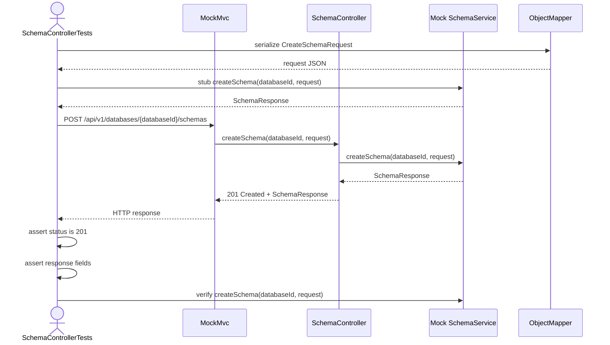
```mermaid
sequenceDiagram
    actor Test as SchemaControllerTests

    participant MockMvc
    participant Controller as SchemaController
    participant Service as Mock SchemaService
    participant Jackson as ObjectMapper

    Test->>Jackson: serialize CreateSchemaRequest
    Jackson-->>Test: request JSON

    Test->>Service: stub createSchema(databaseId, request)
    Service-->>Test: SchemaResponse

    Test->>MockMvc: POST /api/v1/databases/{databaseId}/schemas
    MockMvc->>Controller: createSchema(databaseId, request)

    Controller->>Service: createSchema(databaseId, request)
    Service-->>Controller: SchemaResponse

    Controller-->>MockMvc: 201 Created + SchemaResponse
    MockMvc-->>Test: HTTP response

    Test->>Test: assert status is 201
    Test->>Test: assert response fields
    Test->>Service: verify createSchema(databaseId, request)
```

---

## 1.2 getSchema_ShouldReturn200Ok

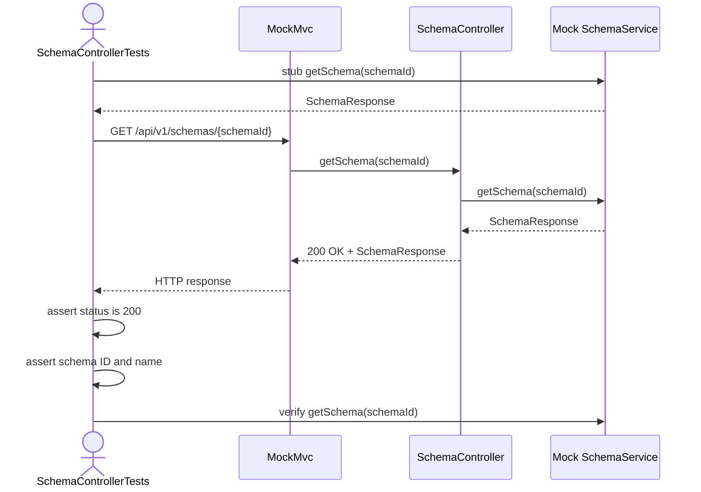
```mermaid
sequenceDiagram
    actor Test as SchemaControllerTests

    participant MockMvc
    participant Controller as SchemaController
    participant Service as Mock SchemaService

    Test->>Service: stub getSchema(schemaId)
    Service-->>Test: SchemaResponse

    Test->>MockMvc: GET /api/v1/schemas/{schemaId}
    MockMvc->>Controller: getSchema(schemaId)

    Controller->>Service: getSchema(schemaId)
    Service-->>Controller: SchemaResponse

    Controller-->>MockMvc: 200 OK + SchemaResponse
    MockMvc-->>Test: HTTP response

    Test->>Test: assert status is 200
    Test->>Test: assert schema ID and name
    Test->>Service: verify getSchema(schemaId)
```

---

## 1.3 listSchemas_ShouldReturn200AndSchemaList

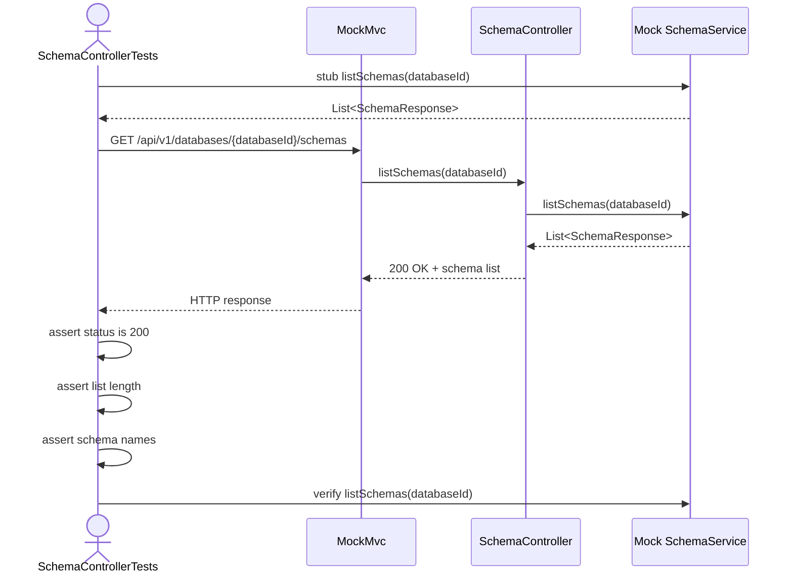
```mermaid
sequenceDiagram
    actor Test as SchemaControllerTests

    participant MockMvc
    participant Controller as SchemaController
    participant Service as Mock SchemaService

    Test->>Service: stub listSchemas(databaseId)
    Service-->>Test: List<SchemaResponse>

    Test->>MockMvc: GET /api/v1/databases/{databaseId}/schemas
    MockMvc->>Controller: listSchemas(databaseId)

    Controller->>Service: listSchemas(databaseId)
    Service-->>Controller: List<SchemaResponse>

    Controller-->>MockMvc: 200 OK + schema list
    MockMvc-->>Test: HTTP response

    Test->>Test: assert status is 200
    Test->>Test: assert list length
    Test->>Test: assert schema names
    Test->>Service: verify listSchemas(databaseId)
```

---

## 1.4 renameSchema_ShouldReturn200Ok

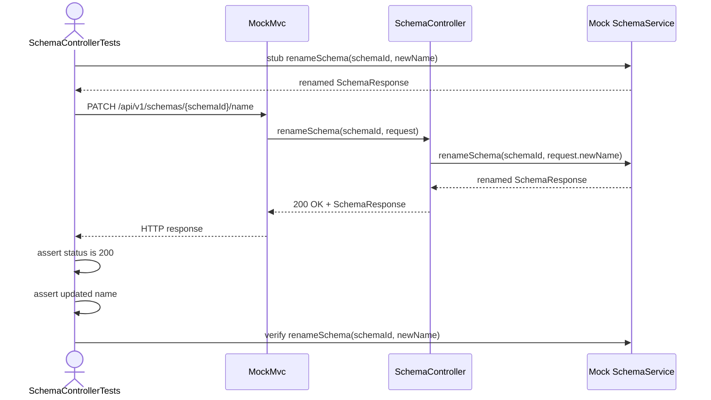
```mermaid
sequenceDiagram
    actor Test as SchemaControllerTests

    participant MockMvc
    participant Controller as SchemaController
    participant Service as Mock SchemaService

    Test->>Service: stub renameSchema(schemaId, newName)
    Service-->>Test: renamed SchemaResponse

    Test->>MockMvc: PATCH /api/v1/schemas/{schemaId}/name
    MockMvc->>Controller: renameSchema(schemaId, request)

    Controller->>Service: renameSchema(schemaId, request.newName)
    Service-->>Controller: renamed SchemaResponse

    Controller-->>MockMvc: 200 OK + SchemaResponse
    MockMvc-->>Test: HTTP response

    Test->>Test: assert status is 200
    Test->>Test: assert updated name
    Test->>Service: verify renameSchema(schemaId, newName)
```

---

## 1.5 copySchema_ShouldReturn201Created

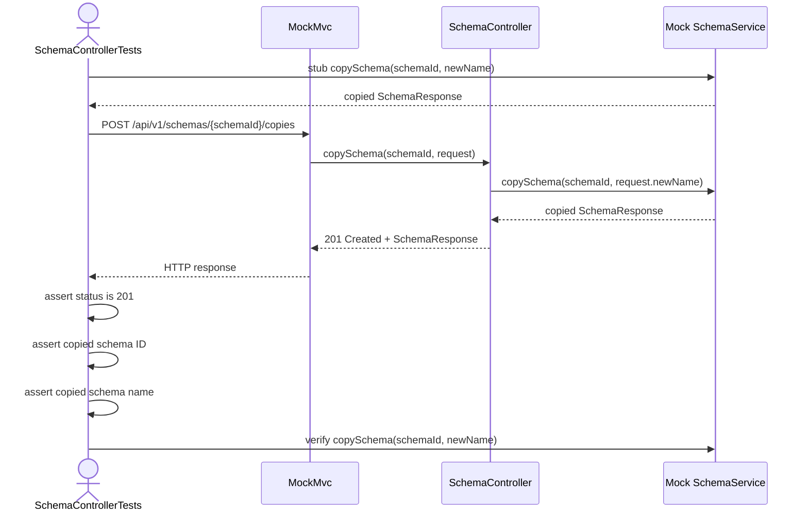
```mermaid
sequenceDiagram
    actor Test as SchemaControllerTests

    participant MockMvc
    participant Controller as SchemaController
    participant Service as Mock SchemaService

    Test->>Service: stub copySchema(schemaId, newName)
    Service-->>Test: copied SchemaResponse

    Test->>MockMvc: POST /api/v1/schemas/{schemaId}/copies
    MockMvc->>Controller: copySchema(schemaId, request)

    Controller->>Service: copySchema(schemaId, request.newName)
    Service-->>Controller: copied SchemaResponse

    Controller-->>MockMvc: 201 Created + SchemaResponse
    MockMvc-->>Test: HTTP response

    Test->>Test: assert status is 201
    Test->>Test: assert copied schema ID
    Test->>Test: assert copied schema name
    Test->>Service: verify copySchema(schemaId, newName)
```

---

## 1.6 deleteSchema_ShouldReturn204NoContent

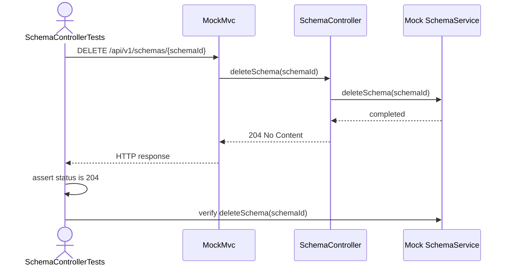
```mermaid
sequenceDiagram
    actor Test as SchemaControllerTests

    participant MockMvc
    participant Controller as SchemaController
    participant Service as Mock SchemaService

    Test->>MockMvc: DELETE /api/v1/schemas/{schemaId}
    MockMvc->>Controller: deleteSchema(schemaId)

    Controller->>Service: deleteSchema(schemaId)
    Service-->>Controller: completed

    Controller-->>MockMvc: 204 No Content
    MockMvc-->>Test: HTTP response

    Test->>Test: assert status is 204
    Test->>Service: verify deleteSchema(schemaId)
```

---

# 2. SchemaServiceTests

## 2.1 createSchema_ShouldMapSaveAndReturnResponse

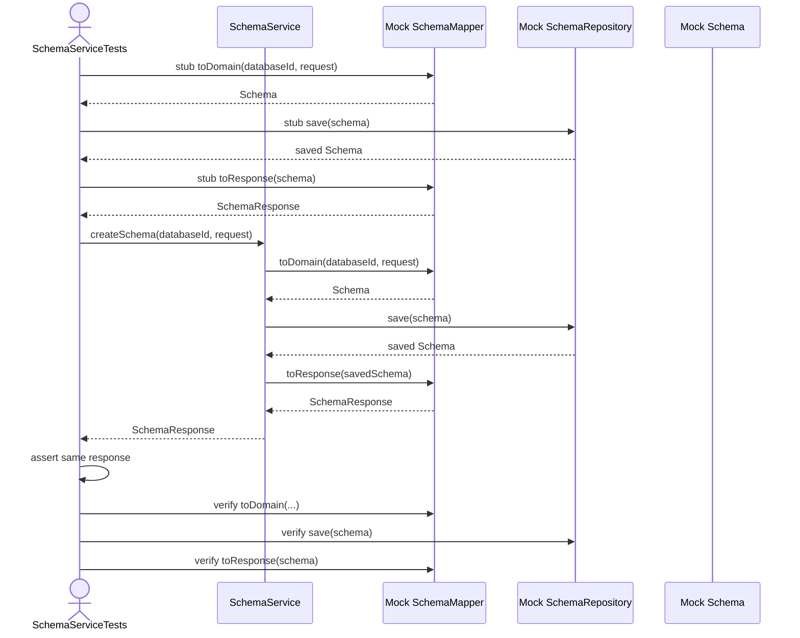
```mermaid
sequenceDiagram
    actor Test as SchemaServiceTests

    participant Service as SchemaService
    participant Mapper as Mock SchemaMapper
    participant Repository as Mock SchemaRepository
    participant Schema as Mock Schema

    Test->>Mapper: stub toDomain(databaseId, request)
    Mapper-->>Test: Schema

    Test->>Repository: stub save(schema)
    Repository-->>Test: saved Schema

    Test->>Mapper: stub toResponse(schema)
    Mapper-->>Test: SchemaResponse

    Test->>Service: createSchema(databaseId, request)

    Service->>Mapper: toDomain(databaseId, request)
    Mapper-->>Service: Schema

    Service->>Repository: save(schema)
    Repository-->>Service: saved Schema

    Service->>Mapper: toResponse(savedSchema)
    Mapper-->>Service: SchemaResponse

    Service-->>Test: SchemaResponse

    Test->>Test: assert same response
    Test->>Mapper: verify toDomain(...)
    Test->>Repository: verify save(schema)
    Test->>Mapper: verify toResponse(schema)
```

---

## 2.2 getSchema_ShouldFindAndMapSchema

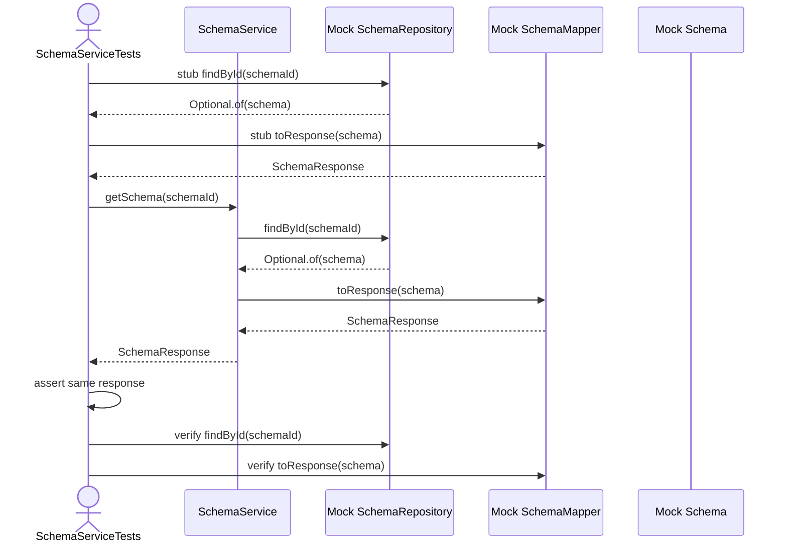
```mermaid
sequenceDiagram
    actor Test as SchemaServiceTests

    participant Service as SchemaService
    participant Repository as Mock SchemaRepository
    participant Mapper as Mock SchemaMapper
    participant Schema as Mock Schema

    Test->>Repository: stub findById(schemaId)
    Repository-->>Test: Optional.of(schema)

    Test->>Mapper: stub toResponse(schema)
    Mapper-->>Test: SchemaResponse

    Test->>Service: getSchema(schemaId)

    Service->>Repository: findById(schemaId)
    Repository-->>Service: Optional.of(schema)

    Service->>Mapper: toResponse(schema)
    Mapper-->>Service: SchemaResponse

    Service-->>Test: SchemaResponse

    Test->>Test: assert same response
    Test->>Repository: verify findById(schemaId)
    Test->>Mapper: verify toResponse(schema)
```

---

## 2.3 listSchemas_ShouldMapAllSchemas

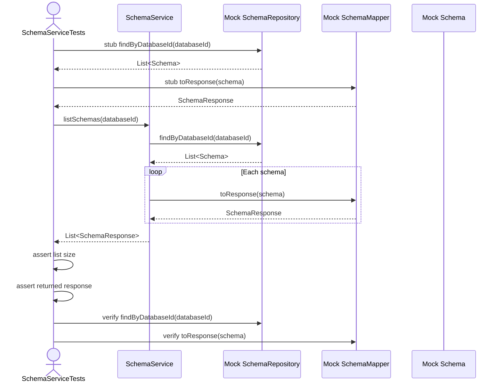
```mermaid
sequenceDiagram
    actor Test as SchemaServiceTests

    participant Service as SchemaService
    participant Repository as Mock SchemaRepository
    participant Mapper as Mock SchemaMapper
    participant Schema as Mock Schema

    Test->>Repository: stub findByDatabaseId(databaseId)
    Repository-->>Test: List<Schema>

    Test->>Mapper: stub toResponse(schema)
    Mapper-->>Test: SchemaResponse

    Test->>Service: listSchemas(databaseId)

    Service->>Repository: findByDatabaseId(databaseId)
    Repository-->>Service: List<Schema>

    loop Each schema
        Service->>Mapper: toResponse(schema)
        Mapper-->>Service: SchemaResponse
    end

    Service-->>Test: List<SchemaResponse>

    Test->>Test: assert list size
    Test->>Test: assert returned response
    Test->>Repository: verify findByDatabaseId(databaseId)
    Test->>Mapper: verify toResponse(schema)
```

---

## 2.4 renameSchema_ShouldFindSaveAndReturnResponse

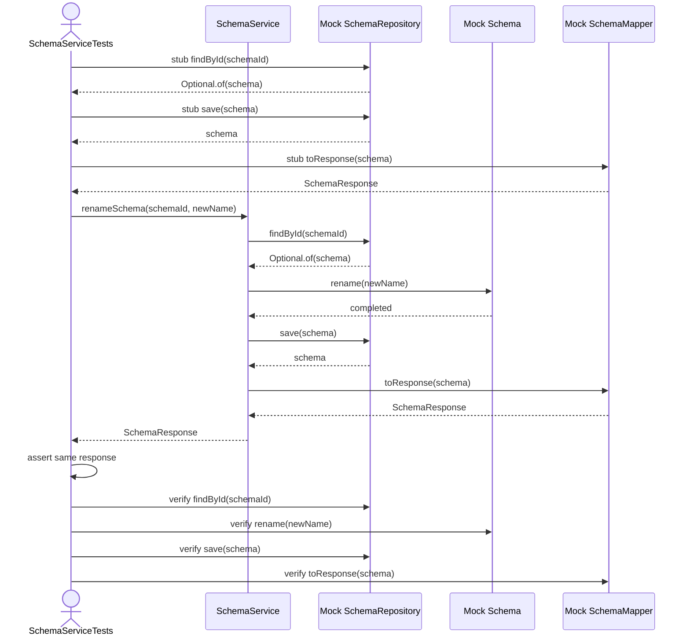
```mermaid
sequenceDiagram
    actor Test as SchemaServiceTests

    participant Service as SchemaService
    participant Repository as Mock SchemaRepository
    participant Schema as Mock Schema
    participant Mapper as Mock SchemaMapper

    Test->>Repository: stub findById(schemaId)
    Repository-->>Test: Optional.of(schema)

    Test->>Repository: stub save(schema)
    Repository-->>Test: schema

    Test->>Mapper: stub toResponse(schema)
    Mapper-->>Test: SchemaResponse

    Test->>Service: renameSchema(schemaId, newName)

    Service->>Repository: findById(schemaId)
    Repository-->>Service: Optional.of(schema)

    Service->>Schema: rename(newName)
    Schema-->>Service: completed

    Service->>Repository: save(schema)
    Repository-->>Service: schema

    Service->>Mapper: toResponse(schema)
    Mapper-->>Service: SchemaResponse

    Service-->>Test: SchemaResponse

    Test->>Test: assert same response
    Test->>Repository: verify findById(schemaId)
    Test->>Schema: verify rename(newName)
    Test->>Repository: verify save(schema)
    Test->>Mapper: verify toResponse(schema)
```

---

## 2.5 copySchema_ShouldFindSaveAndReturnResponse

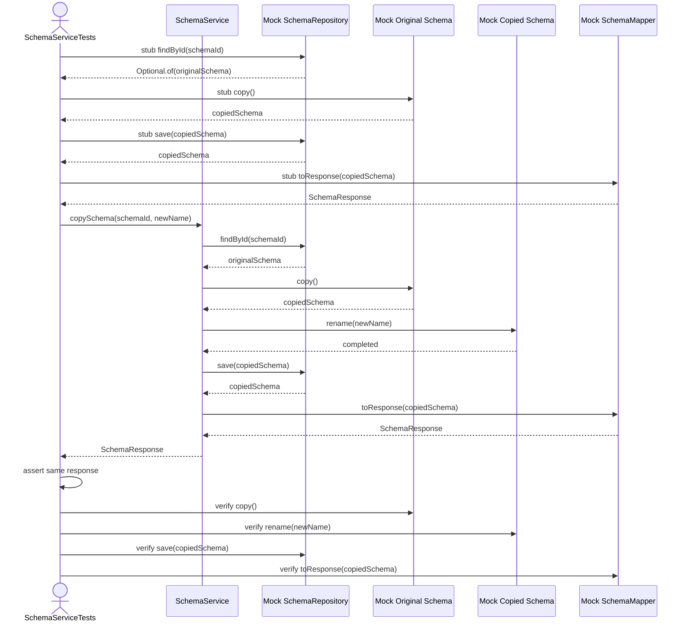
```mermaid
sequenceDiagram
    actor Test as SchemaServiceTests

    participant Service as SchemaService
    participant Repository as Mock SchemaRepository
    participant Original as Mock Original Schema
    participant Copy as Mock Copied Schema
    participant Mapper as Mock SchemaMapper

    Test->>Repository: stub findById(schemaId)
    Repository-->>Test: Optional.of(originalSchema)

    Test->>Original: stub copy()
    Original-->>Test: copiedSchema

    Test->>Repository: stub save(copiedSchema)
    Repository-->>Test: copiedSchema

    Test->>Mapper: stub toResponse(copiedSchema)
    Mapper-->>Test: SchemaResponse

    Test->>Service: copySchema(schemaId, newName)

    Service->>Repository: findById(schemaId)
    Repository-->>Service: originalSchema

    Service->>Original: copy()
    Original-->>Service: copiedSchema

    Service->>Copy: rename(newName)
    Copy-->>Service: completed

    Service->>Repository: save(copiedSchema)
    Repository-->>Service: copiedSchema

    Service->>Mapper: toResponse(copiedSchema)
    Mapper-->>Service: SchemaResponse

    Service-->>Test: SchemaResponse

    Test->>Test: assert same response
    Test->>Original: verify copy()
    Test->>Copy: verify rename(newName)
    Test->>Repository: verify save(copiedSchema)
    Test->>Mapper: verify toResponse(copiedSchema)
```

---

## 2.6 deleteSchema_ShouldDeleteSchema

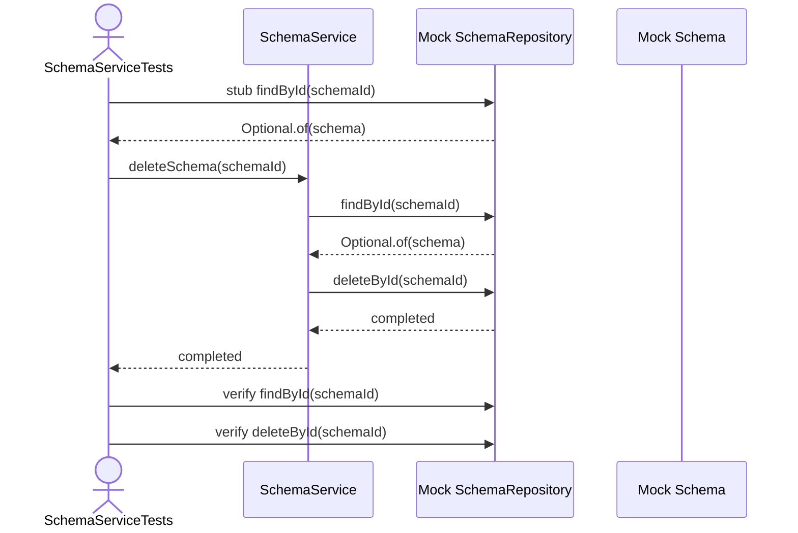
```mermaid
sequenceDiagram
    actor Test as SchemaServiceTests

    participant Service as SchemaService
    participant Repository as Mock SchemaRepository
    participant Schema as Mock Schema

    Test->>Repository: stub findById(schemaId)
    Repository-->>Test: Optional.of(schema)

    Test->>Service: deleteSchema(schemaId)

    Service->>Repository: findById(schemaId)
    Repository-->>Service: Optional.of(schema)

    Service->>Repository: deleteById(schemaId)
    Repository-->>Service: completed

    Service-->>Test: completed

    Test->>Repository: verify findById(schemaId)
    Test->>Repository: verify deleteById(schemaId)
```

---

# 3. SchemaApiIntegrationTests

## 3.1 createSchema_ShouldPersistAndReturn201Created

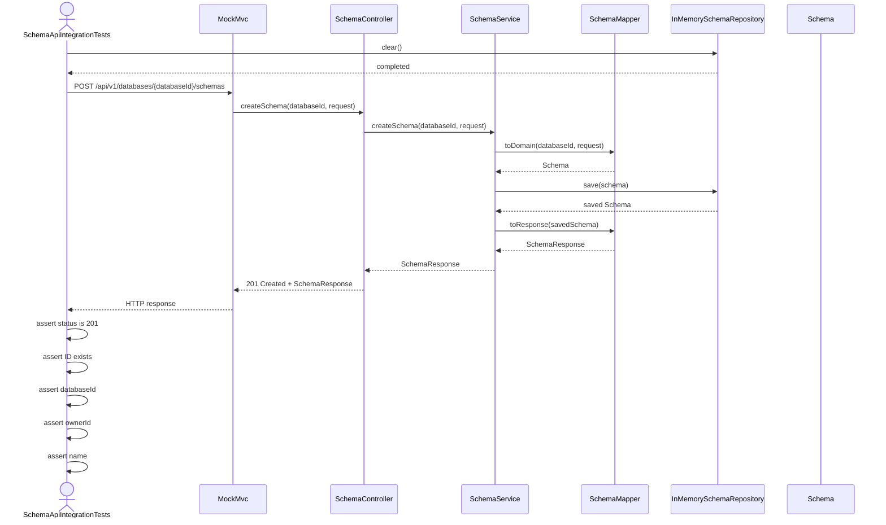
```mermaid
sequenceDiagram
    actor Test as SchemaApiIntegrationTests

    participant MockMvc
    participant Controller as SchemaController
    participant Service as SchemaService
    participant Mapper as SchemaMapper
    participant Repository as InMemorySchemaRepository
    participant Schema as Schema

    Test->>Repository: clear()
    Repository-->>Test: completed

    Test->>MockMvc: POST /api/v1/databases/{databaseId}/schemas
    MockMvc->>Controller: createSchema(databaseId, request)

    Controller->>Service: createSchema(databaseId, request)

    Service->>Mapper: toDomain(databaseId, request)
    Mapper-->>Service: Schema

    Service->>Repository: save(schema)
    Repository-->>Service: saved Schema

    Service->>Mapper: toResponse(savedSchema)
    Mapper-->>Service: SchemaResponse

    Service-->>Controller: SchemaResponse
    Controller-->>MockMvc: 201 Created + SchemaResponse
    MockMvc-->>Test: HTTP response

    Test->>Test: assert status is 201
    Test->>Test: assert ID exists
    Test->>Test: assert databaseId
    Test->>Test: assert ownerId
    Test->>Test: assert name
```

---

## 3.2 createAndGetSchema_ShouldReturnStoredSchema

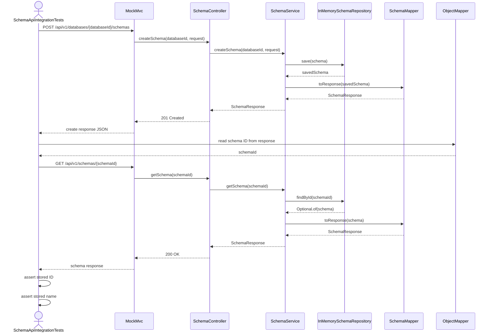
```mermaid
sequenceDiagram
    actor Test as SchemaApiIntegrationTests

    participant MockMvc
    participant Controller as SchemaController
    participant Service as SchemaService
    participant Repository as InMemorySchemaRepository
    participant Mapper as SchemaMapper
    participant Jackson as ObjectMapper

    Test->>MockMvc: POST /api/v1/databases/{databaseId}/schemas
    MockMvc->>Controller: createSchema(databaseId, request)
    Controller->>Service: createSchema(databaseId, request)
    Service->>Repository: save(schema)
    Repository-->>Service: savedSchema
    Service->>Mapper: toResponse(savedSchema)
    Mapper-->>Service: SchemaResponse
    Service-->>Controller: SchemaResponse
    Controller-->>MockMvc: 201 Created
    MockMvc-->>Test: create response JSON

    Test->>Jackson: read schema ID from response
    Jackson-->>Test: schemaId

    Test->>MockMvc: GET /api/v1/schemas/{schemaId}
    MockMvc->>Controller: getSchema(schemaId)

    Controller->>Service: getSchema(schemaId)
    Service->>Repository: findById(schemaId)
    Repository-->>Service: Optional.of(schema)

    Service->>Mapper: toResponse(schema)
    Mapper-->>Service: SchemaResponse

    Service-->>Controller: SchemaResponse
    Controller-->>MockMvc: 200 OK
    MockMvc-->>Test: schema response

    Test->>Test: assert stored ID
    Test->>Test: assert stored name
```

---

## 3.3 createAndListSchemas_ShouldReturnStoredSchemas

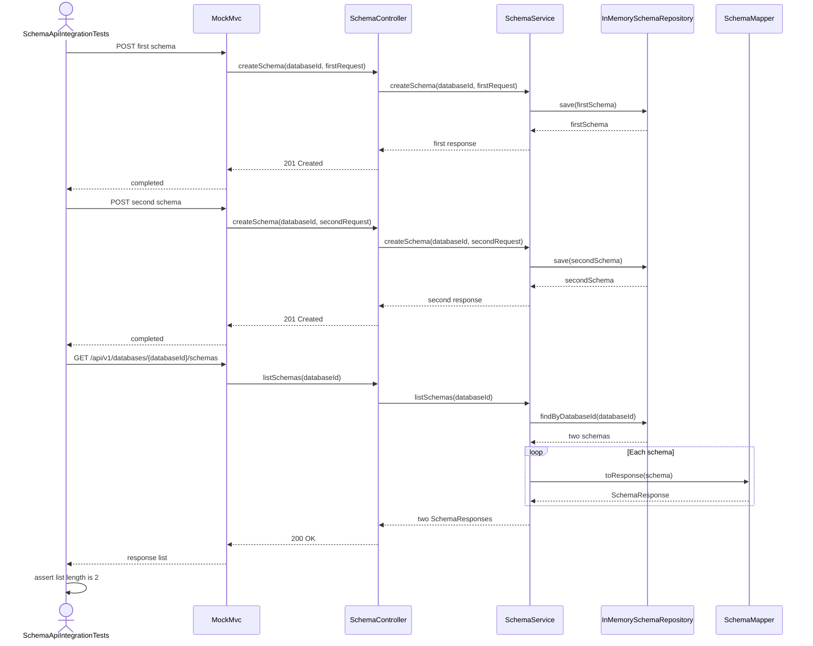
```mermaid
sequenceDiagram
    actor Test as SchemaApiIntegrationTests

    participant MockMvc
    participant Controller as SchemaController
    participant Service as SchemaService
    participant Repository as InMemorySchemaRepository
    participant Mapper as SchemaMapper

    Test->>MockMvc: POST first schema
    MockMvc->>Controller: createSchema(databaseId, firstRequest)
    Controller->>Service: createSchema(databaseId, firstRequest)
    Service->>Repository: save(firstSchema)
    Repository-->>Service: firstSchema
    Service-->>Controller: first response
    Controller-->>MockMvc: 201 Created
    MockMvc-->>Test: completed

    Test->>MockMvc: POST second schema
    MockMvc->>Controller: createSchema(databaseId, secondRequest)
    Controller->>Service: createSchema(databaseId, secondRequest)
    Service->>Repository: save(secondSchema)
    Repository-->>Service: secondSchema
    Service-->>Controller: second response
    Controller-->>MockMvc: 201 Created
    MockMvc-->>Test: completed

    Test->>MockMvc: GET /api/v1/databases/{databaseId}/schemas
    MockMvc->>Controller: listSchemas(databaseId)

    Controller->>Service: listSchemas(databaseId)
    Service->>Repository: findByDatabaseId(databaseId)
    Repository-->>Service: two schemas

    loop Each schema
        Service->>Mapper: toResponse(schema)
        Mapper-->>Service: SchemaResponse
    end

    Service-->>Controller: two SchemaResponses
    Controller-->>MockMvc: 200 OK
    MockMvc-->>Test: response list

    Test->>Test: assert list length is 2
```

---

## 3.4 createAndRenameSchema_ShouldReturnUpdatedName

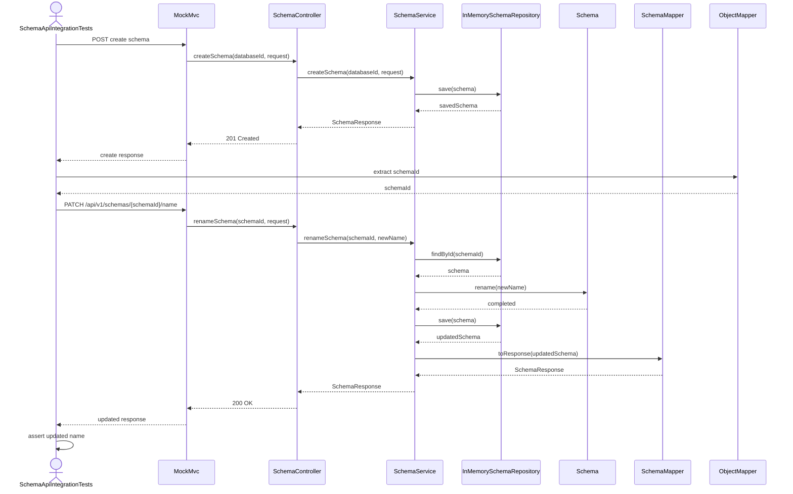
```mermaid
sequenceDiagram
    actor Test as SchemaApiIntegrationTests

    participant MockMvc
    participant Controller as SchemaController
    participant Service as SchemaService
    participant Repository as InMemorySchemaRepository
    participant Schema as Schema
    participant Mapper as SchemaMapper
    participant Jackson as ObjectMapper

    Test->>MockMvc: POST create schema
    MockMvc->>Controller: createSchema(databaseId, request)
    Controller->>Service: createSchema(databaseId, request)
    Service->>Repository: save(schema)
    Repository-->>Service: savedSchema
    Service-->>Controller: SchemaResponse
    Controller-->>MockMvc: 201 Created
    MockMvc-->>Test: create response

    Test->>Jackson: extract schemaId
    Jackson-->>Test: schemaId

    Test->>MockMvc: PATCH /api/v1/schemas/{schemaId}/name
    MockMvc->>Controller: renameSchema(schemaId, request)

    Controller->>Service: renameSchema(schemaId, newName)
    Service->>Repository: findById(schemaId)
    Repository-->>Service: schema

    Service->>Schema: rename(newName)
    Schema-->>Service: completed

    Service->>Repository: save(schema)
    Repository-->>Service: updatedSchema

    Service->>Mapper: toResponse(updatedSchema)
    Mapper-->>Service: SchemaResponse

    Service-->>Controller: SchemaResponse
    Controller-->>MockMvc: 200 OK
    MockMvc-->>Test: updated response

    Test->>Test: assert updated name
```

---

## 3.5 createAndDeleteSchema_ShouldRemoveSchema

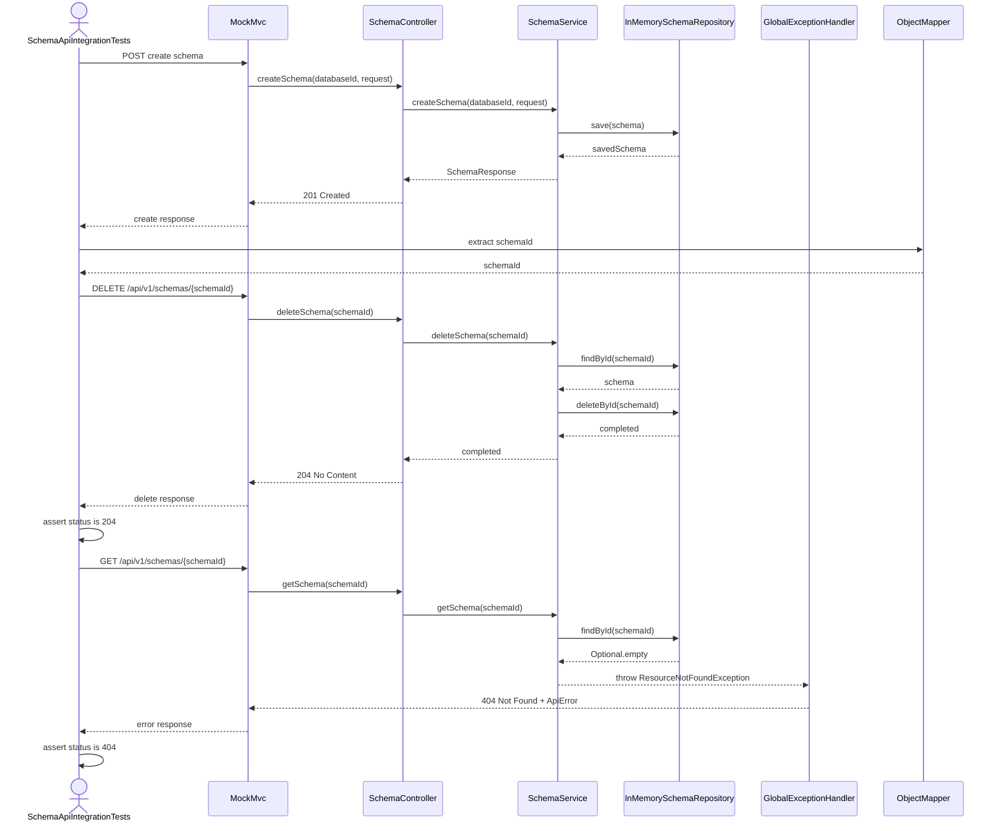
```mermaid
sequenceDiagram
    actor Test as SchemaApiIntegrationTests

    participant MockMvc
    participant Controller as SchemaController
    participant Service as SchemaService
    participant Repository as InMemorySchemaRepository
    participant Handler as GlobalExceptionHandler
    participant Jackson as ObjectMapper

    Test->>MockMvc: POST create schema
    MockMvc->>Controller: createSchema(databaseId, request)
    Controller->>Service: createSchema(databaseId, request)
    Service->>Repository: save(schema)
    Repository-->>Service: savedSchema
    Service-->>Controller: SchemaResponse
    Controller-->>MockMvc: 201 Created
    MockMvc-->>Test: create response

    Test->>Jackson: extract schemaId
    Jackson-->>Test: schemaId

    Test->>MockMvc: DELETE /api/v1/schemas/{schemaId}
    MockMvc->>Controller: deleteSchema(schemaId)

    Controller->>Service: deleteSchema(schemaId)
    Service->>Repository: findById(schemaId)
    Repository-->>Service: schema

    Service->>Repository: deleteById(schemaId)
    Repository-->>Service: completed

    Service-->>Controller: completed
    Controller-->>MockMvc: 204 No Content
    MockMvc-->>Test: delete response

    Test->>Test: assert status is 204

    Test->>MockMvc: GET /api/v1/schemas/{schemaId}
    MockMvc->>Controller: getSchema(schemaId)

    Controller->>Service: getSchema(schemaId)
    Service->>Repository: findById(schemaId)
    Repository-->>Service: Optional.empty

    Service-->>Handler: throw ResourceNotFoundException
    Handler-->>MockMvc: 404 Not Found + ApiError
    MockMvc-->>Test: error response

    Test->>Test: assert status is 404
```

---

# 4. Test Coverage Summary

| Test class | Test type | Number of tests |
| --- | --- | ---: |
| `SchemaControllerTests` | Controller slice tests | 6 |
| `SchemaServiceTests` | Unit tests | 6 |
| `SchemaApiIntegrationTests` | Integration tests | 5 |
| **Total** |  | **17** |

---

# 5. Important Rule

```text
Production method body not implemented
≠
Sequence diagram cannot be created
```

The diagram describes the expected behavior:

```text
Arrange
→ Act
→ Interaction
→ Response
→ Assertion
```

It does not prove that the implementation already exists or that the test currently passes.