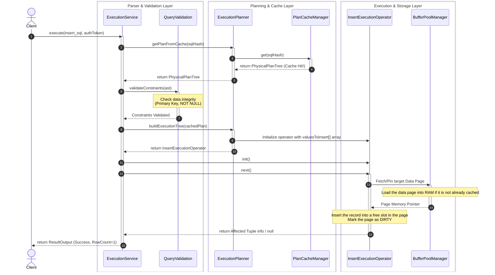

```mermaid
sequenceDiagram
    autonumber
    actor Client

    box Parser & Validation Layer
        participant ExecService as ExecutionService
        participant Valid as QueryValidation
    end

    box Planning & Cache Layer
        participant Planner as ExecutionPlanner
        participant Cache as PlanCacheManager
    end

    box Execution & Storage Layer
        participant InsertOp as InsertExecutionOperator
        participant Buffer as BufferPoolManager
    end

    Client->>ExecService: execute(insert_sql, authToken)
    activate ExecService

    %% --- Stage 1: Check Plan from Cache ---
    ExecService->>Planner: getPlanFromCache(sqlHash)
    activate Planner
    Planner->>Cache: get(sqlHash)
    activate Cache
    Cache-->>Planner: return PhysicalPlanTree (Cache Hit!)
    deactivate Cache
    Planner-->>ExecService: return PhysicalPlanTree
    deactivate Planner

    %% --- Stage 2: Validate Write Constraints ---
    ExecService->>Valid: validateConstraints(ast)
    activate Valid
    Note over Valid: Check data integrity<br/>(Primary Key, NOT NULL)
    Valid-->>ExecService: Constraints Validated
    deactivate Valid

    %% --- Stage 3: Compile & Execute into Buffer ---
    ExecService->>Planner: buildExecutionTree(cachedPlan)
    activate Planner
    Planner->>InsertOp: Initialize operator with valuesToInsert[] array
    Planner-->>ExecService: return InsertExecutionOperator
    deactivate Planner

    ExecService->>InsertOp: init()
    ExecService->>InsertOp: next()
    activate InsertOp

    InsertOp->>Buffer: Fetch/Pin target Data Page
    activate Buffer
    Note over Buffer: Load the data page into RAM if it is not already cached
    Buffer-->>InsertOp: Page Memory Pointer
    deactivate Buffer

    Note over InsertOp: Insert the record into a free slot in the page<br/>Mark the page as DIRTY

    InsertOp-->>ExecService: return Affected Tuple info / null
    deactivate InsertOp

    ExecService-->>Client: return ResultOutput (Success, RowCount=1)
    deactivate ExecService
```
