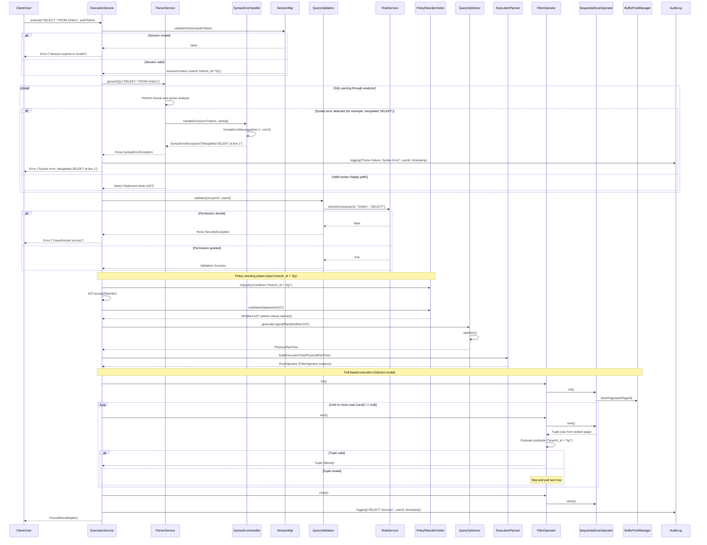

```mermaid
sequenceDiagram
    participant Client as Client/User
    participant ExecService as ExecutionService
    participant QP as ParserService
    participant ErrHandler as SyntaxErrorHandler
    participant SM as SessionMgr
    participant QV as QueryValidation
    participant Role as RoleService
    participant Rewriter as PolicyRewriterVisitor
    participant OptService as QueryOptimizer
    participant Plan as ExecutionPlanner
    participant Exec as FilterOperator
    participant Scan as SequentialScanOperator
    participant Storage as BufferPoolManager
    participant Audit as AuditLog

    Client->>ExecService: execute("SELECT * FROM Orders", authToken)
    ExecService ->> SM: validateSession(authToken)
    alt Session invalid
        SM -->> ExecService: false
        ExecService -->> Client: Error ("Session expired or invalid")
    else Session valid
        SM -->> ExecService: sessionContext (userId, branch_id="Sg")
    end

    ExecService ->> QP: parserSQL("SELEKT * FROM Orders")
    critical SQL parsing through analyzer
        QP ->> QP: Perform lexical and syntax analysis
        alt Syntax error detected (for example, misspelled 'SELEKT')
            QP ->> ErrHandler: handleError(errorTokens, rawSql)
            ErrHandler ->> ErrHandler: formatErrorMessage(line=1, col=0)
            ErrHandler -->> QP: SyntaxErrorException("Misspelled SELEKT at line 1")
            QP -->> ExecService: throw SyntaxErrorException
            ExecService ->> Audit: logging("Parse Failure: Syntax Error", userId, timestamp)
            ExecService -->> Client: Error ("Syntax error: Misspelled SELEKT at line 1")
        else Valid syntax (happy path)
            QP -->> ExecService: Select Statement Node (AST)
        end
    end

    ExecService ->> QV: validateQuery(AST, userId)
    QV ->> Role: checkAccess(userId, "Orders", "SELECT")
    alt Permission denied
        Role -->> QV: false
        QV -->> ExecService: throw SecurityException
        ExecService -->> Client: Error ("Unauthorized access")
    else Permission granted
        Role -->> QV: true
        QV -->> ExecService: Validation Success
    end

    note over ExecService, Rewriter: Policy rewriting phase (inject branch_id = 'Sg')
    ExecService ->> Rewriter: init(policyCondition="branch_id = 'Sg'")
    ExecService ->> ExecService: AST.accept(Rewriter)
    ExecService ->> Rewriter: visitSelectStatement(AST)
    Rewriter -->> ExecService: Modified AST (where clause injected)

    ExecService ->> OptService: generateLogicalPlan(Modified AST)
    OptService ->> OptService: optimize()
    OptService -->> ExecService: PhysicalPlanTree
    ExecService ->> Plan: buildExecutionTree(PhysicalPlanTree)
    Plan -->> ExecService: RootOperator (FilterOperator instance)

    note over ExecService, Storage: Pull-based execution (Volcano model)
    ExecService ->> Exec: init()
    Exec ->> Scan: init()
    Scan ->> Storage: fetchPage(startPageId)
    loop Until no more rows (next() == null)
        ExecService ->> Exec: next()
        Exec ->> Scan: next()
        Scan -->> Exec: Tuple (raw from slotted page)
        Exec ->> Exec: Evaluate predicate ("branch_id = 'Sg'")
        alt Tuple valid
            Exec -->> ExecService: Tuple (filtered)
        else Tuple invalid
            note over Exec: Skip and pull next row
        end
    end
    ExecService ->> Exec: close()
    Exec ->> Scan: close()

    ExecService ->> Audit: logging("SELECT Success", userId, timestamp)
    ExecService -->> Client: FormatResult(tuples)


```
