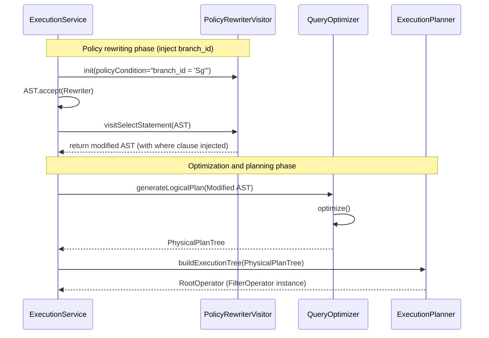

User Story
As a data security administration system,

I want to automatically traverse the user's abstract syntax tree (AST) and silently inject the required branch-level data filtering condition for tenant isolation, then optimize and convert it into an execution tree,

So that data remains fully isolated between branches without requiring application developers to manually write WHERE branch_id = '...' conditions in source code.

