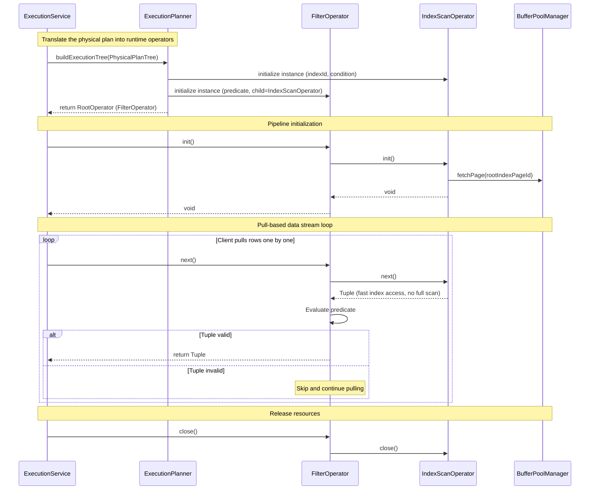

As an execution engine,

I want to process data using a pull-based pipeline (Volcano model) where a parent operator calls its child through init(), next(), and close(),

So that the system can handle millions of rows with a very small and fixed amount of RAM per operator ($O(1)$ memory space per operator).

