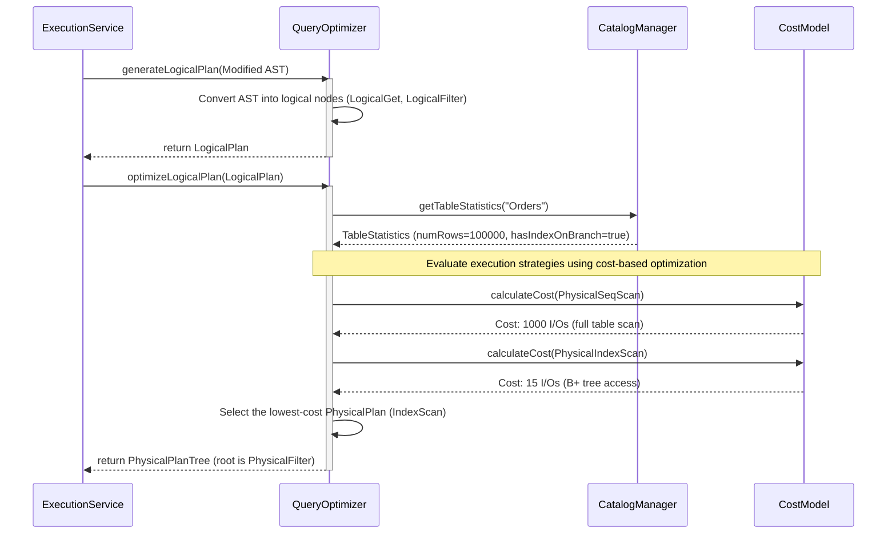

As a database system,

I want the rewritten AST to be converted into a logical plan and then optimized to choose the lowest I/O physical execution plan,

So that queries run as fast as possible and avoid wasteful table scans when an index scan is available.

