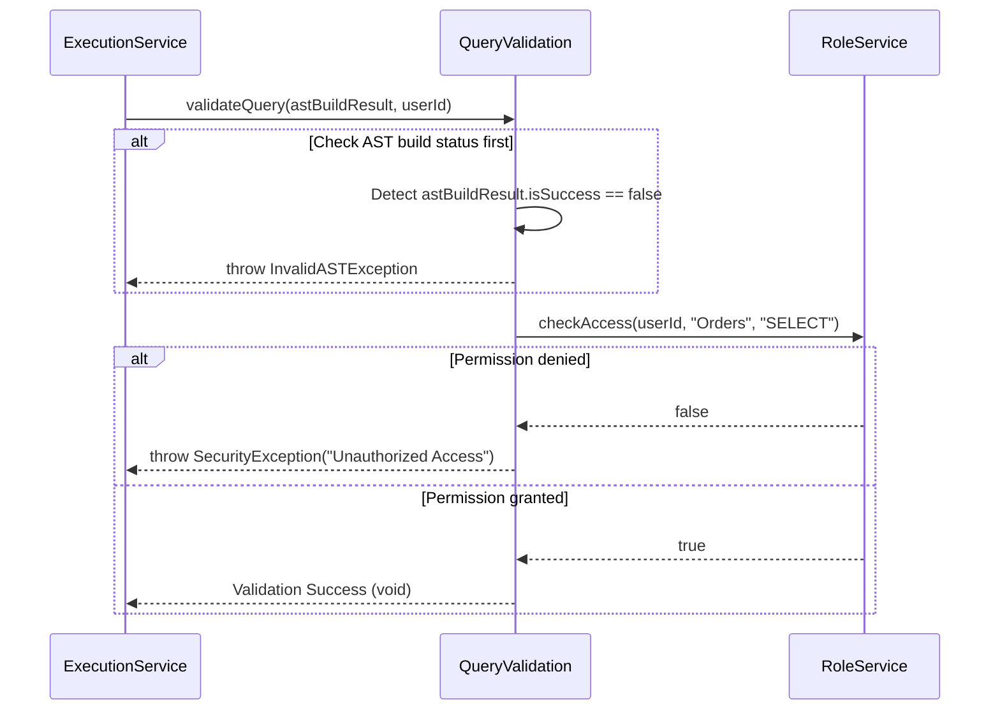

User Story
As a system administrator,

I want the system to automatically validate the AST using the user's identity information so it can verify access rights on data tables,

So that unauthorized access attempts are blocked before the system spends resources on execution.

