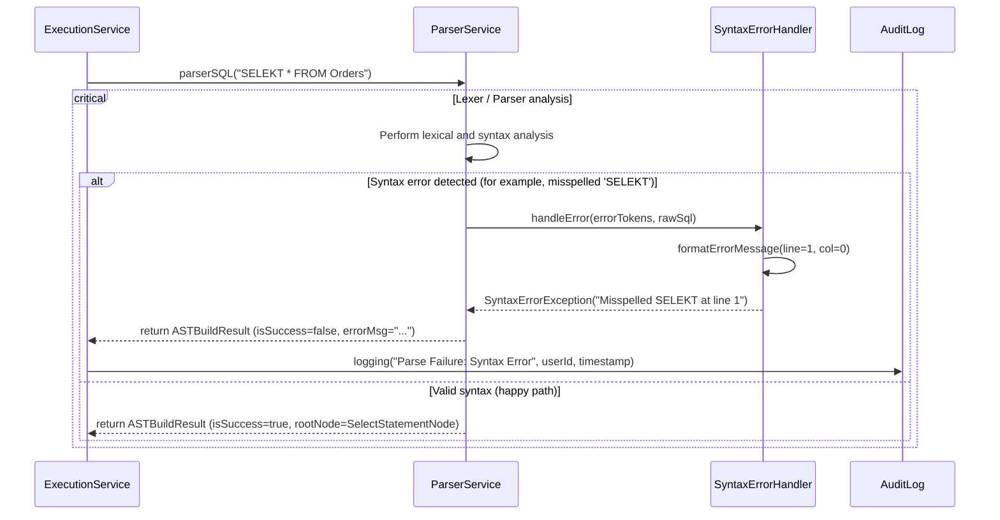

User Story:
As a client application,

I want to submit a raw SQL string and receive either a normalized abstract syntax tree (AST) or a detailed error message at the exact failure position when the statement is invalid,

So that I can provide clean input for later processing steps and debug syntax mistakes quickly.

