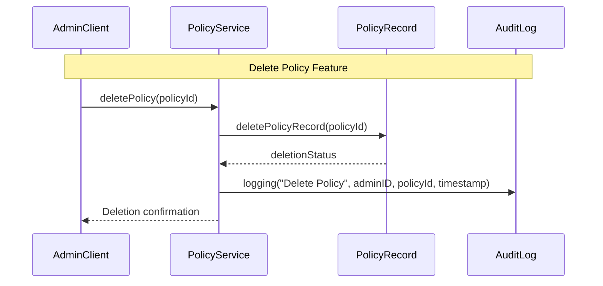

```mermaid
sequenceDiagram
    participant AdminClient
    participant PolicyService
    participant PolicyRecord
    participant AuditLog

    %% Delete Policy
    note over AdminClient, AuditLog: Delete Policy Feature
    AdminClient ->> PolicyService: deletePolicy(policyId)
    PolicyService ->> PolicyRecord: deletePolicyRecord(policyId)
    PolicyRecord -->> PolicyService: deletionStatus
    PolicyService ->> AuditLog: logging("Delete Policy", adminID, policyId, timestamp)
    PolicyService -->> AdminClient: Deletion confirmation
```
