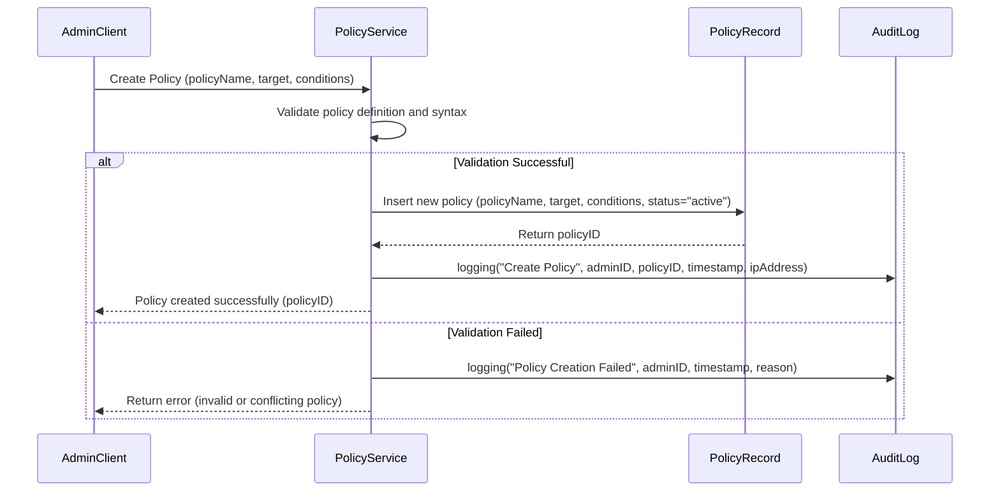

```mermaid
sequenceDiagram
    participant AdminClient
    participant PolicyService
    participant PolicyRecord
    participant AuditLog

    AdminClient ->> PolicyService: Create Policy (policyName, target, conditions)
    PolicyService ->> PolicyService: Validate policy definition and syntax
    alt Validation Successful
        PolicyService ->> PolicyRecord: Insert new policy (policyName, target, conditions, status="active")
        PolicyRecord -->> PolicyService: Return policyID
        PolicyService ->> AuditLog: logging("Create Policy", adminID, policyID, timestamp, ipAddress)
        PolicyService -->> AdminClient: Policy created successfully (policyID)
    else Validation Failed
        PolicyService ->> AuditLog: logging("Policy Creation Failed", adminID, timestamp, reason)
        PolicyService -->> AdminClient: Return error (invalid or conflicting policy)
    end
```