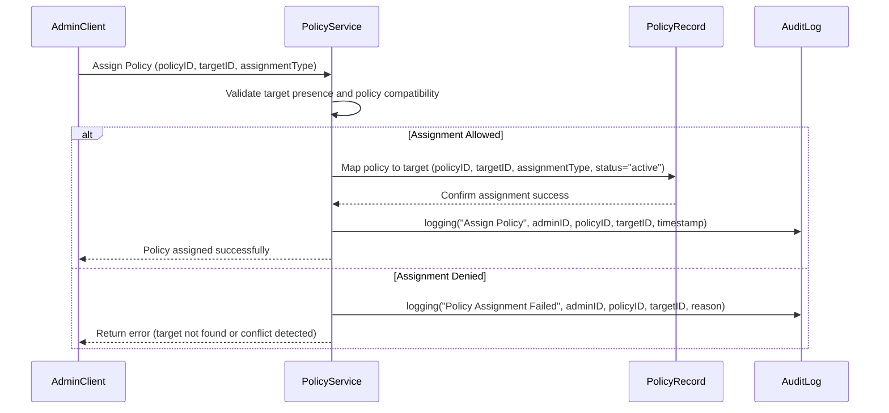

```mermaid
sequenceDiagram
    participant AdminClient
    participant PolicyService
    participant PolicyRecord
    participant AuditLog

    AdminClient ->> PolicyService: Assign Policy (policyID, targetID, assignmentType)
    PolicyService ->> PolicyService: Validate target presence and policy compatibility
    alt Assignment Allowed
        PolicyService ->> PolicyRecord: Map policy to target (policyID, targetID, assignmentType, status="active")
        PolicyRecord -->> PolicyService: Confirm assignment success
        PolicyService ->> AuditLog: logging("Assign Policy", adminID, policyID, targetID, timestamp)
        PolicyService -->> AdminClient: Policy assigned successfully
    else Assignment Denied
        PolicyService ->> AuditLog: logging("Policy Assignment Failed", adminID, policyID, targetID, reason)
        PolicyService -->> AdminClient: Return error (target not found or conflict detected)
    end
```