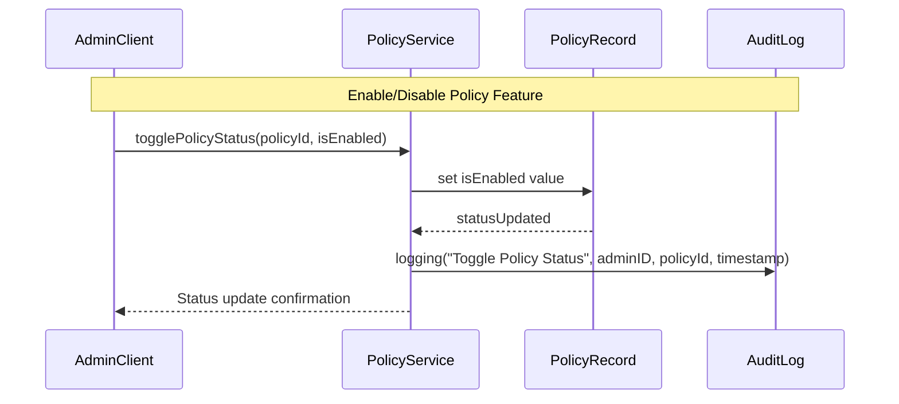

```mermaid
sequenceDiagram
    participant AdminClient
    participant PolicyService
    participant PolicyRecord
    participant AuditLog

    %% Enable/Disable Policy
    note over AdminClient, AuditLog: Enable/Disable Policy Feature
    AdminClient ->> PolicyService: togglePolicyStatus(policyId, isEnabled)
    PolicyService ->> PolicyRecord: set isEnabled value
    PolicyRecord -->> PolicyService: statusUpdated
    PolicyService ->> AuditLog: logging("Toggle Policy Status", adminID, policyId, timestamp)
    PolicyService -->> AdminClient: Status update confirmation
```
