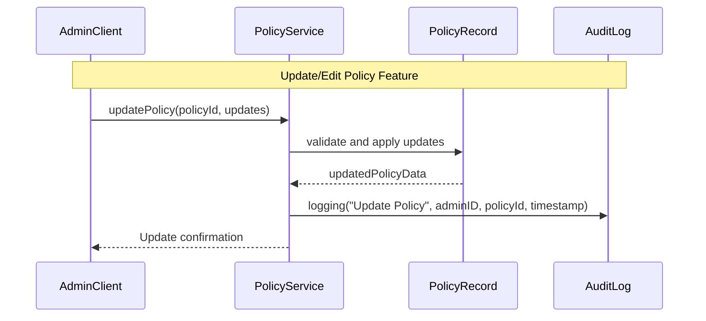

```mermaid
sequenceDiagram
    participant AdminClient
    participant PolicyService
    participant PolicyRecord
    participant AuditLog

    %% Update/Edit PolicyRecord
    note over AdminClient, AuditLog: Update/Edit Policy Feature
    AdminClient ->> PolicyService: updatePolicy(policyId, updates)
    PolicyService ->> PolicyRecord: validate and apply updates
    PolicyRecord -->> PolicyService: updatedPolicyData
    PolicyService ->> AuditLog: logging("Update Policy", adminID, policyId, timestamp)
    PolicyService -->> AdminClient: Update confirmation
```
