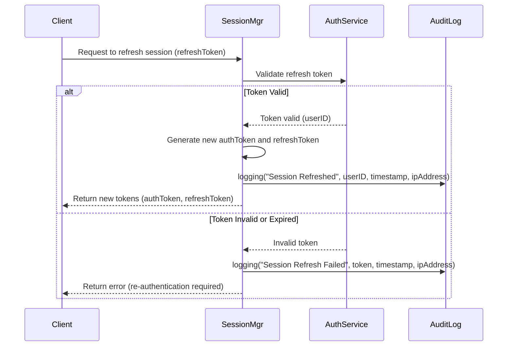

```mermaid
sequenceDiagram
    participant Client
    participant SessionMgr
    participant AuthService
    participant AuditLog

    Client ->> SessionMgr: Request to refresh session (refreshToken)
    SessionMgr ->> AuthService: Validate refresh token
    alt Token Valid
        AuthService -->> SessionMgr: Token valid (userID)
        SessionMgr ->> SessionMgr: Generate new authToken and refreshToken
        SessionMgr ->> AuditLog: logging("Session Refreshed", userID, timestamp, ipAddress)
        SessionMgr -->> Client: Return new tokens (authToken, refreshToken)
    else Token Invalid or Expired
        AuthService -->> SessionMgr: Invalid token
        SessionMgr ->> AuditLog: logging("Session Refresh Failed", token, timestamp, ipAddress)
        SessionMgr -->> Client: Return error (re-authentication required)
    end
```