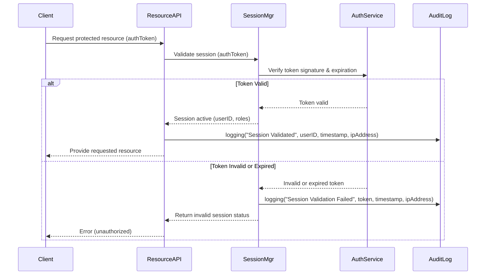

```mermaid

  sequenceDiagram
    participant Client
    participant ResourceAPI
    participant SessionMgr
    participant AuthService
    participant AuditLog

    Client ->> ResourceAPI: Request protected resource (authToken)
    ResourceAPI ->> SessionMgr: Validate session (authToken)
    SessionMgr ->> AuthService: Verify token signature & expiration
    alt Token Valid
        AuthService -->> SessionMgr: Token valid
        SessionMgr -->> ResourceAPI: Session active (userID, roles)
        ResourceAPI ->> AuditLog: logging("Session Validated", userID, timestamp, ipAddress)
        ResourceAPI -->> Client: Provide requested resource
    else Token Invalid or Expired
        AuthService -->> SessionMgr: Invalid or expired token
        SessionMgr ->> AuditLog: logging("Session Validation Failed", token, timestamp, ipAddress)
        SessionMgr -->> ResourceAPI: Return invalid session status
        ResourceAPI -->> Client: Error (unauthorized)
    end
```
