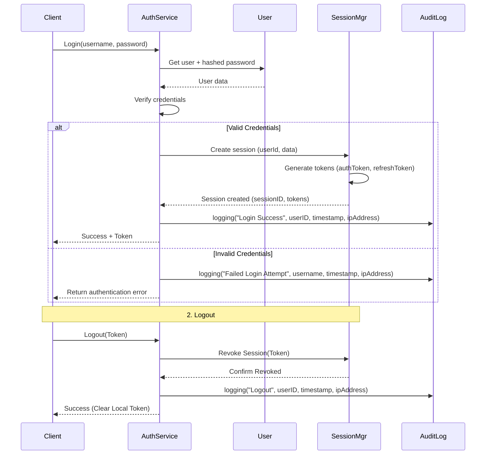

```mermaid
sequenceDiagram
    participant Client
    participant AuthService
    participant User
    participant SessionMgr
    participant AuditLog

    Client->>AuthService: Login(username, password)
    AuthService->>User: Get user + hashed password
    User-->>AuthService: User data
    AuthService->>AuthService: Verify credentials
    alt Valid Credentials
    AuthService->>SessionMgr: Create session (userId, data)
     SessionMgr ->> SessionMgr: Generate tokens (authToken, refreshToken)
        SessionMgr -->> AuthService: Session created (sessionID, tokens)
    AuthService ->> AuditLog: logging("Login Success", userID, timestamp, ipAddress)

    AuthService-->>Client: Success + Token
    else Invalid Credentials
        AuthService ->> AuditLog: logging("Failed Login Attempt", username, timestamp, ipAddress)
        AuthService -->> Client: Return authentication error
    end
    Note over Client, SessionMgr: 2. Logout
    Client->>AuthService: Logout(Token)
    AuthService->>SessionMgr: Revoke Session(Token)
    SessionMgr-->>AuthService: Confirm Revoked
    AuthService->>AuditLog: logging("Logout", userID, timestamp, ipAddress)
    AuthService-->>Client: Success (Clear Local Token)
```
