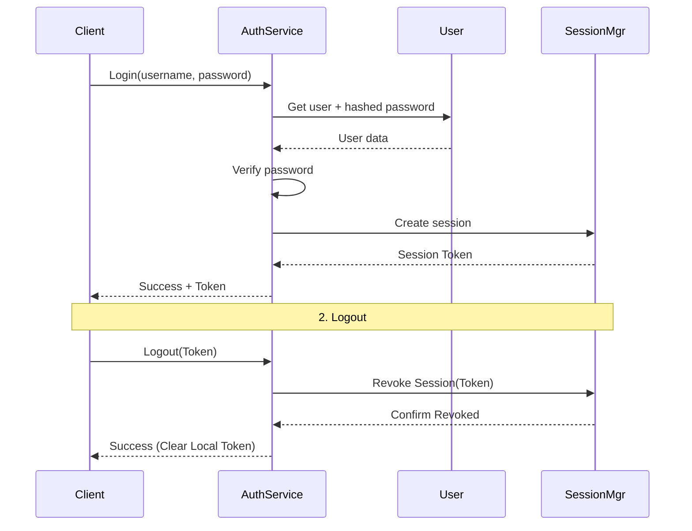

```mermaid
sequenceDiagram
    participant Client
    participant AuthService
    participant User
    participant SessionMgr
    Client->>AuthService: Login(username, password)
    AuthService->>User: Get user + hashed password
    User-->>AuthService: User data
    AuthService->>AuthService: Verify password
    AuthService->>SessionMgr: Create session
    SessionMgr-->>AuthService: Session Token
    AuthService-->>Client: Success + Token
    
    Note over Client, SessionMgr: 2. Logout
    Client->>AuthService: Logout(Token)
    AuthService->>SessionMgr: Revoke Session(Token)
    SessionMgr-->>AuthService: Confirm Revoked
    AuthService-->>Client: Success (Clear Local Token)
```