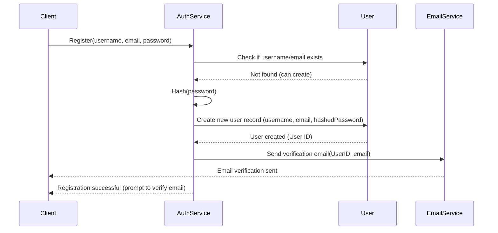

```mermaid
sequenceDiagram
    participant Client
    participant AuthService
    participant User
    participant EmailService

    %% ==========================================
    %% REGISTER NEW USER
    %% ==========================================

    Client->>AuthService: Register(username, email, password)
    AuthService->>User: Check if username/email exists
    User-->>AuthService: Not found (can create)

    AuthService->>AuthService: Hash(password)
    AuthService->>User: Create new user record (username, email, hashedPassword)
    User-->>AuthService: User created (User ID)

    AuthService->>EmailService: Send verification email(UserID, email)
    EmailService-->>Client: Email verification sent

    AuthService-->>Client: Registration successful (prompt to verify email)
```
