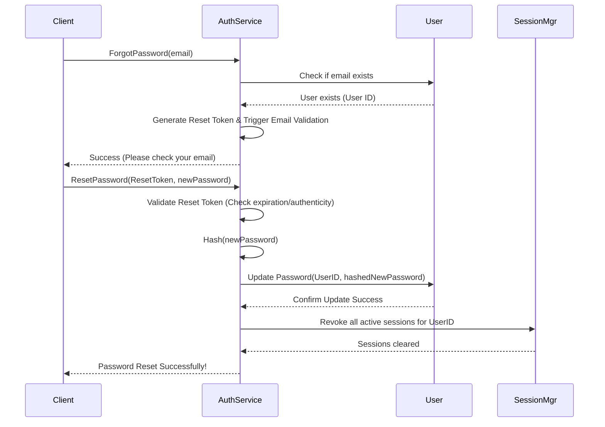

```mermaid
sequenceDiagram
    participant Client
    participant AuthService
    participant User
    participant SessionMgr

    %% Giai đoạn 1: Gửi yêu cầu
    Client->>AuthService: ForgotPassword(email)
    AuthService->>User: Check if email exists
    User-->>AuthService: User exists (User ID)
    AuthService->>AuthService: Generate Reset Token & Trigger Email Validation
    AuthService-->>Client: Success (Please check your email)

    %% Giai đoạn 2: Điền mật khẩu mới với Token nhận được từ Email
    Client->>AuthService: ResetPassword(ResetToken, newPassword)
    AuthService->>AuthService: Validate Reset Token (Check expiration/authenticity)
    AuthService->>AuthService: Hash(newPassword)
    AuthService->>User: Update Password(UserID, hashedNewPassword)
    User-->>AuthService: Confirm Update Success

    %% Bảo mật thêm: Hủy luôn các phiên đăng nhập cũ nếu có
    AuthService->>SessionMgr: Revoke all active sessions for UserID
    SessionMgr-->>AuthService: Sessions cleared

    AuthService-->>Client: Password Reset Successfully!
```
