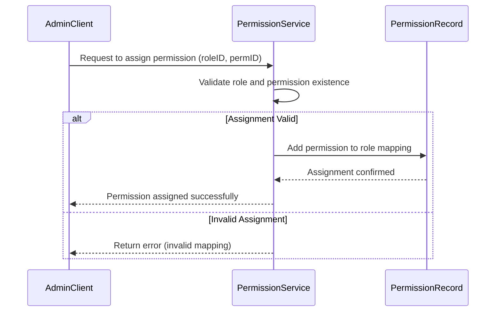

```mermaid
sequenceDiagram
    participant AdminClient
    participant PermissionService
    participant PermissionRecord

    AdminClient ->> PermissionService: Request to assign permission (roleID, permID)
    PermissionService ->> PermissionService: Validate role and permission existence
    alt Assignment Valid
        PermissionService ->> PermissionRecord: Add permission to role mapping
        PermissionRecord -->> PermissionService: Assignment confirmed
        PermissionService -->> AdminClient: Permission assigned successfully
    else Invalid Assignment
        PermissionService -->> AdminClient: Return error (invalid mapping)
    end
```