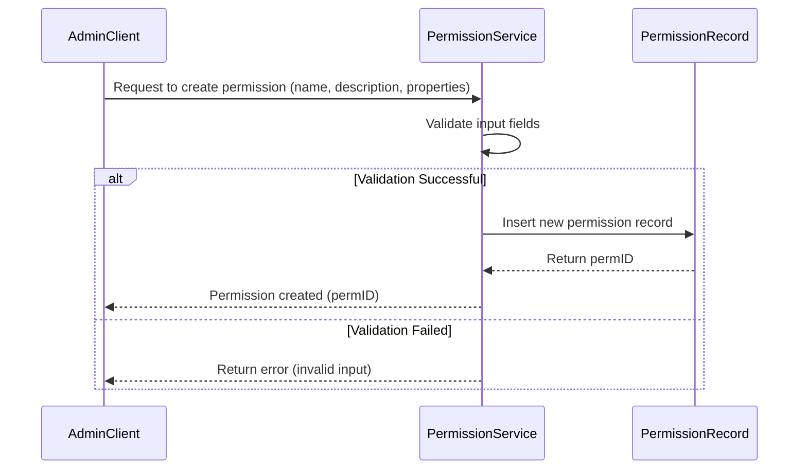

```mermaid
sequenceDiagram
    participant AdminClient
    participant PermissionService
    participant PermissionRecord

    AdminClient ->> PermissionService: Request to create permission (name, description, properties)
    PermissionService ->> PermissionService: Validate input fields
    alt Validation Successful
        PermissionService ->> PermissionRecord: Insert new permission record
        PermissionRecord -->> PermissionService: Return permID
        PermissionService -->> AdminClient: Permission created (permID)
    else Validation Failed
        PermissionService -->> AdminClient: Return error (invalid input)
    end
```