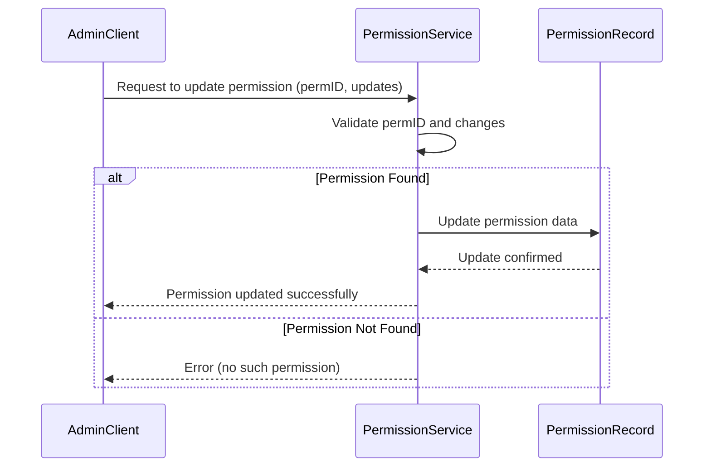

```mermaid
sequenceDiagram
    participant AdminClient
    participant PermissionService
    participant PermissionRecord

    AdminClient ->> PermissionService: Request to update permission (permID, updates)
    PermissionService ->> PermissionService: Validate permID and changes
    alt Permission Found
        PermissionService ->> PermissionRecord: Update permission data
        PermissionRecord -->> PermissionService: Update confirmed
        PermissionService -->> AdminClient: Permission updated successfully
    else Permission Not Found
        PermissionService -->> AdminClient: Error (no such permission)
    end
```