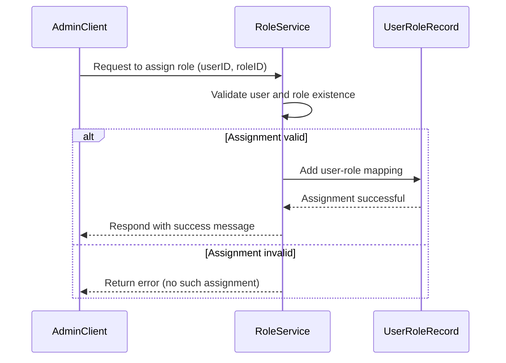

```mermaid
sequenceDiagram
participant AdminClient
participant RoleService
participant UserRoleRecord

    AdminClient->>RoleService: Request to assign role (userID, roleID)
    RoleService ->> RoleService: Validate user and role existence
    alt Assignment valid
        RoleService->>UserRoleRecord: Add user-role mapping
        UserRoleRecord-->>RoleService: Assignment successful
        RoleService -->> AdminClient: Respond with success message
    else Assignment invalid
        RoleService -->> AdminClient: Return error (no such assignment)
    end
```
