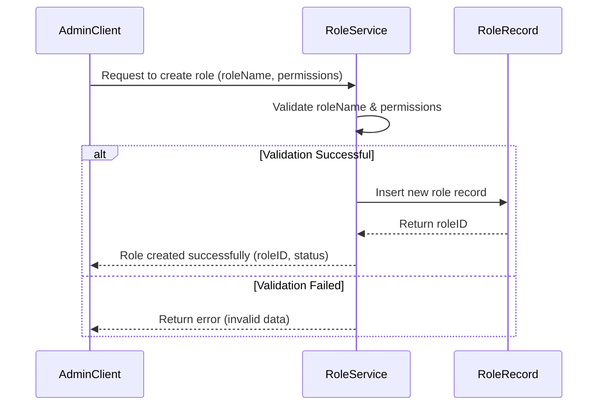

```mermaid
sequenceDiagram
    participant AdminClient
    participant RoleService
    participant RoleRecord

    AdminClient ->> RoleService: Request to create role (roleName, permissions)
    RoleService ->> RoleService: Validate roleName & permissions
    alt Validation Successful
        RoleService ->> RoleRecord: Insert new role record
        RoleRecord -->> RoleService: Return roleID
        RoleService -->> AdminClient: Role created successfully (roleID, status)
    else Validation Failed
        RoleService -->> AdminClient: Return error (invalid data)
    end
```
