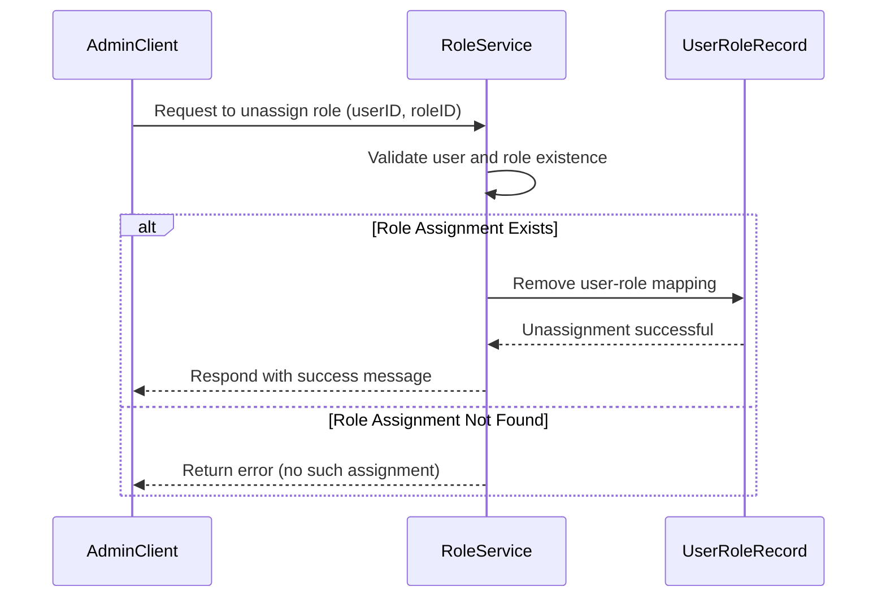

```mermaid
sequenceDiagram
    participant AdminClient
    participant RoleService
    participant UserRoleRecord

    AdminClient ->> RoleService: Request to unassign role (userID, roleID)
    RoleService ->> RoleService: Validate user and role existence
    alt Role Assignment Exists
        RoleService ->> UserRoleRecord: Remove user-role mapping
        UserRoleRecord -->> RoleService: Unassignment successful
        RoleService -->> AdminClient: Respond with success message
    else Role Assignment Not Found
        RoleService -->> AdminClient: Return error (no such assignment)
    end
```