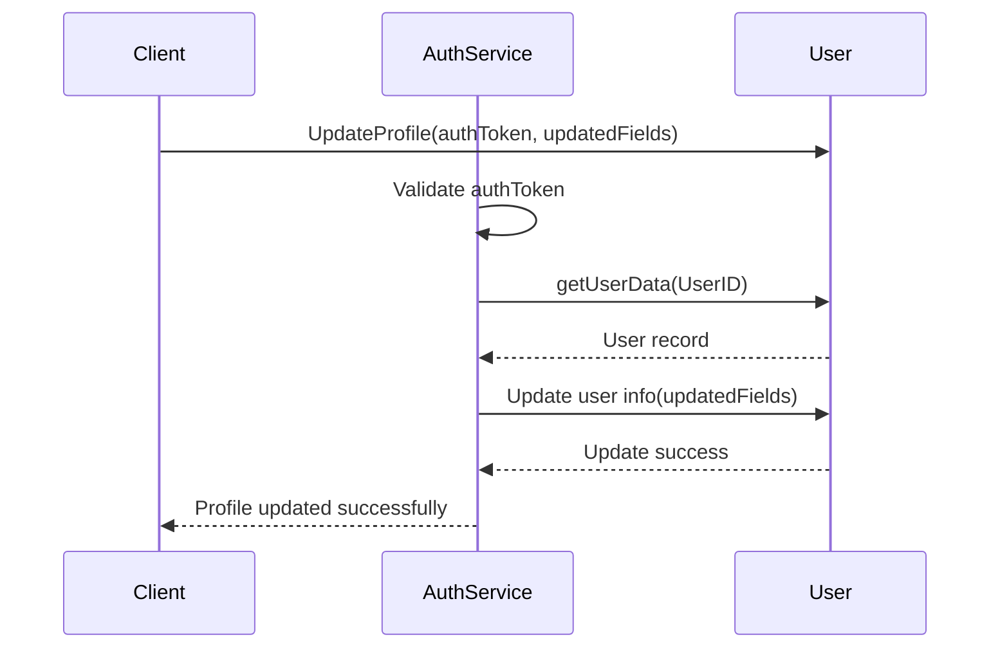

```mermaid
    sequenceDiagram
        participant Client
        participant AuthService
        participant User

        %% ==========================================
        %% EDIT USER PROFILE
        %% ==========================================

        Client->>User: UpdateProfile(authToken, updatedFields)
        AuthService->>AuthService: Validate authToken
        AuthService->>User: getUserData(UserID)
        User-->>AuthService: User record

        AuthService->>User: Update user info(updatedFields)
        User-->>AuthService: Update success

        AuthService-->>Client: Profile updated successfully
```
